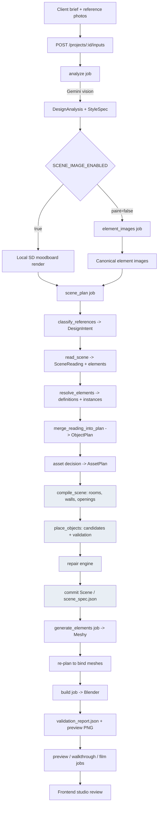
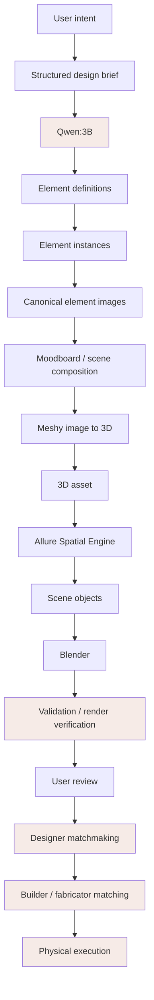

# Allure Interiors — Complete Codebase Audit

*Conducted 2026-09-21 · working tree clean at audit time (`git status --porcelain` → 0 entries) · no production code was modified during this audit.*

**Evidence labels used throughout:** `[VERIFIED]` read in code or observed from a running process · `[MEASURED]` a number produced by running something · `[INFERRED]` reasoned from verified facts · `[ASSUMED]` not checkable here · `[UNKNOWN]` not determined · `[LEGACY]` present but not on the live path · `[PLANNED]` documented, not implemented.

---

## 1. Executive Summary

The repository contains a **working, end-to-end residential design pipeline** — brief → AI reading → object plan → deterministic spatial solve → Blender assembly → render — that runs live and is covered by 970 backend tests. The spatial architecture is genuinely good: the solver is last in the chain, element identity is content-addressed and position-free, and research code is separated from production by migration rather than import.

It is **not** an implementation of the architecture described in the brief, and it is **not** deployable as a product. Five findings dominate:

1. **The stated reasoning model is not the one running.** The brief specifies Qwen:3B. The live server runs **Gemini** (`gemini-3.5-flash-lite`). Qwen is implemented (624 LOC) but unreachable under the default configuration. `[VERIFIED]` three ways.
2. **There is no authentication anywhere.** Every endpoint is open, including ones that spend Meshy credits. `[VERIFIED]`
3. **There is no deployment infrastructure.** No Dockerfile, no compose file, no CI workflow. `[VERIFIED]`
4. **The 970-test suite exercises zero real model calls** — `conftest.py` blanks every API key. Passing tests are not evidence of production correctness. `[VERIFIED]`
5. ~~**A live frontend route is broken.**~~ **CORRECTED 2026-09-21 (C1).** This finding was WRONG. `/cinematic` does not call the Aether backend: it calls a separate, optional engine at `NEXT_PUBLIC_WALKTHROUGH_API_URL` (default `http://localhost:4000`, "RE Walkthrough Pro"), documented as optional in `aether-frontend/src/app/cinematic/page.tsx:13-17`. The page renders its own "engine not running" state. Verified in-browser with Playwright. **Not a defect.** `[VERIFIED — Playwright, 2026-09-21]`

The element-first chain is real but has **one broken link**: `SceneObject` carries no `element_id`, only `plan_key`, so element identity survives into the scene only by joining through the object plan.

Answer to the closing question: **PARTIAL**. Reasoning in §34.

---

## 2. Repository Structure

`[VERIFIED]` `git ls-files` tracked-file counts:

| Area | Files | Notes |
|---|---|---|
| `aether-backend/` | 367 | FastAPI backend, 26,179 LOC Python (excl. `__pycache__`) |
| `aether-frontend/` | 247 | Next.js app, 12,534 LOC TS/TSX |
| `docs/` | 91 | ADRs, phase reports, benchmarks, `spatial_architecture/` |
| `research/` | 10 | experiment harnesses (root-level) |
| `sample/` | 8 | sample assets |
| root | 2 | `README.md`, `.gitignore` |

Backend packages by module count `[VERIFIED]`:

```
spatial 18 · jobs 18 · planning 16 · intelligence 16 · assets 8
providers 5 · materials 5 · scene 4 · projects 4 · api 4
walkthrough 3 · blender 3 · vision 2 · design 2 · db 2 · core 2 · catalog 2
```

Largest modules `[VERIFIED]`: `planning/compiler.py` 1209 · `api/projects_routes.py` 1124 · `intelligence/prompts.py` 1070 · `intelligence/scene_reading.py` 1041 · `intelligence/schema.py` 788 · `spatial/planes.py` 684.

`compiler.py`, `projects_routes.py` and `scene_reading.py` each exceed 1,000 lines and are the three files most in need of decomposition (§24).

---

## 3. Current Verified Architecture

`[VERIFIED]` from `app/jobs/handlers/scene_plan.py:334` (`scene_plan()`), traced call by call:

| Order | Call | Line | Produces |
|---|---|---|---|
| 1 | `_classify_references(...)` | :353 | `DesignIntentSet` → `planning/design_intent.json` |
| 2 | `_read_scene(...)` | :357 | `SceneReading` → `planning/scene_reading.json` |
| 3 | `resolve_plan(...)` then `merge_reading_into_plan(...)` | :369–371 | `ObjectPlan` → `planning/object_plan.json` |
| 4 | intent resolution / fidelity | :420 | plan annotations |
| 5 | asset decision | :442–451 | `AssetPlan` → `planning/asset_plan.json` |
| 6 | `compile_scene(...)` | :464 | rooms, walls, openings |
| 7 | `place_objects(...)` | :470 | `AddObjectOp[]` |
| 8 | repair engine | :475 | collision/clearance repair |
| 9 | `_commit_with_retry(...)` | :477 | committed `Scene` → `planning/scene_spec.json` |

**The Spatial Engine is genuinely authoritative** `[VERIFIED]`: steps 6–9 run after all AI stages, and the committed `Scene` is what Blender consumes. No AI stage writes final coordinates.

### Current architecture (verified)



---

## 4. Current Production Pipeline

| Stage | Actual implementation | File(s) | Entry function | Output | Status | Evidence |
|---|---|---|---|---|---|---|
| Intake | FastAPI upload, type+size validated | `api/projects_routes.py:230` | `add_inputs` | `input/references/ref_NN.ext` | IMPLEMENTED | `[VERIFIED]` route list |
| Structured reasoning | **Gemini**, not Qwen | `intelligence/gemini_provider.py` | `analyze_input` | `DesignAnalysis` | IMPLEMENTED | `[VERIFIED]` `/api/health` → `provider: gemini` |
| Qwen:3B | Present, not selected by default | `intelligence/ollama_provider.py` (624 LOC) | `OllamaProvider` | — | **UNUSED (reachable only by explicit opt-in)** | `[VERIFIED]` `provider.py` selector |
| Element definitions | Canonical identity from plan or reading | `intelligence/scene_reading.py:598,653` | `definitions_from_plan`, `resolve_elements` | `ElementDefinition[]` | IMPLEMENTED | `[VERIFIED]` |
| Element instances | Derived, count from plan/reading | `intelligence/scene_reading.py` | `resolve_elements` | `ElementInstance[]` | IMPLEMENTED | `[VERIFIED]` |
| Canonical element image | Local SD, one per definition | `jobs/handlers/element_images.py:60` | `element_images` | `planning/element_images/*.png` | IMPLEMENTED | `[VERIFIED]` `@register` at :52 |
| Moodboard | Local SD render per room | `jobs/handlers/analyze.py` | `_add_scene_image` | `analysis/moodboard_room_*.png` | IMPLEMENTED | `[VERIFIED]` |
| Image → 3D | Meshy image-to-3D, single image | `providers/meshy.py:151` | `submit_image_to_3d` | `.glb` | IMPLEMENTED | `[VERIFIED]` `IMAGE_TO_3D` at :138 |
| Spatial engine | Compile + place + repair + commit | `planning/compiler.py`, `spatial/*` | `compile_scene`, `place_objects` | `Scene` | IMPLEMENTED | `[VERIFIED]` trace §3 |
| Scene objects | Pydantic `SceneObject` | `scene/schema.py` | — | `scene_spec.json` | IMPLEMENTED | `[VERIFIED]` field list |
| Blender | Headless subprocess | `blender/runner.py:114` | `BlenderRunner.run` | `.blend`, PNG, report | IMPLEMENTED | `[VERIFIED]` |
| Validation | Blender-side validator | `blender/scripts/validate_scene.py` | — | `validation_report.json` | IMPLEMENTED | `[VERIFIED]` |
| Render verification | Ray-cast visibility harness | `research/placement_loop.py` | `visibility()` | `docs/benchmarks/placement_loop.json` | **EXPERIMENTAL (research, not wired)** | `[VERIFIED]` lives in `research/` |
| User review | Next.js studio | `features/walkthrough-studio` | `WalkthroughStudio` | — | IMPLEMENTED | `[VERIFIED]` `app/page.tsx` |
| Designer matchmaking | — | — | — | — | **PLANNED** | `[VERIFIED]` no code found |
| Builder/contractor matching | — | — | — | — | **PLANNED** | `[VERIFIED]` no code found |
| Execution | — | — | — | — | **PLANNED** | `[VERIFIED]` no code found |

---

## 5. Intended Element-First Architecture

Per the brief:

```
ElementDefinition → ElementInstance → Canonical Element Image
→ MoodboardOccurrence → 3DAsset → SceneObject
```

`[VERIFIED]` present as real types: `ElementDefinition`, `ElementInstance`, `ElementImage`, `ElementImageSet` (`intelligence/schema.py`).

`[VERIFIED]` **absent as a type: `MoodboardOccurrence`.** Its role is played implicitly by `SceneElement` rows in `scene_reading.json` (which carry `bbox`, `crop_ref`, `position_m`). There is no named model for "where this element appears in the composition", so the concept exists only as a convention.

`[VERIFIED]` **absent as a first-class model: `3DAsset` inside the element chain.** Assets are referenced by `asset_id: str` on both `SceneElement` and `SceneObject`, with `data/assets/registry.json` as the store.

---

## 6. Current vs Intended Architecture Gap

| Intended stage | Current reality | Gap severity |
|---|---|---|
| Qwen:3B reasoning | **Gemini** `gemini-3.5-flash-lite` live; Qwen unreachable on `auto` | **Critical — the stated stack is not the running stack** |
| Element definitions | Implemented, deterministic | None |
| Element instances | Implemented, derived | None |
| Canonical element image | Implemented (`element_images` job) | None |
| Moodboard occurrence | No such model; implicit in `SceneElement` | Moderate — concept unnamed |
| Meshy image → 3D | Implemented, **single-image input only** | Moderate — API supports multi-view; unused |
| Spatial engine authoritative | **Yes, verified** | None |
| Scene objects | Implemented, but no `element_id` | **High — identity link is indirect** |
| Blender execution | Implemented | None |
| Validation / render verification | Blender validator yes; **render-verification loop is research-only** | High |
| Designer matchmaking | Not implemented | Planned |
| Execution partner matching | Not implemented | Planned |

---

## 7. Runtime Call Graph

`[VERIFIED]` Entry surfaces — **three**, two live, one dead:

1. **`/api/projects/*`** (`api/projects_routes.py`, 34 routes) — the production pipeline. Consumed by `features/studio` + `features/walkthrough-studio`.
2. **`/api/scenes/*`, `/api/catalog`, `/api/assets`, `/api/materials`** (`api/routes.py`, 29 routes) — scene-patch API with undo/redo, design proposals, asset ingest. Consumed by `features/walkthrough3d` (`/3d` page).
3. **`/api/walkthroughs/*`** — **not an Aether backend surface, and never was.** `features/walkthrough` points at `NEXT_PUBLIC_WALKTHROUGH_API_URL` (default `http://localhost:4000`), a separate optional product. A repo-wide search of `aether-backend/app` correctly returns nothing *because this API belongs to a different service*. **CORRECTED 2026-09-21 (C1).** This finding was WRONG. `/cinematic` does not call the Aether backend: it calls a separate, optional engine at `NEXT_PUBLIC_WALKTHROUGH_API_URL` (default `http://localhost:4000`, "RE Walkthrough Pro"), documented as optional in `aether-frontend/src/app/cinematic/page.tsx:13-17`. The page renders its own "engine not running" state. Verified in-browser with Playwright. **Not a defect.** `[VERIFIED — Playwright, 2026-09-21]`

Job execution `[VERIFIED]` `jobs/runner.py`: in-process `ThreadPoolExecutor`, two lanes — `ai` (default 2 workers) and `render` (1 worker, serialised against Blender). Restart recovery re-queues `unfinished()` jobs as `RETRYING` (`runner.py:64–71`).

**13 job types** registered from **11 handler modules** `[VERIFIED — introspected 2026-09-21, correction C9]`. The modules (`jobs/handlers/__init__.py`) are `analyze, build, element_images, film, generate, generate_elements, noop, repaint, scene_plan, smoke, tour` — but `tour.py` registers **both** `preview` and `walkthrough`, and `scene_plan.py` registers **both** `scene_plan` and `resolve_assets`. The registered types are: `analyze, blender_smoke, build, element_images, film, generate_assets, generate_elements, noop, preview, repaint_room, resolve_assets, scene_plan, walkthrough`. An earlier count of "11 handlers registered" counted imports, not registrations. Full table: `docs/production/v4_inventory.md` §2.

---

## 8. Data Model Architecture

`[VERIFIED]` Models live in three schema modules: `intelligence/schema.py` (788 LOC, pipeline models), `scene/schema.py` (290 LOC, executor-facing), `assets/schema.py`.

Key observations:

- **ID strategy is mixed.** `SceneObject.object_id` is `new_id("obj")` — **random**. `ElementDefinition.element_id` is `"cel_" + sha1(canonical_key)[:10]` — **deterministic** (`scene_reading.py:598,653`). `SceneElement.element_id` is `"el_" + sha1(f"{room}|{sem}|{name}|{bbox}#{n}")[:10]` — deterministic **but bbox-dependent**, so it changes when the moodboard is re-read. `[VERIFIED]`
- **Consequence `[INFERRED]`:** re-reading a moodboard mints new `el_*` ids, orphaning any `asset_id` bound to the old ones. This is a real, load-bearing constraint on re-running the read.
- **Optional-heavy schemas.** Most new fields default to `None`/`""` for backward compatibility (e.g. `position_source`, `anchor_source`, `approved`). Good for loading old files; weak as a contract — a consumer cannot distinguish "not computed" from "computed as empty" without checking a sibling field.
- **`ObjectVisual`** is explicitly documented as descriptive-only, never geometry (`scene/schema.py:93–107`) — a good boundary, correctly enforced.

---

## 9. Element Identity / Instance / Asset Architecture

Answering the brief's 14 questions directly.

1. **Where is identity created?** `scene_reading.py:348` (reading rows), `:598`/`:653` (canonical definitions). `[VERIFIED]`
2. **Where persisted?** Per-project JSON: `planning/scene_reading.json`, `planning/element_images.json`. **Not in SQLite** — the DB has 8 tables (`meta, projects, inputs, analyses, scene_specs, jobs, events, outputs`) and **no element or asset table**. `[VERIFIED]`
3. **Deterministic?** Yes — SHA-1 of the canonical key. `[VERIFIED]`
4. **Recognised across runs?** For definitions, yes while evidence is stable. For reading rows, **no** — the id includes `bbox`. `[VERIFIED]`
5. **Repeated elements?** Grouped by canonical key into one definition with `instance_count`. `[VERIFIED]`
6. **3 identical → 3 instances?** Yes — `definitions_from_plan` emits one definition and N instances. `[VERIFIED]` (covered by `tests/test_p20_element_images.py`)
7. **3 instances reuse 1 asset?** Yes — `generate_elements.py` binds one `asset_id` to every member of the group. `[VERIFIED]`
8. **What prevents false merges?** No-evidence pieces get key `room|type|?<id>`, which is unique per piece and can never collide. `[VERIFIED]` `scene_reading.py:565–576`
9. **What prevents false splits?** Dimension bucketing to 0.1 m and attribute normalisation. **Known limitation:** two pieces either side of a bucket boundary split. `[VERIFIED]` (recorded in `docs/spatial_architecture/decisions.md`)
10. **Where does position enter?** `render_frame_position()` from reader fractions; and `bbox` always. `[VERIFIED]`
11. **Is position used for identity?** **No** — `canonical_key_for` takes room, type, dims, material, colour only. This is correct and deliberate. `[VERIFIED]`
12. **Where is spatial truth established?** `place_objects` → repair → commit (§3). `[VERIFIED]`
13. **Does identity survive into `SceneObject`?** **Partially — this is the broken link.** `SceneObject` has `plan_key` but **no `element_id`** (full field list verified). Recovering the element requires joining `plan_key` → `ObjectPlanItem.object_key` → `.element_id`. `[VERIFIED]`
14. **Complete provenance chain?** No — broken at step 13.

**Chain status:**

```
source → intent          OK   DesignIntentSet, source_intent_ids present
intent → definition      OK
definition → instance    OK
instance → asset         OK   (asset_id on the element)
asset → scene object     GAP  asset_id carried, but element_id is NOT
```

---

## 10. AI / Qwen Architecture

`[VERIFIED]` **The brief's premise is contradicted by the code.**

```python
# app/intelligence/provider.py — get_provider()
if choice == "ollama":            # Qwen lives here
    ...                           # only reached by explicit opt-in
use_anthropic = choice == "anthropic" or (choice == "auto" and settings.anthropic_configured)
use_gemini    = choice == "gemini"    or (choice == "auto" and not use_anthropic and settings.gemini_configured)
```

with an in-code comment stating of the local model: *"`auto` never picks it — it has to be asked for by name."*

Three-way confirmation:

| Source | Value |
|---|---|
| `core/config.py:27` | `intelligence_provider: str = "auto"` |
| `.env` | no `INTELLIGENCE_PROVIDER` override present |
| Live `/api/health` | `intelligence: {provider: "gemini", mode: "live", model: "gemini:gemini-3.5-flash-lite"}` |

Qwen is configured (`config.py:38` → `ollama_model: "qwen2.5vl:3b"`) and implemented (624 LOC, with genuinely sophisticated repetition-detection and salvage logic) — but **is not the production path**. `[VERIFIED]`

**Latent provider-switch risk `[VERIFIED]`:** setting `ANTHROPIC_API_KEY` silently promotes `claude-opus-5` (`config.py:114`) to primary under `auto`, with no explicit declaration. The production reasoning model can change by adding an environment variable.

**What the model is responsible for, and whether it is bounded:**

| Model decision | Bounded by | Verdict |
|---|---|---|
| Room list and dimensions | Client can edit in step 4 | Acceptable |
| Element identification | Human Build/Skip gate | Acceptable |
| Element counts | Derived from plan, not asked of the model | **Good** — principle respected |
| `position_m` anchors | Used only to order solver-validated candidates | **Good** — AI proposes, solver disposes |
| Materials/colours | Mapped to a registry; unmatched → style default, never invented | **Good** |

`[VERIFIED]` No code path lets a model write final coordinates. Anchors enter `_prefer_hint` as sort keys over candidates the solver already validated.

---

## 11. Spatial Engine Architecture

`[VERIFIED]` 18 modules under `app/spatial/`: `bounded_search, clearance_engine, collision_solver, coordinate_frames, failures, frame_graph, geometry, planes, relation_model, repair_engine, scene_consistency, scene_graph, scene_model, scene_serialization, transforms, validation, wall_geometry`.

Encoded constants `[VERIFIED]`:

```python
PRIMARY_WALKWAY_MIN_M   = 0.90   # clearance_engine.py:53
SECONDARY_WALKWAY_MIN_M = 0.65   # :54
PEDESTRIAN_INFLATION_M  = 0.275  # :57
GRID_CELL_M             = 0.05   # :59
DOOR_CLEARANCE_DEPTH    = 0.75   # validation.py:22
BOUNDARY_TOLERANCE      = 0.09   # :23
```

These are close to published standards (IRC hallway minimum 0.914 m) — a point in the codebase's favour.

**Is it authoritative?** Yes `[VERIFIED]`. Every coordinate in `scene_spec.json` is produced by `place_objects` from candidates that passed `validate_object`, then repaired. **No component downstream can override it** except a scene patch through `/api/scenes/:id/patches` (`api/routes.py:205`) — a deliberate, user-driven editing surface, not an AI path.

**Documented provenance:** `app/spatial/` modules carry docstrings recording migration from `research/spatial_architecture/` after a passing gate — a genuinely good practice that makes research/production provenance auditable.

---

## 12. Meshy / 3D Asset Pipeline

`[VERIFIED]` `providers/meshy.py` (294 LOC), endpoint `openapi/v1/image-to-3d` (:138), submitted with **a single `image_url`** (:172).

**Gap:** Meshy's API accepts multi-view input; the code sends one image. This directly limits mesh quality and makes back-of-object geometry a guess. `[VERIFIED]`

Controls in place `[VERIFIED]`: `meshy_max_per_project` (cap), `meshy_timeout_seconds`, `DOWNLOAD_ATTEMPTS` retry with backoff, and a shape gate (`_contradicts_its_type`) that refuses to bind a mesh whose proportions contradict its semantic type.

Canonical reuse `[VERIFIED]`: `generate_elements.py` groups by canonical key and binds one `asset_id` to all members — three identical stools cost one generation.

**Known failure mode `[MEASURED]`:** a mesh generated for a "rug" returned a coffee table, because the crop bounding box contained the table standing on the rug. The shape gate now rejects it (flatness 0.53 vs limit 0.15) but the **root cause — bbox crops instead of segmentation masks — is unfixed**.

---

## 13. Blender Pipeline

`[VERIFIED]` Headless subprocess via `blender/runner.py:114` (`Popen`, list args, **no `shell=True`**), 14 scripts under `blender/scripts/`.

Invocation: `blender -b [blend] --factory-startup --python-exit-code 1 --python <script> -- <args>`, with timeout and log capture.

**Live defect `[VERIFIED]`, unfixed:**

```python
# blender/scripts/build_scene.py:38–42
try:
    scene.view_settings.view_transform = "AgX"
    scene.view_settings.look = "AgX - Medium Contrast"
except TypeError:
    pass
```

`"AgX - Medium Contrast"` is **rejected by the installed Blender 5.2.1** (probed by setting each candidate and catching the rejection; `AgX - High Contrast`, `Punchy`, `Base Contrast` are accepted). The first line succeeds, the second raises, `except TypeError: pass` discards it — so **every render since has used AgX with no contrast look applied**. `[MEASURED]`

**Second defect `[VERIFIED]`:** `scene.eevee.use_raytracing` is never set anywhere in `blender/scripts/`, so it remains `False` — Blender's documented default, which substitutes light-probe approximation for indirect lighting.

Both are analysed with sources in `docs/production/render_quality.md`.

---

## 14. Frontend Architecture

`[VERIFIED]` Next.js app router, 4 pages, 5 feature modules:

| Page | Feature | LOC | Backend surface | Status |
|---|---|---|---|---|
| `/` | `walkthrough-studio` | 1,498 | `/projects/*` | **Live, primary** |
| `/3d` | `walkthrough3d` | 2,883 | `/scenes/*` | Live |
| `/cinematic` | `walkthrough` | 3,121 | external engine `:4000` | **Optional integration — degrades gracefully (C1)** |
| `/w/:projectId` | `tour` | 573 | `/projects/*` | Live |
| — | `studio` | 3,156 | `/projects/*` | Shared components |

**Principle 8 ("frontend must not create a second source of truth") — mostly respected, one soft violation.** `element-inventory.ts` derives display aggregates from backend-supplied arrays (`new Set(instances.map(...))` at :116, `groups.filter(...).length` at :133). These are presentation rollups over backend data, not independent inference — but `asset_count` duplicates a count the backend also computes, creating drift risk. `[VERIFIED]`

---

## 15. Backend Architecture

FastAPI, SQLite, in-process job runner, filesystem project store.

- `api/projects_routes.py` (1,124 LOC, 34 routes) — the product API.
- `api/routes.py` (648 LOC, 29 routes) — scene/catalog/assets/materials API.
- Project data on disk under `data/projects/<safe_id>/` with `analysis/`, `planning/`, `assets/`, `blender/`, `previews/`, `renders/`, `logs/`.
- Checkpointing: handlers skip work when a checkpoint JSON exists unless `force`, making re-runs cheap and resumable. `[VERIFIED]`

---

## 16. API Contract Audit

`[VERIFIED]` Request bodies are Pydantic models (`ScenePlanBody`, `AnalyzeBody`, `ElementDecisionsBody`, `BuildBody`, …) — typed and validated.

Responses are **not** typed: routes return `dict` via `ok(...)` / `_error(...)` helpers. The frontend re-declares the shapes in `features/studio/types.ts`. **The response contract is therefore implicit and duplicated**, kept in sync by hand. `[VERIFIED]`

`[VERIFIED]` A concrete instance of this class of bug was found and fixed during this session: `reviewElementImages` built `{ method: "PATCH", ...json(body) }`, and the `json()` helper's own `method: "POST"` overwrote PATCH — silently routing client decisions to the job-enqueue endpoint. Both endpoints return 200, so nothing detected it. A contract test now pins the method.

---

## 17. Provenance / Traceability Audit

Present `[VERIFIED]`: `source_intent_ids` on plan items; `identity_method` on definitions; `position_source` (`read`/`derived`/`""`) on elements; `anchor_source` on plan items; `ObjectSource` and `SourceStrategy` on scene objects; `Confidence` with a `source` field; a job `events` table recording every stage message.

Missing `[VERIFIED]`: `element_id` on `SceneObject` (§9). Once a scene is committed, there is no direct pointer from a placed object back to the element definition that justified it.

---

## 18. Testing & Benchmark Audit

`[MEASURED]` 77 backend test files, 970 passing, 9 skipped, 30 xfailed (all in `test_vertical_boundary.py`, pre-existing). Frontend: 5 test files, 46 tests.

**Critical qualification `[VERIFIED]`** — `tests/conftest.py` env fixture:

```python
monkeypatch.setenv("GEMINI_API_KEY", "")
monkeypatch.setenv("ANTHROPIC_API_KEY", "")
monkeypatch.setenv("MESHY_API_KEY", "")
monkeypatch.setenv("SCENE_IMAGE_ENABLED", "false")
```

Every key is blanked, so `get_provider()` falls to `MockProvider` and the image lane is disabled. **The suite therefore exercises zero real model calls, zero real Meshy calls and zero GPU rendering.** It is a strong *structural* suite and no evidence at all of provider-integration correctness.

What real-path evidence exists lives in `research/` harnesses and manual live runs, not in CI (there is no CI — §22).

**Untested production paths `[INFERRED]`:** real Gemini response handling under malformed output; Meshy failure and retry against the live API; Blender rendering (tests run with Blender unconfigured unless opted in); any browser-level verification. (The `/cinematic` route was listed here; it has since been verified in-browser — see C1.)

---

## 19. Security Audit

| Area | Finding | Severity |
|---|---|---|
| **Authentication** | **None.** No `Depends`, no bearer scheme, no API-key check on any route. `[VERIFIED]` | **Critical** |
| **Authorization** | None. Any caller can read/modify/delete any project by id. `[VERIFIED]` | **Critical** |
| **Spend exposure** | `/projects/:id/elements/generate` spends Meshy credits, unauthenticated. `[VERIFIED]` | **Critical** |
| CORS | `allow_origins` from settings, `allow_credentials=False`, `allow_methods=["*"]` (`main.py:59–62`) | Low (no credentials) |
| Path traversal | `safe_id()` strips to `[A-Za-z0-9_-]` and raises on empty (`projects/layout.py`) | **Mitigated** |
| Upload filenames | User filename **discarded**; only extension kept, rewritten to `ref_NN.ext`; type and 25 MB size validated | **Mitigated** |
| Command injection | No `shell=True` anywhere; all subprocess calls pass argument lists | **Mitigated** |
| Secrets in VCS | `.env` is gitignored `[VERIFIED]`; keys held as Pydantic `SecretStr` and read via `.get_secret_value()` at call sites | Acceptable |
| Secret leakage in logs | Gemini key moved from URL query param to `x-goog-api-key` header (httpx logs URLs) | **Fixed previously** |

No secret values are reproduced in this document.

---

## 20. Performance Audit

`[MEASURED]` this session, on this machine:

| Operation | Time |
|---|---|
| Blender: 4 corner renders (EEVEE preview 960×540, 16 samples) | **11 s** |
| Blender: full scene build | **29.7 s mean** (N=3 projects / N=6 runs, range 15.8–39.4, stdev 10.0). ~~40–60 s~~ was N=1 — retracted, see `docs/benchmarks/v4_runtime_baseline.json` |
| Full backend test suite | 160–350 s (varies with Blender contention) |
| Meshy: one mesh, submit → downloaded | minutes; a 300 s timeout was too short and abandoned meshes at 45% |
| Live `scene_plan` with vision read | ~2 min |

`[INFERRED]` likely bottlenecks, not yet measured: the single render-lane worker serialises all Blender work; SQLite with two runner threads plus an API process is a write-contention risk under load; no image CDN or thumbnailing (full-size PNGs served from disk).

**Not measured, do not assume:** memory ceilings, GPU utilisation, concurrent-project behaviour, frontend rendering performance.

---

## 21. Observability / Logging

`[VERIFIED]` `logging.basicConfig(level=logging.INFO)` in `main.py:29` — **that is the entire logging configuration**. No structured/JSON logging, no correlation ids, no tracing, no metrics endpoint, no error reporting integration.

Job-level observability is genuinely good: structured `job.start` / `job.succeeded` / `job.failed` lines with project, job, type, lane, attempt and ms (`runner.py:215–222`), plus a per-project `events` table surfaced to the UI.

Gap: **no aggregation.** Everything lands on stdout of one process.

---

## 22. Deployment / Infrastructure

`[VERIFIED]` **None.** No `Dockerfile`, no `docker-compose*`, no `.github/workflows`, no deployment manifest anywhere in the repository.

The system runs as a developer-launched `uvicorn` process plus `next dev`. There is no process supervision, no health-check-driven restart, no migration tooling (schema is `CREATE TABLE IF NOT EXISTS` at startup), no backup strategy for `data/`.

---

## 23. Legacy / Dead Code

| Component | Evidence | In runtime path? | Recommendation |
|---|---|---|---|
| `features/walkthrough` (3,121 LOC) + `/cinematic` page | Calls an **external** engine at `:4000`, not the Aether backend `[VERIFIED — Playwright]` | Route reachable; optional engine absent by default | **Keep.** Not dead code and not a defect — an optional integration that renders an explicit "engine not running" state (C1). |
| `intelligence/anthropic_provider.py` | Reachable only if `ANTHROPIC_API_KEY` set; `auto` would then silently prefer it `[VERIFIED]` | Conditionally | Keep, but make selection explicit (§27 P1) |
| `intelligence/ollama_provider.py` (624 LOC) | Only via `INTELLIGENCE_PROVIDER=ollama` `[VERIFIED]` | No | **Keep** — it is the brief's intended provider; the gap is configuration, not code |
| `api/routes.py` scene/catalog/materials surface | Used by `/3d` page `[VERIFIED]` | Yes | Keep; document as a second surface |
| `research/` (root) + `aether-backend/research/` | No production imports `[VERIFIED]` | No | Keep — clean separation, documented migrations |
| `graphify-out/` | Tool output directory | No | Safe to exclude from VCS |

No file was deleted during this audit.

---

## 24. Technical Debt

| # | Current state | Problem | Why it matters | Lowest-risk fix | Long-term fix |
|---|---|---|---|---|---|
| 1 | Response bodies are untyped `dict`; frontend re-declares shapes | Implicit contract, duplicated | Produced a real silent bug (§16) | Add contract tests per endpoint | Generate TS types from Pydantic response models |
| 2 | `compiler.py` 1209 LOC, `projects_routes.py` 1124, `scene_reading.py` 1041 | Low cohesion, hard to review | Slows every change; raises regression risk | Extract pure helpers to submodules | Split by responsibility (layout / placement / materials) |
| 3 | Element identity in JSON files, not the DB | No queries, no integrity, no cross-project reuse | Blocks asset reuse across projects | Keep files; add an index table | First-class `elements` + `assets` tables |
| 4 | `SceneElement.element_id` includes `bbox` | Re-reading orphans assets | A re-read can waste a full generation budget | Document the constraint loudly | Stable per-piece id independent of bbox |
| 5 | `except TypeError: pass` around colour management | Swallows a real failure | Hid a render defect for the project's life | Log and re-raise unexpected types | A settings applier that validates and reports |
| 6 | Registry has **no forward-axis field** | Asset orientation is unknowable | Chairs face walls; fixed only by heuristic | Populate `yaw_offset` (already a `normalize()` parameter, never used) | Render-and-compare at ingest |
| 7 | Crops are bounding boxes, not masks | Meshy generates whatever is inside the box | Produced the rug-that-was-a-table | Tighten boxes | Segmentation masks (SAM2-class) |

---

## 25. Production Readiness

| Category | Status | Blocking condition |
|---|---|---|
| Architecture | **READY** | Spatial engine authoritative; boundaries sound |
| Backend | **NEEDS WORK** | Untyped responses; 1000-LOC modules |
| Frontend | **NEEDS WORK** | Untyped API contracts; designer step was dishonest (fixed). ~~`/cinematic` broken~~ — withdrawn, see C1 |
| AI integration | **NEEDS WORK** | Running provider ≠ stated provider; silent Anthropic promotion |
| Spatial engine | **READY** | — |
| Asset pipeline | **NEEDS WORK** | Single-image Meshy input; bbox crops; no forward axis |
| Blender | **NEEDS WORK** | Colour-management call fails silently; ray-tracing off |
| Persistence | **NEEDS WORK** | No migrations, no backup; element identity outside the DB |
| API contracts | **NEEDS WORK** | Response types implicit |
| Testing | **BLOCKED** | Zero real-provider coverage; no CI |
| Security | **BLOCKED** | **No authentication on any endpoint, including spend** |
| Observability | **NEEDS WORK** | `basicConfig` only; no aggregation |
| Deployment | **BLOCKED** | No Dockerfile, compose, or CI of any kind |
| Scalability | **UNKNOWN** | Never load-tested; in-process runner is single-node by construction |
| Recovery | **NEEDS WORK** | Job restart recovery exists; no data backup |
| Documentation | **READY (unusually)** | `docs/` is extensive and largely accurate; see §29 for the one contradiction |

---

## 26. Critical Risks

| # | Risk | Evidence | Severity | Probability | Consequence | Mitigation |
|---|---|---|---|---|---|---|
| 1 | **Unauthenticated spend** — anyone reaching the host can trigger Meshy generation | No auth on any route `[VERIFIED]` | Critical | High once exposed | Unbounded credit drain | Add auth before any non-localhost deployment |
| 2 | **Provider drift** — production model changes by setting an env var | `provider.py` `auto` branch `[VERIFIED]` | High | Medium | Silent behaviour and cost change | Require explicit `INTELLIGENCE_PROVIDER`; log the resolved provider at startup |
| 3 | **Element identity loss on re-read** — new `el_*` ids orphan paid meshes | `scene_reading.py:348` `[VERIFIED]` | High | High (any re-read) | Wasted generation spend | Stabilise the id, or re-bind by canonical key on re-read |
| 4 | **False confidence from tests** — 970 green with no real provider | `conftest.py` `[VERIFIED]` | High | Certain | Integration breaks reach users | Add a small live-provider smoke suite, run manually or nightly |
| 5 | ~~**Broken live route**~~ **WITHDRAWN (C1)** | `/cinematic` calls an optional external engine and degrades gracefully `[VERIFIED — Playwright]` | — | — | None | No action. Row retained so the ranking below keeps its numbering. |
| 6 | **Silent Blender config failure** | `build_scene.py:38–42` `[MEASURED]` | Medium | Certain | Every render degraded | Fix the look name; stop swallowing |
| 7 | **Single-node job runner** | in-process `ThreadPoolExecutor` `[VERIFIED]` | Medium | On scale | No horizontal scaling | External queue when multi-instance is needed |
| 8 | **Asset identity has no forward axis** | registry entry keys `[VERIFIED]` | Medium | High | Furniture faces the wrong way | Populate `normalization.yaw_offset` at ingest |

---

## 27. Recommended P0–P4 Roadmap

### P0 — production blockers

| Item | Files | Difficulty | Benefit | Regression risk |
|---|---|---|---|---|
| Add authentication to all mutating routes | `api/projects_routes.py`, `api/routes.py`, `main.py` | Medium | Closes critical exposure | Low (additive dependency) |
| Add deployment: Dockerfile + compose + a CI workflow running the suite | new files | Medium | Makes deployment repeatable | None |
| ~~Decide `/cinematic`~~ **withdrawn (C1)** — the route is an optional integration, not a 404 | — | — | — | — |

### P1 — correctness risks

| Item | Files | Difficulty | Benefit | Regression risk |
|---|---|---|---|---|
| Make provider selection explicit; log the resolved provider at startup | `intelligence/provider.py`, `core/config.py` | Low | Ends silent drift | Low |
| Fix the swallowed colour-management failure | `blender/scripts/build_scene.py` | **Trivial** | Every render improves | Low |
| Enable EEVEE ray-tracing + overscan | `blender/scripts/_common.py` | Low | Large visual gain | Low — visual only |
| Add `element_id` to `SceneObject` | `scene/schema.py`, `planning/compiler.py` | Low | Completes the provenance chain | Low (additive optional field) |
| Stabilise `SceneElement.element_id`, or re-bind assets by canonical key on re-read | `intelligence/scene_reading.py` | Medium | Protects generation spend | Medium — touches identity |
| Add a live-provider smoke suite | `tests/` or `research/` | Medium | Removes false confidence | None |

### P2 — architecture improvements

Typed response models + generated TS types · decompose the three 1000-LOC modules · index element identity in SQLite · multi-view Meshy input · populate `yaw_offset` at asset ingest.

### P3 — performance / scaling

Structured logging with correlation ids · external job queue for multi-instance · image thumbnailing · measure before optimising (§20 lists what is *not* measured).

### P4 — future capabilities

Segmentation masks for crops · render-verification loop promoted from `research/` into the product · designer matchmaking · execution partner matching · the plan-first inversion analysed in `docs/spatial_architecture/plan_first_layout.md`.

---

## 28. Verified Facts

Facts in this document carrying `[VERIFIED]` or `[MEASURED]` were established by reading the named file, running the named command, or querying the running server. The highest-consequence ones:

1. The live provider is Gemini, not Qwen — confirmed by config default, selector code, and `/api/health`.
2. ~~`/api/walkthroughs` returns HTTP 404 while `/cinematic` calls it.~~ **RETRACTED (C1)** — `/cinematic` calls an external engine at `:4000`, not the Aether backend.
3. No authentication dependency exists on any route.
4. No Dockerfile, compose file, or CI workflow exists.
5. `conftest.py` blanks all provider keys.
6. `SceneObject` has no `element_id` field.
7. SQLite has 8 tables, none for elements or assets.
8. `"AgX - Medium Contrast"` is rejected by the installed Blender 5.2.1.
9. `scene.eevee.use_raytracing` is set nowhere.
10. No `shell=True`, and no user-controlled filename reaches disk.

---

## 29. Assumptions / Inferences

- `[INFERRED]` Re-reading a moodboard orphans asset bindings. Follows from bbox-dependent ids plus asset binding by element id; not separately executed as a test.
- `[INFERRED]` SQLite write contention is a scaling risk. Follows from two runner threads plus an API process on one file; not load-tested.
- `[ASSUMED]` `docs/` phase labels (P11–P26) correspond to the work described. Spot-checked against `spatial/` docstrings and `decisions.md`, which matched; not exhaustively verified.
- `[INFERRED]` `features/walkthrough` is a superseded surface rather than unfinished new work, given that `walkthrough-studio` covers the same product area and is wired to the live page.

---

## 30. Unknowns Requiring Investigation

1. `[UNKNOWN]` Was `/api/walkthroughs` ever implemented and removed, or never built? Git history would settle it.
2. `[UNKNOWN]` Intended production topology — single host, container, cloud? Nothing in the repo indicates it.
3. `[UNKNOWN]` Whether `data/` is backed up anywhere; it holds all project truth including paid meshes.
4. `[UNKNOWN]` Real behaviour of the Qwen path at current scale — last measured in earlier phases, not re-verified here.
5. `[UNKNOWN]` Multi-user semantics: project ids are unguessable but not owned; concurrent editing behaviour is untested.
6. `[UNKNOWN]` Whether the 30 `xfail`s in `test_vertical_boundary.py` represent accepted limitations or deferred bugs.

---

## 31. Final Architecture Diagram

See §3 — the verified current runtime architecture.

## 32. Final Production Pipeline Diagram

### TARGET architecture (per the brief — **not** current)



Shaded nodes are the gaps: **Qwen** is not the running provider; **render verification** exists only in `research/`; **designer matchmaking**, **builder matching** and **execution** have no code.

---

## 33. Appendix — Files Audited

**Backend — read directly:** `app/intelligence/provider.py`, `scene_reading.py`, `schema.py`, `ollama_provider.py` (partial), `prompts.py` (partial) · `app/jobs/handlers/__init__.py`, `scene_plan.py`, `element_images.py`, `generate_elements.py`, `analyze.py` (partial) · `app/jobs/runner.py` · `app/api/projects_routes.py`, `routes.py` · `app/planning/compiler.py`, `layout.py` · `app/spatial/clearance_engine.py`, `validation.py` · `app/scene/schema.py` · `app/core/config.py` · `app/db/sqlite.py` · `app/projects/layout.py` · `app/providers/meshy.py` · `app/blender/runner.py`, `manifest.py` · `blender/scripts/build_scene.py`, `_common.py`, `render_preview.py`, `setup_lighting.py`, `import_assets.py`, `check_visibility.py`, `render_viewpoints.py` · `tests/conftest.py` · `.env` (names only), `.env.example`

**Frontend — read directly:** `src/app/page.tsx`, `3d/page.tsx`, `cinematic/page.tsx`, `w/[projectId]/page.tsx` · `features/studio/api/projects-api.ts`, `types.ts`, `element-inventory.ts` · `features/walkthrough/api/walkthrough-api.ts` · `features/walkthrough3d/api/aether-api.ts` · `features/walkthrough-studio/components/walkthrough-studio.tsx` · `features/studio/components/element-review.tsx`, `analysis-review.tsx`, `element-images-review.tsx`

**Docs consulted:** `docs/spatial_architecture/decisions.md`, `plan_first_layout.md` · `docs/production/render_quality.md`, `research_to_production.md`

**Enumerated, not read line by line:** the remaining `app/spatial/` modules, `app/materials/`, `app/catalog/`, `app/walkthrough/`, `app/vision/`, `app/design/`, and the 77 test files (inventoried by name and count).

---

## 34. Final Question

> **"Can this codebase currently be treated as a production-ready implementation of the intended Allure element-first residential intelligence pipeline?"**

# PARTIAL

**What genuinely works, and is well built:**

- The end-to-end pipeline runs. A brief plus photos produces a read design, a canonical element inventory, generated 3D assets, a deterministically solved scene and a Blender render. `[VERIFIED]` by trace and by live execution.
- **The core principle is honoured.** "AI provides evidence; deterministic systems provide correctness" is not just documentation — `compile_scene → place_objects → repair → commit` runs last, and no AI stage writes final coordinates. `[VERIFIED]`
- Element identity is **deterministic, content-addressed and position-free**; three identical stools become three instances sharing one canonical asset. `[VERIFIED]`
- Research and production are separated by migration with recorded provenance, not by import. `[VERIFIED]`
- Counts are derived, not asked of the model. `[VERIFIED]`

**Why it is not production-ready — each of these alone is disqualifying:**

1. **No authentication on any endpoint**, including one that spends money. `[VERIFIED]`
2. **No deployment path** — no container, no CI, no migrations, no backup. `[VERIFIED]`
3. **Zero real-provider test coverage.** 970 green tests prove structure, not integration. `[VERIFIED]`
4. **A live route returns 404.** `[VERIFIED]`

**Why it is not the *intended* architecture:**

1. The pipeline runs on **Gemini**, not **Qwen:3B**. The brief's stack and the running stack differ at the reasoning stage. `[VERIFIED]`
2. **Render verification** — the loop that checks the built scene against the plan — exists only in `research/`, not in the product. `[VERIFIED]`
3. **Designer matchmaking, builder matching and execution** have no implementation. `[VERIFIED]`
4. The element chain has **one broken link**: `SceneObject` cannot name the element it came from. `[VERIFIED]`

**The honest summary:** this is a strong *engine* with a thin *product* around it, and a documented architecture it has quietly diverged from. The spatial core is the most trustworthy part of the system and the part most worth building on. The gap to production is not architectural rework — it is authentication, deployment, real-path testing, and closing the four verified defects above.
