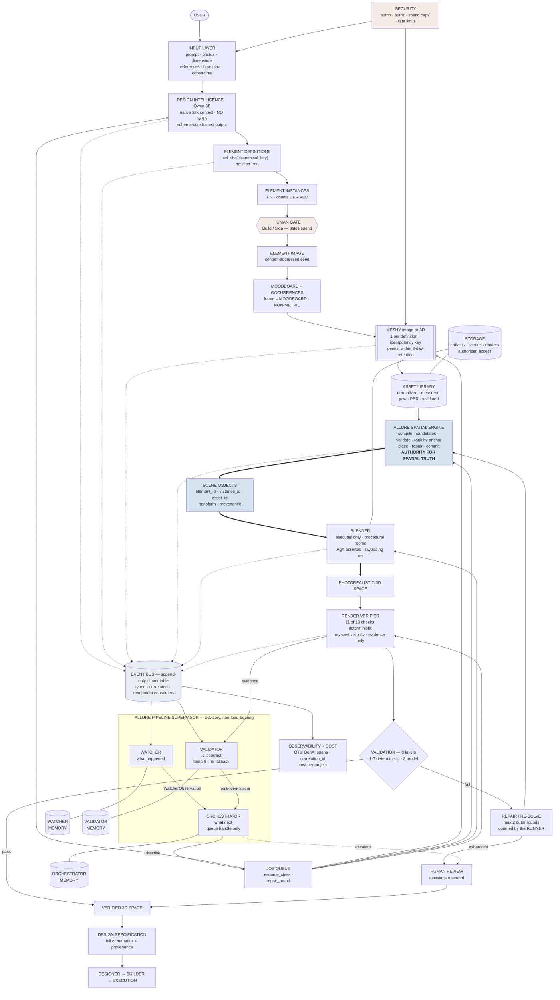

# Allure Interiors V4 — Technical Requirements Document

*Version 1.0 · 2026-09-21 · companion to `plan.md` (roadmap) and `design.md` (internal architecture) · baseline `AUDIT_CODEBASE.md` · **no production code was modified***

**Evidence labels:**
`[VERIFIED CURRENT]` read in the live codebase during this pass · `[RESEARCH-BACKED]` supported by a cited primary source in §59 · `[RECOMMENDED]` an engineering judgement built on cited research · `[INFERRED]` reasoned from verified facts · `[PLANNED]` deferred · `[UNKNOWN]` research could not establish it.

**Priority scale:**
`P0` mandatory for production correctness or security · `P1` mandatory for V4 core functionality · `P2` important for quality or scale · `P3` optimization · `P4` long-term research.

---

## 1. Document Purpose

This TRD is the **technical contract** for Allure Interiors V4. It states what V4 must satisfy before it can be called production-ready, why each requirement exists, how each will be verified, and what evidence supports it.

It is not a design document and not a plan:

| Document | Answers | Owns |
|---|---|---|
| `AUDIT_CODEBASE.md` | What exists today? | Current-state evidence |
| `plan.md` | What do we build, in what order? | Sequencing, priorities, file-by-file changes |
| `design.md` | How does the system work internally? | Boundaries, contracts, authority, state |
| **`TRD.md`** (this) | **What must be true before we ship? How is it proven?** | **Requirements, acceptance criteria, verification** |

Where this document and the other two disagree, **this document's requirement wins** and the disagreement is called out explicitly (see §3.4, which corrects two statements in the earlier documents).

**Audience:** senior engineers across AI, ML, CV, 3D/graphics, spatial computing, backend, frontend, infrastructure, security, MLOps, QA and product.

---

## 2. Scope

### 2.1 In scope

The complete V4 residential pipeline: input intake → design intelligence → element identity → element imagery → moodboard composition → 3D asset generation → asset library → spatial solving → scene commit → Blender execution → photorealistic render → render verification → multi-agent supervision → human review → verified 3D space.

Plus the cross-cutting concerns that make it deployable: authentication, authorization, event bus, job/queue, GPU workers, storage, observability, cost accounting, MLOps, evaluation, and testing.

### 2.2 Out of scope for V4

| Item | Why | Where it goes |
|---|---|---|
| Designer marketplace transactions | Depends on verified structured design data that V4 produces | `[PLANNED]` P4, §44 |
| Builder/fabricator execution integration | Same dependency | `[PLANNED]` P4, §44 |
| Model fine-tuning / training | Requires a governed dataset that V4 only begins to collect | `[PLANNED]` P4, §45 |
| Multi-region deployment | No measured demand | `[PLANNED]` P3+ |
| Commercial/hospitality/industrial verticals | `Vertical` enum exists but V4 targets residential | `[VERIFIED CURRENT]` enum has `RESIDENTIAL`, `HOSPITALITY`, `INDUSTRIAL` |

### 2.3 Explicit non-goals

- **V4 is not a 2D image generator.** A moodboard is an intermediate artifact. §18 and §19 define the actual success condition.
- **V4 does not replace the Spatial Engine.** §15 requires it be extended, not rewritten, absent measured evidence.
- **V4 does not adopt microservices.** See TDR-011 (§48).
- **V4 does not add a vector database.** See TDR-013 (§48).

---

## 3. Current System Baseline

Everything in this section was read from code during this pass. Documentation was not trusted where code was available.

### 3.1 Scale and shape `[VERIFIED CURRENT]`

| Area | Files | LOC |
|---|---|---|
| `aether-backend` | 367 | 26,179 Python |
| `aether-frontend` | 247 | 12,534 TS/TSX |
| Backend tests | 77 files | 970 passing, 9 skipped, 30 xfailed |
| Frontend tests | 5 files | 46 tests |

Largest modules: `planning/compiler.py` 1209 · `api/projects_routes.py` 1124 · `intelligence/prompts.py` 1070 · `intelligence/scene_reading.py` 1041 · `intelligence/schema.py` 788.

### 3.2 What genuinely works `[VERIFIED CURRENT]`

| Capability | Evidence |
|---|---|
| End-to-end pipeline runs | `scene_plan.py:334` traced call-by-call through commit at `:477` |
| **Spatial Engine is authoritative** | `compile_scene` → `place_objects` → repair → `_commit_with_retry` run after every AI stage; coordinates originate only in `place_objects` |
| AI hints are ranking keys, not placements | `_prefer_hint` reorders candidates **already validated** by `validate_object` |
| Deterministic, position-free element identity | `canonical_key = room \| type \| dims-bucket(0.1 m) \| material \| colour`; `element_id = "cel_" + sha1(key)[:10]` |
| Canonical asset reuse | 3 identical stools → 1 definition → 1 generation → 3 instances |
| Counts are derived, never asked of a model | `ElementInventory` counts rows |
| 7-frame coordinate taxonomy with runtime checking | `spatial/coordinate_frames.py` `FrameId`, `FRAME_REGISTRY`; `transforms.py` raises `FrameMismatchError` |
| Repair engine with 5-level escalation ladder | `repair_engine.py`, `MAX_ITERATIONS = 20`, 6 terminal states |
| Deterministic visibility check | `blender/scripts/check_visibility.py` ray-casts per object per camera |
| Versioned DB migrations | `db/sqlite.py` `SCHEMA_VERSION = 2`, `MIGRATIONS`, `_add_column` |
| Optimistic scene locking | `SceneStore.commit(scene, base_version)` → `VersionConflict` |
| Job restart recovery | `JobRunner.start()` re-queues `unfinished()`, marks `RUNNING` → `RETRYING` |
| Idempotent enqueue | dedupe on `(project_id, type)` in-flight |
| Upload safety | filename discarded → `ref_NN.ext`; 25 MB + type + count limits; `safe_id()` strips traversal; **no `shell=True` anywhere** |

### 3.3 Verified gaps `[VERIFIED CURRENT]`

| # | Gap | Evidence |
|---|---|---|
| G1 | **No authentication on any route** — including `POST /projects/{id}/elements/generate`, which spends Meshy credits | no `Depends` on any router |
| G2 | **No deployment artefacts** — no Dockerfile, compose, or CI | repo-wide search |
| G3 | **`SceneObject` has no `element_id` / `instance_id`** | `scene/schema.py:153-187`; only `plan_key` |
| G4 | **`FailureCategory` has zero importers** | 12-category enum defined in `spatial/failures.py`, imported nowhere |
| G5 | **No typed event bus** — `events` table has no `event_type`, `entity_ids`, `severity`, `confidence` | `db/sqlite.py:91-100` |
| G6 | **Zero real-provider test coverage** — `conftest.py` blanks `GEMINI_API_KEY`, `ANTHROPIC_API_KEY`, `MESHY_API_KEY`, sets `SCENE_IMAGE_ENABLED=false` | `tests/conftest.py` |
| G7 | Provider is a process-wide singleton with mock fallback; `auto` silently prefers Anthropic when its key exists | `provider.py:191-221` |
| G8 | Render verification lives in `research/`, not production | `aether-backend/research/placement_loop.py` |
| G9 | **Blender colour-management call silently no-ops**; `use_raytracing` never set | `build_scene.py:38-42`; grep of `blender/scripts/` |
| G10 | Meshy receives **one** image; crops are bounding boxes, not masks | `meshy.py` `submit_image_to_3d` |
| G11 | `NormalizationInfo.yaw_offset` exists but is always `0.0` | `assets/schema.py:35` |
| G12 | ~~`/cinematic` → HTTP 404~~ **WITHDRAWN (C1)** — external optional engine at `:4000`; graceful state | Playwright in-browser, 2026-09-21 |
| G13 | Responses untyped (`dict` via `ok()`); frontend re-declares shapes | `api/envelope.py` |
| G14 | Element identity lives in JSON, not the DB | 8 tables, none for elements or assets |
| G15 | `SceneElement.element_id` includes `bbox` → re-reading orphans paid meshes | `scene_reading.py:348` |
| G16 | **`InputKind.floor_plan` has no handler** — declared, never read | `projects/schema.py:59`; no consumer in `app/` |
| G17 | `"floor_plan"` is **overloaded** — an `InputKind` *and* a relation frame | `relation_model.py:33`, `clearance_engine.py:72` |

### 3.4 Corrections to the earlier V4 documents

Two statements in `plan.md` / `design.md` were imprecise. **This document supersedes them.**

**C1 — Meshy PBR.** Both earlier documents implied Allure inherits Meshy's `enable_pbr` default of `false`. **That is wrong.** `submit_image_to_3d` explicitly passes `enable_pbr=True` (default parameter value), plus `should_remesh=True`, `target_polycount=30_000`, `topology="triangle"`, `symmetry_mode="auto"`. `[VERIFIED CURRENT]` The API default is indeed `false` `[RESEARCH-BACKED]`, but Allure overrides it. PBR texture generation is therefore **already enabled** on the image path.

**C2 — `meshy_mode: "preview"`.** This setting applies to the **text**-to-3D path only. `submit_image_to_3d`'s own docstring records: *"Unlike text-to-3D there is no preview/refine split here — image-to-3D returns a textured model in one task."* `[VERIFIED CURRENT]` The audit's claim that production meshes are "geometry only" was wrong for the image path production actually uses.

Both corrections **improve** the current-state picture: the asset path is better than documented.

### 3.5 Current external dependencies `[VERIFIED CURRENT]`

| Dependency | How used | Config |
|---|---|---|
| Gemini | Live production reasoning provider | `gemini_model: "gemini-3.5-flash-lite"`, 150 s timeout, 12 max reference images |
| Anthropic | Present; `auto` prefers it when key set | `anthropic_model: "claude-opus-5"` |
| Ollama / Qwen2.5-VL-3B | Implemented (624 LOC), **selected only by explicit name** | `ollama_model: "qwen2.5vl:3b"`, `num_ctx: 16384`, `image_max_px: 512`, `scene_image_max_px: 768`, `num_predict: 8192` |
| Meshy | `POST /openapi/v1/image-to-3d`, **base64 data URI** (crops sit on local disk with no web server) | 900 s timeout, cap 20/project, poll 10 s, 4 download attempts |
| Stable Diffusion 1.5 (local) | Moodboard + element images | 704×448, 28 steps, IP-Adapter scale 0.35 |
| Blender | Headless subprocess, list args, no `shell=True` | 1800 s timeout |

---

## 4. V4 Technical Vision

V4 turns a working **engine** into a deployable **product** with an independent verification layer.

```
USER INTENT
  → STRUCTURED DESIGN
  → ELEMENT IDENTITY
  → 3D ASSETS
  → SPATIALLY VALID SCENE
  → BLENDER EXECUTION
  → PHOTOREALISTIC RENDER
  → INDEPENDENT VERIFICATION
  → VERIFIED 3D SPACE
```

**Success is consistency across that whole chain, not the quality of any single artifact in it.**

The single most important statement in this document:

> The system is **not** successful because the image looks good. It is successful when the render **provably corresponds** to a scene that was solved deterministically from elements whose identity is traceable to the client's own input.

### 4.1 What V4 adds that does not exist

| Capability | Section |
|---|---|
| Authentication + authorization | §34 |
| Three-agent Supervisor with isolated memories | §20–22, §24 |
| Typed, immutable event bus | §25 |
| Production render verification | §19 |
| Complete element→render identity chain | §10–11 |
| Photorealism fixes + measurable render quality | §18 |
| GPU worker separation | §41 |
| Real-provider and golden-set evaluation | §38–39 |
| Cost attribution per project | §42 |

---

## 5. Architecture Principles

These are binding. A requirement that conflicts with one of these is wrong.

### P-1 — AI provides evidence; deterministic systems provide correctness

AI may interpret intent, classify references, identify elements, infer relationships, propose style/material/visual attributes, critique output, and flag anomalies.

AI may **not** be the final authority for metric coordinates, collision resolution, clearance, room geometry, final placement, physical dimensions, scene validity, correctness-critical counts that are derivable, or final spatial truth.

`[RESEARCH-BACKED]` This matches the architecture the indoor-layout literature converged on: Holodeck prompts an LLM for *spatial relations* and then hands them to a constraint-satisfaction solver, "decoupling semantic understanding from geometric optimization to avoid collisions and boundary violations" (§59 R-14).

### P-2 — Enforce by withholding capability, not by writing a rule

Where a constraint can be enforced structurally, do that. The Orchestrator is constructed with a queue handle and **no scene-store handle**: it cannot corrupt the scene because the object graph lacks the edge.

`[RESEARCH-BACKED]` OWASP's `LLM06: Excessive Agency` identifies granting an LLM more functionality, permissions or autonomy than its task requires as a top-10 risk, and is "one of the most significantly expanded entries in the 2025 edition" (§59 R-9).

### P-3 — Verification must be independent of generation

A verifier that shares inputs, model or memory with the generator is not a verifier.

### P-4 — Determinism first, model second

Within every component: run the deterministic rules first; use a model only for the residue. A model asked to count will occasionally miscount what SQL knows exactly.

### P-5 — Extend measured infrastructure; replace only on measured evidence

The Spatial Engine's constants carry their measurements in comments. Changing them requires new measurements.

### P-6 — Identity survives every hop

If an artifact cannot be traced to the element that caused it, the pipeline has failed regardless of how the artifact looks.

### P-7 — Every bound is enforced by the component that does not want to exceed it

The repair cap is counted by the **runner**, not by the Orchestrator that requests repair. A loop bounded by a rule the looping component must obey is not bounded.

### P-8 — No fabricated evidence, ever

A verifier that cannot run reports `REVIEW_REQUIRED`. A mock `PASS` is the worst failure this system can produce.

---

## 6. Technical Requirement Classification

### 6.1 Requirement format

Every requirement carries: **TR-ID · Category · Requirement · Rationale · Priority · Source · Verification · Acceptance · Dependencies.** Requirements are presented as tables with those columns; requirements needing extended explanation get a full block.

### 6.2 Categories

`TR-AI` · `TR-VLM` · `TR-CV` · `TR-ELEMENT` · `TR-IDENTITY` · `TR-ASSET` · `TR-MESHY` · `TR-3D` · `TR-SPATIAL` · `TR-GEOMETRY` · `TR-BLENDER` · `TR-RENDER` · `TR-VALIDATION` · `TR-WATCHER` · `TR-VALIDATOR` · `TR-ORCHESTRATOR` · `TR-MEMORY` · `TR-EVENT` · `TR-JOBS` · `TR-QUEUE` · `TR-API` · `TR-FRONTEND` · `TR-VIEWER` · `TR-DATABASE` · `TR-STORAGE` · `TR-SECURITY` · `TR-PRIVACY` · `TR-OBSERVABILITY` · `TR-MLOPS` · `TR-EVAL` · `TR-QA` · `TR-INFRA` · `TR-COST` · `TR-MARKETPLACE` · `TR-HUMAN` · `TR-DATA`

### 6.3 Verification methods

| Method | Meaning |
|---|---|
| `UNIT` | Isolated function/class test, mock providers |
| `INTEGRATION` | Multi-component, in-process, mock providers |
| `CONTRACT` | Pins an interface: HTTP method, status, schema shape |
| `GOLDEN` | Runs against the §54 golden project with fixed expectations |
| `REAL-PROVIDER` | Calls the live vendor, cost-capped, not in the default suite |
| `E2E` | Complete project, brief → verified render |
| `VISUAL-REG` | Render compared against a stored baseline |
| `3D-REG` | Committed scene compared against a stored baseline scene |
| `BROWSER` | Playwright/browser-level |
| `LOAD` | Concurrency and throughput |
| `SECURITY` | Authz matrix, injection, traversal, spend |
| `FAULT` | Deliberate failure injection (§55) |
| `BENCH` | Measured benchmark with a recorded baseline |
| `MANUAL` | Human review, recorded |

### 6.4 The three test classes, kept separate

`[VERIFIED CURRENT]` The 970-test suite blanks every provider key. It is a **structural** suite and must never again be cited as production evidence.

| Class | Keys | Cadence | Covers |
|---|---|---|---|
| **MOCK** | blanked (today's behaviour) | every commit | structure, schemas, solver |
| **REAL-PROVIDER** | live, cost-capped | nightly / pre-release | Gemini, Qwen, Meshy, Blender |
| **PRODUCTION-PATH** | full E2E on a real project | pre-release | the golden project, §54 |

**TR-QA-001 · P0**

| Field | Value |
|---|---|
| **Category** | `TR-QA` |
| **Requirement** | CI output MUST label which of the three test classes ran. A release gate MUST NOT pass on MOCK results alone. |
| **Rationale** | 970 green tests with every provider key blanked created false confidence about production correctness. |
| **Source** | `[VERIFIED CURRENT]` `tests/conftest.py` |
| **Verification** | `MANUAL` review of CI config + `CONTRACT` test asserting the class label is emitted |
| **Acceptance** | A release pipeline run prints `class=MOCK`, `class=REAL-PROVIDER`, `class=PRODUCTION-PATH` with per-class pass counts; the gate fails if REAL-PROVIDER did not run. |
| **Dependencies** | TR-INFRA-002 |

---

## 7. GenAI Requirements

### 7.1 Research basis

**Constrained decoding is now the default contract for LLM integrations.** `[RESEARCH-BACKED]` XGrammar (MLSys 2025) achieved context-free-grammar expressiveness at finite-state-machine speed and became the default structured-generation backend for vLLM, SGLang and TensorRT-LLM; JSONSchemaBench evaluates constrained decoding as the dominant technique for enforcing structured output at generation time (§59 R-4, R-5). Implementations mask invalid tokens per step, so malformed JSON cannot be emitted at all.

**But format compliance is not correctness.** `[RESEARCH-BACKED]` Recent work characterises a measurable gap between *correctness* and *format compliance*, particularly in 7B-scale and smaller models (§59 R-5). A schema-valid answer can still be wrong.

**Consequence for Allure:** constrained decoding removes the *parsing* failure class, not the *semantic* failure class. It is necessary and not sufficient. Every model output still needs evidence references and independent verification (§28).

### 7.2 When an LLM may and may not be used

| Task | LLM? | Why |
|---|---|---|
| Interpret the client brief | **Yes** | Natural-language understanding is the model's job |
| Classify a reference photo | **Yes** | Vision-language grounding |
| Identify elements in an image | **Yes** | Open-vocabulary detection/description |
| Propose style, material, colour words | **Yes** | Aesthetic judgement, later resolved against a registry |
| Propose spatial *relations* ("against the window wall") | **Yes** | Relations are semantic; the solver converts them |
| Narrate an anomaly no rule anticipated | **Yes** | Residual reasoning |
| **Count elements** | **No** | Derivable by counting rows — `ElementInventory` `[VERIFIED CURRENT]` |
| **Emit metric coordinates** | **No** | P-1; the solver owns metres |
| **Decide collision / clearance** | **No** | Deterministic geometry |
| **Decide canonical identity** | **No** | `canonical_key_for` is deterministic |
| **Judge geometric correctness of a render** | **No** | Measured 22-point variance, §19.2 |
| **Grant a final PASS** | **No** | P-8 |

### 7.3 Requirements

| TR-ID | Requirement | Rationale | Pri | Source | Verification | Acceptance | Deps |
|---|---|---|---|---|---|---|---|
| **TR-AI-001** | Every model call feeding a downstream consumer MUST request a schema-constrained structured output, and the response MUST be schema-validated before use. | Removes the malformed-JSON failure class at generation time. | P1 | `[RESEARCH-BACKED]` R-4, R-5 | `UNIT` + `REAL-PROVIDER` | Malformed output from any provider is rejected at layer 1 with `REPRESENTATION_FAILURE`; no consumer receives unvalidated model output. | TR-AI-002 |
| **TR-AI-002** | Every structured-output schema MUST be versioned (`schema_version`) and the version recorded on the artifact produced from it. | Lets a verdict be re-evaluated when the schema changes. | P1 | `[RESEARCH-BACKED]` R-20 | `CONTRACT` | Every checkpoint JSON carries `schema_version`; a reader rejects an unknown major version. | — |
| **TR-AI-003** | `INTELLIGENCE_PROVIDER` MUST be set explicitly. `auto` MUST emit a startup warning naming the provider it resolved to. The resolved provider and model MUST be logged at startup. | `auto` silently promotes Anthropic when its key exists — the production reasoning model can change by adding an env var. | P0 | `[VERIFIED CURRENT]` G7 | `INTEGRATION` | Startup log contains `provider=`, `model=`; setting `ANTHROPIC_API_KEY` without changing `INTELLIGENCE_PROVIDER` produces a warning. | — |
| **TR-AI-004** | A model call that FAILS MUST NOT be silently replaced by mock output. The failure MUST be recorded as `_error` and surfaced as a warning naming the provider and stage. | A mock estimate presented as a reading of the client's photograph is fabricated evidence. | P0 | `[VERIFIED CURRENT]` `ResilientProvider._run` already does this | `UNIT` + `FAULT` | Injecting a provider exception produces a warning containing provider and stage; the result is not presented as a real reading. | — |
| **TR-AI-005** | Mock substitution is permitted ONLY when the operator selected the deterministic provider by name. | Distinguishes "operator chose deterministic" from "real provider failed". | P0 | `[VERIFIED CURRENT]` | `UNIT` | With `INTELLIGENCE_PROVIDER=mock`, results are labelled mock; with a real provider that fails, they are labelled degraded. | TR-AI-004 |
| **TR-AI-006** | Every model output making a claim about a client photograph MUST carry the reference id(s) it derived from. | Grounding; enables the §36 provenance query. | P1 | `[RESEARCH-BACKED]` R-16 | `INTEGRATION` | Every `DesignIntent` carries ≥1 `source_intent_id` resolvable to an `input_id`. | TR-IDENTITY-001 |
| **TR-AI-007** | Every model output MUST carry a numeric confidence; consumers MUST route below-threshold outputs to human review rather than treating them as fact. | Low-confidence output silently becoming a premise is the main hallucination-propagation path. | P1 | `[RESEARCH-BACKED]` R-16 | `INTEGRATION` | An output below threshold produces a `human_review.required` event. | TR-HUMAN-001 |
| **TR-AI-008** | Prompts MUST be versioned in a registry carrying `prompt_id`, immutable content hash, author, changelog, model hint and parameters; `prompt_version` MUST be recorded on every artifact produced. | Makes prompt edits auditable, testable and reversible; required for regression attribution. | P2 | `[RESEARCH-BACKED]` R-20 | `CONTRACT` | Changing a prompt changes its recorded hash; an artifact names the prompt version that produced it. | TR-MLOPS-002 |
| **TR-AI-009** | Every provider call MUST have an explicit timeout, bounded retries with exponential backoff, and a token budget. | Unbounded consumption is OWASP `LLM10`. | P1 | `[RESEARCH-BACKED]` R-9 | `UNIT` + `FAULT` | A hung provider is abandoned at its timeout; retries are bounded and backed off; the job fails cleanly rather than hanging. | — |
| **TR-AI-010** | Temperature MUST be explicitly configured per role and recorded with the output. Verification roles MUST use temperature 0. | Judge same-verdict rate is >95% at temperature 0 and falls to as low as ~70% at temperature 1. | P0 | `[RESEARCH-BACKED]` R-6 | `BENCH` | The Validator's configured temperature is 0; a repeated-verdict benchmark records the same-verdict rate. | TR-VALIDATOR-004 |
| **TR-AI-011** | Model, provider, prompt version, schema version, temperature, token counts and latency MUST be recorded per call. | Without this, drift and cost are unattributable. | P1 | `[RESEARCH-BACKED]` R-11 | `INTEGRATION` | Every model call emits a span carrying these attributes. | TR-OBSERVABILITY-002 |

### 7.4 Qwen design-planner requirements

`[RESEARCH-BACKED]` The Qwen2.5-VL-3B-Instruct model card states: 32,768-token context; 4–16,384 visual tokens per image with configurable `min_pixels`/`max_pixels`; stable JSON output for coordinates and attributes; **and explicitly that YaRN context extension "has a significant impact on the performance of temporal and spatial localization tasks, and is therefore not recommended for use"** (§59 R-2).

That last clause is the most directly actionable research finding in this document, because Allure's entire use of this model *is* spatial localization.

**TR-AI-012 · P0**

| Field | Value |
|---|---|
| **Category** | `TR-AI` |
| **Requirement** | The Qwen design planner MUST operate within the model's native 32,768-token context. YaRN or any other context-extension technique MUST NOT be enabled. |
| **Rationale** | The model card states YaRN significantly degrades spatial localization — precisely the capability Allure depends on. |
| **Priority** | P0 |
| **Source** | `[RESEARCH-BACKED]` R-2 |
| **Verification** | `INTEGRATION` (assert no rope-scaling/YaRN entry in serving config) + `BENCH` on §54 |
| **Acceptance** | Serving configuration contains no YaRN/rope-scaling entry; effective context ≤ 32768. |
| **Dependencies** | — |

`[VERIFIED CURRENT]` Allure's `ollama_num_ctx: 16384` is already safely inside the native window, and its config comment records the measurement that chose it: 24k did fit the tokens but not the 6 GB card — ollama reported 7.1 GB and ran 69%/31% CPU/GPU, turning a 90 s call into over ten minutes. **This requirement confirms an existing good decision rather than changing it.**

| TR-ID | Requirement | Rationale | Pri | Source | Verification | Acceptance | Deps |
|---|---|---|---|---|---|---|---|
| **TR-AI-013** | Image token budget MUST be set explicitly per call type, and each value MUST carry a recorded measurement. | Qwen bills context by pixel area; full-size photos crashed the server historically (four originals caused a stack overrun). | P1 | `[RESEARCH-BACKED]` R-2 + `[VERIFIED CURRENT]` `ollama_image_max_px: 512`, `ollama_scene_image_max_px: 768` | `INTEGRATION` | Each call type has an explicit pixel cap with a comment naming the measurement behind it. | TR-AI-012 |
| **TR-AI-014** | Production Qwen serving MUST support concurrency, batching and constrained decoding. Ollama is acceptable for local/single-user development only. | Ollama targets local single-model use and is limited in concurrency and batching; vLLM V1 provides constrained decoding at minimal overhead. | P2 | `[RESEARCH-BACKED]` R-3, R-4 | `LOAD` | A load test at target concurrency meets the latency budget. Budget is `[UNKNOWN]` until §38 measures it. | TR-INFRA-004 |
| **TR-AI-015** | Design-planner output MUST be reproducible for unchanged input at temperature 0 with a fixed seed, or the divergence MUST be recorded. | Reproducibility is the precondition for regression-testing a generative stage. | P2 | `[RESEARCH-BACKED]` R-20 | `BENCH` | A repeated-run benchmark records the exact-match rate. Baseline `[UNKNOWN]` until measured. | TR-EVAL-002 |

---

## 8. Multimodal / VLM Requirements

### 8.1 Division of labour

The brief's core question — what belongs to the VLM, to CV, and to deterministic geometry — is answered by capability, not preference:

| Task | Owner | Why |
|---|---|---|
| "What kind of room is this?" | **VLM** | Semantic classification |
| "What furniture is present?" | **VLM** | Open-vocabulary detection |
| "What colour/material is that sofa?" | **VLM** | Attribute extraction |
| "Which uploaded photo shows the same sofa?" | **CV embedding** | Visual similarity is metric, not linguistic |
| "Exactly which pixels are the rug?" | **CV segmentation** | Mask precision, not description |
| "Are these two detections the same object?" | **CV + deterministic** | IoU / containment thresholds |
| "How many stools are there?" | **Deterministic** | Count rows |
| "Is the chair 0.9 m from the wall?" | **Deterministic geometry** | Metres |
| "Is the chair visible in this render?" | **Deterministic ray-cast** | §19.2 |
| "Does the render's material match the brief?" | **VLM** | Appearance judgement |

### 8.2 Requirements

| TR-ID | Requirement | Rationale | Pri | Source | Verification | Acceptance | Deps |
|---|---|---|---|---|---|---|---|
| **TR-VLM-001** | Multi-image reasoning MUST NOT silently drop inputs. If more references are supplied than one call can carry, each MUST be read individually. | A hardcoded 6-image cap once silently dropped 2 of a client's 8 references. | P1 | `[VERIFIED CURRENT]` `gemini_max_reference_images: 12`; `reference_reader.py` reads each photo on its own | `INTEGRATION` | With N references, N classification results exist or N failures are recorded; none vanish. | — |
| **TR-VLM-002** | VLM bounding boxes MUST be recorded in normalized `IMAGE`/`MOODBOARD` coordinates and MUST NOT be interpreted as metres. | A moodboard has no camera pose; converting fractions to metres is a convention, not a transform. | P0 | `[VERIFIED CURRENT]` `position_source`; `design.md` §11 | `UNIT` | A frame-typed value cannot be mixed with a `ROOM` value without raising `FrameMismatchError`. | TR-GEOMETRY-002 |
| **TR-VLM-003** | Every VLM detection MUST record `position_source` ∈ {`read`, `derived`, `""`}, distinguishing a model-stated position from one computed from the crop box. | `derived` values are ordinal, not metric, and must not be compared in metres. | P0 | `[VERIFIED CURRENT]` | `UNIT` | A `derived` anchor is never used in a metric comparison; a test asserts it. | TR-VLM-002 |
| **TR-VLM-004** | A crop shown back to a VLM for verification MUST be presented in isolation, with no scene context and no mention of the expected label. | Priming a verifier with the expected answer destroys its independence (P-3). | P0 | `[VERIFIED CURRENT]` `check_element_crop` already does this | `UNIT` | The verification prompt contains no expected `semantic_type`. | — |
| **TR-VLM-005** | A verification call that FAILS MUST produce `unreadable`, which is NOT a pass. | A failed check silently waved through leads to spend on a wrong asset. | P0 | `[VERIFIED CURRENT]` `ElementCheck` includes `unreadable` | `FAULT` | Injecting a provider failure during crop check produces `unreadable`; the element does not proceed to generation unreviewed. | TR-ASSET-002 |
| **TR-VLM-006** | Untrusted images MUST be re-encoded before reaching any VLM and MUST NOT be treated as instruction-bearing. | Image-based prompt injection embeds instructions via typographic text, steganography, adversarial perturbation or physical signage; JPEG recompression and Gaussian filtering degrade steganographic payloads while preserving legitimate content. **No current defence fully neutralises all variants.** | P0 | `[RESEARCH-BACKED]` R-10 | `SECURITY` | An uploaded image carrying embedded typographic instructions does not change any pipeline decision; images are recompressed on ingest. | TR-SECURITY-006 |
| **TR-VLM-007** | Floor-plan inputs MUST either be read by a handler or rejected at upload with a clear message. An accepted-but-ignored input kind is forbidden. | `InputKind.floor_plan` is accepted and never read — the client believes it was used. | P1 | `[VERIFIED CURRENT]` G16 | `CONTRACT` | Uploading a floor plan either produces a parsed artifact or returns 4xx explaining it is unsupported. | — |

---

## 9. Computer Vision Requirements

### 9.1 Research basis

**Segmentation over bounding boxes.** `[RESEARCH-BACKED]` SAM 2 is a unified promptable segmentation model for images and video; for image segmentation it is reported more accurate and ~6× faster than the original SAM (§59 R-7).

**Why this matters concretely:** a "rug" crop that was a bounding box contained the coffee table standing on the rug, and Meshy generated a table. `[VERIFIED CURRENT]` The shape gate now rejects it (measured flatness 0.53 against a 0.15 limit) — but the gate is a **symptom guard**. Mask-based crops address the cause.

**Embeddings for identity and verification.** `[RESEARCH-BACKED]` In a CAD image-similarity comparison, although CLIP yielded slightly higher scores on *correct* matches, **DINOv2 achieved significantly lower similarity on *incorrect* matches, giving more robust separation and better retrieval accuracy**; DINOv2-based approaches prioritise semantic and geometric alignment while remaining robust to benign photometric differences (§59 R-8).

Good separation of *non*-matches is exactly what a duplicate detector and a render verifier need, because their cost of a false positive is high.

### 9.2 Requirements

| TR-ID | Requirement | Rationale | Pri | Source | Verification | Acceptance | Deps |
|---|---|---|---|---|---|---|---|
| **TR-CV-001** | Crops sent to 3D generation MUST derive from a segmentation mask, not a raw bounding box. Where no mask exists the crop MUST be marked `bbox_fallback` and the shape gate MUST remain in force. | Bounding boxes include neighbouring objects; this produced a table mesh for a rug. | P2 | `[RESEARCH-BACKED]` R-7 + `[VERIFIED CURRENT]` shape gate | `GOLDEN` | On §54, every generated asset's source crop is mask-derived or explicitly flagged. | TR-ASSET-004 |
| **TR-CV-002** | The shape gate (`_contradicts_its_type`) MUST remain in force after mask crops ship. | Defence in depth; masks reduce but do not eliminate wrong-object crops. | P1 | `[VERIFIED CURRENT]` | `UNIT` | A flat type whose depth ratio exceeds its limit is rejected before binding. | — |
| **TR-CV-003** | Visual duplicate detection MUST use a metric embedding with a recorded threshold, not a model's verbal judgement. | Metric separation is reproducible; verbal judgement is not. | P2 | `[RESEARCH-BACKED]` R-8 | `BENCH` | A labelled duplicate/non-duplicate set yields measured precision/recall at the chosen threshold. Baseline `[UNKNOWN]`. | TR-EVAL-004 |
| **TR-CV-004** | Duplicate merging MUST require the same `semantic_type` AND a geometric overlap threshold, and MUST mark rather than delete. | Two genuine sofas must not become one; `mark_duplicates` already encodes this and its docstring records the mistake it exists to prevent. | P0 | `[VERIFIED CURRENT]` IoU ≥ 0.6 / containment ≥ 0.8 | `UNIT` | Three stools at different boxes survive as three; a byte-identical repeat is marked `duplicate`, not removed. | TR-IDENTITY-004 |
| **TR-CV-005** | Reference-photo matching MUST record the embedding model and version, and MUST be re-runnable. | An unversioned similarity result cannot be reproduced or regression-tested. | P2 | `[RESEARCH-BACKED]` R-8, R-20 | `CONTRACT` | Every match record carries `embedding_model` and `embedding_version`. | TR-MLOPS-001 |
| **TR-CV-006** | Confidence values used as thresholds MUST be calibrated against a labelled set. | Raw model scores are not probabilities. | P3 | `[RESEARCH-BACKED]` R-8 | `BENCH` | A reliability curve exists for each thresholded score. `[UNKNOWN]` until measured. | TR-EVAL-004 |

---

## 10. Element Identity Requirements

### 10.1 The identity types, distinguished

| Identity | Question | Allure mechanism | Status |
|---|---|---|---|
| **Semantic** | What kind of thing is it? | `semantic_type` via `vocab.canonical_type()` | `[VERIFIED CURRENT]` |
| **Canonical** | Is this the same *kind* as that? | `canonical_key` → `cel_<sha1>` | `[VERIFIED CURRENT]` |
| **Instance** | Is this the same *copy*? | `ElementInstance.instance_id` | `[VERIFIED CURRENT]` |
| **Asset** | Is this the same *mesh*? | `AssetRecord.asset_id` | `[VERIFIED CURRENT]` |
| **Occurrence** | Where does this copy appear in a composition? | — | **`[NEW V4]`** §11 |
| **Version** | Which revision of the record? | `schema_version` / `Scene.version` | `[VERIFIED CURRENT]` partial |

**The cardinality that defines the product:** `ElementDefinition 1:N ElementInstance`, `ElementDefinition 1:1 ThreeDAsset`. Three identical stools are **one** identity, **three** occurrences, **one** generation.

### 10.2 Failure modes and their guards

| Failure | Consequence | Guard | Status |
|---|---|---|---|
| **False merge** | Two different pieces become one; one disappears from the design | No-evidence pieces get key `room\|type\|?<id>`, unique by construction | `[VERIFIED CURRENT]` |
| **False split** | One piece becomes two; paid twice | Dimension bucketing to 0.1 m + attribute normalisation | `[VERIFIED CURRENT]`, known boundary limitation |
| **Duplicate assets** | Wasted spend | Canonical binding: one generation per definition | `[VERIFIED CURRENT]` |
| **Identity loss** | Render cannot be traced to an element | — | **`[NEW V4]`**, G3 |

### 10.3 Requirements

**TR-IDENTITY-001 · P1 — the single most important structural requirement in V4**

| Field | Value |
|---|---|
| **Category** | `TR-IDENTITY` |
| **Requirement** | `SceneObject` MUST carry `element_id` and `instance_id` as optional fields defaulting to `None`. `plan_key` MUST be retained. |
| **Rationale** | The identity chain currently dies at one constructor call. Recovering the element requires joining `plan_key` → `ObjectPlanItem.object_key` → `.element_id`, which no downstream consumer should have to do. |
| **Priority** | P1 |
| **Source** | `[VERIFIED CURRENT]` G3; `scene/schema.py:153-187` |
| **Verification** | `UNIT` + `3D-REG` |
| **Acceptance** | A 3-count plan item yields 3 `SceneObject`s sharing 1 `element_id` with 3 distinct `instance_id`s; **a `scene_spec.json` written before V4 still loads unchanged**. |
| **Dependencies** | — |

| TR-ID | Requirement | Rationale | Pri | Source | Verification | Acceptance | Deps |
|---|---|---|---|---|---|---|---|
| **TR-IDENTITY-002** | `element_id` MUST be content-addressed from identity evidence and MUST NOT include position. | Position in the key made 3 identical stools into 3 identities and 90 credits where 30 would do. | P0 | `[VERIFIED CURRENT]` `research/element-first/identity-ablation.json` | `UNIT` | Moving a piece in the render does not change its `element_id`. | — |
| **TR-IDENTITY-003** | A piece with no positive identity evidence MUST receive a unique key and MUST NOT be merged with anything. | Prevents false merges of unknowns. | P0 | `[VERIFIED CURRENT]` | `UNIT` | Two evidence-free pieces of the same type in one room remain two definitions. | — |
| **TR-IDENTITY-004** | Identity resolution MUST NOT delete an element. Rejected or suspect elements MUST be marked via `ElementCheck` and surfaced to a human. | Silent deletion is unexplainable to a reviewer; the check vocabulary already supports marking. | P0 | `[VERIFIED CURRENT]` `ElementCheck` = `unchecked\|ok\|mismatch\|crowded\|duplicate\|unreadable\|implausible` | `UNIT` | No code path removes an element row; a marked element is visible in the review panel. | TR-HUMAN-002 |
| **TR-IDENTITY-005** | Re-reading a moodboard MUST re-bind existing assets by canonical key and MUST NOT orphan a previously generated asset. | `SceneElement.element_id` includes `bbox`, so a re-read mints new ids and strands paid meshes. | P1 | `[VERIFIED CURRENT]` G15 | `INTEGRATION` + `FAULT` | Re-reading a project with bound assets issues **zero** new Meshy calls and every asset stays bound. | TR-MESHY-004 |
| **TR-IDENTITY-006** | The Blender manifest MUST carry `element_id`, `instance_id` and `plan_key` per object. | Without it the chain breaks at the final hop and a render cannot be traced back. | P1 | `[VERIFIED CURRENT]` manifest entry is `{"id": object_id, …}` | `CONTRACT` | Every manifest object entry contains the three identity fields. | TR-IDENTITY-001 |
| **TR-IDENTITY-007** | `AssetRecord` MUST carry `canonical_element_id` and `source_image_id`. | The asset records only `project_id`; it cannot name the element it was generated for. | P1 | `[VERIFIED CURRENT]` `assets/schema.py` | `UNIT` | Every generated asset names its element and source image. | TR-IDENTITY-001 |
| **TR-IDENTITY-008** | Measured false-merge and false-split rates MUST be recorded against a labelled set before V4 is declared done. | Both are `[UNKNOWN]`; a guard with no measured rate is an assumption. | P2 | `[INFERRED]` | `BENCH` | A labelled golden set yields published false-merge and false-split rates. | TR-EVAL-004 |

---

## 11. Element Instance & Occurrence Requirements

### 11.1 `instance_id` allocation

`ObjectPlanItem` carries `count: int`, not instance ids, and the compiler expands it with `for n in range(item.count)`. `[VERIFIED CURRENT]`

**Decision (TDR-004, §48):** derive `instance_id = f"{element_id}#{n}"` at compile time. Resolving real `ElementInstance` rows inside the compiler would require `app/planning` to import from `app/intelligence`, crossing a boundary the codebase deliberately maintains — `scene/schema.py` documents that the executor-facing contract imports nothing from the intelligence package.

| TR-ID | Requirement | Rationale | Pri | Source | Verification | Acceptance | Deps |
|---|---|---|---|---|---|---|---|
| **TR-ELEMENT-001** | `instance_id` MUST be deterministic and stable across re-runs for an unchanged plan. | Non-deterministic instance ids break regression testing and provenance. | P1 | `[VERIFIED CURRENT]` | `UNIT` | Two compiles of the same plan produce identical `instance_id` sets. | TR-IDENTITY-001 |
| **TR-ELEMENT-002** | When `item.count` differs from `len(instances)` for an element, the divergence MUST be emitted as an event, not silently tolerated. | Silent divergence makes derived ids meaningless without anyone noticing. | P1 | `[INFERRED]` from `[VERIFIED CURRENT]` schema | `UNIT` | A mismatch produces an event carrying both counts and the `element_id`. | TR-EVENT-002 |
| **TR-ELEMENT-003** | `ElementInventory` MUST record `read`, `usable` and `lost_to` per (room, type); a shortfall MUST be explainable. | Three stools whose boxes ran to the image edge once became ONE usable element, and the two that vanished left no trace at all. | P0 | `[VERIFIED CURRENT]` `ElementInventory.lost_to` | `UNIT` | For any discrepancy, `lost_to` names the check that removed each row. | TR-IDENTITY-004 |

### 11.2 MoodboardOccurrence `[NEW V4]`

A first-class record of *where an instance appears in a generated composition* — explicitly **not** a world position.

```
occurrence_id, element_instance_id, element_id, moodboard_id, room_id
frame            Literal["MOODBOARD"]        # pinned - enforced
bbox_norm        (u0, v0, u1, v1)            # fractions, NOT metres
scale_norm       float
rotation_hint    "back"|"left"|"right"|"front"|""
crop_ref, crop_px                            # px = size BEFORE upscaling
position_source  "read"|"derived"|""
confidence       float
provenance       {element_image_id, moodboard_render_id, reader_model, reader_version}
```

| TR-ID | Requirement | Rationale | Pri | Source | Verification | Acceptance | Deps |
|---|---|---|---|---|---|---|---|
| **TR-ELEMENT-004** | `MoodboardOccurrence` MUST exist as a typed record with `frame` pinned to `MOODBOARD`, derived from `SceneElement` rather than authored independently. | A pinned frame field is the mechanism that stops a moodboard fraction being read as metres; deriving it avoids a second source of truth. | P1 | `[RECOMMENDED]`; `design.md` §12.3 | `UNIT` | An occurrence's `frame` is always `MOODBOARD`; constructing one from a metric value fails. | TR-GEOMETRY-002 |
| **TR-ELEMENT-005** | `crop_px` MUST record the crop's native size BEFORE upscaling. | Every crop is upscaled to a usable input size, which would otherwise make a 59×88 towel rail and a 586×420 bed look identical to a reviewer. | P1 | `[VERIFIED CURRENT]` | `UNIT` | The reviewer-facing payload exposes native crop size. | — |

---

## 12. Asset Generation Requirements

### 12.1 Four independent spend gates

| # | Gate | Status |
|---|---|---|
| 1 | Human approval — `ElementDefinition.approved is True` | `[VERIFIED CURRENT]` |
| 2 | **Authentication** — endpoint requires a principal | **`[NEW V4]`** — today the endpoint is open |
| 3 | Per-project cap — `meshy_max_per_project` (20) | `[VERIFIED CURRENT]` |
| 4 | **Idempotency key** — `generation_request_id` | **`[NEW V4]`** |

Gate 4 is what makes retry safe. Without it a retried job re-submits and re-charges.

| TR-ID | Requirement | Rationale | Pri | Source | Verification | Acceptance | Deps |
|---|---|---|---|---|---|---|---|
| **TR-ASSET-001** | Exactly one 3D asset MUST be generated per `ElementDefinition`, bound to every instance. | Per-instance generation triples cost for identical pieces. | P0 | `[VERIFIED CURRENT]` | `GOLDEN` | On §54, three bar stools consume exactly one generation. | TR-IDENTITY-002 |
| **TR-ASSET-002** | Asset generation MUST pass all four gates above; any one failing MUST prevent spend. | An unauthenticated money-spending endpoint is the highest-severity audit finding. | P0 | `[VERIFIED CURRENT]` G1 | `SECURITY` + `FAULT` | An unauthenticated request to the generate endpoint returns 401 and spends nothing. | TR-SECURITY-001, TR-MESHY-004 |
| **TR-ASSET-003** | An asset failing validation MUST be recorded `status="failed"` with `ValidationIssue[]`, MUST NOT be silently used, and any stand-in MUST be visibly labelled in the UI. | A silent substitution is how "5 pieces over the limit of 6" became invisible to the client. | P0 | `[VERIFIED CURRENT]` `AssetRecord.status`, `valid` | `INTEGRATION` + `BROWSER` | A failed asset never binds; the UI shows a stand-in badge. | TR-FRONTEND-003 |
| **TR-ASSET-004** | Normalization MUST record `unit_scale`, `yaw_offset`, `translation`, `strategy`; `yaw_offset` MUST be **measured**, not defaulted. | The field exists and is always `0.0`; orientation is currently unknowable per asset. | P2 | `[VERIFIED CURRENT]` G11 | `UNIT` + `GOLDEN` | Ingesting a deliberately rotated asset records a non-zero `yaw_offset` and placement honours it. | TR-3D-003 |
| **TR-ASSET-005** | Generated assets MUST stay scoped to the project that produced them and MUST NOT enter the shared catalog. | A sofa generated from one client's moodboard is not a library piece; offering it to the next project puts one client's furniture in another's home. | P0 | `[VERIFIED CURRENT]` `AssetRecord.project_id` with recorded reasoning | `SECURITY` | A cross-project query returns no generated assets. | TR-PRIVACY-003 |
| **TR-ASSET-006** | Mesh files MUST be downloaded and persisted to Allure-controlled storage immediately on task success. | Meshy retains files **3 days on non-Enterprise plans** and serves signed, time-limited URLs. | P0 | `[RESEARCH-BACKED]` R-13 | `INTEGRATION` + `FAULT` | A completed task's mesh exists in Allure storage before the task is marked done; a stale vendor URL never blocks a build. | TR-STORAGE-001 |
| **TR-ASSET-007** | Polycount MUST be bounded at ingest and remeshing MUST stay enabled. | Unremeshed output measured ~1.9 M triangles, past the ingester's hard limit, so the asset registers `failed` and is unusable; on, at 30k, the glb is 42× smaller. | P1 | `[VERIFIED CURRENT]` config comment | `UNIT` | An over-budget mesh is rejected or remeshed, never silently accepted. | — |

---

## 13. Meshy Requirements

### 13.1 Verified API facts `[RESEARCH-BACKED]` (§59 R-12, R-13, R-21)

| Fact | Value |
|---|---|
| Multi-image endpoint | `POST /openapi/v1/multi-image-to-3d` — **it exists** |
| Image count | **1 to 4**, `.jpg` / `.jpeg` / `.png` |
| Input form | public URLs **or base64 data URIs** |
| Guidance | "All images should depict the same object from different angles" |
| Key parameters | `ai_model`, `geometry_resolution` (`standard`/`2k`), `should_texture`, `enable_pbr` (API default **false**), `texture_resolution` (`2k`/`4k`/`8k`), `should_remesh`, `topology` (`quad`/`triangle`), `target_polycount` (100–300,000), `target_formats` |
| Task states | `PENDING`, `IN_PROGRESS`, `SUCCEEDED`, `FAILED`, `CANCELED` |
| Completion signals | polling `GET /…/:id`, SSE `GET /…/:id/stream`, or webhook |
| Result fields | `model_urls`, `thumbnail_url`, `texture_urls` (base_color, metallic, normal, roughness, emission), `progress`, `consumed_credits` |
| Auth | Bearer token |
| **Rate limits** | 20 req/s (Pro, Premium, Ultra, Studio); 100 req/s (Enterprise). **Queue tasks:** 10 Pro / 30 Premium / 100 Ultra / 20 Studio. Per-account, shared across all API keys. |
| **429 variants** | `RateLimitExceeded` (requests/sec) vs `NoMoreConcurrentTasks` (queue depth) — **different causes, different handling** |
| **File retention** | **3 days on non-Enterprise plans**; signed, time-limited URLs |

`[UNKNOWN]` Current Meshy credit pricing per generation was **not** retrieved from an official page during this pass and MUST NOT be assumed. §42 requires cost be read from `consumed_credits` at runtime rather than hardcoded.

### 13.2 Requirements

| TR-ID | Requirement | Rationale | Pri | Source | Verification | Acceptance | Deps |
|---|---|---|---|---|---|---|---|
| **TR-MESHY-001** | The adapter MUST distinguish `RateLimitExceeded` from `NoMoreConcurrentTasks` and apply different backoff. | Different causes: request rate vs concurrent queue depth. Treating both as a generic 429 either over-throttles or stalls. | P1 | `[RESEARCH-BACKED]` R-21 | `UNIT` + `FAULT` | A simulated `NoMoreConcurrentTasks` waits for a slot; `RateLimitExceeded` backs off on request rate. | — |
| **TR-MESHY-002** | Concurrent in-flight Meshy tasks MUST be capped below the account's queue-task limit, configurable per plan tier. | Exceeding it produces avoidable 429s and wasted retries. | P1 | `[RESEARCH-BACKED]` R-21 | `LOAD` | In-flight task count never exceeds the configured cap. | TR-QUEUE-002 |
| **TR-MESHY-003** | Multi-view submission MUST use the documented `multi-image-to-3d` endpoint with 1–4 images and MUST NOT invent parameters. | The endpoint and limits are documented; invented parameters produce silent failures. | P2 | `[RESEARCH-BACKED]` R-12 | `REAL-PROVIDER` | A 4-view submission succeeds against the live API using only documented parameters. | TR-3D-002 |
| **TR-MESHY-004** | Every submission MUST carry a deterministic `generation_request_id = sha1(element_id + image_checksum + params)`; a repeat MUST poll the existing task, never re-submit. | Without it a retried job re-charges. | P0 | `[INFERRED]` from `[VERIFIED CURRENT]` retry behaviour | `FAULT` | Killing and restarting a generation job results in **zero** additional submissions. | TR-JOBS-003 |
| **TR-MESHY-005** | `consumed_credits` MUST be read from the task response and recorded as a `CostEvent`. | Cost must be measured, not estimated; pricing is `[UNKNOWN]` and may change. | P1 | `[RESEARCH-BACKED]` R-12 | `REAL-PROVIDER` | Every completed generation produces a cost event carrying actual credits. | TR-COST-001 |
| **TR-MESHY-006** | The provider MUST sit behind an abstraction such that a second image-to-3D backend can be added without changing callers. | Avoids vendor lock-in without prematurely switching. | P2 | `[RECOMMENDED]` | `UNIT` | A stub backend satisfies the same interface in tests. | — |
| **TR-MESHY-007** | Timeouts MUST exceed the vendor's observed worst case, and abandoning a task MUST be recorded distinctly from failure. | A 300 s timeout abandoned meshes "still IN_PROGRESS at 45%"; waiting costs only time, abandoning wastes the wait and leaves a stand-in. | P1 | `[VERIFIED CURRENT]` config comment; now 900 s | `INTEGRATION` | An abandoned task is recorded `timeout`, not `failed`, and is resumable. | TR-JOBS-004 |

---

## 14. 3D Representation Requirements

### 14.1 Research basis

`[RESEARCH-BACKED]` Both leading open-source image-to-3D families (TRELLIS, Hunyuan3D) use multi-view diffusion plus reconstruction — a diffusion model generates several consistent 2D views, then a network reconstructs the mesh, reported to produce the cleanest topology. Hunyuan3D-2.1 is described as a fully open-source framework with PBR texture synthesis and released weights and training code (§59 R-17).

**Application to Allure — evaluate, do not adopt.** These are technology options, not current production. Allure's current provider is Meshy `[VERIFIED CURRENT]`. The relevance of the multi-view finding is that it corroborates TR-3D-002: **more views produce better geometry**, which is why Meshy's own multi-image endpoint is worth adopting *before* considering a provider change.

| TR-ID | Requirement | Rationale | Pri | Source | Verification | Acceptance | Deps |
|---|---|---|---|---|---|---|---|
| **TR-3D-001** | Assets MUST be stored as glTF 2.0 / GLB using the metallic-roughness material model. | glTF's declarative PBR representation enables consistent cross-platform rendering; metallic-roughness is the specification's model, with roughness in green and metalness in blue of the packed texture. | P1 | `[RESEARCH-BACKED]` R-18 | `UNIT` | Every registry asset is valid GLB with metallic-roughness materials. | — |
| **TR-3D-002** | Multi-view asset generation MUST be A/B measured against single-view on identical elements before adoption. | Multi-view is theoretically better; whether it improves *this* pipeline is `[UNKNOWN]`. | P2 | `[RESEARCH-BACKED]` R-17 + `[UNKNOWN]` | `BENCH` | A recorded comparison over ≥10 elements reports geometry and orientation deltas; adoption requires a measured win. | TR-MESHY-003 |
| **TR-3D-003** | Every asset MUST have a known forward axis recorded in `NormalizationInfo.yaw_offset`. | Orientation is otherwise unknowable per asset; chairs faced walls. | P2 | `[VERIFIED CURRENT]` G11 | `GOLDEN` | Every asset used on §54 has a recorded — possibly zero, but *measured* — yaw offset. | TR-ASSET-004 |
| **TR-3D-004** | The `ASSET → OBJECT` transform MUST remain identity **only** where measurement supports it; generated meshes MUST be measured separately from the audited catalog. | A Phase 10 audit found none of the 58 registry assets needed correction, so identity is measured-correct for *those*. Meshy output is a different population. | P1 | `[VERIFIED CURRENT]` `frame_graph.py` docstring | `UNIT` | A generated asset with a non-zero measured yaw produces a real `Rigid3` on that edge. | TR-3D-003 |
| **TR-3D-005** | Dimensions MUST be metric and post-normalization, and MUST be scaled to the element's read dimensions where available. | Physical scale is a hard photorealism requirement; a correctly-proportioned mesh at the wrong size is still wrong. | P1 | `[VERIFIED CURRENT]` `SceneElement.dimensions_m`, `AssetRecord.dimensions` | `GOLDEN` | Every placed object's dimensions fall within tolerance of its element's stated metres. | TR-RENDER-002 |
| **TR-3D-006** | Web delivery MUST use compressed assets (Draco geometry and/or KTX2/Basis textures); Blender MUST continue reading the uncompressed normalized copy. | KTX2 + Basis reduces download size *and* GPU memory by transcoding to each GPU's native format; the offline renderer needs full fidelity. | P2 | `[RESEARCH-BACKED]` R-19 | `BENCH` | A web variant is measurably smaller; Blender reads the normalized copy unchanged. | TR-VIEWER-002 |

---

## 15. Spatial Engine Requirements

### 15.1 Research basis — the architecture is already the one research converged on

`[RESEARCH-BACKED]` The indoor-layout literature has repeatedly landed on **LLM proposes relations → solver produces coordinates**:

- **Holodeck** prompts an LLM for spatial relations between objects, then uses a constraint-satisfaction solver to convert them into physically plausible layouts, "decoupling semantic understanding from geometric optimization to avoid collisions and boundary violations." It adopts a search-based strategy that effectively avoids object collisions (§59 R-14).
- **LayoutVLM** combines VLM semantic knowledge with *differentiable optimization* for physically plausible layouts — again, the model supplies semantics, an optimizer supplies geometry (§59 R-14).
- **Co-Layout** pairs LLM agents with integer programming and reports 0% overlap / out-of-bounds (§59 R-15).
- Direct numerical layout generation by LLMs remains an active research problem with dedicated work on spatial reasoning (§59 R-15).

**Conclusion for Allure:** the existing architecture is not merely defensible, it is the published consensus. `[VERIFIED CURRENT]` `_prefer_hint` ranks candidates the solver has *already validated* — this is the Holodeck pattern implemented. **Requirement: do not invert it.**

### 15.2 Encoded constants — measured, not arbitrary `[VERIFIED CURRENT]`

```
PRIMARY_WALKWAY_MIN_M   = 0.90    # clearance_engine.py:53 — near IRC 0.914 m hallway minimum
SECONDARY_WALKWAY_MIN_M = 0.65    # :54
PEDESTRIAN_INFLATION_M  = 0.275   # :57
GRID_CELL_M             = 0.05    # :59
DOOR_CLEARANCE_DEPTH    = 0.75    # validation.py:22
BOUNDARY_TOLERANCE      = 0.09    # :23 — lets furniture sit flush against walls
MAX_ITERATIONS          = 20      # repair_engine.py:63
LEVEL3_BUDGET           = 400     # :64
DUPLICATE_IOU_THRESHOLD = 0.70    # :65
```

### 15.3 Requirements

**TR-SPATIAL-001 · P0 — the foundational requirement of the entire system**

| Field | Value |
|---|---|
| **Category** | `TR-SPATIAL` |
| **Requirement** | Final world-space object transforms MUST be produced by the deterministic Spatial Engine. No production code path may allow an LLM response to directly commit a final `SceneObject` transform. |
| **Rationale** | Prevents LLM-generated coordinates from becoming spatial truth. This is P-1 expressed as a testable constraint. |
| **Priority** | P0 |
| **Source** | `[VERIFIED CURRENT]` `scene_plan.py:464-477`; `[RESEARCH-BACKED]` R-14, R-15 |
| **Verification** | `INTEGRATION` + `SECURITY` (capability audit) |
| **Acceptance** | A test asserts that every `SceneObject.position` in a committed scene traces to `place_objects` or the repair engine; no module that calls a provider also holds a scene-write handle. |
| **Dependencies** | — |

| TR-ID | Requirement | Rationale | Pri | Source | Verification | Acceptance | Deps |
|---|---|---|---|---|---|---|---|
| **TR-SPATIAL-002** | AI-supplied anchors MUST be applied only as a ranking key over candidates that have **already passed** `validate_object`. An anchor no valid candidate satisfies MUST be dropped silently and the solver's own choice stand. | This is the Holodeck decoupling; reversing the order would let a model's guess override a validated placement. | P0 | `[VERIFIED CURRENT]` `_prefer_hint`; `[RESEARCH-BACKED]` R-14 | `UNIT` | A test injects an anchor inside a wall; the object is placed validly elsewhere and the anchor is recorded as dropped. | TR-SPATIAL-001 |
| **TR-SPATIAL-003** | The clearance and tolerance constants MUST NOT be changed without a recorded measurement accompanying the change. | Each constant carries its measurement; changing one on intuition silently alters habitability guarantees. | P0 | `[VERIFIED CURRENT]` | `CONTRACT` | A test pins each constant's value; changing it requires updating the test and a comment naming the new measurement. | — |
| **TR-SPATIAL-004** | The Spatial Engine MUST be extended rather than replaced absent measured evidence that a replacement is better. | 18 modules with recorded research→production migration gates; replacement risk is high and benefit unmeasured. | P0 | `[VERIFIED CURRENT]`; P-5 | `MANUAL` | Any PR replacing a solver component cites a benchmark showing improvement. | — |
| **TR-SPATIAL-005** | Scene commit MUST use optimistic locking; a mismatched `base_version` MUST raise a retryable conflict. | Two concurrent solves on one project must not silently overwrite each other. | P0 | `[VERIFIED CURRENT]` `SceneStore.commit` → `VersionConflict` → HTTP 409 retryable | `INTEGRATION` | Concurrent commits produce one success and one 409; no lost update. | TR-API-004 |
| **TR-SPATIAL-006** | Every scene version MUST be retained immutably. | Enables 3D regression, repair audit and provenance. | P1 | `[VERIFIED CURRENT]` full version history | `3D-REG` | An earlier scene version is retrievable byte-identical. | TR-STORAGE-002 |
| **TR-SPATIAL-007** | An unplaceable item MUST be reported as a warning naming the item, the room and its priority. It MUST NOT be silently dropped or given an invalid position. | A missing piece with no explanation is unexplainable to a reviewer. | P0 | `[VERIFIED CURRENT]` `"{key}: no valid position in {room} (priority {n})"` | `UNIT` | An over-constrained room yields explicit warnings, and the count of placed + warned equals the count planned. | TR-HUMAN-002 |
| **TR-SPATIAL-008** | The engine MUST emit `spatial.solve.started` / `spatial.solve.completed` events carrying entity ids and outcome counts. | Required for Watcher observation and repair attribution. | P1 | `[NEW V4]` | `INTEGRATION` | Each solve produces exactly one start and one completion event. | TR-EVENT-002 |
| **TR-SPATIAL-009** | Solver failures MUST be classified using the existing `FailureCategory`, not a new enum. | The 12-category taxonomy exists with binding relabelling rules and zero importers. | P1 | `[VERIFIED CURRENT]` G4 | `UNIT` | Solver warnings carry a `FailureCategory`; all 12 values are reachable from at least one real failure. | TR-VALIDATION-002 |

---

## 16. Computational Geometry Requirements

### 16.1 The frame taxonomy already exists

`[VERIFIED CURRENT]` `spatial/coordinate_frames.py` defines a `FrameId` enum and a `FRAME_REGISTRY` of `FrameSpec` records carrying `units`, `handedness`, `up`, `right`, `forward`, `metric`, `persistent`, `serializable` and `transform_source`. `frame_graph.py` holds the transform tree as typed `Rigid3` edges. `transforms.py` raises `FrameMismatchError` when frames are mixed.

**Seven frames:** `IMAGE`, `CAMERA`, `ROOM`, `WALL`, `OBJECT`, `ASSET`, `BLENDER_WORLD`.
*(The module docstring says "EIGHT FRAMES" while the enum defines seven — a doc/code discrepancy to correct when the file is next touched.)*

**`ROOM` is the authority frame:** metres, up `+Y`, right `+X`, forward `−Z`; plan-view geometry in the XZ plane; yaw around `+Y` in radians. `[VERIFIED CURRENT]`

**`ROOM → BLENDER_WORLD`** `[VERIFIED CURRENT]`:
```
to_blender_xyz((x, y, z)) -> [x, -z, y]
to_blender_xy((x, z))     -> [x, -z]
yaw_to_blender_rz(r)      -> r               # identity
scene_forward(r)  = (-sin r, -cos r)         # ROOM (x, z)
blender_forward(r)= (-sin r,  cos r)         # BLENDER (x, y), local forward +Y
```

### 16.2 The one frame V4 adds

| TR-ID | Requirement | Rationale | Pri | Source | Verification | Acceptance | Deps |
|---|---|---|---|---|---|---|---|
| **TR-GEOMETRY-001** | A `MOODBOARD` frame MUST be added to the registry with `metric = FALSE`, `parent = None` and **no edge in the frame graph**. | A moodboard is generated without a camera pose, so no projection exists to invert. Any metre value derived from it is a *convention*, not a transform. | P1 | `[VERIFIED CURRENT]` + `design.md` §11 | `UNIT` | `FRAME_REGISTRY[MOODBOARD].metric is False`; no `Rigid3` edge connects it to `ROOM`. | — |
| **TR-GEOMETRY-002** | Every persisted spatial quantity MUST name its frame. No file may mix frames. | "No implicit coordinate systems" is only enforceable if the frame travels with the value. | P0 | `[VERIFIED CURRENT]` `FrameMismatchError` | `UNIT` + `CONTRACT` | `scene_spec.json` is `ROOM` throughout; `build_manifest.json` is `BLENDER_WORLD` throughout; a mixed file fails validation. | TR-GEOMETRY-001 |
| **TR-GEOMETRY-003** | The `"floor_plan"` name collision MUST be resolved. Until renamed, no code may compare `InputKind.floor_plan` with the relation-frame literal. | `"floor_plan"` is both an uploaded document type and a relation frame meaning "room plan view" — two unrelated concepts sharing a string. | P1 | `[VERIFIED CURRENT]` G17 | `UNIT` | A test asserts the two are never compared; the relation frame is renamed to align with `FrameId`. | — |
| **TR-GEOMETRY-004** | Rotation MUST be represented as yaw around `+Y` in radians in `ROOM`, and any conversion MUST go through the named helpers. | Ad-hoc trig at call sites is how the forward-axis class of bug arises. | P0 | `[VERIFIED CURRENT]` `yaw_to_blender_rz`, `scene_forward`, `blender_forward` | `UNIT` | No module computes a forward vector inline; all use the helpers. | TR-GEOMETRY-002 |
| **TR-GEOMETRY-005** | `Rigid3` transforms MUST be orthonormal and validated. | A non-orthonormal "rigid" transform silently shears geometry. | P1 | `[VERIFIED CURRENT]` `is_orthonormal`, `determinant3` | `UNIT` | Composing transforms preserves orthonormality within tolerance. | — |
| **TR-GEOMETRY-006** | A `derived` (crop-box) anchor MUST be treated as ordinal, never metric. | `position_source="derived"` values are computed from a 2D box with no depth; comparing them in metres is meaningless. | P0 | `[VERIFIED CURRENT]` | `UNIT` | A test asserts no metric comparison consumes a `derived` anchor. | TR-VLM-003 |

---

## 17. Blender Requirements

### 17.1 Research basis

`[RESEARCH-BACKED]` Blender's manual documents background mode (`-b`) as running with no windows, able to render stills and animations and execute any Python script with full access to the loaded `.blend`, and states that rendering in background mode **saves extra memory**. It also warns that **arguments are executed in the order given** — output and format settings must be defined before render commands (§59 R-22).

`[VERIFIED CURRENT]` Allure already uses `blender -b [blend] --factory-startup --python-exit-code 1 --python <script> -- <args>` with list arguments, a timeout and log capture, and **no `shell=True` anywhere**. `--factory-startup` is a meaningful hardening choice: it prevents a user's saved preferences or add-ons from altering a production render.

### 17.2 Requirements

| TR-ID | Requirement | Rationale | Pri | Source | Verification | Acceptance | Deps |
|---|---|---|---|---|---|---|---|
| **TR-BLENDER-001** | Blender MUST consume the authoritative committed `Scene` via the manifest and MUST NOT solve, reposition, or resolve collisions. | Blender becoming a second spatial solver would create two sources of spatial truth. | P0 | `[VERIFIED CURRENT]`; P-1 | `INTEGRATION` + `3D-REG` | Every imported object's transform equals its manifest transform to within float tolerance. | TR-SPATIAL-001 |
| **TR-BLENDER-002** | Room geometry MUST be built procedurally from the room boundary, never from generated meshes. | Procedural construction keeps corners square, doors aligned, and lets the validator prove nothing blocks a doorway; generated wall meshes replace geometry that is correct *by construction* with geometry correct *by luck*. | P0 | `[VERIFIED CURRENT]` `RoomSurfaces` docstring | `3D-REG` | Walls/floors/ceilings in the built scene match the boundary polygon. | — |
| **TR-BLENDER-003** | Blender MUST run headless (`-b`) with `--factory-startup` and `--python-exit-code 1`, argument lists only, with an explicit timeout. | Background mode saves memory and avoids UI dependence; factory startup prevents local preferences leaking into production renders; `--python-exit-code 1` makes a script error a process failure rather than a silent pass. | P0 | `[RESEARCH-BACKED]` R-22 + `[VERIFIED CURRENT]` | `INTEGRATION` | A script exception yields a non-zero exit and a `BLENDER_EXECUTION_FAILURE`. | TR-SECURITY-007 |
| **TR-BLENDER-004** | Render settings application MUST validate and report. `except: pass` around settings assignment is **forbidden**. | A swallowed `TypeError` hid a colour-management failure for the project's entire life. | P0 | `[VERIFIED CURRENT]` G9 | `INTEGRATION` | A build asserts the applied look/view transform matches what was requested; an invalid value fails loudly. | TR-RENDER-001 |
| **TR-BLENDER-005** | Each Blender invocation MUST be an isolated subprocess whose failure cannot corrupt the parent, and whose logs are captured. | Process isolation is the crash-recovery boundary. | P1 | `[VERIFIED CURRENT]` `Popen` + log capture | `FAULT` | Killing a Blender process mid-build marks the job failed with captured logs; the API stays up. | TR-JOBS-005 |
| **TR-BLENDER-006** | GPU rendering MUST be explicitly configured and its availability verified at startup; a missing GPU MUST fail fast with `BLENDER_NOT_CONFIGURED`-style clarity, not silently fall back to CPU. | Silent CPU fallback turns a 40 s render into an unexplained multi-minute stall. | P1 | `[VERIFIED CURRENT]` `blender_configured` property exists | `INTEGRATION` | Startup logs the render device; a misconfigured device fails the job with a named error. | TR-INFRA-003 |
| **TR-BLENDER-007** | The build manifest MUST be versioned. | A manifest change must not silently alter an existing scene's build. | P1 | `[VERIFIED CURRENT]` `MANIFEST_VERSION = "1.1"` | `CONTRACT` | Manifest carries its version; a reader rejects an unknown major version. | TR-IDENTITY-006 |
| **TR-BLENDER-008** | `render_viewpoints.py` MUST be promoted to a registered job. | It already opens the saved `.blend` without rebuilding and takes an N-camera spec — exactly what render verification needs — but has no handler. | P1 | `[VERIFIED CURRENT]` | `INTEGRATION` | A `viewpoints` job renders N cameras from a committed scene without rebuilding. | TR-RENDER-006 |

---

## 18. Photorealistic Rendering Requirements

**This is a hard product requirement, not a quality nicety.**

### 18.1 Research basis

`[RESEARCH-BACKED]` Blender's manual establishes:
- **AgX** is a tone-mapping view transform that improves on Filmic, gives more photorealistic results, offers ~16.5 stops of dynamic range, and desaturates highly exposed colours to mimic film's response. **Filmic is deprecated and superseded by AgX.** ACES 2.0 is also available with a more neutral look (§59 R-23).
- **EEVEE raytracing**: the pipeline's goal is "to increase the accuracy of surface indirect lighting by generating rays from each BSDF and finding their intersection with the scene individually." **When disabled, it is replaced by a faster pipeline that uses pre-filtered light-probes** — "a more visually stable and optimized alternative when visual fidelity is not the primary goal." Settings include tracing method (light-probe vs screen-trace with light-probe fallback), max BSDF roughness for raytracing (above which Fast GI approximation takes over), GI rays per pixel, and screen samples per ray (§59 R-24).
- EEVEE in 4.2+ uses screen-space ray tracing for **every** BSDF with no BSDF-count limit; virtual shadow maps replaced the previous shadow system with automatic bias (§59 R-25).

`[RESEARCH-BACKED]` glTF's metallic-roughness model is the industry-standard PBR representation: base colour is measured reflectance at normal incidence (F0) for metals and diffuse reflected colour for non-metals; roughness runs 0.0 smooth → 1.0 rough; metalness and roughness pack into blue and green channels of one linearly-encoded texture (§59 R-18).

### 18.2 The two verified live defects

`[VERIFIED CURRENT]` `blender/scripts/build_scene.py:38-42`:

```python
try:
    scene.view_settings.view_transform = "AgX"          # succeeds
    scene.view_settings.look = "AgX - Medium Contrast"  # rejected by the installed Blender
except TypeError:
    pass                                                 # discards the failure
```

Line 1 succeeds, line 2 raises, the `except` discards it. **Every render to date has used AgX with no contrast look applied.** Probing the installed build, `AgX - High Contrast`, `Punchy` and `Base Contrast` were accepted. `[VERIFIED CURRENT]` by measurement.

`[VERIFIED CURRENT]` `scene.eevee.use_raytracing` is set **nowhere** in `blender/scripts/`, so indirect lighting uses the light-probe approximation path the manual describes as the lower-fidelity alternative.

### 18.3 Requirements

| TR-ID | Requirement | Rationale | Pri | Source | Verification | Acceptance | Deps |
|---|---|---|---|---|---|---|---|
| **TR-RENDER-001** | The view transform MUST be AgX (or ACES 2.0) with a **valid, verified** look name, and application MUST be asserted rather than assumed. | The current look name is rejected and the failure is swallowed, so no contrast look has ever applied. | P0 | `[RESEARCH-BACKED]` R-23 + `[VERIFIED CURRENT]` G9 | `INTEGRATION` + `VISUAL-REG` | Post-build assertion confirms `view_transform` and `look` equal the requested values; a baseline render changes measurably when the look is corrected. | TR-BLENDER-004 |
| **TR-RENDER-002** | Physical scale MUST be correct: every object's rendered dimensions MUST match its element's metric dimensions within tolerance. | Photorealism without correct scale is a convincing picture of the wrong room. | P0 | `[VERIFIED CURRENT]` `validate_scene.py` checks bbox within ±25% | `GOLDEN` | On §54 every object passes the dimension check; failures are reported per object. | TR-3D-005 |
| **TR-RENDER-003** | EEVEE ray-tracing MUST be explicitly enabled and configured, with the chosen tracing method, ray count and max roughness recorded. | Disabled raytracing substitutes a pre-filtered light-probe approximation the manual describes as for when "visual fidelity is not the primary goal" — which is the opposite of this product's requirement. | P1 | `[RESEARCH-BACKED]` R-24 + `[VERIFIED CURRENT]` G9 | `INTEGRATION` + `VISUAL-REG` | The render config records raytracing on with named settings; render time delta is measured and recorded. | TR-BLENDER-004 |
| **TR-RENDER-004** | Materials MUST be PBR metallic-roughness sourced from the registry, not per-object defaults. | The material model is the specification's and the assets already carry it; defaults discard the data. | P1 | `[RESEARCH-BACKED]` R-18 | `VISUAL-REG` | Registry roughness/metalness reach the rendered material; a changed registry value changes the render. | TR-3D-001 |
| **TR-RENDER-005** | Lighting MUST be driven by `LightingSpec` (sun azimuth/elevation/strength, sky turbidity, exposure, interior lights), not hardcoded. | The typed spec already exists and is unused for interior lights; hardcoded lighting cannot respond to the design. | P1 | `[VERIFIED CURRENT]` `LightingSpec`, `InteriorLight` exist | `VISUAL-REG` | Changing `LightingSpec` changes the render; interior lights appear at their specified positions. | — |
| **TR-RENDER-006** | Render outputs MUST be deterministic for an unchanged scene, settings and seed, so visual regression is meaningful. | Golden-image testing requires reproducibility; a reference image is generated with a fixed seed and verified by hash on later builds. | P1 | `[RESEARCH-BACKED]` R-26 | `VISUAL-REG` | Two renders of an unchanged scene differ below a recorded perceptual threshold; the threshold is documented, not chosen to hide drift. | TR-QA-005 |
| **TR-RENDER-007** | Camera parameters (focal length, exposure, position, target) MUST be explicit per view and recorded with the render. | "Camera realism" is unverifiable if the camera is implicit. | P2 | `[RECOMMENDED]`; `[VERIFIED CURRENT]` `CameraPlan`, `SavedView` exist | `CONTRACT` | Every render records its camera parameters. | TR-BLENDER-008 |
| **TR-RENDER-008** | Texture resolution and denoising settings MUST be explicit and recorded per render profile (preview vs final). | An undocumented quality setting makes two renders incomparable. | P2 | `[RESEARCH-BACKED]` R-24 | `CONTRACT` | Each profile names its sample count, denoiser and texture budget. | — |

### 18.4 Objective quality criteria

**Subjective "looks realistic" is not an acceptance criterion.** The measurable proxies:

| Dimension | Objective measure | Baseline |
|---|---|---|
| Geometry present | Every manifest object has geometry (`parts > 0`) | `[VERIFIED CURRENT]` checked |
| Scale | Rendered bbox vs expected, ±25% | `[VERIFIED CURRENT]` `TOL = 0.25` |
| Containment | Object pivot inside its room polygon | `[VERIFIED CURRENT]` checked |
| Textures resolve | No missing image on disk | `[VERIFIED CURRENT]` checked |
| Room completeness | Every room has floor, ceiling and light | `[VERIFIED CURRENT]` checked |
| Visibility | Ray-cast: visible / occluded / never-in-frame | `[VERIFIED CURRENT]` `check_visibility.py` |
| Orientation | Rendered yaw vs `facing_dir` | `[MEASURED]` 100% on `proj_a25a006c88` |
| Placement accuracy | Distance from intended anchor | `[MEASURED]` 91% within 1.0 m, 55% within 0.5 m |
| Coverage | Planned objects that reached the render | `[MEASURED]` 100% |
| Colour management applied | Asserted view transform + look | **`[NEW V4]`** — currently silently failing |
| Indirect lighting | Raytracing enabled flag + measured render-time delta | **`[NEW V4]`** |
| Perceptual stability | Render-to-render difference under a recorded threshold | **`[NEW V4]`** |

---

## 19. Render Verification Requirements

### 19.1 Design stance

The Render Verifier compares **expected scene** against **observed render** and **produces evidence only**. It never becomes the geometry authority.

`[MEASURED 2026-09-21, N=2]` Re-run on two projects. The first **reproduces exactly**: coverage 100%, placement 91% @1.0 m, orientation 100%, assets 100% → composite 98%. The second scores **coverage 75%, placement 100%, composite 94%** — below the 95% target, five pieces unreachable by any camera. **Coverage varies 25 points between two projects**, so 98% was the better of two, not a typical value. It lives in `research/`, not production. `[VERIFIED CURRENT]` G8.

### 19.2 Why a model is not the judge of geometry

`[VERIFIED CURRENT]` `check_visibility.py`'s own docstring records the measurement that settled this: a VLM asked to name what it saw scored the **same** built scene **0.556 / 0.778 / 0.556 / 0.556** across four reads — a 22-point spread, wider than any improvement worth chasing — **while inventing a dining table in all four views of a living room that has none.**

> *"A generative reader cannot be the judge of the pipeline that feeds it."*

`[RESEARCH-BACKED]` This is consistent with the broader LLM-as-judge literature: systematic architecturally-rooted biases, single-pass evaluation insufficient for reliable measurement, style bias dominant at 0.76–0.92 across models, and frontier models exceeding 50% error rates on advanced bias tests (§59 R-6).

**Therefore:** the deterministic ray-cast is the visibility authority. The model is confined to appearance judgements where no deterministic check exists.

### 19.3 Check allocation

| Check | Mechanism | Deterministic? |
|---|---|---|
| Expected objects exist | manifest vs `validate_scene.py` | **yes** |
| Object count | manifest vs placed | **yes** |
| Major objects visible | `check_visibility.py` ray-cast | **yes** |
| Approximate location | placed vs committed transform | **yes** |
| Scale | rendered bbox vs expected ±25% | **yes** |
| Orientation | yaw vs `facing_dir` | **yes** |
| Floating objects | y vs floor / support surface | **yes** |
| Severe intersections | `validate_scene` collision | **yes** |
| Room architecture preserved | manifest vs built geometry | **yes** |
| Doors / windows respected | `door_clearance_rects` | **yes** |
| Circulation | `clearance_engine` | **yes** |
| **Major materials match** | render vs `ObjectVisual` | **no — Validator** |
| **Major colours match** | render vs `color` / `color_words` | **no — Validator** |

**Eleven of thirteen checks are deterministic.** That ratio is achievable only because the ray-cast and geometric validators already exist.

### 19.4 Requirements

| TR-ID | Requirement | Rationale | Pri | Source | Verification | Acceptance | Deps |
|---|---|---|---|---|---|---|---|
| **TR-VALIDATION-001** | Render verification MUST run in production as a registered job producing `VerificationEvidence`. | A render that nobody checks against the scene is a picture, not a verification. | P1 | `[VERIFIED CURRENT]` G8; `[MEASURED]` 98% | `GOLDEN` | §54 produces a verification report with per-object results. | TR-BLENDER-008 |
| **TR-VALIDATION-002** | Verification MUST classify failures using the existing `FailureCategory`. | One causal vocabulary, already defined with binding relabelling rules. | P1 | `[VERIFIED CURRENT]` G4 | `UNIT` | Every verification failure carries a category. | TR-SPATIAL-009 |
| **TR-VALIDATION-003** | `unknown` MUST be a first-class verification result. A check that could not run is NOT a pass. | P-8. A silent skip is indistinguishable from a pass in the report. | P0 | `[RECOMMENDED]`; `design.md` §16 | `FAULT` | Disabling a checker yields `unknown` for its checks, and the overall verdict is not `PASS`. | TR-VALIDATOR-003 |
| **TR-VALIDATION-004** | Object visibility MUST be determined by ray-cast, never by asking a model what it sees. | Measured 22-point variance and fabricated objects in all four reads. | P0 | `[VERIFIED CURRENT]` + `[RESEARCH-BACKED]` R-6 | `GOLDEN` | Visibility results are byte-identical across repeated runs of an unchanged scene. | TR-RENDER-006 |
| **TR-VALIDATION-005** | The verifier MUST report per object, keyed by `scene_object_id`, `element_id` and `instance_id`. | A report that cannot name the element is not actionable. | P1 | `[NEW V4]` | `GOLDEN` | Every per-object entry carries the three ids. | TR-IDENTITY-001 |
| **TR-VALIDATION-006** | The verifier MUST NOT write to the scene, the assets, or any identity record. | P-3 / P-2: evidence only. | P0 | `[RECOMMENDED]` | `SECURITY` | The verifier is constructed with read-only handles; a capability audit confirms no write path. | TR-SPATIAL-001 |
| **TR-VALIDATION-007** | Perceptual comparison, where used, MUST use a metric with recorded separation characteristics and MUST be advisory, not decisive. | DINOv2 gives better separation on non-matches than CLIP; but no perceptual metric is a geometry authority. | P2 | `[RESEARCH-BACKED]` R-8 | `BENCH` | The metric, model version and threshold are recorded; the result never overrides a deterministic check. | TR-CV-003 |

---

## 20. Watcher Requirements

### 20.1 Agent contract

| Field | Specification |
|---|---|
| **Role** | Observation — *"What happened?"* |
| **Model** | `WATCHER_MODEL`, independently configured. `[UNKNOWN]` which model — §23 benchmark decides |
| **Memory** | `WatcherMemory` **only** |
| **Input** | Typed events + own memory + stage statistics. **Never** artifacts it would have to interpret geometrically |
| **Output** | `WatcherObservation[]` |
| **Tools** | Read-only queries over events and own memory |
| **Authority** | None over any artifact |
| **Forbidden** | Modify geometry · decide spatial correctness · repair a scene · override the Spatial Engine · change user intent · read another agent's memory |
| **Evidence** | `evidence_refs` are paths; `detection_method` records rule / statistic / model |
| **Timeout** | `WATCHER_TIMEOUT_SECONDS` |
| **Retry** | `WATCHER_MAX_ATTEMPTS`, bounded; failure degrades observation only |
| **Evaluation** | Anomaly precision/recall against a labelled event log |
| **Security** | Read-only handles; no queue handle; no scene handle |

### 20.2 Output schema

```
WatcherObservation
  observation_id, schema_version, project_id, job_id, stage, event_type
  observed_at        ISO-8601 UTC
  entity_ids         str[]
  evidence_refs      str[]        # paths, never inlined content
  anomaly_type       missing_output | unexpected_output | schema_drift
                   | identity_discontinuity | provenance_gap | count_drift
                   | latency_outlier | cost_outlier | retry_storm
                   | state_regression | none
  observed / expected  dict
  severity           info|warning|error|critical
  confidence         float
  detection_method   rule | statistic | model
  recommended_check  str          # a CHECK for the Validator, never an action
  watcher_version    str
```

### 20.3 Requirements

| TR-ID | Requirement | Rationale | Pri | Source | Verification | Acceptance | Deps |
|---|---|---|---|---|---|---|---|
| **TR-WATCHER-001** | The Watcher MUST be rules-first: deterministic detectors run before any model call, and the model handles only the residue. | A model asked to count re-derives what SQL knows exactly, at cost and with error. P-4. | P1 | `[RECOMMENDED]`; `[VERIFIED CURRENT]` `runner.py` already emits the needed structured lines | `UNIT` | Missing outputs, count drift and latency outliers are detected with **zero** model calls. | TR-EVENT-002 |
| **TR-WATCHER-002** | Every observation MUST record `detection_method`. | A rule-detected missing output is a fact; a model-narrated anomaly is a suggestion. Collapsing them lets a guess enter the Orchestrator with the weight of a count. | P1 | `[RECOMMENDED]` | `UNIT` | Every observation carries the field; consumers weight by it. | TR-ORCHESTRATOR-002 |
| **TR-WATCHER-003** | `recommended_check` MUST be a **check** for the Validator, never an action. | The Watcher must not become a decision-maker by the back door. | P0 | `[RECOMMENDED]`; P-2 | `CONTRACT` | The schema has no action field; a capability audit confirms no queue handle. | TR-MEMORY-001 |
| **TR-WATCHER-004** | The Watcher MUST detect element-identity discontinuity: an `element_id` present upstream and absent downstream. | Identity loss is otherwise invisible until provenance is queried, long after the run. | P1 | `[VERIFIED CURRENT]` G3 motivates it | `FAULT` | Dropping an `element_id` between stages produces an `identity_discontinuity` observation. | TR-IDENTITY-001 |
| **TR-WATCHER-005** | The Watcher MUST NOT be able to read `ValidatorMemory` or `OrchestratorMemory`. | Memory isolation is the correlated-failure defence. | P0 | `[RESEARCH-BACKED]` R-27 | `SECURITY` | An isolation test asserts a Watcher store handle cannot read the other tables. | TR-MEMORY-002 |
| **TR-WATCHER-006** | Watcher failure MUST NOT fail the pipeline. | The Supervisor is advisory; its outage must not stop production work. | P0 | `[RECOMMENDED]`; `design.md` §21.6 | `FAULT` | With the Watcher disabled, the golden project still completes. | TR-JOBS-006 |

---

## 21. Validator Requirements

### 21.1 Agent contract

| Field | Specification |
|---|---|
| **Role** | Independent verification — *"Is the produced result correct?"* |
| **Model** | `VALIDATOR_MODEL`, independently configured, **temperature 0** |
| **Memory** | `ValidatorMemory` **only** |
| **Input** | Deterministic reports (layers 1–7), renders, scene, definitions, instances, asset metadata, design intents, rules |
| **Output** | `ValidationResult` |
| **Tools** | Read-only artifact access |
| **Authority** | Verdicts only — **no mutation of anything** |
| **Forbidden** | Write a scene · change an asset · re-check geometry the deterministic layers own · read another agent's memory · return `PASS` when it could not run |
| **Evidence** | Every `FAIL` MUST cite ≥1 `evidence_ref`; an unsupported verdict is itself invalid |
| **Timeout** | `VALIDATOR_TIMEOUT_SECONDS` |
| **Retry** | Bounded; exhaustion → `REVIEW_REQUIRED` |
| **Fallback** | **NONE** — `allow_fallback=False` |
| **Evaluation** | Agreement with human verdicts on a labelled set; repeat-run consistency |
| **Security** | Read-only; no queue handle; untrusted renders treated as data |

### 21.2 The mock-fallback prohibition

`[VERIFIED CURRENT]` `ResilientProvider` falls back to `MockProvider` on failure. For a Validator this is catastrophic: a mock `PASS` is fabricated evidence presented as verification — the single worst output this system can produce.

**TR-VALIDATOR-001 · P0**

| Field | Value |
|---|---|
| **Category** | `TR-VALIDATOR` |
| **Requirement** | Every Supervisor agent MUST be constructed with `allow_fallback=False`. A Validator that cannot run MUST return `REVIEW_REQUIRED`, never `PASS`. |
| **Rationale** | The existing resilient wrapper silently substitutes a mock; a mock PASS would present fabrication as verification. |
| **Priority** | P0 |
| **Source** | `[VERIFIED CURRENT]` `provider.py:151-163`; P-8 |
| **Verification** | `FAULT` |
| **Acceptance** | Injecting a provider failure into the Validator yields `REVIEW_REQUIRED`; a test asserts `PASS` is unreachable on the failure path. |
| **Dependencies** | TR-AI-005 |

### 21.3 Output schema

```
ValidationResult
  validation_id, schema_version, project_id, scene_id, scene_version
  status              PASS | FAIL | WARNING | REVIEW_REQUIRED
  severity            info|warning|error|critical
  issue_type          str                 # aligned to the layer that found it
  failure_category    FailureCategory?    # the EXISTING 12-value enum
  affected_entities   [{kind, id}]
  expected / observed dict
  evidence            str[]
  confidence          float
  recommended_action  continue | retry | regenerate_asset | re_solve
                    | re_read | human_review
  determinism         deterministic | model_assisted
  rationale           str
  validator_version, rules_version
```

### 21.4 The eight validation layers

Deliberately **not** merged into one validator. Each has one job, one input, one failure category.

| # | Layer | Detects | Category | Status |
|---|---|---|---|---|
| 1 | Schema | malformed / missing fields | `REPRESENTATION_FAILURE` | `[VERIFIED CURRENT]` Pydantic |
| 2 | Element identity | false merge/split, count drift, orphaned ids | `REPRESENTATION_FAILURE` | `[EXTENSION]` |
| 3 | Asset | polycount, bounds, textures, shape-vs-type | `ASSET_FAILURE` | `[VERIFIED CURRENT]` |
| 4 | Spatial | collision, boundary, door clearance | `GEOMETRY_FAILURE` | `[VERIFIED CURRENT]` |
| 5 | Scene consistency | dangling refs, parent cycles, room mismatch | `REPRESENTATION_FAILURE` | `[VERIFIED CURRENT]` |
| 6 | Blender execution | missing geometry, bbox ±25%, pivot outside room, missing textures | `BLENDER_EXECUTION_FAILURE` | `[VERIFIED CURRENT]` |
| 7 | Render verification | invisible / missing / floating / mis-oriented | `VALIDATION_FAILURE` | **`[NEW V4]`** |
| 8 | Design intent | requested style/elements/constraints not honoured | `PERCEPTION_FAILURE` or none | **`[NEW V4]`** Validator |

**Layers 1–7 are deterministic. Only layer 8 needs a model.**

### 21.5 Requirements

| TR-ID | Requirement | Rationale | Pri | Source | Verification | Acceptance | Deps |
|---|---|---|---|---|---|---|---|
| **TR-VALIDATOR-002** | The Validator MUST NOT re-check geometry. It consumes the deterministic layers' reports as evidence and adjudicates only appearance and design-intent adherence. | Three deterministic checkers already exist and are better at geometry than any model; a model re-checking them adds variance, not accuracy. | P0 | `[VERIFIED CURRENT]` + `[RESEARCH-BACKED]` R-6 | `UNIT` | The Validator's prompt receives report *results*, not raw geometry to re-derive. | TR-VALIDATION-004 |
| **TR-VALIDATOR-003** | Every `FAIL` MUST cite at least one `evidence_ref`. An unsupported verdict MUST be rejected as invalid. | An assertion travelling without its support is how a guess becomes a fact. | P0 | `[RESEARCH-BACKED]` R-16 | `UNIT` | A verdict with empty `evidence` fails schema validation. | TR-AI-006 |
| **TR-VALIDATOR-004** | The Validator MUST run at temperature 0, and repeat-run verdict consistency MUST be measured and published. | Judge same-verdict rate is >95% at temperature 0, falling to as low as ~70% at temperature 1. | P0 | `[RESEARCH-BACKED]` R-6 | `BENCH` | Configured temperature is 0; a repeat-run benchmark publishes the same-verdict rate. Baseline `[UNKNOWN]` until measured. | TR-AI-010 |
| **TR-VALIDATOR-005** | Validator evaluation MUST account for known judge biases — style, position, verbosity, self-enhancement, authority. Evaluation design MUST include reference answers and score descriptions. | Style bias is dominant at 0.76–0.92 across models, far exceeding position bias (≤0.04); comprehensive design with reference answers and score descriptions is essential for human alignment. | P1 | `[RESEARCH-BACKED]` R-6 | `BENCH` | The evaluation harness includes reference answers; bias probes are run and results recorded. | TR-EVAL-005 |
| **TR-VALIDATOR-006** | The Validator MUST NOT receive the generator's reasoning or any other agent's memory. | P-3: verification independent of generation. | P0 | `[RESEARCH-BACKED]` R-27 | `SECURITY` | An isolation test asserts no transcript or foreign memory reaches the Validator. | TR-MEMORY-002 |
| **TR-VALIDATOR-007** | `rules_version` MUST be recorded on every result. | A `PASS` under rules v1 is not a `PASS` under v2; the system must be able to tell. | P1 | `[RESEARCH-BACKED]` R-20 | `CONTRACT` | Every result carries `rules_version` and `validator_version`. | TR-MLOPS-003 |
| **TR-VALIDATOR-008** | Where multiple sampling is used for a verdict, aggregation MUST be by mean over samples rather than a single greedy decode. | Sampling-based scoring with mean aggregation outperforms greedy-decode scoring. | P2 | `[RESEARCH-BACKED]` R-6 | `BENCH` | The harness records sample count and aggregation method. | TR-VALIDATOR-004 |

---

## 22. Orchestrator Requirements

### 22.1 Agent contract

| Field | Specification |
|---|---|
| **Role** | Decision and control — *"What should happen next?"* |
| **Model** | `ORCHESTRATOR_MODEL`, independently configured |
| **Memory** | `OrchestratorMemory` **only** |
| **Input** | `WatcherObservation[]`, `ValidationResult[]`, job state, repair round, policy table |
| **Output** | `Directive` |
| **Tools** | **Queue enqueue only** |
| **Authority** | Job control only |
| **Forbidden** | Author geometry · write a scene · change identity or asset content · exceed the repair bound · read another agent's memory |
| **Evidence** | Every directive cites the `observation_ids` / `validation_ids` it rests on; `decided_by` records policy vs model |
| **Bound** | `repair_round` enforced **by the runner**, not by the agent |
| **Evaluation** | Directive appropriateness against a labelled failure set; escalation precision |
| **Security** | No scene-store handle exists in its constructor |

### 22.2 Policy table — `FailureCategory` → directive

Deterministic first; the model is consulted only where the table abstains.

| Category | Directive | Note |
|---|---|---|
| `PERCEPTION_FAILURE` | `RE_READ` | the model's output was wrong |
| `ASSET_FAILURE` | `REGENERATE` (bounded) | the asset was wrong |
| `GEOMETRY_FAILURE` | `RE_SOLVE` → Repair Engine | **never** "ask an LLM for new XYZ" |
| `SOLVER_FAILURE` | `RE_SOLVE` | chose wrong among valid candidates |
| `CANDIDATE_VOCABULARY_FAILURE` | `HUMAN_REVIEW` | **code defect** — no candidate could express a valid solution |
| `CONSTRAINT_FAILURE` | `HUMAN_REVIEW` | **code defect** |
| `REPRESENTATION_FAILURE` | `HUMAN_REVIEW` | **code defect** — the data model could not express a true fact |
| `REPAIR_FAILURE` | `ESCALATE` | |
| `VALIDATION_FAILURE` | `HUMAN_REVIEW` | a check was missing or wrong |
| `BLENDER_EXECUTION_FAILURE` | `RETRY` then `ESCALATE` | |
| `HARDWARE_FAILURE` | `RETRY` / requeue | **never blame the model** |
| `UNKNOWN` | gather evidence then `ESCALATE` | correctly abstained — *not* "no problem" |

**The three code-defect rows matter.** `REPRESENTATION_FAILURE`, `CONSTRAINT_FAILURE` and `CANDIDATE_VOCABULARY_FAILURE` cannot be repaired at runtime — they mean the system *could not express* the right answer. Retrying is wasted spend; a human must change code.

### 22.3 Requirements

**TR-ORCHESTRATOR-001 · P0**

| Field | Value |
|---|---|
| **Category** | `TR-ORCHESTRATOR` |
| **Requirement** | The Orchestrator MUST be constructed with a queue handle and **no scene-store handle**. It MUST NOT be able to write geometry, identity or asset content. |
| **Rationale** | P-2: enforce by withholding capability. OWASP `LLM06 Excessive Agency` identifies over-broad permissions as a top-10 risk and the most expanded 2025 entry. |
| **Priority** | P0 |
| **Source** | `[RESEARCH-BACKED]` R-9; `design.md` §21.3 |
| **Verification** | `SECURITY` — capability audit |
| **Acceptance** | A test asserts the Orchestrator's constructor accepts no scene store and that no write path exists from it to `SceneStore`. |
| **Dependencies** | TR-SPATIAL-001 |

| TR-ID | Requirement | Rationale | Pri | Source | Verification | Acceptance | Deps |
|---|---|---|---|---|---|---|---|
| **TR-ORCHESTRATOR-002** | Directives MUST be produced by the policy table first; a model is consulted only where the table abstains or evidence conflicts. `decided_by` MUST record which. | Determinism first (P-4); also bounds cost and makes decisions auditable. | P1 | `[RECOMMENDED]` | `UNIT` | All 12 categories have a table entry; `decided_by` is recorded on every directive. | TR-VALIDATION-002 |
| **TR-ORCHESTRATOR-003** | Automatic repair MUST be bounded at **2 outer rounds**, and `repair_round` MUST be incremented by the **runner before dispatch**, not by the Orchestrator. | P-7. A loop bounded by a rule the looping component must obey is not bounded. | P0 | `[RECOMMENDED]`; `design.md` §19 | `FAULT` | A deliberately misbehaving Orchestrator that requests repair indefinitely still halts at round 2 and escalates. | TR-JOBS-007 |
| **TR-ORCHESTRATOR-004** | A geometry failure MUST be routed to the deterministic Repair Engine, never to a model for new coordinates. | P-1. This is the single behaviour that would invert the architecture. | P0 | `[VERIFIED CURRENT]` `repair_engine.py`; `[RESEARCH-BACKED]` R-14 | `INTEGRATION` | A collision directive invokes the repair engine; no code path sends a collision to a provider for coordinates. | TR-SPATIAL-001 |
| **TR-ORCHESTRATOR-005** | `TerminalState.UPSTREAM_REQUIRED` from the repair engine MUST route to a re-read or re-solve, not to another repair attempt. | The engine is signalling that the fault is upstream of geometry; repeating repair wastes a round. | P1 | `[VERIFIED CURRENT]` `TerminalState` | `UNIT` | `UPSTREAM_REQUIRED` maps to `RE_READ`/`RE_SOLVE` in the policy table. | TR-ORCHESTRATOR-002 |
| **TR-ORCHESTRATOR-006** | Every directive MUST cite the observation and validation ids it rests on. | An uncited decision is unauditable and unlearnable. | P1 | `[RECOMMENDED]` | `CONTRACT` | `based_on` is non-empty on every directive. | TR-EVENT-003 |
| **TR-ORCHESTRATOR-007** | Repair history MUST be persisted: original failure, verdict, decision + rationale, action, resulting scene version, second validation, outcome. | Without it the system cannot answer "why does this room look like this" — the question every reviewer asks. | P1 | `[RECOMMENDED]` | `INTEGRATION` | A repaired project exposes a complete repair record per round. | TR-DATABASE-003 |

---

## 23. Multi-Model Requirements

### 23.1 The claim being made — and not made

**Not claimed:** "multiple LLMs eliminate hallucination."

**Claimed:** *multiple independent verification layers reduce correlated failure under measured conditions* — and the measurement is a requirement, not an assumption.

`[RESEARCH-BACKED]` Anthropic's multi-agent research system uses an orchestrator-worker pattern where subagents "act as intelligent filters," each exploring extensively but returning only a condensed 1,000–2,000 token summary, achieving "a clear separation of concerns — the detailed search context remains isolated within sub-agents." Their internal evaluation reports multi-agent outperforming single-agent by 90.2% **for tasks requiring pursuit of multiple independent directions simultaneously** (§59 R-28).

**Honest application:** that result is about *breadth-first research*, not *verification*. It supports the architectural pattern (isolated context, distilled structured returns) and does **not** establish that model diversity improves verification accuracy in Allure. That remains `[UNKNOWN]` until §38 measures it.

### 23.2 Requirements

| TR-ID | Requirement | Rationale | Pri | Source | Verification | Acceptance | Deps |
|---|---|---|---|---|---|---|---|
| **TR-AI-016** | Watcher, Validator and Orchestrator MUST have independently configurable provider, model, temperature, token budget, timeout, retry policy, output schema and memory scope. | Model diversity is only possible if it is configurable; hard-coding one model forecloses it. | P1 | `[RESEARCH-BACKED]` R-28 | `CONTRACT` | Three independent config blocks exist; changing one does not affect the others. | TR-AI-003 |
| **TR-AI-017** | The three resolved role→model bindings MUST be logged at startup. | The audit found the production model could change silently via an env var; that must not be reproduced three more times. | P0 | `[VERIFIED CURRENT]` G7 | `INTEGRATION` | Startup emits three lines naming role, provider and model. | TR-AI-003 |
| **TR-AI-018** | Model selection per role MUST be a **benchmark output**, not an assumption. Selection MUST optimise for **lowest correlated error**, not highest individual accuracy. | Uncorrelated failure is the entire purpose of diversity; three highly-accurate models that fail together provide no defence. | P1 | `[RESEARCH-BACKED]` R-28 + `[UNKNOWN]` | `BENCH` | A labelled set of known-good and known-bad pipeline states yields per-role precision/recall **and** a pairwise error-correlation matrix; the chosen combination is justified against it. | TR-EVAL-005 |
| **TR-AI-019** | If benchmarking shows model diversity provides no measurable reduction in correlated error, the architecture MUST record that finding rather than retain diversity for its own sake. | Complexity without measured benefit is cost. Honest negative results are a requirement. | P2 | `[RECOMMENDED]`; P-5 | `BENCH` | The benchmark report states the measured correlation and the resulting decision. | TR-AI-018 |
| **TR-AI-020** | Cross-agent communication MUST be **typed, distilled structured records**, never raw transcripts. | A transcript carries the producing model's phrasing, uncertainty and errors as if they were observations — exactly how one model's hallucination becomes another's premise. Anthropic's pattern returns condensed summaries, not raw context. | P0 | `[RESEARCH-BACKED]` R-28 | `SECURITY` | No agent receives another's transcript; a test asserts the message types carry no free-form reasoning field from another agent. | TR-MEMORY-002 |

---

## 24. Memory Isolation Requirements

### 24.1 Research basis

`[RESEARCH-BACKED]` OWASP's 2025 LLM Top 10 added **`LLM08: Vector and Embedding Weaknesses`** as a new category and retains prompt injection at #1, noting that LLMs "process instructions and data in the same channel without clear separation" (§59 R-9). Memory that ingests untrusted or cross-agent content is an injection surface.

`[RESEARCH-BACKED]` The isolation pattern itself is supported by Anthropic's finding that keeping detailed context inside a subagent and returning only a distilled summary achieves "a clear separation of concerns" (§59 R-28).

### 24.2 Store specification

| Property | Watcher | Validator | Orchestrator |
|---|---|---|---|
| **May contain** | events, traces, latency/cost series, anomaly history, prior observations | rules, prior verdicts, known failure exemplars, evidence refs | decisions, directives, repair rounds, escalations, outcomes |
| **MUST NOT contain** | Validator verdicts, Orchestrator decisions, raw transcripts | Watcher observations as *conclusions*, Orchestrator decisions, raw transcripts | raw model transcripts from either |
| **Scope** | project-scoped; cross-project only as **aggregate statistics**, never raw rows | project-scoped; rules global | project-scoped |
| **Write mode** | append-only | append-only | append-only |
| **Read permission** | Watcher process only | Validator process only | Orchestrator process only |
| **Retrieval** | `(project_id, stage, window)`; recent-N + statistics | `(project_id, entity_id)` + rule lookup by category | `(project_id, job_id)` + round counter |
| **Retention** | `[UNKNOWN]` — set from measured storage cost; detail then aggregates | verdicts for project lifetime; exemplars indefinite | project lifetime |
| **Versioning** | `memory_schema_version` on every row | same | same |

### 24.3 Requirements

**TR-MEMORY-001 · P0**

| Field | Value |
|---|---|
| **Category** | `TR-MEMORY` |
| **Requirement** | Each agent MUST be constructed with exactly one memory-store handle — its own. No constructor may receive another agent's store. |
| **Rationale** | Isolation enforced by the object graph cannot be violated by a prompt, a model error, or a careless call site. |
| **Priority** | P0 |
| **Source** | `[RESEARCH-BACKED]` R-9, R-28; P-2 |
| **Verification** | `SECURITY` — isolation test |
| **Acceptance** | A test attempts to read `validator_memory` through a Watcher handle and fails; constructors are asserted to accept exactly one store. |
| **Dependencies** | — |

| TR-ID | Requirement | Rationale | Pri | Source | Verification | Acceptance | Deps |
|---|---|---|---|---|---|---|---|
| **TR-MEMORY-002** | Cross-agent information MUST move only as typed records. Raw transcripts MUST NOT cross an agent boundary. | A typed output has schema, confidence and evidence refs; a transcript carries reasoning the receiving model will treat as premise. | P0 | `[RESEARCH-BACKED]` R-28 | `SECURITY` | Message schemas contain no free-form foreign-reasoning field. | TR-AI-020 |
| **TR-MEMORY-003** | All memory stores MUST be append-only. | Rewriting memory destroys the audit trail and enables silent revision of a wrong conclusion. | P0 | `[RECOMMENDED]` | `CONTRACT` | No `UPDATE` or `DELETE` path exists on memory tables. | TR-DATABASE-004 |
| **TR-MEMORY-004** | Memory content that originated from untrusted input (client uploads, model output about them) MUST be stored as **data**, never as instruction, and MUST be clearly typed as such. | Memory poisoning / indirect injection: LLMs process instructions and data in the same channel without clear separation. | P0 | `[RESEARCH-BACKED]` R-9, R-10 | `SECURITY` | An injected instruction stored in memory does not alter a later agent's behaviour in a decision-changing way. | TR-VLM-006 |
| **TR-MEMORY-005** | Every memory row MUST carry `memory_schema_version`. | Retrieval semantics change; old rows must remain interpretable. | P1 | `[RESEARCH-BACKED]` R-20 | `CONTRACT` | A row written under v1 is readable after a v2 migration. | TR-DATABASE-002 |
| **TR-MEMORY-006** | Cross-project memory MUST be limited to aggregate statistics. Raw rows MUST NOT cross a project boundary. | One client's project data must not inform another's design; the same tenancy boundary `AssetRecord.project_id` already enforces for assets. | P0 | `[VERIFIED CURRENT]` tenancy precedent; `[RESEARCH-BACKED]` R-29 | `SECURITY` | A cross-project raw-row query returns nothing; only aggregates are exposed. | TR-PRIVACY-003 |
| **TR-MEMORY-007** | Memory retention MUST be defined, enforced by automated deletion, and auditable. | Organisations must define how long they keep training data, model inputs, outputs and logs, with automated deletion aligned to data-minimisation. | P1 | `[RESEARCH-BACKED]` R-29 | `INTEGRATION` | A retention job deletes rows past their window and records what it deleted. | TR-PRIVACY-002 |

---

## 25. Event Bus Requirements

### 25.1 Research basis and the design decision it drives

`[RESEARCH-BACKED]` The outbox pattern guarantees **at-least-once delivery, not exactly-once** — the relay can publish, crash before marking published, and republish on restart. Consumers must therefore be idempotent, using deduplication keys or idempotency tokens; events need a unique identifier for duplicate recognition. Two valid idempotency strategies: store processed event ids, or design operations so running twice produces the same result (§59 R-30).

`[RESEARCH-BACKED]` The same source cautions against over-applying the pattern: choose the outbox when you want reliable event publishing with traditional database patterns; choose event sourcing when complete audit history is a **core** requirement (§59 R-30).

**Decision for Allure (TDR-009, §48):** Allure's events genuinely *are* the audit trail the Supervisor depends on, so immutability is a core requirement — but the system is a **single-node in-process runner** today. The requirement is therefore an **append-only event table with idempotent consumers**, not Kafka. Over-engineering early infrastructure is explicitly out of scope.

### 25.2 Event envelope

Built on the existing `events` table and the existing `ctx.emit(stage, message, status)` call sites, so no current emitter breaks.

```
PipelineEvent
  event_id           int      # [CURRENT] autoincrement, also the ordering key
  schema_version     str      # [NEW V4]
  project_id, job_id str      # [CURRENT]
  parent_event_id    int?     # [NEW V4] causal chain
  correlation_id     str      # [NEW V4] one project run end-to-end
  producer           str      # [NEW V4] component name + version
  event_type         str      # [NEW V4]
  stage, status      str      # [CURRENT]
  severity           info|warning|error|critical   # [NEW V4] set by EMITTER
  entity_ids         str[]    # [NEW V4]
  evidence_refs      str[]    # [NEW V4] PATHS, never inlined content
  payload            dict     # [NEW V4] small, typed per event_type
  duration_ms        int      # [CURRENT]
  ts                 str      # [CURRENT] ISO 8601 UTC
```

Example:

```json
{
  "schema_version": "1.0",
  "event_id": 84213,
  "parent_event_id": 84207,
  "correlation_id": "run_7b3c1d",
  "project_id": "proj_a25a006c88",
  "job_id": "job_1f2e3d4c5b",
  "producer": "spatial_engine@4.0",
  "event_type": "validation.failed",
  "stage": "spatial_solve",
  "status": "failed",
  "severity": "error",
  "entity_ids": ["cel_ab12cd34ef", "cel_ab12cd34ef#1"],
  "evidence_refs": ["planning/validation_report.json", "renders/view_ne.png"],
  "payload": {"failure_category": "geometry_failure", "violation_count": 2},
  "duration_ms": 1840,
  "ts": "2026-09-21T03:14:07Z"
}
```

### 25.3 Requirements

| TR-ID | Requirement | Rationale | Pri | Source | Verification | Acceptance | Deps |
|---|---|---|---|---|---|---|---|
| **TR-EVENT-001** | Events MUST be immutable. No `UPDATE` or `DELETE`. A correction MUST be a **new** event referencing the old via `parent_event_id`. | Events are the Supervisor's evidence; rewriting evidence destroys the audit trail. | P0 | `[RESEARCH-BACKED]` R-30 | `CONTRACT` | No update/delete path exists on the events table; a correction test produces two rows. | TR-DATABASE-004 |
| **TR-EVENT-002** | Every major stage MUST emit typed events with `event_type`, `entity_ids` and `evidence_refs`. The single attach point MUST be `runner._execute`. | One hook covers all **13 job types** (11 modules; `tour` and `scene_plan` each register two — C9); per-handler wiring would drift. | P1 | `[VERIFIED CURRENT]` `runner.py:194-255` is the choke point | `INTEGRATION` | Every job transition produces an event; existing `emit()` call sites are unchanged. | TR-DATABASE-002 |
| **TR-EVENT-003** | `evidence_refs` MUST be paths, never inlined content. | Keeps rows small and prevents a large model answer becoming a memory row. | P1 | `[RECOMMENDED]` | `CONTRACT` | A test asserts no `evidence_ref` exceeds a path-length bound or contains embedded content. | TR-STORAGE-003 |
| **TR-EVENT-004** | `severity` MUST be set by the **emitter**, never inferred downstream. | The emitter knows whether a missing texture is fatal; a downstream model would guess. | P1 | `[RECOMMENDED]` | `UNIT` | No consumer writes severity. | TR-WATCHER-001 |
| **TR-EVENT-005** | Consumers MUST be idempotent: reprocessing an `event_id` MUST NOT duplicate effects. | Delivery is at-least-once, not exactly-once. | P0 | `[RESEARCH-BACKED]` R-30 | `FAULT` | Replaying a batch of events produces no duplicated side effects. | TR-JOBS-003 |
| **TR-EVENT-006** | Events MUST carry `correlation_id` minted at `project.created` and propagated to every event, job and log line. | One trace per project run is the basis of §36 observability. | P1 | `[RESEARCH-BACKED]` R-11 | `INTEGRATION` | A project's full event stream shares one correlation id. | TR-OBSERVABILITY-001 |
| **TR-EVENT-007** | Event schemas MUST be versioned; a consumer MUST ignore unknown fields and reject unknown major versions. | Additive evolution without breaking replay. | P1 | `[RESEARCH-BACKED]` R-20 | `CONTRACT` | A v1 consumer reads a v1.1 event; a v2 event is rejected explicitly. | TR-EVENT-002 |
| **TR-EVENT-008** | Emission failure MUST be logged and MUST NOT fail the producing job. | Observability must not become a source of production failure. | P0 | `[RECOMMENDED]` | `FAULT` | Breaking the event writer does not fail the golden project. | TR-WATCHER-006 |

---

## 26. Job / Queue Requirements

### 26.1 Current state `[VERIFIED CURRENT]`

Two-lane in-process `ThreadPoolExecutor` (`ai` 2 workers, `render` 1). `JobStatus`: `QUEUED · RUNNING · SUCCEEDED · FAILED · RETRYING · CANCELLED`. Restart recovery re-queues `unfinished()`. Idempotent enqueue dedupes on `(project_id, type)` in flight. `_lane_for` routes local-GPU work to the render lane so the single-worker pool acts as the GPU mutex — **a genuinely good design that generalises**.

### 26.2 Resource classes `[NEW V4]`

| Class | Workloads | Scaling |
|---|---|---|
| `CPU` | API, state machine, event bus, Orchestrator policy, asset normalization | always on |
| `GPU_INFERENCE` | Qwen, image generation, visual verification | scale to zero |
| `GPU_RENDER` | Blender build + render | scale to zero; serialised per GPU |
| `EXTERNAL_API` | Meshy, cloud models | no local resource; rate-limited |

### 26.3 Requirements

| TR-ID | Requirement | Rationale | Pri | Source | Verification | Acceptance | Deps |
|---|---|---|---|---|---|---|---|
| **TR-JOBS-001** | Every job MUST carry `resource_class`, `priority`, `repair_round` and `idempotency_key`. | Required for GPU scheduling, bounded repair and safe retry. | P1 | `[NEW V4]` | `CONTRACT` | The job row carries all four; a migration backfills existing rows. | TR-DATABASE-002 |
| **TR-JOBS-002** | Enqueue MUST remain idempotent per `(project_id, type)` for in-flight jobs. | A double-clicked "Generate 3D space" once queued two concurrent `scene_plan` jobs writing the same planning files. | P0 | `[VERIFIED CURRENT]` `runner.py:99` | `UNIT` | Two rapid enqueues return the same job id. | — |
| **TR-JOBS-003** | Every expensive stage MUST be safely retryable without duplicating paid work. | Retry is worthless if it re-charges. | P0 | `[RESEARCH-BACKED]` R-30 | `FAULT` | Killing and restarting each expensive stage produces zero duplicate external spend. | TR-MESHY-004 |
| **TR-JOBS-004** | Retries MUST use exponential backoff with a bounded attempt count; exhaustion MUST mark `FAILED` with a recorded cause. | Unbounded retry is OWASP `LLM10` unbounded consumption. | P1 | `[RESEARCH-BACKED]` R-9; `[VERIFIED CURRENT]` `retry_delay * attempt` | `FAULT` | Attempts are bounded; delays increase; the final state names the cause. | — |
| **TR-JOBS-005** | Restart recovery MUST resume in-flight jobs from their checkpoint and record that the process restarted. | Already implemented and valuable; must not regress. | P0 | `[VERIFIED CURRENT]` `JobRunner.start()` | `FAULT` | Killing the process mid-job and restarting resumes from checkpoint with a `resumed` event. | TR-DATABASE-003 |
| **TR-JOBS-006** | Jobs MUST be cancellable, and cancellation MUST be recorded distinctly from failure. | A user-cancelled project is not a system failure and must not pollute failure metrics. | P1 | `[VERIFIED CURRENT]` `CANCELLED` state exists | `INTEGRATION` | Cancelling moves the job to `CANCELLED`; in-flight external work is abandoned cleanly. | — |
| **TR-JOBS-007** | `repair_round` MUST be incremented by the runner **before dispatch**. | P-7: the bound must not depend on the component that wants to exceed it. | P0 | `[RECOMMENDED]` | `FAULT` | A misbehaving Orchestrator cannot exceed 2 rounds. | TR-ORCHESTRATOR-003 |
| **TR-QUEUE-001** | GPU-bound work MUST be serialised per GPU. The existing single-worker render lane MUST remain the single-node implementation of that rule. | Two inferences plus a render fighting over one 6 GB card measurably destroyed throughput (two analyze jobs overlapped for 11 minutes). | P0 | `[VERIFIED CURRENT]` `_lane_for` | `LOAD` | Concurrent GPU jobs never exceed the GPU's worker count. | TR-INFRA-003 |
| **TR-QUEUE-002** | External-API concurrency MUST be capped independently of local workers. | Meshy queue-task limits are per-account and shared across API keys. | P1 | `[RESEARCH-BACKED]` R-21 | `LOAD` | In-flight external tasks stay under the configured cap. | TR-MESHY-002 |
| **TR-QUEUE-003** | Failed jobs that exhaust retries MUST be retained for inspection (dead-letter equivalent), not discarded. | A discarded failure cannot be diagnosed. | P1 | `[RESEARCH-BACKED]` R-30 | `INTEGRATION` | A permanently failed job remains queryable with its error and logs. | TR-DATABASE-003 |
| **TR-QUEUE-004** | An external queue MUST NOT be introduced until a measured need exists. | Over-engineering early infrastructure is explicitly out of scope; the in-process runner is correct for a single node. | P2 | `[RESEARCH-BACKED]` R-30; P-5 | `MANUAL` | Any PR introducing a broker cites the measurement that forced it. | — |

---

## 27. Agentic Safety Requirements

### 27.1 Threat model

`[RESEARCH-BACKED]` OWASP 2025 LLM Top 10: prompt injection holds #1 for the second consecutive edition; excessive agency (`LLM06`) is among the most expanded entries; new categories include system prompt leakage (`LLM07`), vector and embedding weaknesses (`LLM08`) and unbounded consumption (`LLM10`). The root issue is that LLMs "process instructions and data in the same channel without clear separation" (§59 R-9).

`[RESEARCH-BACKED]` For Allure specifically, **image-based injection is the live threat**, because every project ingests client-uploaded photographs. Four demonstrated embedding techniques — typographic text, steganographic encoding, adversarial pixel perturbations, and physical-world signage — bypass text-layer sanitisation, which inspects characters rather than pixels. Recompression and filtering degrade steganographic payloads while preserving legitimate content, but **no current defence fully neutralises all variants** (§59 R-10).

### 27.2 Requirements

| TR-ID | Requirement | Rationale | Pri | Source | Verification | Acceptance | Deps |
|---|---|---|---|---|---|---|---|
| **TR-SECURITY-006** | Uploaded images MUST be re-encoded (decode → re-encode) before reaching any model, and the re-encoded copy MUST be what models see. | Recompression degrades steganographic payloads; the original is retained for provenance but not fed to models. | P0 | `[RESEARCH-BACKED]` R-10 | `SECURITY` | A test image with a steganographic payload loses it after ingest; models receive the re-encoded copy. | TR-VLM-006 |
| **TR-SECURITY-007** | Model output MUST NEVER be used to construct a shell command, file path, SQL query, or URL without validation. | Injection chains: the model generates malicious output and the application executes it. | P0 | `[RESEARCH-BACKED]` R-9; `[VERIFIED CURRENT]` no `shell=True`, `safe_id()` exists | `SECURITY` | A capability audit confirms no model output reaches a subprocess, path join or query unvalidated. | TR-SECURITY-003 |
| **TR-SECURITY-008** | Each agent MUST hold the minimum tool set for its role: Watcher read-only, Validator read-only, Orchestrator queue-enqueue only. | `LLM06 Excessive Agency`: more tools, broader permissions, or acting without approval creates an exploitable surface. | P0 | `[RESEARCH-BACKED]` R-9 | `SECURITY` | A capability audit enumerates each agent's tools and confirms the minimum. | TR-ORCHESTRATOR-001 |
| **TR-SECURITY-009** | Agent loops MUST be bounded in rounds, wall-clock time and spend. | Runaway agents and unbounded consumption (`LLM10`). | P0 | `[RESEARCH-BACKED]` R-9 | `FAULT` | A deliberately looping agent halts on each of the three bounds. | TR-ORCHESTRATOR-003, TR-COST-003 |
| **TR-SECURITY-010** | System prompts MUST NOT contain secrets, and prompt content MUST NOT be echoed into user-visible output or logs. | `LLM07 System Prompt Leakage`. | P1 | `[RESEARCH-BACKED]` R-9 | `SECURITY` | A prompt-extraction attempt returns no secret; logs carry ids only, never prompt text. | TR-OBSERVABILITY-004 |
| **TR-SECURITY-011** | Content retrieved from memory or events MUST be presented to a model as clearly-delimited **data**, never merged into the instruction channel. | Instructions and data share one channel; delimitation is the mitigation available. | P0 | `[RESEARCH-BACKED]` R-9, R-10 | `SECURITY` | Prompt construction places untrusted content in a delimited data section; a test asserts the delimiter is present and escaped. | TR-MEMORY-004 |

---

## 28. Hallucination Mitigation Requirements

### 28.1 Technique → Allure mapping

| # | Technique | Allure mechanism | Status | Reduces |
|---|---|---|---|---|
| 1 | Structured outputs | Pydantic schemas on every stage | `[VERIFIED CURRENT]` | Unfalsifiable free-form claims |
| 2 | Constrained decoding | Schema-constrained generation | **`[NEW V4]`** TR-AI-001 | Malformed output entirely |
| 3 | Schema validation | Layer 1 | `[VERIFIED CURRENT]` | Bad data reaching consumers |
| 4 | Grounding / evidence refs | `source_intent_ids`, `evidence_refs` | `[VERIFIED CURRENT]` partial | Assertions travelling without support |
| 5 | Confidence | `Confidence(value, source)` | `[VERIFIED CURRENT]` | Low-confidence output becoming premise |
| 6 | Independent verification | Validator reads artifacts, not reasoning | **`[NEW V4]`** | Single-model error surviving |
| 7 | Model diversity | Three role-configured models | **`[NEW V4]`** | Correlated error — **magnitude `[UNKNOWN]`** |
| 8 | Memory isolation | Three stores, no cross handles | **`[NEW V4]`** | Yesterday's wrong conclusion as today's context |
| 9 | **Deterministic computation** | Spatial Engine owns metres | `[VERIFIED CURRENT]` | **Spatial hallucination entirely** |
| 10 | **Derived counts** | `ElementInventory` counts rows | `[VERIFIED CURRENT]` | **The commonest numeric hallucination entirely** |
| 11 | Tool execution over assertion | Ray-cast instead of "what do you see" | `[VERIFIED CURRENT]` | Fabricated visibility |
| 12 | Human escalation | Review state | **`[NEW V4]`** | Ambiguity resolved by guess |
| 13 | Bounded retries | 2 outer rounds | **`[NEW V4]`** | A wrong belief driving unbounded spend |
| 14 | Provenance | Full identity chain | **`[NEW V4]`** | Undiscoverable fabrication |
| 15 | Immutable events | Append-only | **`[NEW V4]`** | Retroactive consistency with a wrong conclusion |
| 16 | **No mock fallback in verification** | `allow_fallback=False` | **`[NEW V4]`** | **Fabricated PASS** |

**Rows 9, 10 and 16 are load-bearing:** they make whole classes of hallucination *impossible* rather than *detectable*.

### 28.2 Requirements

| TR-ID | Requirement | Rationale | Pri | Source | Verification | Acceptance | Deps |
|---|---|---|---|---|---|---|---|
| **TR-AI-021** | Any quantity that can be derived MUST be derived, never asked of a model. | Eliminates the commonest numeric hallucination by construction. | P0 | `[VERIFIED CURRENT]` `ElementInventory` | `UNIT` | No prompt in the codebase asks "how many"; a lint test asserts it. | TR-ELEMENT-003 |
| **TR-AI-022** | Hallucination-adjacent rates MUST be **measured**, not asserted. The system MUST publish measured false-merge, false-split, fabricated-object and verdict-disagreement rates. | "Multiple LLMs eliminate hallucination" is not a claim this document permits; measured reduction under stated conditions is. | P1 | `[RESEARCH-BACKED]` R-6, R-16 + `[UNKNOWN]` | `BENCH` | A published benchmark report states each rate with its measurement method and date. | TR-EVAL-004 |
| **TR-AI-023** | Documentation and marketing MUST NOT claim hallucination elimination. Permitted phrasing: "multiple independent verification layers reduce correlated failure under measured conditions." | Overclaiming is itself a correctness failure, and it erodes the evidence discipline the architecture depends on. | P1 | `[RECOMMENDED]`; P-8 | `MANUAL` | A documentation review confirms no elimination claim. | TR-AI-022 |

---

## 29. API Requirements

### 29.1 The bug that motivates typed responses

`[VERIFIED CURRENT]` The frontend built `{ method: "PATCH", ...json(body) }`; the `json()` helper's own `method: "POST"` spread on top and overwrote PATCH, routing client element decisions to the **enqueue** endpoint instead. Both endpoints return 200, so nothing detected it — until a user reported their Build/Skip choices vanishing.

An untyped contract cannot catch that class of bug. A generated client and a contract test can.

### 29.2 Requirements

| TR-ID | Requirement | Rationale | Pri | Source | Verification | Acceptance | Deps |
|---|---|---|---|---|---|---|---|
| **TR-API-001** | Every route MUST declare a typed Pydantic **response** model. Returning a bare `dict` is forbidden for new routes and MUST be eliminated for existing ones. | Responses are currently untyped and re-declared by hand in the frontend. | P2 | `[VERIFIED CURRENT]` G13 | `CONTRACT` | Every route has a response model; a lint test fails on a bare `dict` return. | — |
| **TR-API-002** | Frontend types MUST be **generated** from backend models. Hand-written duplicates are forbidden. | Two hand-maintained copies of one contract drift, silently. | P2 | `[VERIFIED CURRENT]` G13 | `CONTRACT` | A codegen step produces the TS types; CI fails if generated types differ from committed ones. | TR-API-001 |
| **TR-API-003** | A contract test MUST pin method, status and shape for every endpoint. | The PATCH/POST bug passed because both endpoints returned 200. | P1 | `[VERIFIED CURRENT]` | `CONTRACT` | Changing an endpoint's method or shape fails a test. | TR-API-001 |
| **TR-API-004** | Every mutating route MUST accept an `Idempotency-Key` header and replay the prior response for a repeat. | Network retries must not double-submit expensive work. | P1 | `[RESEARCH-BACKED]` R-30 | `CONTRACT` + `FAULT` | A repeated request with the same key returns the original response and causes no second effect. | TR-JOBS-003 |
| **TR-API-005** | The API MUST be versioned (`/api/v1`), with current unversioned routes aliased. | Contract evolution without breaking existing clients. | P2 | `[RECOMMENDED]` | `CONTRACT` | Both paths resolve; the version is in the OpenAPI document. | TR-API-001 |
| **TR-API-006** | The response envelope MUST remain `{success, data}` / `{success, error:{code, message, retryable}}` with **stable** error codes. | It works, it is consistent, and client error handling depends on code stability. | P1 | `[VERIFIED CURRENT]` `api/envelope.py` | `CONTRACT` | Error codes are enumerated and pinned by test. | — |
| **TR-API-007** | List endpoints MUST be cursor-paginated. | Events and jobs grow unbounded per project. | P2 | `[RECOMMENDED]` | `CONTRACT` | Event and job listings accept a cursor and return a next cursor. | TR-DATABASE-005 |
| **TR-API-008** | `retryable` MUST be **honest** — true only where a retry can succeed. | A dishonest flag makes clients retry unrecoverable errors. | P1 | `[VERIFIED CURRENT]` `VersionConflict` correctly marks retryable | `CONTRACT` | Each error code's retryability is asserted. | TR-API-006 |

---

## 30. Frontend Requirements

**The frontend renders backend state. It never derives truth.**

| TR-ID | Requirement | Rationale | Pri | Source | Verification | Acceptance | Deps |
|---|---|---|---|---|---|---|---|
| **TR-FRONTEND-001** | The frontend MUST NOT independently decide canonical identity, element count, spatial correctness or asset validity. | A second source of truth for any of these will drift from the backend and mislead the client. | P0 | `[VERIFIED CURRENT]` soft violation in `element-inventory.ts` | `BROWSER` + `CONTRACT` | Displayed counts equal backend `ElementInventory` values; a test asserts no client-side recomputation of `asset_count`. | TR-ELEMENT-003 |
| **TR-FRONTEND-002** | The UI MUST expose backend pipeline state, including which stage is running, validation state and **repair round N of 2**. | A bounded loop the user cannot see is indistinguishable from a hung system. | P1 | `[RECOMMENDED]` | `BROWSER` | The repairing state shows the round counter. | TR-ORCHESTRATOR-003 |
| **TR-FRONTEND-003** | A stand-in asset MUST be visibly labelled as a stand-in. | A silent substitution is how "5 pieces over the limit of 6" became invisible to the client. | P0 | `[VERIFIED CURRENT]` historical failure | `BROWSER` | A project with a failed asset shows a stand-in badge on that object. | TR-ASSET-003 |
| **TR-FRONTEND-004** | ~~The `/cinematic` route MUST be resolved.~~ **WITHDRAWN (C1).** Superseded by: any route that depends on an optional external service MUST state that dependency in the UI when the service is absent — which `/cinematic` already does. | The original rationale was wrong: the route targets `NEXT_PUBLIC_WALKTHROUGH_API_URL` (`:4000`), a separate product, not the Aether backend. | — | `[VERIFIED — Playwright 2026-09-21]` | `BROWSER` | Already satisfied: the page renders "The walkthrough engine is not running … Nothing else in the portal is affected." | — |
| **TR-FRONTEND-005** | The UI MUST expose provenance: selecting an object shows its element chain back to the source photo. | Provenance that exists but is unreachable does not serve the reviewer it was built for. | P2 | `[NEW V4]` | `BROWSER` | Clicking an object in the viewer surfaces `element_id`, `instance_id`, `asset_id` and the source reference. | TR-IDENTITY-001 |
| **TR-FRONTEND-006** | Long-running operations MUST use pessimistic updates driven by job state, not optimistic UI. | An optimistic success for a job that later fails misrepresents the system. | P1 | `[RECOMMENDED]` | `BROWSER` | The UI reflects the job's actual terminal state. | TR-JOBS-001 |
| **TR-FRONTEND-007** | Human-review actions (approve / reject / edit / retry / override) MUST be explicit, and an override MUST require a reason. | An override without an attributable reason is an unexplained state change. | P0 | `[RECOMMENDED]` | `BROWSER` | The override control is disabled until a reason is entered. | TR-HUMAN-003 |
| **TR-FRONTEND-008** | The review surface MUST meet basic accessibility: keyboard reachability, visible focus, and non-colour-only status encoding. | Validation status encoded only in colour is unreadable for a large minority of users. | P2 | `[RECOMMENDED]` | `BROWSER` | An accessibility check passes for the review and inventory screens. | — |

### 30.1 UX state mapping

| UX state | Backend state | Progress | Allowed actions | On error |
|---|---|---|---|---|
| `CREATED` | `CREATED` | 0% | upload, edit brief | — |
| `UPLOADING` | `CREATED` | 5% | cancel | per-file retry |
| `ANALYZING` | `ANALYZING` | 15% | cancel | show cause, retry |
| `UNDERSTANDING` | `DESIGN_SPEC_READY` | 25% | **edit rooms**, confirm | re-run analysis |
| `GENERATING_ELEMENTS` | `ELEMENTS_DETECTED` → `ELEMENTS_VALIDATED` | 35% | **Build / Skip per element** | retry element |
| `BUILDING_ASSETS` | `ELEMENT_IMAGES_READY` → `ASSETS_READY` | 50% | cancel | per-asset retry; **labelled stand-in** |
| `SOLVING_SPACE` | `SCENE_BUILDING` → `SCENE_READY` | 65% | cancel | show unplaceable items |
| `RENDERING` | `BLENDER_BUILDING` → `RENDER_READY` | 80% | cancel | show Blender log |
| `VALIDATING` | `SCENE_VALIDATING` | 90% | — | show failing layer |
| `REPAIRING` | `REPAIRING` | 92% | — | **show round N of 2** |
| `REVIEW_REQUIRED` | `HUMAN_REVIEW` | 95% | approve · reject · edit · retry · override | — |
| `READY` | `VERIFIED` / `COMPLETED` | 100% | share, export, hand off | — |
| `FAILED` | `FAILED` | — | retry from checkpoint | full cause + evidence |

---

## 31. 3D Viewer Requirements

`[RESEARCH-BACKED]` Best practice for web 3D delivery: use GLB in production, apply Draco geometry compression and KTX2 texture compression via `gltf-transform`. KTX2 with Basis Universal reduces **both download size and GPU memory** by transcoding to each GPU's native compressed format (BC7 desktop, ASTC modern mobile, ETC1 older mobile). In three.js this requires setting a `DRACOLoader` and a `KTX2Loader` with a transcoder path on the `GLTFLoader` (§59 R-19).

| TR-ID | Requirement | Rationale | Pri | Source | Verification | Acceptance | Deps |
|---|---|---|---|---|---|---|---|
| **TR-VIEWER-001** | The viewer MUST load GLB and MUST render the committed scene's transforms verbatim. It MUST NOT re-layout. | A viewer that repositions creates a third spatial truth. | P0 | `[RECOMMENDED]`; P-1 | `BROWSER` | Viewer object positions equal scene positions within float tolerance. | TR-SPATIAL-001 |
| **TR-VIEWER-002** | Web assets MUST use the compressed web variant (Draco and/or KTX2), never the Blender-facing normalized copy. | KTX2 reduces download *and* GPU memory; the full-fidelity copy is for offline rendering. | P2 | `[RESEARCH-BACKED]` R-19 | `BENCH` | Measured payload and GPU memory are lower with the web variant; a decoder path is configured. | TR-3D-006 |
| **TR-VIEWER-003** | The viewer MUST bound GPU memory and degrade gracefully on constrained devices. | An unbounded scene crashes mobile browsers. | P2 | `[RESEARCH-BACKED]` R-19 | `BROWSER` | A large scene loads on a constrained device or degrades with a clear message. | TR-VIEWER-002 |
| **TR-VIEWER-004** | Selecting an object in the viewer MUST surface its identity chain. | Makes provenance usable rather than theoretical. | P2 | `[NEW V4]` | `BROWSER` | Selection shows `element_id`, `instance_id`, `asset_id`. | TR-FRONTEND-005 |

`[UNKNOWN]` Whether WebGPU offers a measurable benefit over WebGL for Allure's scene sizes was not established by this research pass. Adopt only on measurement.

---

## 32. Database Requirements

### 32.1 The vector-database decision

`[RESEARCH-BACKED]` Guidance converges: start with pgvector on Postgres and move to a dedicated vector DB only when a specific bottleneck forces it; pgvector handles up to ~50 M vectors comfortably and, for typical workloads under 1 M vectors with sub-100 ms queries, wins on operational simplicity by a wide margin; keeping structured and unstructured data in one place reduces operational complexity (§59 R-31).

**Allure's scale:** element definitions per project number in the tens. Even at thousands of projects this is far below the threshold where a dedicated vector store earns its operational cost.

**Decision (TDR-013, §48): no vector database in V4.** If embedding search becomes necessary, use pgvector in the same Postgres.

### 32.2 Requirements

| TR-ID | Requirement | Rationale | Pri | Source | Verification | Acceptance | Deps |
|---|---|---|---|---|---|---|---|
| **TR-DATABASE-001** | A vector database MUST NOT be introduced in V4. If embedding search is needed, use pgvector in the primary database. | Allure's vector count is orders of magnitude below where a dedicated store earns its cost. | P2 | `[RESEARCH-BACKED]` R-31 | `MANUAL` | No separate vector service in the deployment; any embedding index lives in Postgres. | — |
| **TR-DATABASE-002** | All schema changes MUST go through the existing versioned `MIGRATIONS` ladder, be additive, and be safe to run twice. | The ladder already exists with `_add_column`; additive-only preserves old data. | P0 | `[VERIFIED CURRENT]` `SCHEMA_VERSION = 2` | `INTEGRATION` | Running migrations twice is a no-op; a v2 database upgrades cleanly and old rows remain readable. | — |
| **TR-DATABASE-003** | Element identity MUST be indexed in the database while the per-project JSON files remain the record. | Identity currently lives only in files, so it cannot be queried across projects or joined for provenance. | P2 | `[VERIFIED CURRENT]` G14 | `INTEGRATION` | `elements` and `element_instances` tables answer a provenance query by join. | TR-IDENTITY-001 |
| **TR-DATABASE-004** | Event and agent-memory tables MUST be append-only at the schema level. | Immutability is the contract those tables exist to provide. | P0 | `[RESEARCH-BACKED]` R-30 | `CONTRACT` | No update/delete path exists; a test asserts it. | TR-EVENT-001, TR-MEMORY-003 |
| **TR-DATABASE-005** | `app/db/sqlite.py` MUST remain the Postgres swap seam; stores above it MUST NOT change when the swap happens. | The module is documented and structured as that seam; preserving it keeps the migration cheap. | P2 | `[VERIFIED CURRENT]` module docstring | `MANUAL` | A Postgres adapter satisfies the same interface with no store changes. | — |
| **TR-DATABASE-006** | Nothing may be dropped during V4 migrations. | Additive-only is the rollback story for every schema change. | P0 | `[RECOMMENDED]` | `MANUAL` | No migration contains `DROP`. | TR-DATABASE-002 |

---

## 33. Storage Requirements

| TR-ID | Requirement | Rationale | Pri | Source | Verification | Acceptance | Deps |
|---|---|---|---|---|---|---|---|
| **TR-STORAGE-001** | External vendor artifacts MUST be copied to Allure-controlled storage immediately and MUST NOT be referenced by vendor URL after the job completes. | Meshy retains files 3 days on non-Enterprise plans and serves signed, time-limited URLs. | P0 | `[RESEARCH-BACKED]` R-13 | `FAULT` | Expiring the vendor URL after download does not break any later build or render. | TR-ASSET-006 |
| **TR-STORAGE-002** | Binary artifacts MUST live in object storage (or disk pre-migration), never in the database. | Binaries in a relational store destroy backup and replication economics. | P1 | `[VERIFIED CURRENT]` `StaticFiles` mounts + project dirs | `MANUAL` | No blob columns exist. | TR-DATABASE-002 |
| **TR-STORAGE-003** | Artifact addressing MUST be stable and content-addressed where the content is immutable. | Enables cache validity proofs and deduplication. | P1 | `[VERIFIED CURRENT]` `CHECKPOINTS` map | `UNIT` | An unchanged artifact resolves to the same address. | TR-EVENT-003 |
| **TR-STORAGE-004** | `data/` MUST have a defined backup strategy before production. It holds every paid mesh and every project's truth. | Currently `[UNKNOWN]` whether it is backed up at all. | P0 | `[UNKNOWN]` — flagged in the audit | `MANUAL` | A documented, tested restore procedure exists. | — |
| **TR-STORAGE-005** | Project artifact layout MUST remain the documented `CHECKPOINTS` map; new artifacts MUST be added to it rather than written ad hoc. | The map is the artifact contract that makes resume and inspection possible. | P1 | `[VERIFIED CURRENT]` | `CONTRACT` | New V4 artifacts (`moodboard_occurrences.json`, `render_verification.json`) appear in the map. | — |
| **TR-STORAGE-006** | File access MUST be authorized or signed. Bare `StaticFiles` exposure of project artifacts MUST be removed. | `GET /files/projects/{id}/{path}` has a traversal guard and **no authorization** — the largest single hole. | P0 | `[VERIFIED CURRENT]`; `docs/AUTH_PLAN.md` | `SECURITY` | An unauthorized request for another user's render is refused. | TR-SECURITY-002 |

---

## 34. Security Requirements

### 34.1 Adopt the existing auth plan

`docs/AUTH_PLAN.md` is a mature, codebase-specific plan. Its three findings are correct and non-obvious, and this TRD adopts them rather than re-deriving:

1. **RLS cannot protect most of the product's data** — scenes are JSON files on disk; file authorization is application-layer work whatever the database.
2. **The job runner has no user context** — it needs a service identity.
3. **Share links are deliberately anonymous** — `/w/{projectId}` needs a capability token, not a session, and an auth rollout must not break it.

`[UNKNOWN]` The A/B/C option decision (Supabase / self-hosted JWT / managed IdP + app-layer authz) is **open and is the user's**. Steps 1–5 of that plan are independent of it, so **it does not block starting**.

### 34.2 Requirements

**TR-SECURITY-001 · P0 — the highest-severity requirement in this document**

| Field | Value |
|---|---|
| **Category** | `TR-SECURITY` |
| **Requirement** | No unauthenticated endpoint may trigger paid external generation. `POST /projects/{id}/elements/generate` MUST require an authenticated principal with authorization for that project. |
| **Rationale** | The endpoint spends Meshy credits and is currently open to anyone who can reach the host. |
| **Priority** | P0 |
| **Source** | `[VERIFIED CURRENT]` G1 |
| **Verification** | `SECURITY` |
| **Acceptance** | An unauthenticated request returns 401 and spends nothing; an authenticated request for another user's project returns 403 and spends nothing. |
| **Dependencies** | TR-SECURITY-002 |

| TR-ID | Requirement | Rationale | Pri | Source | Verification | Acceptance | Deps |
|---|---|---|---|---|---|---|---|
| **TR-SECURITY-002** | Authorization MUST be enforced at a single choke point, deny-by-default, covering both routers. | Scattered checks drift; one dependency is auditable. | P0 | `[VERIFIED CURRENT]` G1; AUTH_PLAN step 3 | `SECURITY` | An authz matrix test covers every route × role combination. | TR-SECURITY-001 |
| **TR-SECURITY-003** | Uploads MUST keep the existing hardening: filename discarded, type and size validated, count capped, `safe_id()` traversal guard, and no `shell=True` anywhere. | These are already correct and must not regress. | P0 | `[VERIFIED CURRENT]` | `SECURITY` | Traversal, oversized, wrong-type and shell-metacharacter attempts all fail. | — |
| **TR-SECURITY-004** | Anonymous share links MUST be capability tokens — unguessable, revocable, scoped to one project's tour package. | `/w/{projectId}` is deliberately anonymous; an auth rollout must not break or over-restrict it. | P0 | `[VERIFIED CURRENT]` AUTH_PLAN finding 3 | `SECURITY` | A share link works without a session, is revocable, and grants no access beyond the tour. | TR-SECURITY-002 |
| **TR-SECURITY-005** | The job runner MUST operate under a service identity distinct from any user. | It cannot carry a user JWT across a restart. | P0 | `[VERIFIED CURRENT]` AUTH_PLAN finding 2 | `SECURITY` | Runner actions are attributable to the service identity in the audit log. | TR-SECURITY-002 |
| **TR-SECURITY-012** | Secrets MUST remain `SecretStr`, unwrapped only inside provider adapters, and MUST NOT appear in URLs, logs or error messages. | The Gemini key was moved from a URL query parameter to a header precisely because httpx logs URLs. | P0 | `[VERIFIED CURRENT]` | `SECURITY` | A log scan finds no secret material; keys travel in headers. | TR-OBSERVABILITY-004 |
| **TR-SECURITY-013** | Per-principal and per-route rate limits MUST exist. | Absent entirely today; unbounded consumption is `LLM10`. | P0 | `[RESEARCH-BACKED]` R-9 | `SECURITY` + `LOAD` | Exceeding a limit returns 429 with a retry hint. | TR-API-006 |
| **TR-SECURITY-014** | Spend caps MUST be enforced per user and per project against **recorded cost events**, not an in-memory counter. | A counter that does not survive a restart is not a cap. | P0 | `[INFERRED]` | `FAULT` | Restarting the process does not reset accumulated spend. | TR-COST-002 |
| **TR-SECURITY-015** | An append-only audit log MUST record who did what to which project and when. | Required for override attribution and incident response. | P1 | `[VERIFIED CURRENT]` AUTH_PLAN table | `SECURITY` | Every mutating action is attributable to a principal. | TR-DATABASE-004 |

---

## 35. Privacy / Data Governance Requirements

### 35.1 Research basis

`[RESEARCH-BACKED]` GDPR guidance on images and AI training establishes: explicit consent is often the safest legal basis, especially for identifiable images; **blanket consent through general terms of service is insufficient for AI training** — organisations must explain how personal data will be used in training, specify processing types, provide granular consent per purpose, and enable easy withdrawal with corresponding removal from AI systems. Organisations must define retention for training data, model inputs, outputs and logs with automated deletion aligned to minimisation. Using data for training must be compatible with the purpose disclosed, or a **fresh legal basis is required** (§59 R-29).

**Allure's exposure is high and specific:** client-uploaded photographs of the **interior of their home**, potentially including identifiable people, and room dimensions that are effectively property data.

### 35.2 Requirements

| TR-ID | Requirement | Rationale | Pri | Source | Verification | Acceptance | Deps |
|---|---|---|---|---|---|---|---|
| **TR-PRIVACY-001** | Consent for *design production* MUST be separate from consent for *model training or evaluation*. Training consent MUST be granular, opt-in and withdrawable. | Blanket ToS consent is insufficient for training; a fresh legal basis is required if training was not the disclosed purpose. | P0 | `[RESEARCH-BACKED]` R-29 | `MANUAL` + `CONTRACT` | Two distinct consent records exist; withdrawing training consent removes the data from evaluation sets. | TR-DATA-001 |
| **TR-PRIVACY-002** | Retention MUST be defined for uploads, derived crops, renders, events, logs and agent memory, with **automated** deletion. | Retention aligned to minimisation is an explicit requirement, not a nicety. | P0 | `[RESEARCH-BACKED]` R-29 | `INTEGRATION` | A retention job runs on schedule and records what it deleted. | TR-MEMORY-007 |
| **TR-PRIVACY-003** | A client's data MUST NOT influence another client's design. Generated assets, memory rows and learning data are project-scoped. | Already enforced for assets with recorded reasoning; the same boundary must cover memory and learning. | P0 | `[VERIFIED CURRENT]` `AssetRecord.project_id` | `SECURITY` | Cross-project queries return nothing for project-scoped data. | TR-MEMORY-006, TR-ASSET-005 |
| **TR-PRIVACY-004** | Deletion MUST be complete: request deletion removes uploads, derived artifacts, renders, and identity rows, and records the deletion. | A partial delete is a compliance failure and a trust failure. | P0 | `[RESEARCH-BACKED]` R-29 | `INTEGRATION` | After deletion, no artifact or row for that project remains except a deletion audit record. | TR-STORAGE-004 |
| **TR-PRIVACY-005** | Uploaded images containing identifiable people MUST be flagged, and the system MUST support excluding them from any retained dataset. | Images with biometric/facial data attract additional Article 9 safeguards. | P1 | `[RESEARCH-BACKED]` R-29 | `MANUAL` | A flagged image is excluded from evaluation and training sets by default. | TR-DATA-002 |
| **TR-PRIVACY-006** | Data at rest and in transit MUST be encrypted. | Baseline for personal data. | P0 | `[RECOMMENDED]` | `SECURITY` | TLS in transit; encryption at rest on the storage backend. | TR-STORAGE-002 |
| **TR-PRIVACY-007** | A subject access request MUST be answerable: the system MUST be able to enumerate everything held about a project and its owner. | Provenance makes this achievable; without it, it is not. | P1 | `[RESEARCH-BACKED]` R-29 | `INTEGRATION` | A single query enumerates all artifacts and rows for a project. | TR-DATABASE-003 |

---

## 36. Observability Requirements

### 36.1 Research basis

`[RESEARCH-BACKED]` OpenTelemetry's GenAI semantic conventions standardise how model operations are recorded, including `gen_ai.request.model`, `gen_ai.usage.input_tokens`, `gen_ai.usage.output_tokens`, `gen_ai.response.finish_reasons`, and structured message/tool-call attributes; they organise signals into traces, metrics and events, with agent spans and vendor extensions (§59 R-11).

**Adopting the standard rather than inventing attribute names** means Allure's telemetry is portable across backends and comparable with the rest of the industry.

`[VERIFIED CURRENT]` Today: `logging.basicConfig(level=INFO)` is the entire configuration. Job-level events are good (`job.start` / `succeeded` / `failed` with ids, and a per-project events table) but **there is no aggregation**.

### 36.2 Requirements

| TR-ID | Requirement | Rationale | Pri | Source | Verification | Acceptance | Deps |
|---|---|---|---|---|---|---|---|
| **TR-OBSERVABILITY-001** | Every log line, event, job and span MUST carry `project_id`, `job_id`, `correlation_id` and `stage`. | One project run must be traceable end to end. | P0 | `[RESEARCH-BACKED]` R-11 | `INTEGRATION` | Filtering by correlation id returns the complete run. | TR-EVENT-006 |
| **TR-OBSERVABILITY-002** | Model calls MUST be instrumented using OpenTelemetry GenAI semantic conventions (`gen_ai.request.model`, token usage, finish reasons), extended with `agent_id`, `provider`, `prompt_version`. | Standard attributes keep telemetry portable and comparable; inventing names does not. | P1 | `[RESEARCH-BACKED]` R-11 | `INTEGRATION` | A trace shows GenAI spans with the standard attributes. | TR-AI-011 |
| **TR-OBSERVABILITY-003** | Logs MUST be structured JSON. | `basicConfig` output cannot be aggregated or queried. | P0 | `[VERIFIED CURRENT]` | `MANUAL` | Every line parses as JSON with the required id fields. | TR-OBSERVABILITY-001 |
| **TR-OBSERVABILITY-004** | Logs MUST carry **ids only** — never a brief, an image, a prompt, or a key. | Already the codebase's stated practice; must survive the move to structured logging. | P0 | `[VERIFIED CURRENT]` `runner.py` comment | `SECURITY` | A log scan finds no prompt text or secret material. | TR-SECURITY-012 |
| **TR-OBSERVABILITY-005** | Metrics MUST cover stage latency, success rate, retry rate, **repair rate**, **escalation rate**, queue depth, GPU utilisation and cost. | These are the numbers that say whether the Supervisor is working. | P1 | `[RESEARCH-BACKED]` R-11 | `INTEGRATION` | A dashboard renders each metric. | TR-COST-001 |
| **TR-OBSERVABILITY-006** | Per-agent telemetry MUST record calls, tokens, latency, verdict distribution and **abstention rate**. | Abstention rate is the early signal that a verification agent has stopped being useful. | P1 | `[RECOMMENDED]` | `BENCH` | Each agent's abstention rate is visible over time. | TR-VALIDATOR-004 |
| **TR-OBSERVABILITY-007** | The Watcher MUST be a **consumer** of observability, never a replacement for it. Anything a query can answer MUST NOT be inferred by a model. | P-4; also avoids paying a model to re-derive facts. | P0 | `[RECOMMENDED]` | `UNIT` | Rule-based detections require zero model calls. | TR-WATCHER-001 |

---

## 37. MLOps Requirements

### 37.1 Research basis

`[RESEARCH-BACKED]` Production LLM practice converges on: a **golden dataset** — a fixed set of test cases with reviewed reference outputs or explicit pass criteria, run before every meaningful change; a **prompt registry** storing `prompt_id`, immutable version (content hash or semver), author, changelog, golden-dataset pointer, model hint and parameters; and **CI eval gates** where every PR touching a prompt, model version or retrieval config runs the golden dataset and fails on regression beyond a threshold. Models are promoted through a registry with environment aliases and are tagged with training metadata, evaluation metrics and dataset version. For LLM workflows, prompt templates, adapters and retrieval configuration must also be versioned (§59 R-20).

### 37.2 Requirements

| TR-ID | Requirement | Rationale | Pri | Source | Verification | Acceptance | Deps |
|---|---|---|---|---|---|---|---|
| **TR-MLOPS-001** | Every model, embedding model and agent configuration MUST be versioned and recorded on the artifacts it produces. | Without it, a regression cannot be attributed. | P1 | `[RESEARCH-BACKED]` R-20 | `CONTRACT` | Each artifact names the model and version that produced it. | TR-AI-011 |
| **TR-MLOPS-002** | A prompt registry MUST exist with immutable content-hashed versions and a pointer to the golden dataset each prompt is evaluated against. | Makes prompt changes auditable, testable and reversible. | P1 | `[RESEARCH-BACKED]` R-20 | `CONTRACT` | Editing a prompt produces a new hash; the registry links it to its eval set. | TR-AI-008 |
| **TR-MLOPS-003** | A PR that changes a prompt, model version, schema or validation rule MUST run the golden evaluation in CI and MUST fail on regression beyond a stated threshold. | This is the control that prevents silent quality loss. | P1 | `[RESEARCH-BACKED]` R-20 | `BENCH` | A deliberately degraded prompt fails CI. | TR-EVAL-002, TR-INFRA-002 |
| **TR-MLOPS-004** | Evaluation datasets MUST be versioned, and results MUST record the dataset version. | A score without its dataset version is not comparable over time. | P1 | `[RESEARCH-BACKED]` R-20 | `CONTRACT` | Every benchmark result names its dataset version. | TR-DATA-003 |
| **TR-MLOPS-005** | Model and prompt changes MUST be rollback-capable via registry aliases. | Fast reversal is what makes iteration safe. | P2 | `[RESEARCH-BACKED]` R-20 | `INTEGRATION` | Repointing an alias reverts behaviour without a code deploy. | TR-MLOPS-001 |
| **TR-MLOPS-006** | Drift MUST be monitored: verdict distributions, abstention rates and output-schema conformance tracked over time with alerting on shift. | Provider models change under you; silent drift is the failure mode. | P2 | `[RESEARCH-BACKED]` R-11, R-20 | `BENCH` | A drift dashboard exists with alert thresholds. | TR-OBSERVABILITY-006 |

---

## 38. Evaluation Requirements

**This is the most important section for making V4 defensible.** Every number below is either `[MEASURED]` with its value, or `[UNKNOWN]` with the method to obtain it. **No target values are invented.**

### 38.1 Benchmark inventory

| Metric | Baseline | Method | Class |
|---|---|---|---|
| Intent extraction accuracy | `[UNKNOWN]` | Hand-label references; compare `DesignIntent` against labels | Offline |
| Element detection recall | `[UNKNOWN]` | Hand-label a moodboard; compare detections | Offline |
| Element detection precision | `[UNKNOWN]` | Same; count fabricated elements | Offline |
| **Element count accuracy** | `[UNKNOWN]` | Hand-count vs `ElementInventory` | Offline |
| **False merge rate** | `[UNKNOWN]` | Distinct pieces sharing a `canonical_key` | Offline |
| **False split rate** | `[UNKNOWN]` | Identical pieces with different keys (dims-bucket boundary) | Offline |
| Attribute extraction accuracy | `[UNKNOWN]` | Labelled material/colour vs extracted | Offline |
| Asset reuse rate | `[UNKNOWN]` | generations ÷ instances | Offline |
| Mesh generation success rate | `[MEASURED]` 11/11 on `proj_a25a006c88` | Meshy job outcomes | Real-provider |
| **Spatial validity rate** | `[UNKNOWN]` | `validate_scene` violations = 0 | Offline |
| Collision rate | `[UNKNOWN]` | `count_hard_full` | Offline |
| Clearance violation rate | `[UNKNOWN]` | `clearance_engine` | Offline |
| **Placement accuracy** | `[MEASURED]` 91% within 1.0 m; 55% within 0.5 m | `placement_loop.py` | E2E |
| **Orientation accuracy** | `[MEASURED]` 100% | `placement_loop.py` | E2E |
| **Coverage** | `[MEASURED]` 100% | `placement_loop.py` | E2E |
| **Composite accuracy** | `[MEASURED]` 98% | `placement_loop.py` | E2E |
| Render verification pass rate | `[UNKNOWN]` | Once §19 ships | E2E |
| Repair success rate | `[UNKNOWN]` | `TerminalState` distribution | E2E |
| Human escalation rate | `[UNKNOWN]` | escalations ÷ projects | E2E |
| Validator repeat-run consistency | `[UNKNOWN]` | Same input × N at temp 0 | Offline |
| Validator–human agreement | `[UNKNOWN]` | Labelled verdict set | Human |
| **Inter-model error correlation** | `[UNKNOWN]` | Pairwise agreement on known-bad states | Offline |
| Photorealism | `[UNKNOWN]` | **Requires a defined rubric first** — §38.4 | Human |
| E2E completion rate | `[UNKNOWN]` | Projects reaching verified render | E2E |
| Pipeline duration | `[MEASURED 2026-09-21]` Blender build **29.7 s mean, N=3 projects / N=6 runs**, range 15.8–39.4, stdev 10.0; of which `preview` 16.9 s and `objects` 5.1 s. ~~40–60 s~~ was N=1, retracted. scene_plan and the 4-render figure remain **N=1 and unverified**. | `docs/benchmarks/v4_runtime_baseline.json` | E2E |
| Cost per project | `[UNKNOWN]` | §42 cost events | E2E |

### 38.2 Requirements

| TR-ID | Requirement | Rationale | Pri | Source | Verification | Acceptance | Deps |
|---|---|---|---|---|---|---|---|
| **TR-EVAL-001** | A golden dataset MUST exist with reviewed reference outputs or explicit pass criteria, versioned, and run before every meaningful change. | The industry-standard control for generative regression. | P1 | `[RESEARCH-BACKED]` R-20 | `GOLDEN` | The §54 project runs as a versioned golden set in CI. | TR-MLOPS-004 |
| **TR-EVAL-002** | Offline benchmarks, real-provider tests and E2E tests MUST be reported separately and never aggregated into one number. | A blended score hides which layer regressed. | P0 | `[VERIFIED CURRENT]` G6 | `BENCH` | The report has three sections with independent pass rates. | TR-QA-001 |
| **TR-EVAL-003** | Every published metric MUST carry its measurement method, date, dataset version and sample size. | A number without provenance cannot be compared or trusted. | P0 | `[RESEARCH-BACKED]` R-20 | `MANUAL` | Each metric row in the report carries all four. | TR-MLOPS-004 |
| **TR-EVAL-004** | Identity metrics — false merge, false split, count accuracy — MUST be measured against a hand-labelled set before V4 is declared done. | All three are currently `[UNKNOWN]`; the guards are unverified assumptions without them. | P2 | `[INFERRED]` | `BENCH` | Published rates with sample size. | TR-IDENTITY-008 |
| **TR-EVAL-005** | Agent model selection MUST be driven by a benchmark that reports per-role precision/recall **and** pairwise error correlation. | Diversity's value is uncorrelated failure, which individual accuracy does not measure. | P1 | `[RESEARCH-BACKED]` R-6, R-28 | `BENCH` | A correlation matrix exists and the chosen combination is justified against it. | TR-AI-018 |
| **TR-EVAL-006** | Benchmarks MUST include **known-bad** states, not only known-good. | A verifier is defined by what it catches, not what it waves through. | P0 | `[RESEARCH-BACKED]` R-6 | `FAULT` | The eval set contains deliberately broken scenes with expected verdicts. | TR-QA-004 |
| **TR-EVAL-007** | A regression beyond a stated threshold MUST block merge. | Evaluation without a gate is documentation. | P1 | `[RESEARCH-BACKED]` R-20 | `BENCH` | A deliberately degraded prompt fails CI. | TR-MLOPS-003 |

### 38.3 Statistical honesty

| TR-ID | Requirement | Rationale | Pri | Source | Verification | Acceptance | Deps |
|---|---|---|---|---|---|---|---|
| **TR-EVAL-008** | Single-run results MUST NOT be reported as rates. Any rate MUST state N. | "100% orientation accuracy" on one project is a single observation, not a rate. | P0 | `[RESEARCH-BACKED]` R-6 (single-pass evaluation is insufficient) | `MANUAL` | Every rate in the report states its N; single-project results are labelled as such. | TR-EVAL-003 |
| **TR-EVAL-009** | Where a metric is `[UNKNOWN]`, it MUST be published as `[UNKNOWN]` with its method, never omitted or estimated. | Omission reads as absence of a problem; estimation is fabrication. | P0 | `[RECOMMENDED]`; P-8 | `MANUAL` | The report lists unknowns explicitly. | — |

### 38.4 Photorealism evaluation — rubric first

`[UNKNOWN]` **No photorealism score may be published until a rubric exists.** The rubric must decompose into independently-judgeable dimensions (scale plausibility, material plausibility, lighting plausibility, shadow correctness, absence of artifacts), each with anchored descriptions, evaluated by multiple humans with inter-rater agreement reported.

`[RESEARCH-BACKED]` Using an LLM judge for this without a rubric is contraindicated: comprehensive evaluation design with both reference answers and score descriptions is essential for human alignment, and style bias dominates at 0.76–0.92 (§59 R-6).

---

## 39. Testing / QA Requirements

| TR-ID | Requirement | Rationale | Pri | Source | Verification | Acceptance | Deps |
|---|---|---|---|---|---|---|---|
| **TR-QA-002** | Real-provider smoke tests MUST exist for each provider: Gemini, Qwen, Meshy, Blender. | Zero real-provider coverage exists today; the 970-test suite blanks every key. | P0 | `[VERIFIED CURRENT]` G6 | `REAL-PROVIDER` | One live call per provider passes nightly, cost-capped. | TR-QA-001 |
| **TR-QA-003** | An end-to-end test MUST run the golden project from brief to verified render. | Nothing currently proves the whole chain works together on the real path. | P1 | `[VERIFIED CURRENT]` G6 | `E2E` | §54 completes with all acceptance criteria met. | TR-EVAL-001 |
| **TR-QA-004** | Fault-injection tests MUST cover every row of the §55 matrix. | Controlled recovery must be demonstrated, not assumed. | P1 | `[RECOMMENDED]` | `FAULT` | Each injected failure produces the expected classification, directive and terminal state. | TR-ORCHESTRATOR-002 |
| **TR-QA-005** | Visual regression MUST use a deterministic golden image with a documented threshold and an explicit update ritual (e.g. an env-gated regenerate), never silent CI overwrite. | A reference image is generated with a fixed seed and verified by hash; an explicit update flag prevents CI silently rewriting baselines. | P1 | `[RESEARCH-BACKED]` R-26 | `VISUAL-REG` | Baselines cannot be updated by a normal CI run; a threshold chosen to hide drift is rejected in review. | TR-RENDER-006 |
| **TR-QA-006** | 3D scene regression MUST compare committed scenes against stored baselines by structure and transform, not by rendered pixels. | Pixel comparison conflates a solver regression with a renderer change. | P1 | `[RECOMMENDED]` | `3D-REG` | A moved object fails scene regression even if the render looks similar. | TR-SPATIAL-006 |
| **TR-QA-007** | Browser-level tests MUST exist for the review flow, the human-review actions and the viewer. | None exist today. | P2 | `[VERIFIED CURRENT]` | `BROWSER` | The Build/Skip flow, override flow and viewer selection are covered. | TR-FRONTEND-007 |
| **TR-QA-008** | The memory-isolation test and the no-fallback test MUST both exist and MUST be treated as security tests, not unit tests. | These encode two of the architecture's load-bearing invariants; burying them in a unit suite invites deletion. | P0 | `[RECOMMENDED]` | `SECURITY` | Both tests exist and run in the security suite. | TR-MEMORY-001, TR-VALIDATOR-001 |
| **TR-QA-009** | A test MUST assert the pipeline completes correctly with the Supervisor **disabled**. | The Supervisor is advisory; this is its rollback story and must be provable. | P0 | `[RECOMMENDED]`; `design.md` §21.6 | `E2E` | With all three agents disabled, §54 still reaches `VERIFIED`. | TR-WATCHER-006 |
| **TR-QA-010** | The existing 970 MOCK tests MUST stay green through every V4 phase. | They encode a large amount of structural correctness; regression there is regression. | P0 | `[VERIFIED CURRENT]` | `UNIT` | Every phase gate includes the mock suite. | — |
| **TR-QA-011** | The 30 `xfail`s in `test_vertical_boundary.py` MUST be classified as accepted limitations or deferred bugs. | `[UNKNOWN]` today; an unexplained xfail is an unresolved question. | P2 | `[VERIFIED CURRENT]` | `MANUAL` | Each xfail carries a reason and a disposition. | — |

---

## 40. Infrastructure Requirements

| TR-ID | Requirement | Rationale | Pri | Source | Verification | Acceptance | Deps |
|---|---|---|---|---|---|---|---|
| **TR-INFRA-001** | A container image MUST exist that builds and boots the backend reproducibly. | No deployment artefact exists at all. | P0 | `[VERIFIED CURRENT]` G2 | `INTEGRATION` | `docker build` succeeds and the container serves `/api/health`. | — |
| **TR-INFRA-002** | CI MUST exist and MUST run the MOCK suite on every commit. | No CI exists; quality currently depends on local runs. | P0 | `[VERIFIED CURRENT]` G2 | `MANUAL` | A pipeline runs on push and blocks merge on failure. | TR-QA-010 |
| **TR-INFRA-003** | The CPU control plane MUST be separable from GPU workers, and GPU work MUST be dispatched as jobs. | Lets the GPU scale to zero without affecting API availability. | P2 | `[VERIFIED CURRENT]` `_lane_for` already encodes the single-node case | `LOAD` | The API serves requests with no GPU worker running; GPU jobs queue. | TR-QUEUE-001 |
| **TR-INFRA-004** | Configuration MUST be environment-driven with typed settings and no hardcoded secrets. | Already true; must not regress as new services arrive. | P0 | `[VERIFIED CURRENT]` `pydantic-settings` + `SecretStr` | `SECURITY` | A config audit finds no literal secret. | TR-SECURITY-012 |
| **TR-INFRA-005** | Health checks MUST report the resolved intelligence provider, Blender availability and queue depth. | A health check that only says "up" hides the failure modes that matter here. | P1 | `[VERIFIED CURRENT]` `/api/health` reports provider | `INTEGRATION` | The health payload includes all three. | TR-AI-017 |
| **TR-INFRA-006** | The architecture MUST remain a modular monolith for V4. Microservices MUST NOT be introduced without a measured need. | See TDR-011. Current scale does not justify distributed-system cost. | P2 | `[RECOMMENDED]`; P-5 | `MANUAL` | Any PR splitting a service cites the measurement forcing it. | — |

---

## 41. Compute & GPU Requirements

> **CORRECTION — 2026-09-21.** An earlier draft of this section treated an AWS G6e / L40S instance as *the* environment. **That is wrong for development.** V4 is developed and validated on the founder's local Windows machine, and the architecture must work inside its limits. G6e is retained below strictly as a **future production scaling option**, not a development dependency.

### 41.0 CURRENT DEVELOPMENT ENVIRONMENT `[VERIFIED CURRENT]` — the binding constraint

**Measured on this machine, 2026-09-21** (`nvidia-smi`, `Win32_ComputerSystem`, `Win32_Processor`):

| Resource | Measured value | Consequence for V4 |
|---|---|---|
| **GPU** | **NVIDIA GeForce RTX 3050 6GB Laptop GPU** — 6144 MiB total, 6001 MiB free, driver 592.82 | **6 GB is the hard ceiling.** Qwen, Stable Diffusion and Blender contend for one card |
| Secondary GPU | Intel UHD Graphics (integrated) | Not usable for CUDA workloads |
| **System RAM** | **15.65 GB total — 0.84 GB free at measurement** | **Severe pressure.** Not "≈16.8 GB available" |
| **Commit charge** | **45.21 GB** — ~3× physical RAM | The machine is **already paging heavily** |
| CPU | 13th Gen Intel Core i5-13420H — 8 cores / 12 logical | Adequate; not the bottleneck |
| Disk | C: 215 GB free · G: 222 GB free | Adequate for assets and renders |
| Form factor | **Laptop GPU** | Sustained load is **thermally throttled**; a 40 s render is not a 40 s render at minute ten |

**Concurrently running at measurement:** backend on `:8000`, frontend on `:3001`, Ollama on `:11434`, **51 node processes consuming 2,385 MB**. Blender was not running — and there was **0.84 GB free to start it in**.

#### What this makes true, and what it forbids

| Requirement | Why |
|---|---|
| **A single GPU mutex is mandatory, not an optimisation** | Two inferences plus a render on one 6 GB card is not slow — it fails. The existing `_lane_for` routing (render lane = 1 worker) is **the correct design** and must be preserved |
| **Models must be unloadable between stages** | 6 GB cannot hold Qwen + SD + a Blender scene simultaneously |
| **`ollama_num_ctx: 16384` stays** | Its config comment records the measurement: 24k pushed the card to 7.1 GB and split 69%/31% CPU/GPU, turning a 90 s call into >10 minutes |
| **`ollama_model: qwen2.5vl:3b` stays — not 7B** | 7B at q4 is ~6 GB of weights alone; on this card it split 50/50 with CPU. 3B runs fully on GPU at 3.4 GB |
| **`scene_image_width/height: 704×448` stays** | Chosen to fit beside Blender and Ollama on this card |
| **Blender must run as an isolated subprocess** | Already true, and it is what lets the OS reclaim its memory |
| **Hunyuan3D / TRELLIS MUST NOT become a local dependency** | Both need far more than 6 GB. They remain `[FUTURE]` production options (§14.1) — **Meshy stays the current provider precisely because it is external and costs no local VRAM** |
| **Unreal Engine is not available and is not assumed** | Not installed, not required, not in the stack |
| **Latency baselines must be measured here** | A benchmark from a 48 GB datacentre card would be fiction for this product's actual development loop |

**TR-INFRA-012 · P0 · `TR-INFRA`**

| Field | Value |
|---|---|
| **Requirement** | The complete V4 pipeline MUST run end-to-end on the documented development machine (6 GB VRAM, ~15.6 GB RAM) without requiring datacentre hardware. Any feature that cannot must degrade gracefully and be documented as production-only. |
| **Rationale** | Development and validation happen here. A V4 that only works on an L40S is unverifiable by the team building it. |
| **Priority** | P0 |
| **Source** | `[VERIFIED CURRENT]` measurement above |
| **Verification** | `E2E` — the §54 golden project completes on this machine |
| **Acceptance** | Golden project reaches a verified render locally; peak VRAM stays under 6 GB; the run completes without OOM. |
| **Dependencies** | TR-QUEUE-001 |

**TR-INFRA-013 · P1**

| Field | Value |
|---|---|
| **Requirement** | Peak VRAM and peak RSS MUST be recorded per pipeline stage on the development machine, and a stage exceeding its budget MUST fail loudly rather than silently swapping. |
| **Rationale** | 0.84 GB free RAM and 45 GB commit means the failure mode here is **paging**, which looks like slowness rather than an error. |
| **Priority** | P1 |
| **Source** | `[VERIFIED CURRENT]` |
| **Verification** | `BENCH` |
| **Acceptance** | Every stage has a recorded peak-VRAM and peak-RSS figure with N; exceeding budget raises `HARDWARE_FAILURE`, never a silent stall. |
| **Dependencies** | TR-INFRA-012, TR-OBSERVABILITY-005 |

**TR-INFRA-014 · P1**

| Field | Value |
|---|---|
| **Requirement** | Every model/provider MUST sit behind an interface that allows swapping it for a larger model or a hosted endpoint **without changing callers**. |
| **Rationale** | The local stack is a constraint, not a commitment. Upgrading later must not be a rewrite. |
| **Priority** | P1 |
| **Source** | `[RECOMMENDED]`; `[VERIFIED CURRENT]` `provider.py` already does this for intelligence |
| **Verification** | `UNIT` — a stub backend satisfies each interface |
| **Acceptance** | Intelligence, image generation and image-to-3D each have a provider interface with ≥2 implementations (one real, one stub). |
| **Dependencies** | TR-MESHY-006 |

### 41.1 FUTURE PRODUCTION SCALING OPTION — AWS G6e `[RESEARCH-BACKED]` (§59 R-1)

> **Not a development dependency. Not required for V4 acceptance.** Recorded so that scaling, when justified by measured demand, starts from verified facts rather than guesswork.

AWS EC2 G6e, NVIDIA L40S:

| Instance | GPUs | GPU memory | vCPU | System memory | Local storage | Network |
|---|---|---|---|---|---|---|
| `g6e.xlarge` | 1 | 48 GB | 4 | 32 GiB | 250 GB | up to 20 Gbps |
| `g6e.2xlarge` | 1 | 48 GB | 8 | 64 GiB | 450 GB | up to 20 Gbps |
| `g6e.4xlarge` | 1 | 48 GB | 16 | 128 GiB | 600 GB | 20 Gbps |
| `g6e.8xlarge` | 1 | 48 GB | 32 | 256 GiB | 900 GB | 25 Gbps |
| `g6e.16xlarge` | 1 | 48 GB | 64 | 512 GiB | 1900 GB | 35 Gbps |
| `g6e.12xlarge` | 4 | 192 GB | 48 | 384 GiB | 3800 GB | 100 Gbps |
| `g6e.24xlarge` | 4 | 192 GB | 96 | 768 GiB | 3800 GB | 200 Gbps |
| `g6e.48xlarge` | 8 | 384 GB | 192 | 1536 GiB | 7600 GB | 400 Gbps |

AWS positions G6e for deploying LLMs **up to 13B parameters**, diffusion models for image/video/audio generation, and **spatial computing workloads** including 3D simulation and digital twins.

**If and when production scaling is justified**, `g6e.4xlarge` (1× L40S 48 GB, 16 vCPU, 128 GiB) is the natural first step: Qwen2.5-VL-3B and SD 1.5 sit far inside 48 GB, and 13B is AWS's stated comfortable ceiling — Allure's models are well under it. The jump from 6 GB to 48 GB would remove the single-GPU-mutex constraint entirely.

**But that is a scaling decision, not a design premise.** §41.0 governs. Adopting G6e must be triggered by measured demand — concurrent-project throughput this machine cannot meet — and never by convenience during development.

`[UNKNOWN]` **Current AWS pricing was not retrieved during this pass and MUST NOT be assumed.** Any cost model must read live pricing at the time of planning.

### 41.1a The three environments, kept distinct

| | **Current development** `[VERIFIED CURRENT]` | **Production target** `[PLANNED]` | **Future scaling** `[FUTURE]` |
|---|---|---|---|
| Machine | RTX 3050 6GB Laptop · 15.65 GB RAM · i5-13420H | CPU control plane + 1 GPU worker | Multi-GPU pool, scale-to-zero |
| Reasoning | Qwen2.5-VL-3B via Ollama (local) **or** Gemini (live production path today) | Same, explicitly selected | Larger Qwen / hosted |
| Images | Stable Diffusion 1.5 local, 704×448 | Same | Higher resolution |
| Image→3D | **Meshy (external — costs no local VRAM)** | Meshy | Self-hosted Hunyuan3D/TRELLIS *if measured to win* |
| 3D execution | Blender headless, single render worker | Blender on a GPU worker | Parallel render workers |
| GPU concurrency | **1 — enforced by the render lane** | 1 per device | N devices |
| Blocking constraint | **6 GB VRAM · 0.84 GB free RAM** | GPU cost | Cost and orchestration |

**No document may assume a later column while describing work in an earlier one.**

### 41.2 Requirements

| TR-ID | Requirement | Rationale | Pri | Source | Verification | Acceptance | Deps |
|---|---|---|---|---|---|---|---|
| **TR-INFRA-007** | The system MUST NOT assume a GPU is always running. Every GPU workload MUST be a queued job with retry, timeout and checkpointing. | A cold pool must degrade latency, never correctness. | P2 | `[RESEARCH-BACKED]` R-1 + `[VERIFIED CURRENT]` all GPU work is already a job | `FAULT` | With no GPU worker running, GPU jobs queue and complete when one starts. | TR-QUEUE-001 |
| **TR-INFRA-008** | GPU workers MUST report start, end, duration, GPU utilisation, peak VRAM, outcome and estimated cost, attributed to project, job and stage. | Cost and capacity are otherwise unattributable. | P1 | `[RESEARCH-BACKED]` R-11 | `INTEGRATION` | Every GPU job emits a resource record. | TR-COST-001 |
| **TR-INFRA-009** | Instance sizing MUST be derived from measured VRAM and latency, not from the spec sheet. | Model memory footprints and concurrency behaviour are `[UNKNOWN]` for Allure's mix. | P2 | `[RESEARCH-BACKED]` R-1 + `[UNKNOWN]` | `LOAD` | A sizing document cites measured peak VRAM and p95 latency per workload. | TR-EVAL-003 |
| **TR-INFRA-010** | Concurrent GPU workloads MUST be serialised per GPU device. | Measured: two analyze jobs overlapping for 11 minutes on one card destroyed throughput and crashed a pipeline. | P0 | `[VERIFIED CURRENT]` | `LOAD` | Per-device concurrency never exceeds its configured worker count. | TR-QUEUE-001 |
| **TR-INFRA-011** | Any pricing figure used in planning MUST cite a current AWS source and its retrieval date. | Stale pricing quoted as fact misleads capacity and business planning. | P1 | `[UNKNOWN]` | `MANUAL` | Cost models carry a source URL and date. | TR-COST-004 |

---

## 42. Cost Engineering Requirements

### 42.1 Cost event

```
CostEvent
  cost_event_id, project_id, job_id, stage
  provider   meshy | gemini | anthropic | ollama | aws
  model      str?
  entity_id  str?          # element_id / asset_id
  kind       ai_tokens | mesh_generation | gpu_seconds
           | storage_bytes | render_seconds
  quantity   float
  unit_cost  float?        # [UNKNOWN] until provider rates are configured
  amount     float?
  ts         ISO-8601 UTC
```

| TR-ID | Requirement | Rationale | Pri | Source | Verification | Acceptance | Deps |
|---|---|---|---|---|---|---|---|
| **TR-COST-001** | Every expensive operation MUST emit a cost event attributable to project, job, stage, provider, model and entity. | "What did this project cost?" must be answerable by query, not estimate. | P1 | `[RESEARCH-BACKED]` R-11 | `INTEGRATION` | A project's total cost is computable from events alone. | TR-EVENT-002 |
| **TR-COST-002** | Spend caps MUST be evaluated against persisted cost events. | An in-memory counter does not survive a restart, so it is not a cap. | P0 | `[INFERRED]` | `FAULT` | Restarting mid-project does not reset accumulated spend. | TR-SECURITY-014 |
| **TR-COST-003** | Agent (Supervisor) cost MUST be tracked per role and compared against pipeline cost. | If verification costs more than generation, the design is wrong and must be visible. | P1 | `[RECOMMENDED]` | `BENCH` | A report shows per-role agent cost beside pipeline cost. | TR-OBSERVABILITY-006 |
| **TR-COST-004** | External unit costs MUST be read from the provider (e.g. `consumed_credits`) or from live pricing, never hardcoded. | Meshy credit pricing is `[UNKNOWN]` here and changes; AWS pricing changes. | P1 | `[RESEARCH-BACKED]` R-12 + `[UNKNOWN]` | `REAL-PROVIDER` | Cost is recorded from the response, and a stale hardcoded rate does not exist. | TR-MESHY-005 |
| **TR-COST-005** | **Cost per completed project** MUST be reportable, split by AI / Meshy / GPU / storage / render. | The core business metric for this product. | P1 | `[RECOMMENDED]` | `BENCH` | The report exists for the golden project. Baseline `[UNKNOWN]`. | TR-COST-001 |

---

## 43. Human-in-the-Loop Requirements

### 43.1 Where humans enter — and where they must not

**Humans must enter at:** element approval (already exists), persistent validation failure, low confidence, conflicting agent decisions, code-defect failure classes, unusual spatial conditions, and spend-cap breach.

**Humans must not be forced into:** every project, every element, or every render. A review queue that fires on everything trains reviewers to approve without looking — which is worse than no review.

| TR-ID | Requirement | Rationale | Pri | Source | Verification | Acceptance | Deps |
|---|---|---|---|---|---|---|---|
| **TR-HUMAN-001** | Human review MUST be a first-class pipeline state with its own persisted records, not an error path. | Review is a normal outcome, and its decisions are the highest-value data the system collects. | P1 | `[RECOMMENDED]` | `INTEGRATION` | `HUMAN_REVIEW` exists as a state with queryable review items. | TR-DATABASE-003 |
| **TR-HUMAN-002** | A review item MUST carry the issue, affected entities, evidence refs, expected vs observed, what was attempted per round, and the available actions. | A reviewer cannot adjudicate without the evidence and the attempt history. | P1 | `[RECOMMENDED]` | `BROWSER` | A review item renders all six. | TR-ORCHESTRATOR-007 |
| **TR-HUMAN-003** | Every override MUST record the person, the reason and the resulting state. | An override without an attributable human is an unexplained state change. | P0 | `[RECOMMENDED]` | `SECURITY` | An override without a reason is rejected; the audit log names the principal. | TR-SECURITY-015 |
| **TR-HUMAN-004** | The element Build/Skip gate MUST remain the gate on spend. | It already exists and is the cheapest, highest-leverage human control in the system. | P0 | `[VERIFIED CURRENT]` `ElementDefinition.approved` | `E2E` | No generation occurs for an element with `approved` ≠ `True`. | TR-ASSET-002 |
| **TR-HUMAN-005** | Escalation rate MUST be measured. A rate approaching 100% indicates the automation is not working and MUST trigger review of the thresholds. | A review queue that fires on everything is not human-in-the-loop, it is manual operation with extra steps. | P1 | `[RECOMMENDED]` | `BENCH` | Escalation rate is published; a threshold alert exists. | TR-OBSERVABILITY-005 |

---

## 44. Marketplace Integration Requirements

| TR-ID | Requirement | Rationale | Pri | Source | Verification | Acceptance | Deps |
|---|---|---|---|---|---|---|---|
| **TR-MARKETPLACE-001** | The marketplace MUST consume a `DesignSpecification` derived **only** from a `VERIFIED` scene, never raw AI output. | A contractor quote traced to an unverifiable element is a liability. | P1 | `[RECOMMENDED]` | `CONTRACT` | The specification generator refuses a scene that is not `VERIFIED`. | TR-VALIDATION-001 |
| **TR-MARKETPLACE-002** | `DesignSpecification` MUST carry rooms with dimensions, element definitions with instance counts and dimensions, materials and finishes, asset references, and the full provenance chain. | This is what makes it a bill of materials rather than a picture. | P2 | `[RECOMMENDED]` | `GOLDEN` | The §54 project produces a complete specification. | TR-IDENTITY-001 |
| **TR-MARKETPLACE-003** | Designer and builder matching MUST operate on the structured specification, not on renders. | Matching on images cannot be audited or explained. | P4 | `[RECOMMENDED]` | `MANUAL` | Matching inputs are structured fields. | TR-MARKETPLACE-002 |
| **TR-MARKETPLACE-004** | `[UNKNOWN]` Whether IFC/BIM interoperability is required MUST be determined by a real partner requirement before any IFC work begins. | IFC is the recognised AEC interoperability standard and supports digital-twin semantics, but adopting it without a consuming partner is speculative complexity. | P4 | `[RESEARCH-BACKED]` R-32 | `MANUAL` | An IFC decision cites a named partner requirement. | — |

---

## 45. Learning / Feedback Requirements

| TR-ID | Requirement | Rationale | Pri | Source | Verification | Acceptance | Deps |
|---|---|---|---|---|---|---|---|
| **TR-DATA-001** | Collection and training MUST be separate decisions with separate approvals and separate consent. | Using data for training must be compatible with the disclosed purpose, or a fresh legal basis is required. | P0 | `[RESEARCH-BACKED]` R-29 | `MANUAL` | Two consent records; training requires explicit opt-in. | TR-PRIVACY-001 |
| **TR-DATA-002** | Collected feedback MUST be quality-filtered and annotated before entering any evaluation set. | Unfiltered production data contains the system's own errors; training on them compounds. | P2 | `[RESEARCH-BACKED]` R-20 | `MANUAL` | The dataset pipeline has an explicit filtering and annotation stage. | TR-MLOPS-004 |
| **TR-DATA-003** | Evaluation and training datasets MUST be versioned and separated, with no leakage between them. | A model evaluated on its training data reports a meaningless score. | P1 | `[RESEARCH-BACKED]` R-20 | `BENCH` | A leakage check passes; results cite dataset versions. | TR-MLOPS-004 |
| **TR-DATA-004** | Human review decisions MUST be captured as labelled data — they are the highest-quality signal the system will ever collect. | A human adjudicating a genuine ambiguity produces exactly the label the evaluation set needs. | P2 | `[RECOMMENDED]` | `INTEGRATION` | Review decisions are queryable as labelled examples. | TR-HUMAN-001 |
| **TR-DATA-005** | Automatic training on all collected data is **forbidden**. | Consent, quality and tenancy all fail under blanket training. | P0 | `[RESEARCH-BACKED]` R-29 | `MANUAL` | No automated training trigger exists. | TR-DATA-001 |

---

## 46. Current vs Best-Practice Gap

| Area | Current Allure | Best practice | Gap | Pri | Recommendation |
|---|---|---|---|---|---|
| **AI** | Gemini live; `auto` can silently switch to Anthropic; no constrained decoding | Explicit provider; schema-constrained decoding; versioned prompts | Provider ambiguity; parse-failure class still open | P0/P1 | Explicit selection + startup log; adopt constrained decoding |
| **VLM** | Qwen implemented, reachable only by name; per-reference reading already correct | Native context only (no YaRN); explicit pixel budgets | Qwen not the production path; YaRN risk if context is ever extended | P0 | Forbid YaRN; keep measured pixel caps |
| **CV** | bbox crops + shape gate; no embeddings | Mask crops (SAM2-class); metric embeddings for duplicates | Wrong-object crops possible at source | P2 | Mask crops; DINOv2-class embedding for separation |
| **Element identity** | Deterministic, position-free, canonical reuse — **already strong** | Same, plus DB index and occurrence type | Identity dies at `SceneObject`; no DB index | P1/P2 | Add `element_id`/`instance_id`; index in DB |
| **3D assets** | Meshy single-image, PBR **on**, remesh on, shape gate | Multi-view input; measured forward axis | Single view; `yaw_offset` never measured | P2 | Multi-image endpoint (A/B first); measure yaw at ingest |
| **Spatial** | Deterministic solver, measured constants, 5-level repair — **matches published consensus** | Holodeck-style relation→solver decoupling | **No gap** | — | Extend only; do not invert |
| **Coordinate frames** | 7-frame registry with runtime `FrameMismatchError` — **already strong** | Every quantity frame-tagged | Missing `MOODBOARD`; `"floor_plan"` overloaded | P1 | Add one frame; resolve the name collision |
| **Blender** | Headless, `--factory-startup`, no `shell=True`, procedural rooms | Same + validated settings application | Colour management silently no-ops; raytracing never enabled | P0/P1 | Fix look name; stop swallowing; enable raytracing |
| **Photorealism** | AgX requested but look rejected; light-probe GI | AgX + valid look; raytraced GI; PBR from registry | Two verified defects | P0/P1 | Fix both; measure render-time delta |
| **Validation** | 6 deterministic layers exist; render verification in `research/` | 8 layers, verification in production | Layers 7–8 missing | P1 | Promote `placement_loop.py`; add Validator layer 8 |
| **Agents** | None | Specialised, isolated, structured returns | Entire Supervisor missing | P1 | Build rules-first, model-second |
| **Memory** | None | Isolated per agent, append-only, versioned | Entire layer missing | P1 | Three stores, construction-enforced isolation |
| **Events** | `events` table with stage/status/message | Typed, immutable, correlated, idempotent consumers | No types, ids or severity | P1 | Extend via the migration ladder |
| **Security** | **No auth at all**; money endpoint open | Authn + authz + spend caps + rate limits | Total | **P0** | Adopt `AUTH_PLAN.md` |
| **Testing** | 970 tests, **zero real-provider** | Three separated classes + golden set + fault injection | Real path unproven | **P0** | Add real-provider and E2E classes |
| **MLOps** | None | Model/prompt registry, golden set, CI eval gates | Total | P1/P2 | Prompt registry + CI gate |
| **Infrastructure** | No container, no CI | Reproducible build + pipeline | Total | **P0** | Dockerfile + CI |
| **Observability** | `basicConfig` only | Structured JSON + OTel GenAI conventions + metrics | No aggregation | P0/P1 | Structured logs + correlation ids |
| **Cost** | None | Per-project attribution from recorded events | Total | P1 | Cost events from `consumed_credits` and GPU seconds |
| **Frontend** | Untyped contracts; minor derived count | Generated types; backend as sole truth | Contract drift | P2 | Generate types (`/cinematic` item withdrawn, C1) |
| **Viewer** | Loads GLB | Compressed web variant, bounded GPU memory | No compression path | P2 | Draco/KTX2 web variant |

---

## 47. Current vs V4 Requirement Gap

| Requirement | Current status | V4 requirement | Gap | Implementation |
|---|---|---|---|---|
| Spatial authority | **Met** | TR-SPATIAL-001 | None | Add a test that pins it |
| Anchor-as-ranking | **Met** | TR-SPATIAL-002 | None | Add a test that pins it |
| Position-free identity | **Met** | TR-IDENTITY-002 | None | Add a test that pins it |
| Canonical asset reuse | **Met** | TR-ASSET-001 | None | Verify on golden project |
| Derived counts | **Met** | TR-AI-021 | None | Lint that no prompt asks "how many" |
| Frame typing | **Mostly met** | TR-GEOMETRY-001/002 | 1 frame; 1 name collision | Add `MOODBOARD`; rename relation frame |
| `element_id` on `SceneObject` | **Missing** | TR-IDENTITY-001 | 2 optional fields | `scene/schema.py` + `compiler.py:803` |
| `instance_id` | **Missing** | TR-ELEMENT-001 | Derivation at compile time | `compiler.py:747/803` |
| Identity in manifest | **Missing** | TR-IDENTITY-006 | 3 fields | `blender/manifest.py` |
| `element_id` on asset | **Missing** | TR-IDENTITY-007 | 2 fields | `assets/schema.py` |
| Re-read asset rebinding | **Missing** | TR-IDENTITY-005 | Rebind by canonical key | `scene_reading.py` |
| Meshy idempotency | **Missing** | TR-MESHY-004 | Request id + task lookup | `providers/meshy.py` |
| Mesh persistence within 3 days | **Partially met** (downloads now) | TR-ASSET-006 | Make it a stated invariant | Assert before task-complete |
| Colour management applied | **Broken silently** | TR-RENDER-001 | Valid look + assertion | `build_scene.py:38-42` |
| Raytracing | **Never enabled** | TR-RENDER-003 | Explicit config | `blender/scripts/_common.py` |
| Render verification | **In `research/`** | TR-VALIDATION-001 | Promote + job | `app/verification/` |
| Watcher / Validator / Orchestrator | **Missing** | §20–22 | New package | `app/supervisor/` |
| Isolated memories | **Missing** | TR-MEMORY-001 | 3 tables + 3 stores | `db/sqlite.py` + `app/supervisor/memory.py` |
| Typed events | **Partial** | TR-EVENT-002 | Extra columns + hook | `db/sqlite.py`, `jobs/context.py`, `runner.py` |
| `FailureCategory` wired | **Defined, unused** | TR-SPATIAL-009 | First importers | `app/supervisor/classify.py` |
| Bounded repair | **Inner only** | TR-ORCHESTRATOR-003 | Outer counter on job row | `jobs/runner.py` |
| Authentication | **Missing** | TR-SECURITY-001 | Full auth layer | `app/auth/` + `main.py` |
| File authorization | **Missing** | TR-STORAGE-006 | Replace `StaticFiles` | `main.py`, `files_router` |
| Real-provider tests | **Missing** | TR-QA-002 | New test class | `tests/real/` |
| Container + CI | **Missing** | TR-INFRA-001/002 | New files | repo root |
| Structured logs | **Missing** | TR-OBSERVABILITY-003 | JSON formatter + ids | `main.py`, `runner.py` |
| Cost events | **Missing** | TR-COST-001 | New table + emitters | `db/sqlite.py` + adapters |
| Typed API responses | **Missing** | TR-API-001/002 | Response models + codegen | `app/api/*`, frontend |
| ~~`/cinematic` resolved~~ **withdrawn (C1)** | Already correct | TR-FRONTEND-004 (withdrawn) | None | — |

---

## 48. Technical Decision Records

### TDR-001 — Why the Spatial Engine is deterministic and authoritative

**Decision:** deterministic solver owns all metric coordinates; AI supplies relations and hints only.
**Options:** (a) LLM emits coordinates directly; (b) LLM emits relations, solver produces coordinates; (c) hybrid with LLM override.
**Research:** Holodeck prompts an LLM for spatial relations then uses a constraint solver, explicitly "decoupling semantic understanding from geometric optimization to avoid collisions and boundary violations," and its search-based strategy effectively avoids collisions. LayoutVLM pairs VLM semantics with differentiable optimization. Co-Layout reports 0% overlap/out-of-bounds with LLM agents plus integer programming. Direct numerical layout generation remains an open research problem (§59 R-14, R-15).
**Trade-offs:** (b) costs a solver and cannot express every natural-language nuance; (a) is simpler but has no correctness guarantee; (c) reintroduces (a)'s failure mode through a back door.
**Decision: (b).** **Why:** it is the published consensus, it is already implemented, and it gives a *provable* collision-free result rather than a probable one.
**Rejected:** (a) — no guarantee, and hallucinated coordinates are unfalsifiable without a solver to check them. (c) — an override path is the same as (a) on the cases that matter.

### TDR-002 — Why element-first

**Decision:** elements are the primary entity; assets and scene objects derive from them.
**Options:** (a) scene-first (objects exist only in scenes); (b) asset-first; (c) element-first.
**Research/evidence:** `[VERIFIED CURRENT]` `research/element-first/identity-ablation.json` measured that including position in the identity key turned 3 identical stools into 3 identities and 90 Meshy credits where 30 would do.
**Trade-offs:** element-first requires an identity resolver and a human approval gate; scene-first is simpler but cannot deduplicate or explain provenance.
**Decision: (c).** **Why:** it is the only model in which "three identical stools cost one generation" is expressible, and it is what makes provenance and a bill of materials possible.
**Rejected:** (a) — no reuse, no provenance. (b) — assets cannot represent a piece that has no mesh yet.

### TDR-003 — Why Qwen 3B (and why it is not yet the production path)

**Decision:** retain Qwen2.5-VL-3B as the intended local model; keep it selectable by name; do not force it into production before benchmarking.
**Research:** the model card documents 32,768 context, configurable visual-token budget, stable JSON for coordinates and attributes — and warns that **YaRN extension significantly degrades spatial localization** (§59 R-2). `[VERIFIED CURRENT]` Allure's config comment records the measured reason for 3B over 7B: 7B at q4 is ~6 GB of weights alone, and on a 6 GB card ollama split 50/50 with CPU, turning a 90 s call into over ten minutes; 3B runs fully on GPU at 3.4 GB with the full context.
**Trade-offs:** local is free and private but slower and weaker; cloud is faster and stronger but costs money and sends client photographs off-machine.
**Decision:** keep both, select explicitly, benchmark before switching production.
**Rejected:** forcing Qwen into production now — `[UNKNOWN]` whether its quality matches Gemini's on this task; TR-AI-003 makes the choice explicit rather than accidental.

### TDR-004 — Why `instance_id` is derived at compile time

**Decision:** `instance_id = f"{element_id}#{n}"` in the compiler.
**Options:** (a) derive; (b) carry `instance_ids` on `ObjectPlanItem`; (c) look up `ElementInstance` rows in the compiler.
**Trade-offs:** (a) is two lines and deterministic but can diverge from resolver rows when `count` ≠ `len(instances)`; (b) is correct but changes the plan schema; (c) is most correct but **crosses an architectural boundary** — `scene/schema.py` documents that the executor-facing contract imports nothing from the intelligence package.
**Decision: (a) now, (b) if reconciliation is ever needed.**
**Rejected: (c) outright** — breaking a deliberate boundary for a problem no requirement currently demands.

### TDR-005 — Why Meshy (for now)

**Decision:** retain Meshy behind an abstraction; adopt its multi-image endpoint before considering a provider change.
**Research:** Meshy documents a multi-image endpoint (1–4 images, data URIs accepted), PBR textures, task lifecycle, SSE/webhook, per-tier rate limits, and 3-day file retention (§59 R-12, R-13, R-21). Open alternatives (Hunyuan3D-2.1, TRELLIS) are production-capable with released weights and PBR synthesis (§59 R-17).
**Trade-offs:** Meshy is managed and already integrated with measured settings; self-hosting removes per-mesh cost but adds GPU load and operational burden — on a card already contended by Blender and SD.
**Decision:** stay, adopt multi-image, keep the abstraction.
**Rejected:** switching now — `[UNKNOWN]` comparative quality on Allure's crops, and TR-MESHY-006 keeps the option open at low cost.

### TDR-006 — Why Blender

**Decision:** Blender remains the execution and rendering layer, never a solver.
**Research:** background mode runs without a UI, executes Python with full `.blend` access and **saves memory**; argument order matters (§59 R-22). EEVEE Next raytraces every BSDF with no BSDF-count limit and virtual shadow maps with automatic bias (§59 R-25).
**Trade-offs:** Blender is heavyweight and GPU-contended; alternatives (a game engine, a web renderer) are lighter but lose the procedural-geometry and validation tooling Allure already depends on.
**Decision:** keep, with TR-BLENDER-001 forbidding it from solving.
**Rejected:** a second renderer — no measured need, and two renderers means two definitions of "what the scene looks like".

### TDR-007 — Why three separate agents rather than one

**Decision:** Watcher, Validator and Orchestrator as independent systems.
**Options:** (a) one agent with three prompts; (b) three agents, one shared memory; (c) three agents, isolated memories.
**Research:** Anthropic's orchestrator-worker pattern keeps detailed context isolated inside subagents that return condensed 1,000–2,000-token summaries, achieving "a clear separation of concerns" (§59 R-28). LLM-as-judge research finds systematic architecturally-rooted biases and that single-pass evaluation is insufficient (§59 R-6).
**Trade-offs:** three agents cost more tokens and more engineering; one agent is cheaper but fails in one correlated way.
**Decision: (c).** **Why:** the value is uncorrelated failure, which requires different inputs *and* different memory. (a) is one model talking to itself — it fails exactly when all three views are wrong together.
**Rejected:** (b) — shared memory means yesterday's wrong conclusion becomes today's premise for the other two, which is the failure this architecture exists to prevent.

### TDR-008 — Why different models per agent

**Decision:** independently configurable models; selection by benchmark.
**Research:** multi-agent gains are documented for breadth-first research tasks (§59 R-28); LLM judges show systematic shared biases — style bias 0.76–0.92 across models (§59 R-6).
**Trade-offs:** diversity adds configuration and evaluation burden; it may deliver no measurable benefit here.
**Decision:** make it configurable and **measure**; TR-AI-019 requires recording a negative result honestly if diversity does not help.
**Rejected:** assuming diversity helps — that assumption is exactly the kind this document forbids.

### TDR-009 — Why an append-only table, not Kafka

**Decision:** append-only event table with idempotent consumers; no broker in V4.
**Research:** the outbox pattern guarantees **at-least-once, not exactly-once**; consumers must be idempotent; choose event sourcing when complete audit history is a core requirement, and avoid over-applying the pattern (§59 R-30).
**Trade-offs:** a broker gives durability and fan-out across nodes; it also adds an operational component to a single-node system.
**Decision:** table now, broker only on measured need (TR-QUEUE-004).
**Why:** immutability is genuinely a core requirement here (the Supervisor's evidence), but distribution is not — there is one node.

### TDR-010 — Why PostgreSQL (eventually), and SQLite now

**Decision:** stay on SQLite for V4; keep `app/db/sqlite.py` as the documented swap seam; migrate when auth and multi-user require it.
**Trade-offs:** SQLite is simple and already has a migration ladder; it serialises writes and is single-node.
**Decision:** migrate at AUTH_PLAN step 6, not before.
**Why:** the seam exists and is genuinely structured as one; migrating early buys nothing measurable.

### TDR-011 — Why not microservices

**Decision:** modular monolith.
**Trade-offs:** microservices give independent scaling and deployment; they cost network boundaries, distributed tracing, partial-failure handling and deployment complexity.
**Decision:** monolith with clear module boundaries; separate only the GPU worker, which has a genuine resource reason.
**Why:** Allure's boundaries are already clean (`app/spatial` imports nothing from `app/intelligence`); splitting processes would add distributed-systems cost with no measured benefit at current scale.
**Rejected:** service-per-stage — the pipeline is sequential and shares a filesystem; splitting it would mostly add serialization.

### TDR-012 — Why not let AI place furniture

**Decision:** AI never emits final coordinates.
**Research:** §59 R-14, R-15 — the field's own answer is relations-then-solver. **Also `[VERIFIED CURRENT]`:** a VLM judging the same built scene scored 0.556 / 0.778 / 0.556 / 0.556 across four reads while inventing a dining table in all four views of a room that has none.
**Why:** if a model cannot reliably *describe* a scene it is looking at, it cannot be trusted to *author* one it cannot see.

### TDR-013 — Why no vector database

**Decision:** none in V4; pgvector inside Postgres if embedding search is later needed.
**Research:** start with pgvector and move only when a specific bottleneck forces it; pgvector handles ~50 M vectors comfortably and wins on operational simplicity under ~1 M vectors (§59 R-31).
**Why:** Allure's element count per project is in the tens. A dedicated vector store would be an operational component serving a workload three orders of magnitude below its threshold.

### TDR-014 — Why not generate the whole room as one image

**Decision:** element-first, then solver, then Blender — not direct room generation.
**Why:** a generated room image has no metric scale, no camera pose, no collision guarantee, no per-object identity and no bill of materials. It cannot be traced, quoted, built, or verified. `[VERIFIED CURRENT]` The moodboard is retained precisely as an *intermediate* artifact for human approval, and `MOODBOARD` is explicitly a non-metric frame (TR-GEOMETRY-001) so its coordinates can never be mistaken for world truth.

### TDR-015 — Why `MoodboardOccurrence` is a new type despite `plan.md` arguing against it

**Decision:** add it, derived from `SceneElement`.
**Context:** `plan.md` §9 argued that `SceneElement` already carries the fields, so a new type would duplicate.
**Why the reversal:** the value is not the fields, it is the **pinned `frame` field**. A record whose frame is `Literal["MOODBOARD"]` cannot silently supply a metric value. Deriving it from `SceneElement` answers the duplication objection by construction — there is one source, two views.
**Recorded so the disagreement is visible** rather than resolved silently.

---

## 49. P0 Requirements — mandatory for production correctness and security

*Nothing ships publicly until every row is met.*

| TR-ID | Summary |
|---|---|
| TR-SECURITY-001 | **No unauthenticated endpoint may trigger paid generation** |
| TR-SECURITY-002 | Authorization at one choke point, deny by default |
| TR-SECURITY-003 | Upload hardening must not regress |
| TR-SECURITY-004 | Share links as capability tokens |
| TR-SECURITY-005 | Runner service identity |
| TR-SECURITY-006 | Images re-encoded before reaching a model |
| TR-SECURITY-007 | Model output never builds a command/path/query/URL unvalidated |
| TR-SECURITY-008 | Minimum tool set per agent |
| TR-SECURITY-009 | Agent loops bounded in rounds, time and spend |
| TR-SECURITY-011 | Untrusted content delimited as data, not instruction |
| TR-SECURITY-012 | Secrets never in URLs, logs or errors |
| TR-SECURITY-013 | Rate limits exist |
| TR-SECURITY-014 | Spend caps enforced against persisted events |
| TR-SPATIAL-001 | **Spatial Engine owns final transforms** |
| TR-SPATIAL-002 | Anchors rank validated candidates only |
| TR-SPATIAL-003 | Measured constants change only on measurement |
| TR-SPATIAL-004 | Extend, do not replace |
| TR-SPATIAL-005 | Optimistic locking on commit |
| TR-SPATIAL-007 | Unplaceable items reported, never dropped |
| TR-VALIDATOR-001 | **`allow_fallback=False`; never `PASS` when unable to run** |
| TR-VALIDATOR-002 | Validator does not re-check geometry |
| TR-VALIDATOR-003 | Every FAIL cites evidence |
| TR-VALIDATOR-004 | Temperature 0 for verification |
| TR-VALIDATOR-006 | No generator reasoning reaches the Validator |
| TR-ORCHESTRATOR-001 | **Queue handle only; no scene-store handle** |
| TR-ORCHESTRATOR-003 | Repair bounded at 2, counted by the runner |
| TR-ORCHESTRATOR-004 | Geometry failures go to the Repair Engine, never a model |
| TR-MEMORY-001 | One store handle per agent |
| TR-MEMORY-002 | Typed records only, never transcripts |
| TR-MEMORY-003 | Append-only memory |
| TR-MEMORY-004 | Untrusted memory content is data, not instruction |
| TR-MEMORY-006 | No raw cross-project memory |
| TR-EVENT-001 | Events immutable |
| TR-EVENT-005 | Idempotent consumers |
| TR-EVENT-008 | Emission failure never fails a job |
| TR-JOBS-002 | Idempotent enqueue |
| TR-JOBS-003 | Retry never duplicates paid work |
| TR-JOBS-005 | Restart recovery from checkpoint |
| TR-JOBS-007 | `repair_round` incremented by the runner |
| TR-QUEUE-001 | GPU work serialised per device |
| TR-ASSET-001 | One asset per definition |
| TR-ASSET-002 | Four spend gates |
| TR-ASSET-003 | Failed assets never silently used; stand-ins labelled |
| TR-ASSET-005 | Generated assets stay project-scoped |
| TR-ASSET-006 | Meshes persisted immediately (3-day vendor retention) |
| TR-MESHY-004 | Deterministic generation request id |
| TR-IDENTITY-002/003/004 | Position-free identity; no false merge; never delete |
| TR-ELEMENT-003 | Inventory explains every shortfall |
| TR-VLM-002/003/004/005 | Frame-tagged boxes; `position_source`; isolated crop check; failure ≠ pass |
| TR-CV-004 | Duplicate merge requires type + overlap, marks not deletes |
| TR-GEOMETRY-002/004/006 | Frame naming; rotation via helpers; derived anchors ordinal |
| TR-BLENDER-001/002/003/004 | Blender executes only; procedural rooms; headless hardening; no swallowed settings |
| TR-RENDER-001/002 | Colour management asserted; physical scale correct |
| TR-VALIDATION-003/004/006 | `unknown` ≠ pass; ray-cast visibility; verifier writes nothing |
| TR-AI-003/004/005/010/012/017/021 | Explicit provider; no silent mock; temp 0; **no YaRN**; log bindings; derive counts |
| TR-AI-020 | No transcripts across agents |
| TR-PRIVACY-001/002/003/004/006 | Separate consent; retention; tenancy; complete deletion; encryption |
| TR-DATA-001/005 | Collection ≠ training; no automatic training |
| TR-STORAGE-001/004/006 | Vendor artifacts copied; `data/` backed up; file authorization |
| TR-DATABASE-002/004/006 | Additive migrations; append-only tables; never drop |
| TR-OBSERVABILITY-001/003/004/007 | Correlated ids; structured logs; ids only; Watcher consumes telemetry |
| TR-INFRA-001/002/004/010 | Container; CI; typed config; per-device GPU serialisation |
| TR-API-004 (P1 but gating spend paths) | Idempotency keys on mutating routes |
| TR-FRONTEND-001/003/007 | No second source of truth; labelled stand-ins; override reasons (004 withdrawn, C1) |
| TR-HUMAN-003/004 | Overrides attributed; Build/Skip gates spend |
| TR-QA-001/002/008/009/010 | Test classes labelled; real-provider smoke; isolation + no-fallback tests; Supervisor-disabled test; mock suite green |
| TR-EVAL-002/003/006/008/009 | Classes separate; metrics carry provenance; known-bad included; N stated; unknowns published |
| TR-COST-002 | Caps against persisted events |
| TR-AI-023 | No hallucination-elimination claims |

## 50. P1 Requirements — mandatory for V4 core functionality

TR-IDENTITY-001, 005, 006, 007 · TR-ELEMENT-001, 002, 004, 005 · TR-AI-001, 002, 006, 007, 009, 011, 013, 016, 018, 022 · TR-VLM-001, 007 · TR-CV-002 · TR-ASSET-007 · TR-MESHY-001, 002, 005, 007 · TR-3D-001, 004, 005 · TR-SPATIAL-006, 008, 009 · TR-GEOMETRY-001, 003, 005 · TR-BLENDER-005, 006, 007, 008 · TR-RENDER-003, 004, 005, 006 · TR-VALIDATION-001, 002, 005 · TR-WATCHER-001, 002, 004 · TR-VALIDATOR-005, 007 · TR-ORCHESTRATOR-002, 005, 006, 007 · TR-MEMORY-005, 007 · TR-EVENT-002, 003, 004, 006, 007 · TR-JOBS-001, 004, 006 · TR-QUEUE-002, 003 · TR-API-003, 004, 006, 008 · TR-FRONTEND-002, 006 · TR-DATABASE-005 · TR-STORAGE-002, 003, 005 · TR-SECURITY-010, 015 · TR-PRIVACY-005, 007 · TR-OBSERVABILITY-002, 005, 006 · TR-MLOPS-001, 002, 003, 004 · TR-EVAL-001, 005, 007 · TR-QA-003, 004, 005, 006 · TR-INFRA-005, 008, 011 · TR-COST-001, 003, 004, 005 · TR-HUMAN-001, 002, 005 · TR-MARKETPLACE-001 · TR-DATA-003

## 51. P2 Requirements — quality and scalability

TR-AI-008, 014, 015, 019 · TR-CV-001, 003, 005 · TR-IDENTITY-008 · TR-ASSET-004 · TR-MESHY-003, 006 · TR-3D-002, 003, 006 · TR-RENDER-007, 008 · TR-VALIDATION-007 · TR-API-001, 002, 005, 007 · TR-FRONTEND-005, 008 · TR-VIEWER-001, 002, 003, 004 · TR-DATABASE-001, 003 · TR-MLOPS-005, 006 · TR-EVAL-004 · TR-QA-007, 011 · TR-INFRA-003, 006, 007, 009 · TR-MARKETPLACE-002 · TR-DATA-002, 004

## 52. P3 Requirements — optimization

TR-CV-006 · external queue introduction (gated by TR-QUEUE-004) · multi-region · WebGPU evaluation · advanced denoising profiles · asset LOD generation · render farm distribution.

## 53. P4 Requirements — long-term research

TR-MARKETPLACE-003, 004 · designer matchmaking · builder/fabricator matching · learning loop activation · model fine-tuning on governed data · IFC/BIM interoperability (gated on a named partner requirement) · plan-first layout inversion (`docs/spatial_architecture/plan_first_layout.md`).

---

## 54. Golden End-to-End Benchmark

### 54.1 The canonical project

**`GOLDEN-LIVING-ROOM-01`** — one living room, fixed brief, fixed reference photographs, fixed room dimensions, versioned as a dataset.

| Element | Count | Why it is in the set |
|---|---|---|
| Sofa | 1 | Large floor object, wall-adjacent, orientation matters |
| Lounge chairs | **2 identical** | **Tests 1 definition → 2 instances → 1 asset** |
| Bar stools | **3 identical** | **The canonical reuse case measured in the ablation** |
| Side tables | 2 | Relation-placed (`NEAR` sofa); near-duplicate but distinguishable |
| Coffee table | 1 | Centre-of-room placement; clearance-critical |
| Cushions | 4 | `on_surface` mounting; tests parent/child |
| Floor lamp | 1 | Small footprint; corner placement |
| Rug | 1 | **Flat object — the shape-gate regression case** |
| TV unit (existing) | 1 | **Client-owned piece from a reference photo, not generated** |
| Television | 1 | **Wall-mounted; the type-split regression case** |

**Expected identity arithmetic:**
- Definitions: **10**
- Instances: **17** (1+2+3+2+1+4+1+1+1+1)
- Generated assets: **≤ 9** (TV unit is client-owned; identical pieces share one asset)
- **Generation count for the 3 stools: exactly 1**
- **Generation count for the 2 chairs: exactly 1**

### 54.2 Acceptance criteria

| # | Criterion | Requirement | Method |
|---|---|---|---|
| 1 | Correct element count | 10 definitions | TR-ELEMENT-003 · `GOLDEN` |
| 2 | Correct instance count | 17 instances | TR-ELEMENT-001 · `GOLDEN` |
| 3 | **Canonical asset reuse** | 3 stools → 1 generation; 2 chairs → 1 generation | TR-ASSET-001 · `GOLDEN` |
| 4 | No false merge | 2 side tables remain 2 definitions | TR-IDENTITY-003 · `GOLDEN` |
| 5 | No false split | 3 stools remain 1 definition | TR-IDENTITY-002 · `GOLDEN` |
| 6 | Client-owned piece not generated | TV unit binds to a catalog/reference asset, spends nothing | TR-ASSET-002 · `GOLDEN` |
| 7 | Type separation | `television` ≠ `tv_unit`; no duplicate | TR-IDENTITY-003 · `GOLDEN` |
| 8 | Rug survives the shape gate | Rug asset is flat and is a rug | TR-CV-002 · `GOLDEN` |
| 9 | **Collision-free scene** | `validate_scene` violations = 0 | TR-SPATIAL-001 · `3D-REG` |
| 10 | **Clearance honoured** | No walkway below 0.90 m primary; door clearance intact | TR-SPATIAL-003 · `3D-REG` |
| 11 | Cushions parented | Each cushion has `parent_id` = sofa/chair | TR-SPATIAL-001 · `3D-REG` |
| 12 | Correct materials | Registry material reaches the rendered surface | TR-RENDER-004 · `VISUAL-REG` |
| 13 | **Colour management applied** | `view_transform` and `look` assert equal to requested | TR-RENDER-001 · `INTEGRATION` |
| 14 | Physical scale | Every object within ±25% of stated metres | TR-RENDER-002 · `GOLDEN` |
| 15 | **Render verified** | Coverage, placement, orientation, assets reported per object | TR-VALIDATION-001 · `E2E` |
| 16 | **Complete provenance** | Every rendered object resolves to its source photo | TR-IDENTITY-006 · `E2E` |
| 17 | **Repair on injected failure** | A deliberately induced collision is repaired within 2 rounds or escalates | TR-ORCHESTRATOR-003 · `FAULT` |
| 18 | Supervisor-optional | Same result with all three agents disabled | TR-QA-009 · `E2E` |
| 19 | Cost recorded | Project cost computable from events | TR-COST-005 · `E2E` |
| 20 | Idempotent | Re-running spends nothing additional | TR-MESHY-004 · `FAULT` |

### 54.3 The provenance proof

The benchmark passes criterion 16 only if this query returns a complete chain for **every** rendered object:

```
render_id
  -> blender_object_id   (manifest entry, carrying element_id)
  -> scene_object_id
  -> instance_id
  -> element_id
  -> ElementDefinition.source_element_ids
  -> ElementInstance.source_element_id
  -> SceneElement.crop_ref
  -> DesignIntent.source_intent_ids
  -> input_id
  -> input/references/ref_NN.jpg
```

`[VERIFIED CURRENT]` Two hops in that chain do not exist today.

---

## 55. Failure Injection Matrix

Every row must demonstrate **controlled** recovery: correct classification, correct directive, bounded attempts, correct terminal state.

| # | Injected failure | Expected detection | Expected `FailureCategory` | Expected directive | Terminal state |
|---|---|---|---|---|---|
| 1 | Remove one element from the reading | Watcher: `count_drift`; Inventory `lost_to` | `PERCEPTION_FAILURE` | `RE_READ` | Recovered or `HUMAN_REVIEW` |
| 2 | Duplicate one element (byte-identical) | `mark_duplicates` marks it | — (marked, not failed) | `CONTINUE` | Marked `duplicate`, **not deleted** |
| 3 | Duplicate with a different bbox (3 stools) | No merge | — | `CONTINUE` | 3 instances survive |
| 4 | Swap an asset for the wrong type | Shape gate rejects | `ASSET_FAILURE` | `REGENERATE` | Recovered or stand-in **labelled** |
| 5 | Alter dimensions beyond tolerance | Blender validator ±25% | `ASSET_FAILURE` | `REGENERATE` | Flagged in verification |
| 6 | Force a collision in the committed scene | `validate_scene` | `GEOMETRY_FAILURE` | `RE_SOLVE` → Repair Engine | `REPAIRED` within 20 inner iterations |
| 7 | Rotate an object 90° wrong | Orientation check vs `facing_dir` | `GEOMETRY_FAILURE` | `RE_SOLVE` | Corrected or escalated |
| 8 | Remove a material reference | Blender texture check | `BLENDER_EXECUTION_FAILURE` | `RETRY` | Fails loudly, not silently |
| 9 | **Corrupt the provider response (invalid JSON)** | Schema validation, layer 1 | `REPRESENTATION_FAILURE` | `HUMAN_REVIEW` | **No consumer receives it** |
| 10 | **Meshy timeout** | Poll exceeds 900 s | `ASSET_FAILURE` (timeout variant) | `RETRY` bounded | Recorded `timeout` ≠ `failed`; resumable |
| 11 | **Meshy 429 `NoMoreConcurrentTasks`** | Adapter distinguishes it | `HARDWARE_FAILURE`-adjacent / resource | Wait for slot | No wasted retry storm |
| 12 | **Meshy 429 `RateLimitExceeded`** | Adapter distinguishes it | resource | Backoff on request rate | Recovered |
| 13 | **Meshy URL expired (3-day retention)** | Download fails | `ASSET_FAILURE` | `REGENERATE` | Prevented entirely if TR-ASSET-006 holds |
| 14 | **Blender process killed mid-build** | Non-zero exit | `BLENDER_EXECUTION_FAILURE` | `RETRY` | API stays up; logs captured |
| 15 | **Blender invalid look name** | Settings assertion | `BLENDER_EXECUTION_FAILURE` | fail loudly | **Not swallowed** (regression guard for G9) |
| 16 | **Validator provider unavailable** | No response | — | — | **`REVIEW_REQUIRED`, never `PASS`** |
| 17 | **Validator disagrees with deterministic layers** | Conflict detected | `VALIDATION_FAILURE` | `HUMAN_REVIEW` | Escalated with both verdicts |
| 18 | **Watcher false positive** | Validator finds nothing wrong | — | `CONTINUE` | **Pipeline not disrupted** |
| 19 | **Orchestrator retry loop** (misbehaving agent) | Runner counter | — | Forced escalation | **Halts at round 2** |
| 20 | Supervisor entirely disabled | — | — | — | **Pipeline completes normally** |
| 21 | Event writer broken | Emission error logged | — | `CONTINUE` | **Job unaffected** |
| 22 | Process killed mid-pipeline | Restart recovery | — | Resume from checkpoint | `resumed` event; no duplicate spend |
| 23 | **Re-read a project with bound assets** | Canonical re-bind | — | `CONTINUE` | **Zero new Meshy calls** |
| 24 | Duplicate job enqueue | In-flight dedupe | — | Return existing job | One job, not two |
| 25 | **Image with embedded typographic instructions** | Re-encode + data delimitation | `SECURITY` | Reject or ignore | **No decision changed** |
| 26 | Unauthenticated generate request | Auth dependency | `SECURITY` | Reject | **401, zero spend** |
| 27 | Cross-user project access | Authz check | `SECURITY` | Reject | **403** |
| 28 | Spend cap reached mid-project | Cost events | — | `HUMAN_REVIEW` | Generation halted, project preserved |
| 29 | GPU unavailable | Startup/job check | `HARDWARE_FAILURE` | Requeue | **Never blamed on the model** |
| 30 | Scene version conflict | Optimistic lock | — | Retry with new base | One commit wins; no lost update |

---

## 56. Definition of Done

V4 is complete when **all** of the following hold, each with evidence:

### Pipeline
- [ ] User intent captured and structured
- [ ] Room understood; dimensions editable by the client
- [ ] Design intent structured with source references
- [ ] Element definitions created deterministically
- [ ] Element instances created and counted, never asked of a model
- [ ] Canonical element images generated, content-addressed
- [ ] Moodboard composed; occurrences recorded in a **non-metric** frame
- [ ] 3D assets generated or reused — **one per definition**
- [ ] Asset provenance preserved (`canonical_element_id`, `source_image_id`)
- [ ] Spatial Engine solves placement; **no AI coordinate authority**
- [ ] `SceneObject` carries `element_id` + `instance_id` + `asset_id`
- [ ] Blender scene assembled from the authoritative scene
- [ ] Photorealistic render produced with **asserted** colour management and raytracing
- [ ] Render independently verified; 11 of 13 checks deterministic
- [ ] **Complete provenance chain queryable end to end**

### Supervisor
- [ ] Watcher observes every stage, rules-first
- [ ] Validator verifies independently, temperature 0, **never `PASS` when unable to run**
- [ ] Orchestrator decides from structured evidence, **holds no scene handle**
- [ ] Three memories isolated by construction; isolation asserted by a security test
- [ ] Communication is typed records only, never transcripts
- [ ] Repair bounded at 2 rounds, counted by the runner
- [ ] Human review escalation works, with recorded decisions
- [ ] **Pipeline completes correctly with the Supervisor disabled**

### Evidence
- [ ] Real-provider tests exist for Gemini, Qwen, Meshy, Blender
- [ ] End-to-end golden project passes all 20 criteria
- [ ] All 30 failure-injection rows demonstrate controlled recovery
- [ ] Every published metric carries method, date, dataset version and N
- [ ] Unknowns published as `[UNKNOWN]`, never estimated
- [ ] **The mock suite is never cited as production evidence**

### Production
- [ ] Authentication and authorization on every route, deny by default
- [ ] File access authorized; share links are capability tokens
- [ ] Spend caps enforced against persisted cost events
- [ ] Rate limits exist
- [ ] Container builds; CI runs the mock suite on every commit
- [ ] Structured logs with correlation ids; GenAI spans on model calls
- [ ] Cost per completed project reportable
- [ ] `data/` backup tested by restore
- [ ] Consent separated: production vs training
- [ ] Retention enforced by automated deletion

---

## 57. Risks

| # | Risk | Severity | Likelihood | Mitigation |
|---|---|---|---|---|
| R1 | **Unauthenticated spend** before P0 completes | **Critical** | High if exposed | Do not expose beyond localhost until TR-SECURITY-001 + TR-SECURITY-014 |
| R2 | **Validator falls back to mock and fabricates a `PASS`** | **Critical** | Medium | TR-VALIDATOR-001; asserted by a security test |
| R3 | **Three agents end up on one model**, eliminating the diversity rationale | High | Medium | TR-AI-016/017/018; startup logs all three |
| R4 | Supervisor becomes load-bearing; a model outage stops production | High | Medium | TR-QA-009 requires the disabled-Supervisor test to pass |
| R5 | **Re-read orphans paid meshes** | High | High until fixed | TR-IDENTITY-005 |
| R6 | Auth rollout **breaks anonymous share links** | High | Medium | TR-SECURITY-004; share-link test on every auth change |
| R7 | Orchestrator loops and drains spend | High | Low | TR-ORCHESTRATOR-003 (runner-counted) + TR-SECURITY-009 |
| R8 | **Image-based prompt injection** via client uploads | High | Low–Medium | TR-VLM-006, TR-SECURITY-011. **No defence fully neutralises all variants** — accept residual risk knowingly |
| R9 | Agent cost exceeds pipeline cost | Medium | Medium | Rules-first design; TR-COST-003 makes it visible |
| R10 | Mock suite cited as production evidence again | Medium | Medium | TR-QA-001 labels classes in CI output |
| R11 | Identity migration breaks old scenes | Medium | Low | Optional fields only; old-file load test in TR-IDENTITY-001 acceptance |
| R12 | Enabling raytracing regresses render throughput unacceptably | Medium | Medium | TR-RENDER-003 requires measuring the delta before adoption |
| R13 | Multi-view Meshy costs more without measurable gain | Medium | Medium | TR-3D-002 requires an A/B win before adoption |
| R14 | Photorealism pursued instead of correctness | Medium | Medium | §18.2/§19; a render is correct only when it corresponds to the verified scene |
| R15 | Over-engineering infrastructure early | Medium | Medium | TDR-009, TDR-011, TDR-013; TR-QUEUE-004 requires a measurement before a broker |
| R16 | **Meshy 3-day retention loses a mesh** | Medium | Low once TR-ASSET-006 holds | Persist immediately; failure row 13 tests it |
| R17 | Client photographs of homes create a GDPR incident | High | Low | TR-PRIVACY-001–007; separate consent, retention, complete deletion |
| R18 | Replacing working spatial infrastructure without evidence | Medium | Low | TR-SPATIAL-004; P-5 |

---

## 58. Unknowns

Each requires resolution; **none may be filled with an estimate.**

| # | Unknown | How to resolve | Blocks |
|---|---|---|---|
| U1 | **Auth option A / B / C** | **User decision** — `docs/AUTH_PLAN.md` | Nothing — steps 1–5 are independent |
| U2 | Which model suits Watcher / Validator / Orchestrator | TR-AI-018 benchmark | Supervisor tuning, not build |
| U3 | Whether model diversity measurably reduces correlated error **here** | TR-EVAL-005 correlation matrix | TR-AI-019 decision |
| U4 | Meshy credit pricing per generation | Read `consumed_credits`; consult official pricing at planning time | Cost model |
| U5 | Current AWS G6e pricing | Cite a current AWS source with retrieval date | Capacity/cost planning |
| U6 | False-merge / false-split rates | TR-EVAL-004 labelled set | Identity confidence claims |
| U7 | Qwen quality vs Gemini on Allure's actual tasks | Re-run `research/phase*` benchmarks | Provider decision |
| U8 | Whether multi-view Meshy improves *this* pipeline | TR-3D-002 A/B | Multi-view adoption |
| U9 | Render-time cost of enabling raytracing | Measure before/after | TR-RENDER-003 adoption |
| U10 | **Photorealism rubric** | Define before any score is published | Any photorealism claim |
| U11 | Real GPU / VRAM / concurrency limits for Allure's mix | Load test on the target instance | Instance sizing |
| U12 | Whether `data/` is backed up | Ask; then design and test restore | TR-STORAGE-004 |
| U13 | Was `/api/walkthroughs` ever implemented? | `git log --diff-filter=D -- '*walkthrough*'` | TR-FRONTEND-004 decision |
| U14 | Do the 30 `xfail`s encode accepted limits or deferred bugs? | Read them | TR-QA-011 |
| U15 | Whether WebGPU benefits Allure's scene sizes | Measure | TR-VIEWER adoption |
| U16 | Whether any partner requires IFC/BIM | Ask partners | TR-MARKETPLACE-004 |
| U17 | Retention windows appropriate for agent memory | Derive from measured storage cost + legal review | TR-MEMORY-007 |
| U18 | Blender `RaytraceEEVEE` exact property defaults | The official API pages render via JS and could not be read in this pass; read them in-process with `dir()`/`help()` inside Blender | TR-RENDER-003 configuration values |

---

## 59. Research Sources

All sources were retrieved during this research pass on **2026-09-21**. Tier per the brief's hierarchy: **T1** official documentation / primary specification · **T2** peer-reviewed or conference research · **T3** technical writing and community sources.

| Ref | Source | URL | Tier | Topic | Key finding applied |
|---|---|---|---|---|---|
| **R-1** | AWS — Amazon EC2 G6e Instances | https://aws.amazon.com/ec2/instance-types/g6e/ | T1 | GPU infrastructure | Exact instance sizes; 48 GB per L40S; positioned for LLMs **up to 13B** and spatial-computing workloads. `g6e.4xlarge` = the brief's 16 vCPU / 128 GiB / 48 GB target. |
| **R-2** | Qwen — Qwen2.5-VL-3B-Instruct model card | https://huggingface.co/Qwen/Qwen2.5-VL-3B-Instruct | T1 | VLM capability | 32,768 context; 4–16,384 visual tokens; stable JSON for coordinates. **YaRN "not recommended" — significantly degrades spatial localization.** → TR-AI-012 |
| **R-3** | Red Hat Developers — Structured outputs in vLLM | https://developers.redhat.com/articles/2025/06/03/structured-outputs-vllm-guiding-ai-responses | T2/T3 | Serving | Guided decoding masks invalid tokens per step; vLLM V1 adds minimal overhead where V0 degraded system-wide. → TR-AI-014 |
| **R-4** | JSONSchemaBench (OpenReview) | https://openreview.net/forum?id=FKOaJqKoio | T2 | Constrained decoding | Constrained decoding is the dominant technique for enforcing structured output; JSON Schema is the standardised format. → TR-AI-001 |
| **R-5** | *Generating Structured Outputs from Language Models: Benchmark and Studies* | https://arxiv.org/html/2501.10868v1 | T2 | Structured output | Systematic evaluation of constrained decoding on efficiency, coverage and quality; correctness ≠ format compliance, notably at 7B scale. → §7.1 |
| **R-6** | *Reliability without Validity: Large-Scale Evaluation of LLM-as-a-Judge* | https://arxiv.org/html/2606.19544v1 | T2 | Judge reliability | **Same-verdict rate >95% at temperature 0, falling to ~70% at temperature 1.** Systematic architecturally-rooted biases; single-pass evaluation insufficient. → TR-AI-010, TR-VALIDATOR-004 |
| **R-6b** | *An Empirical Study of LLM-as-a-Judge: How Design Choices Impact Evaluation Reliability* | https://arxiv.org/pdf/2506.13639 | T2 | Judge design | Reference answers + score descriptions essential for human alignment; sampling with mean aggregation beats greedy decoding. → TR-VALIDATOR-005, TR-VALIDATOR-008 |
| **R-6c** | *LLMs-as-Judges: A Comprehensive Survey* | https://arxiv.org/pdf/2412.05579 | T2 | Judge bias | Verbosity, position, self-enhancement and authority biases catalogued. → TR-VALIDATOR-005 |
| **R-7** | Meta AI — *SAM 2: Segment Anything in Images and Videos* | https://arxiv.org/abs/2408.00714 · https://ai.meta.com/research/sam2/ | T1/T2 | Segmentation | Unified promptable segmentation; for images, more accurate and ~6× faster than SAM. → TR-CV-001 |
| **R-8** | *VideoCAD* (CAD image-similarity comparison) | https://arxiv.org/pdf/2505.24838 | T2 | Embeddings | CLIP slightly higher on correct matches, but **DINOv2 gives significantly lower similarity on incorrect matches → better separation and retrieval.** → TR-CV-003, TR-VALIDATION-007 |
| **R-8b** | DreamSim | https://pypi.org/project/dreamsim/ | T3 | Perceptual metrics | Bridges low-level (LPIPS/PSNR) and high-level (CLIP) similarity by concatenating CLIP, OpenCLIP and DINO embeddings. → §9.1 |
| **R-9** | OWASP GenAI Security Project — Top 10 for LLM Applications (2025) | https://genai.owasp.org/llmrisk/llm01-prompt-injection/ · https://genai.owasp.org/llmrisk/llm06-sensitive-information-disclosure/ | T1 | Security | Prompt injection #1 for a second edition; **`LLM06 Excessive Agency`** among the most expanded entries; new `LLM07` system-prompt leakage, `LLM08` vector/embedding weaknesses, `LLM10` unbounded consumption. *(Note: the second URL's path reads `sensitive-information-disclosure` while the page is titled `LLM06:2025 Excessive Agency` — recorded as retrieved.)* → §27 |
| **R-10** | *Image-based Prompt Injection: Hijacking Multimodal LLMs* | https://arxiv.org/pdf/2603.03637 | T2 | Multimodal security | Four embedding techniques — typographic, steganographic, adversarial perturbation, physical signage — bypass text-layer sanitisation. Recompression/filtering degrades steganographic payloads; **no defence fully neutralises all variants.** → TR-VLM-006 |
| **R-10b** | Cloud Security Alliance — research note on image prompt injection | https://labs.cloudsecurityalliance.org/research/csa-research-note-image-prompt-injection-multimodal-llm-2026/ | T2/T3 | Multimodal security | Corroborates attack surface for agentic pipelines processing untrusted images. → TR-SECURITY-006 |
| **R-11** | OpenTelemetry — GenAI semantic conventions | https://opentelemetry.io/docs/specs/semconv/gen-ai/gen-ai-spans/ · https://opentelemetry.io/blog/2026/genai-observability/ | T1 | Observability | Standard attributes `gen_ai.request.model`, `gen_ai.usage.input_tokens`/`output_tokens`, `gen_ai.response.finish_reasons`; traces/metrics/events; agent spans. → TR-OBSERVABILITY-002 |
| **R-12** | Meshy — Multi-Image to 3D API | https://docs.meshy.ai/en/api/multi-image-to-3d | T1 | 3D generation | `POST /openapi/v1/multi-image-to-3d`; **1–4 images**; URLs or base64 data URIs; `enable_pbr` default **false**; `target_polycount` 100–300,000; states `PENDING/IN_PROGRESS/SUCCEEDED/FAILED/CANCELED`; `consumed_credits` in the result. → §13.1 |
| **R-13** | Meshy — Quickstart | https://docs.meshy.ai/en/api/quick-start | T1 | 3D generation | Bearer auth; polling, SSE or webhook; **"Files are retained for 3 days on non-Enterprise plans"**; signed, time-limited URLs. → TR-ASSET-006 |
| **R-14** | *IL3D: A Large-Scale Indoor Layout Dataset for LLM-Driven 3D Scene Generation* | https://arxiv.org/html/2510.12095v1 | T2 | Spatial reasoning | Holodeck prompts an LLM for spatial relations then uses a constraint solver, "decoupling semantic understanding from geometric optimization to avoid collisions and boundary violations"; LayoutVLM pairs VLM semantics with differentiable optimization. → P-1, TDR-001 |
| **R-15** | *Co-Layout: LLM-driven Co-optimization for Interior Layout* | https://arxiv.org/pdf/2511.12474 | T2 | Spatial reasoning | LLM agents + integer programming achieve 0% overlap / out-of-bounds. → TDR-001 |
| **R-15b** | *Direct Numerical Layout Generation for 3D Indoor Scene Synthesis via Spatial Reasoning* | https://arxiv.org/pdf/2506.05341 | T2 | Spatial reasoning | Direct numerical layout generation by LLMs is an open research problem requiring dedicated spatial-reasoning machinery. → TDR-012 |
| **R-16** | *A Survey on Evaluating Quality and Trustworthiness in LLM-Generated Data* | https://arxiv.org/pdf/2601.17717 | T2 | Grounding | Evidence, confidence and provenance as trustworthiness signals for generated data. → TR-AI-006, TR-AI-007 |
| **R-17** | Tencent — Hunyuan3D-2.1 | https://github.com/tencent-hunyuan/hunyuan3d-2.1 | T1 | 3D generation | Open-source framework with PBR texture synthesis, full weights and training code; multi-view diffusion + reconstruction yields cleanest topology. → §14.1 |
| **R-17b** | *Hunyuan3D Studio: End-to-End AI Pipeline for Game-Ready 3D Asset Generation* | https://arxiv.org/pdf/2509.12815 | T2 | 3D generation | Production-oriented asset pipeline description. → §14.1 |
| **R-18** | Khronos — glTF 2.0 Specification · PBR in glTF | https://registry.khronos.org/glTF/specs/2.0/glTF-2.0.html · https://www.khronos.org/gltf/pbr/ | T1 | PBR | Metallic-roughness model; base colour is F0 for metals and diffuse for non-metals; roughness in green, metalness in blue of one linearly-encoded texture. → TR-3D-001, TR-RENDER-004 |
| **R-19** | Khronos — KTX 2.0 press release · three.js GLTFLoader · glTF-Transform | https://www.khronos.org/news/press/khronos-ktx-2-0-textures-enable-compact-visually-rich-gltf-3d-assets · https://threejs.org/docs/pages/GLTFLoader.html · https://gltf-transform.dev/ | T1 | Web 3D | KTX2 + Basis reduces download **and** GPU memory by transcoding to native GPU formats; Draco for geometry; loaders must be wired explicitly. → TR-3D-006, TR-VIEWER-002 |
| **R-20** | Langfuse — Golden dataset evaluation · Prompt registry & CI eval gates | https://langfuse.com/resources/engineering/golden-dataset-evaluation · https://dev.to/nainikmehta/prompt-registry-ci-eval-gates-for-safe-llms-1mlb | T3 | MLOps | Golden set run before every meaningful change; prompt registry with immutable content hash, changelog, model hint, params; PRs touching prompts run the golden set and fail on regression. → §37 |
| **R-21** | Meshy — Rate Limits | https://docs.meshy.ai/en/api/rate-limits | T1 | Vendor limits | 20 req/s (Pro/Premium/Ultra/Studio), 100 (Enterprise); queue tasks 10/30/100/20; per-account across all keys; **`RateLimitExceeded` vs `NoMoreConcurrentTasks`**. → TR-MESHY-001/002 |
| **R-22** | Blender — Command Line Arguments · Python Tips and Tricks | https://docs.blender.org/manual/en/latest/advanced/command_line/arguments.html · https://docs.blender.org/api/current/info_tips_and_tricks.html | T1 | Blender ops | `-b` opens no windows, runs scripts with full `.blend` access, and **saves extra memory**; **arguments execute in the order given**. → TR-BLENDER-003 |
| **R-23** | Blender — Displays and Views (Color Management) | https://docs.blender.org/manual/en/latest/render/color_management/displays_views.html | T1 | Colour | AgX gives more photorealistic results with ~16.5 stops and desaturates highlights; **Filmic is deprecated, superseded by AgX**; ACES 2.0 available; contrast set via the Look option. → TR-RENDER-001 |
| **R-24** | Blender — EEVEE Raytracing settings | https://docs.blender.org/manual/en/latest/render/eevee/render_settings/raytracing.html | T1 | Rendering | Raytracing increases indirect-lighting accuracy per BSDF; **when disabled it is replaced by a light-probe pipeline** described as the choice "when visual fidelity is not the primary goal"; settings cover tracing method, max roughness before Fast GI, rays per pixel and screen samples per ray. → TR-RENDER-003 |
| **R-25** | Blender — 4.2 LTS EEVEE release notes | https://developer.blender.org/docs/release_notes/4.2/eevee/ | T1 | Rendering | Screen-space raytracing for **every** BSDF with no BSDF-count limit; virtual shadow maps with automatic bias; contact shadows removed. → §18.1 |
| **R-26** | Rive — Graphics module tests and golden images | https://deepwiki.com/rive-app/rive-runtime/11.2-graphics-module-tests-and-golden-images | T3 | Visual regression | Golden baseline images detect rendering regressions; deterministic command streams; explicit baseline-update ritual so CI never silently rewrites baselines. → TR-QA-005 |
| **R-27** | Anthropic — Effective context engineering for AI agents | https://www.anthropic.com/engineering/effective-context-engineering-for-ai-agents | T1 | Agent context | Context isolation and deliberate curation as engineering levers. → §24 |
| **R-28** | Anthropic — How we built our multi-agent research system | https://www.anthropic.com/engineering/multi-agent-research-system | T1 | Multi-agent | Orchestrator–worker pattern; subagents return **condensed 1,000–2,000 token summaries**, keeping detailed context isolated — "a clear separation of concerns." Internal eval reports 90.2% improvement **for breadth-first tasks**. → TDR-007, TR-AI-020 |
| **R-29** | GDPR for Images · GDPR Compliance for AI Training | https://gdprlocal.com/gdpr-for-images/ · https://www.bluente.com/blog/gdpr-ai-training-developer-guide | T3 | Privacy | Explicit consent safest for identifiable images; Article 9 safeguards for biometric data; **blanket ToS consent insufficient for training** — granular, withdrawable consent required; retention with automated deletion; **fresh legal basis if training was not the disclosed purpose**. → §35 |
| **R-30** | Event-Driven.io — Outbox/Inbox patterns and delivery guarantees · AWS Prescriptive Guidance — Transactional outbox | https://event-driven.io/en/outbox_inbox_patterns_and_delivery_guarantees_explained/ · https://docs.aws.amazon.com/prescriptive-guidance/latest/cloud-design-patterns/transactional-outbox.html | T1/T3 | Events | Outbox gives **at-least-once, not exactly-once**; consumers must be idempotent via dedup keys or naturally idempotent operations; choose event sourcing only when full audit history is a core requirement. → TDR-009, TR-EVENT-005 |
| **R-31** | Encore — You probably don't need a vector database | https://encore.dev/blog/you-probably-dont-need-a-vector-database | T3 | Storage | Start with pgvector; move only when a specific bottleneck forces it; comfortable to ~50 M vectors; under ~1 M vectors it wins on operational simplicity. → TDR-013 |
| **R-32** | *Digital Twin Smart City: Integrating IFC and CityGML with Semantic Graph* | https://www.mdpi.com/1424-8220/24/12/3761 | T2 | BIM / digital twin | IFC is the recognised AEC interoperability standard and supports digital-twin semantics; semantic mapping across IFC/CityGML/RDF. → TR-MARKETPLACE-004 |

### 59.1 Sources that could not be retrieved

| Target | URL | Why | Consequence |
|---|---|---|---|
| Blender `bpy.types.RaytraceEEVEE` / `SceneEEVEE` property defaults | https://docs.blender.org/api/current/bpy.types.RaytraceEEVEE.html | Page renders via JavaScript; fetches returned navigation only | Exact property defaults are `[UNKNOWN]` (U18). §18 cites the **manual** for behaviour and marks `use_raytracing` being unset as `[VERIFIED CURRENT]` **by probe of this codebase**, not as a documented default. |
| Meshy pricing per generation | — | Not retrieved from an official page in this pass | `[UNKNOWN]` (U4); TR-COST-004 requires reading `consumed_credits` instead of hardcoding |
| Current AWS G6e pricing | — | Not retrieved; pricing changes and stale figures mislead | `[UNKNOWN]` (U5); TR-INFRA-011 requires a cited source and date |

---

## 60. Final Technical Architecture



### 60.1 The success condition, restated

```
USER INTENT
   ↓  structured, schema-validated, evidence-grounded
STRUCTURED DESIGN
   ↓  deterministic, position-free, content-addressed
ELEMENT IDENTITY
   ↓  one asset per definition, idempotent, persisted
3D ASSETS
   ↓  solver-authored coordinates, collision-free, clearance-honoured
SPATIALLY VALID SCENE
   ↓  executes the committed scene, never re-solves
BLENDER EXECUTION
   ↓  asserted colour management, raytraced GI, PBR materials
PHOTOREALISTIC RENDER
   ↓  11 of 13 checks deterministic, ray-cast visibility
INDEPENDENT VERIFICATION
   ↓
VERIFIED 3D SPACE
```

**Every arrow above is a requirement in this document with an acceptance criterion and a verification method.**

The final output is a

> **TRACEABLE · SPATIALLY VALID · PHOTOREALISTIC · EXECUTABLE 3D REPRESENTATION OF A RESIDENTIAL INTERIOR.**

It is **not** successful because the image looks good. It is successful when the render provably corresponds to a scene solved deterministically from elements whose identity traces back to the client's own photographs — and when that correspondence is demonstrated by evidence a sceptical engineer can re-run.

---

*End of Technical Requirements Document. Roadmap and sequencing: `plan.md`. Internal architecture: `design.md`. Current-state evidence: `AUDIT_CODEBASE.md`.*
