# Allure Interiors V4 — System Design Document

*Written 2026-09-21 · companion to `plan.md` · verified against the live codebase · **no production code was modified***

**Relationship to `plan.md`:** `plan.md` says *what* is built and *in what order*. This document says *how the system works internally* — boundaries, contracts, authority, state, and failure propagation. Where the two overlap, `plan.md` owns sequencing and this document owns structure.

**Labels:** `[CURRENT]` exists and runs today · `[EXTENSION]` exists, V4 extends it · `[NEW V4]` does not exist · `[PLANNED]` deferred beyond V4 · `[UNKNOWN]` not determined.

---

## 1. Two findings that shaped this design

Reading the code before designing changed two whole sections. Both are stated up front because they invert the obvious approach.

### 1.1 The coordinate-frame system is already built

The brief asks for explicit coordinate frames with "no implicit coordinate systems." `app/spatial/coordinate_frames.py` **already implements this**: a `FrameId` enum, a `FRAME_REGISTRY` of `FrameSpec` records carrying `units`, `handedness`, `up`, `right`, `forward`, `metric`, `persistent`, `serializable` and `transform_source`; `frame_graph.py` holds the explicit transform tree as typed `Rigid3` edges; `transforms.py` raises `FrameMismatchError` at runtime when frames are mixed. `[CURRENT]`

The enum has **seven** members: `IMAGE, CAMERA, ROOM, WALL, OBJECT, ASSET, BLENDER_WORLD`. *(The module docstring says "EIGHT FRAMES, NOT TWELVE" while the enum defines seven — a doc/code discrepancy worth correcting when the file is next touched.)*

**The gap is exactly one frame.** Moodboard quantities — `SceneElement.bbox` (image fractions), the render-frame names `back|left|right|front`, and `position_m` — have no frame in the registry. §11 adds `MOODBOARD` and nothing else. The design does not build a frame system; it completes one.

### 1.2 The failure vocabulary exists and is unused

`app/spatial/failures.py` defines `FailureCategory` with twelve categories and the P10 relabelling rules. A repo-wide search for importers returns **zero**. `[CURRENT]` as a definition, unused in practice.

Consequence for this design: §29 does **not** define a new failure taxonomy. The brief's requested classes (`INPUT_FAILURE`, `MODEL_FAILURE`, …) are presented as a **stage-axis annotation** layered on top of the existing twelve-category *causal* taxonomy, not as a competing enum. Two enums for "what went wrong" would be the exact duplication the codebase's own P10 rules forbid.

---

## 2. The architectural principle, and how it is enforced

> **AI provides evidence. Deterministic systems provide correctness.**

This is not maintained by discipline. It is maintained by four structural facts:

| Enforcement | Mechanism | Status |
|---|---|---|
| No AI stage writes coordinates | `compile_scene → place_objects → repair → commit` runs after every AI stage; coordinates originate only in `place_objects` | `[CURRENT]` |
| AI position hints are ranking keys, not placements | `_prefer_hint` reorders candidates the solver has **already validated** | `[CURRENT]` |
| The Orchestrator cannot write a scene | Constructed with a queue handle and **no scene-store handle** — capability absent, not forbidden | `[NEW V4]` |
| The Validator cannot silently pass | `allow_fallback=False`; a provider failure yields `REVIEW_REQUIRED`, never `PASS` | `[NEW V4]` |

**Design rule:** where a constraint can be enforced by withholding a capability, do that instead of writing a rule. A component that has no handle to the scene store cannot corrupt the scene, whatever its model outputs.

---

## 3. Diagram 1 — High-level system architecture

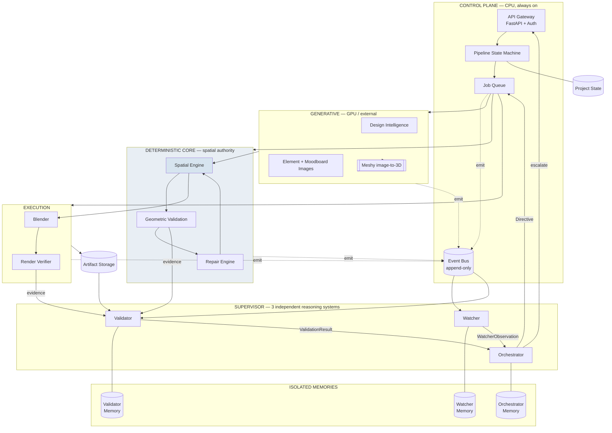

**Read the arrows into `QUEUE`.** Everything that changes the system passes through the job queue. The Orchestrator's only outbound edge to the pipeline is a directive to that queue. It has no edge to `SE`, `DET` or `STORE`.

---

## 4. Diagram 2 — Current → V4 migration

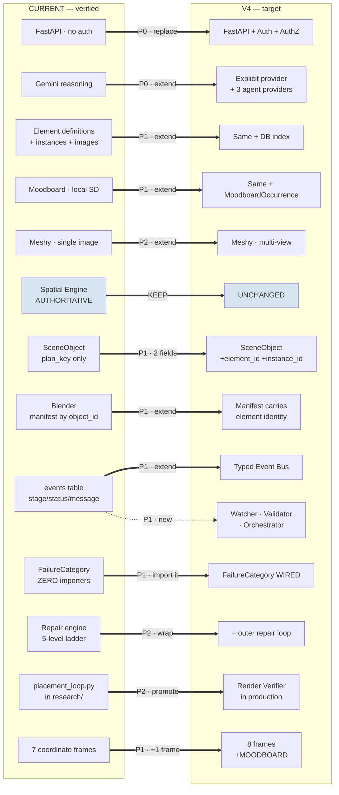

Only two boxes are *replacements* (auth, provider selection). Everything else is an extension of something that already works, and the Spatial Engine is untouched.

---

## 5. Diagram 3 — Complete production pipeline

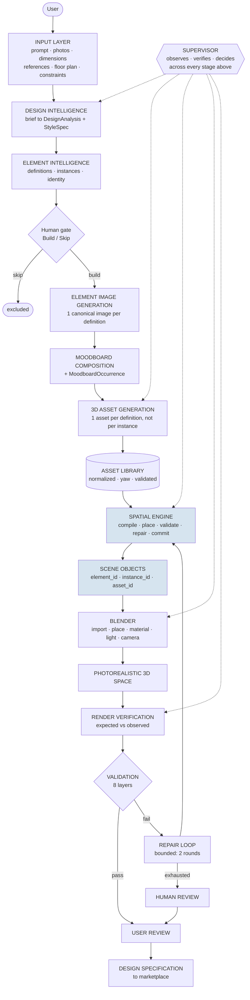

The Supervisor is drawn with dotted edges deliberately: it is **cross-cutting, not sequential**, and it is **non-load-bearing** — with the Supervisor disabled the solid path still completes. §21.6 makes that a testable property.

---

## 6. Component interface table

Every component: what it receives, what it produces, what it is permitted to change, and what happens when it fails.

| Component | Input | Output | **Authority over** | Reads | Writes | **May NOT change** | Failure mode |
|---|---|---|---|---|---|---|---|
| **Input Layer** `[EXTENSION]` | HTTP multipart, brief text, room hints | `InputRecord`, `ref_NN.ext` on disk | file identity, storage path | request | `inputs` table, `input/references/` | anything downstream | reject 4xx; no partial write |
| **Design Intelligence (Qwen/Gemini)** `[EXTENSION]` | `InputBundle` | `DesignAnalysis`, `StyleSpec`, `ObjectPlan` | **nothing final** — proposals only | inputs | checkpoint JSON | coordinates, counts, identity | `_error` recorded; never silent mock substitution for a real primary |
| **Element Resolver** `[CURRENT]` | `SceneReading` / `ObjectPlan` | `ElementDefinition[]`, `ElementInstance[]`, `ElementInventory[]` | **canonical identity** | reading, plan | `scene_reading.json` | positions, assets | unresolved pieces keep unique `?<id>` keys — never merged |
| **Element Image Generator** `[CURRENT]` | `ElementDefinition` | `ElementImage` (PNG + seed + prompt) | image identity (content-addressed) | definitions | `planning/element_images/` | definition fields | per-image `error` field; definition survives |
| **Moodboard Composer** `[EXTENSION]` | `StyleSpec`, element images | room render + `MoodboardOccurrence[]` | **composition only** | style, images | `analysis/moodboard_room_*.png` | world coordinates | degrades moodboard; never fails analysis |
| **Meshy Adapter** `[EXTENSION]` | `ElementImage` (1..N views) | `.glb` + generation metadata | nothing | element images | `assets/generated/` | element identity | 4 retries on transport/5xx; `asset.failed` event |
| **Asset Library** `[EXTENSION]` | `.glb` + `IngestMeta` | `AssetRecord` (normalized, validated) | **asset identity, normalization, yaw** | glb | `registry.json`, `normalized/`, `web/` | element identity, scene | `status="failed"` + `ValidationIssue[]`; asset unusable, not silently used |
| **Spatial Engine** `[CURRENT]` | `ObjectPlan` + `AssetPlan` + room geometry | `Scene` (committed) | **ALL spatial truth** | plan, assets, registry | `scene_spec.json` via `SceneStore.commit` | element identity, asset content | warnings per item; unplaceable item reported, never faked |
| **Repair Engine** `[CURRENT]` | invalid `Scene` | repaired `Scene` + `TerminalState` | **transforms, within the solver's rules** | scene, relations | returns a new `Scene` | identity, dimensions, asset binding | `UNREPAIRABLE` / `ESCALATE` / `UPSTREAM_REQUIRED` |
| **Blender** `[EXTENSION]` | `build_manifest.json` | `.blend`, renders, `validation_report.json` | **nothing spatial** — executes only | manifest, assets | `blender/`, `previews/`, `renders/` | positions, rotations, dimensions | non-zero exit → `BLENDER_EXECUTION_FAILURE` |
| **Render Verifier** `[NEW V4]` | `Scene` + renders + visibility report | `VerificationEvidence` | **nothing** — evidence only | scene, renders | `planning/render_verification.json` | scene, assets, identity | reports `UNKNOWN`, never a pass |
| **Watcher** `[NEW V4]` | event stream | `WatcherObservation[]` | **nothing** | bus, `WatcherMemory` | `WatcherMemory` | scene, assets, other memories | degraded observation; pipeline unaffected |
| **Validator** `[NEW V4]` | structured evidence + renders | `ValidationResult` | **nothing** — verdicts only | evidence, `ValidatorMemory` | `ValidatorMemory` | scene, assets, other memories | `REVIEW_REQUIRED` — **never `PASS`** |
| **Orchestrator** `[NEW V4]` | `WatcherObservation` + `ValidationResult` + job state | `Directive` | **job control only** | both inputs, `OrchestratorMemory` | `OrchestratorMemory`, queue | scene, geometry, identity | `HUMAN_REVIEW` |
| **Event Bus** `[EXTENSION]` | `PipelineEvent` | append-only stream | **event ordering + immutability** | — | `events` table | past events (immutable) | emit failure logged, never blocks the job |
| **Job Queue / Runner** `[EXTENSION]` | `Job` | job lifecycle | **execution, lanes, retries, repair counter** | `jobs` table | `jobs`, `events` | domain artifacts | retry to `max_attempts`, then `FAILED` |
| **Storage** `[EXTENSION]` | artifacts | URIs | **durability, addressing** | — | object store / disk | artifact content | write failure fails the producing stage |
| **API Gateway** `[EXTENSION]` | HTTP | typed envelope | **authn/authz, idempotency** | all stores | via services | domain rules | typed error envelope |
| **GPU Worker** `[NEW V4]` | GPU job | artifacts + resource report | **nothing domain-level** | job payload | artifacts, `job_metrics` | domain truth | job marked failed with resource evidence |

---

## 7. Authority matrix

| Decision | Authority | AI may propose? | AI may decide? | Human override? |
|---|---|---|---|---|
| Element identification | Element Resolver, from AI evidence | **yes** | no | **yes** (Build/Skip gate) |
| Element count | **Derived** — rows counted, never asked | no | **no** | yes (edit inventory) |
| Canonical identity (merge/split) | `canonical_key_for` — deterministic | evidence only | no | yes |
| Asset identity | Asset Library | no | no | yes (replace asset) |
| Asset normalization / yaw | Asset ingest — **measured** | no | no | yes (explicit `yaw_offset`) |
| Object dimensions | Asset record, else per-type table | **yes** (estimate) | no | yes |
| Material / colour | Registry resolution of AI proposal | **yes** | no | yes |
| **Spatial position** | **Spatial Engine** | hint only (ranking key) | **NO** | yes (scene patch) |
| **Orientation** | **Spatial Engine** | hint only | **NO** | yes |
| **Collision resolution** | **Repair Engine** | no | **NO** | yes |
| **Clearance** | **Clearance Engine** | no | **NO** | no — code-derived |
| Room geometry | Compiler, from hints | estimate only | no | **yes** (step-4 editing) |
| Visual quality assessment | Validator | **yes** | advisory only | yes |
| Render validity | Render Verifier (deterministic) + Validator (appearance) | **yes** (appearance) | **no** | yes |
| Repair strategy | Orchestrator policy table | **yes** (ambiguous cases) | within the bounded ladder | yes |
| Pipeline continuation | Orchestrator | yes | yes, **bounded** | yes |
| **Final approval** | **Human** | no | **NO** | — it *is* the human's |

**The three NO-in-caps rows are the product.** Everything else is negotiable design; those are not.

---

## 8. Data ownership matrix

| Data | Owner | Readers | Writers | Immutable? |
|---|---|---|---|---|
| `InputRecord` + reference files | Input Layer | all stages | Input Layer | **yes after upload** |
| `DesignIntentSet` | Reference Reader | planner, validator, UI | Reference Reader | versioned; re-run replaces |
| `DesignAnalysis` / `StyleSpec` | Design Intelligence | planner, moodboard | analyze handler | versioned |
| `ElementDefinition` | Element Resolver | all downstream | resolver; **`approved` by human** | identity immutable; `approved` mutable once |
| `ElementInstance` | Element Resolver | compiler, validator | resolver | yes |
| `ElementImage` | Image Generator | Meshy, moodboard, UI | image handler | yes (content-addressed) |
| `MoodboardOccurrence` `[NEW V4]` | Moodboard Composer | validator, UI, planner | composer | **yes** |
| `ThreeDAsset` / `AssetRecord` | Asset Library | compiler, Blender, UI | ingest pipeline | record versioned; **mesh file immutable** |
| `ObjectPlan` | Planner + merge | compiler | planner | versioned |
| `SceneObject` | **Spatial Engine** | Blender, verifier, UI | **Spatial Engine + Repair only** | no — but only via `commit` |
| `Scene` | `SceneStore` | everything downstream | `commit(scene, base_version)` | **each version immutable**; full history kept |
| `build_manifest.json` | Manifest builder | Blender | manifest builder | yes per build |
| Render outputs | Blender | verifier, UI | Blender | **yes** |
| `ValidationResult` | Validator | Orchestrator, UI | Validator | **yes** |
| `VerificationEvidence` | Render Verifier | Validator, UI | Verifier | **yes** |
| `PipelineEvent` | Event Bus | Watcher, Validator, UI | producers (append) | **YES — never rewritten** |
| `WatcherMemory` | Watcher | **Watcher only** | Watcher | append-only |
| `ValidatorMemory` | Validator | **Validator only** | Validator | append-only |
| `OrchestratorMemory` | Orchestrator | **Orchestrator only** | Orchestrator | append-only |
| `HumanDecision` `[NEW V4]` | API | Orchestrator, provenance, UI | API (authenticated) | **yes** |

Three rows say "only". Those are §10's isolation rule expressed as data ownership.

---

## 9. Diagram 4 — Supervisor architecture

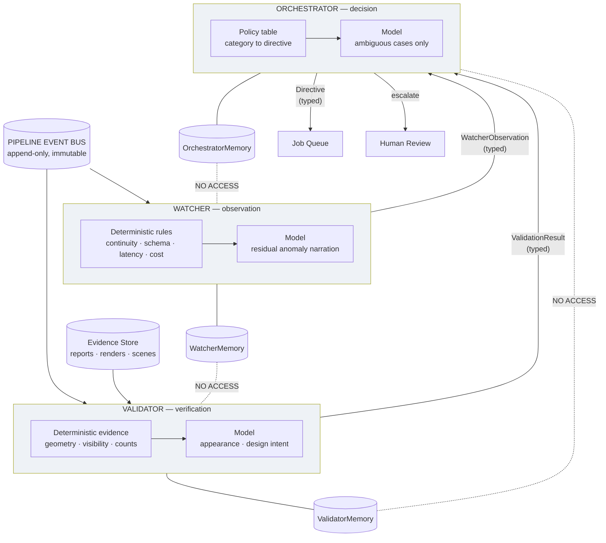

**Each agent is rules-first, model-second.** The deterministic block runs first and the model handles only the residue. This is a cost decision and a correctness decision: a model asked to count elements will sometimes miscount something SQL knows exactly.

---

## 10. Diagram 5 — Memory isolation

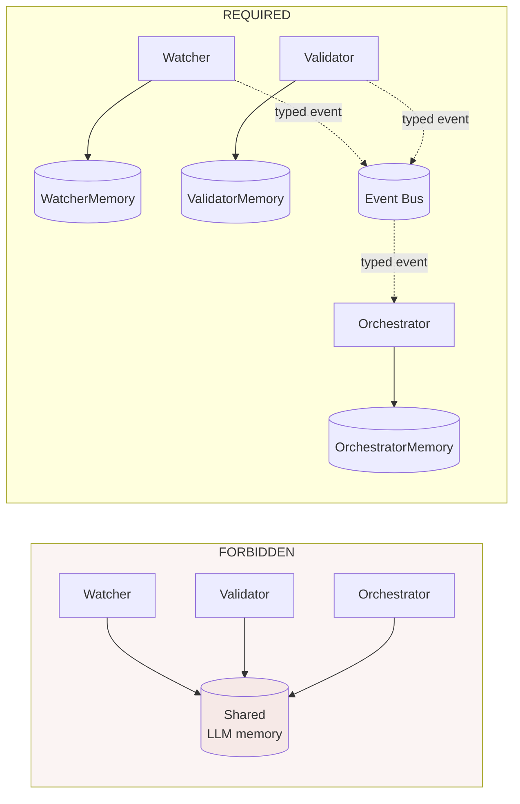

### Isolation is a construction property

Each agent is built with exactly one store handle:

```
Watcher(provider=W, memory=WatcherMemoryStore(project_id))
Validator(provider=V, memory=ValidatorMemoryStore(project_id))
Orchestrator(provider=O, memory=OrchestratorMemoryStore(project_id), queue=QueueHandle)
```

No constructor receives another agent's store. Isolation therefore cannot be violated by a prompt, a model error, or a careless call site — the object graph does not contain the edge.

### Memory store specification

| Property | Watcher | Validator | Orchestrator |
|---|---|---|---|
| **Contents** | events, traces, latency/cost series, anomaly history, prior observations | rules, prior verdicts, known failure exemplars, evidence refs | decisions, directives, repair rounds, escalations, outcomes |
| **Scope** | project-scoped; cross-project only as **aggregate statistics**, never raw rows | project-scoped; rules are global | project-scoped |
| **Storage** | `watcher_memory` table + evidence refs to object storage | `validator_memory` table | `orchestrator_memory` table |
| **Write mode** | append-only | append-only | append-only |
| **Read permission** | Watcher process only | Validator process only | Orchestrator process only |
| **Retrieval** | by `(project_id, stage, time-window)`; recent-N + statistical summary | by `(project_id, entity_id)` + rule lookup by category | by `(project_id, job_id)` + round counter |
| **Retention** | 90 d detail then aggregates — `[UNKNOWN]`, set from storage cost | verdicts for project lifetime; exemplars indefinite | project lifetime |
| **Versioning** | `memory_schema_version` on every row | same | same |
| **Never contains** | Validator verdicts, Orchestrator decisions, raw transcripts | Watcher observations as *conclusions*, Orchestrator decisions, raw transcripts | raw model transcripts from either |

**Cross-agent leakage rule:** an agent may receive another agent's *typed output* as an input field (the Orchestrator receives `ValidationResult`). It may never receive another agent's *memory* or *transcript*. The difference is that a typed output has a schema, a confidence and evidence refs; a transcript carries reasoning that the receiving model will treat as premise.

---

## 11. Coordinate system design

### 11.1 The frame registry — already built

`FrameId` `[CURRENT]`:

| Frame | Space | Units | Up / Right / Forward | Metric | Serializable |
|---|---|---|---|---|---|
| `IMAGE` | 2D pixels of a source photo | px | — / +u / — | no | no |
| `CAMERA` | 3D camera-relative, OpenCV | m | per OpenCV | yes | no |
| **`ROOM`** | **3D Allure canonical — the authority frame** | **m** | **+Y / +X / −Z** | **yes** | **yes** |
| `WALL` | 3D per-wall local | m | per wall | yes | yes |
| `OBJECT` | 3D per-SceneObject local | m | object-local | yes | yes |
| `ASSET` | 3D per-mesh local | m | asset-local | yes | yes |
| `BLENDER_WORLD` | Blender's world | m | +Z up, Y depth | yes | yes |

### 11.2 The one frame V4 adds

**`MOODBOARD`** `[NEW V4]`:

```
frame_id          MOODBOARD
purpose           position within a generated room composition
parent            None  (not a projection of ROOM - no camera pose exists)
units             dimensionless (fractions of image extent)
handedness        None (2D)
up / right        origin top-left, +u right, +v down
metric            FALSE           <-- the critical field
persistent        TRUE            (stored in scene_reading.json)
serializable      TRUE
transform_source  none - THERE IS NO TRANSFORM TO ROOM
```

**`MOODBOARD` has no edge in the frame graph, deliberately.** A moodboard is generated without a camera pose, so no projection exists to invert. Anything that converts a moodboard quantity to metres is applying a **convention**, not a transform, and must say so.

That convention `[CURRENT]`: the render is treated as taken from the room's front wall looking at the back wall; the plan binds *back* to the room rectangle's north edge (min z) and *left* to west (min x). `SceneElement.position_source` records which happened — `"read"` (the model answered the frame fields) or `"derived"` (computed from the crop box, ordinal not metric).

**Design rule:** a `MOODBOARD` quantity may become a **ranking hint** for the solver. It may never become a placement. `position_source="derived"` values are ordinal and must not be compared in metres.

### 11.3 The name collision to fix

`"floor_plan"` currently means two unrelated things `[CURRENT]`:

1. `InputKind.floor_plan` — an uploaded document type (`projects/schema.py:59`). *(Note: accepted as an input kind but **no handler reads it** — floor-plan intake is declared, not implemented.)*
2. `Frame = Literal["floor_plan", "camera"]` — a relation frame in `spatial/relation_model.py:33`, also `clearance_engine.py:72`

These are different concepts sharing a string. V4 renames the *relation* frame usage to align with `FrameId` (the relation sense means "in the room's plan view", i.e. `ROOM` projected to XZ) and leaves `InputKind` alone. Until renamed, **no code may compare the two**.

### 11.4 ROOM → BLENDER_WORLD

The only transform crossing into the executor `[CURRENT]`, in `blender/manifest.py`:

```
to_blender_xyz((x, y, z))  ->  [x, -z, y]
to_blender_xy((x, z))      ->  [x, -z]
yaw_to_blender_rz(r)       ->  r            # identity
scene_forward(r)   = (-sin r, -cos r)       # ROOM (x, z)
blender_forward(r) = (-sin r,  cos r)       # BLENDER (x, y), local forward +Y
```

Every serialized quantity must name its frame. The manifest is `BLENDER_WORLD` throughout; `scene_spec.json` is `ROOM` throughout. **No file mixes frames.**

### 11.5 ASSET → OBJECT is identity, and why

`frame_graph.asset_to_object_transform()` returns identity `[CURRENT]`. The module records the reason: a Phase 10 audit found **none of the 58 registry assets** needed a forward-axis correction, so identity is the measured-correct default rather than an unfilled placeholder.

**This does not extend to generated meshes.** Meshy output is a different population from the audited catalog, and `NormalizationInfo.yaw_offset` exists precisely to carry a per-asset correction. V4 measures and stores it at ingest (§14.4); when non-zero it becomes a real `Rigid3` on this edge. The identity default stays correct for the 58 audited assets.

---

## 12. Element identity architecture

### 12.1 Diagram 7 — the identity chain

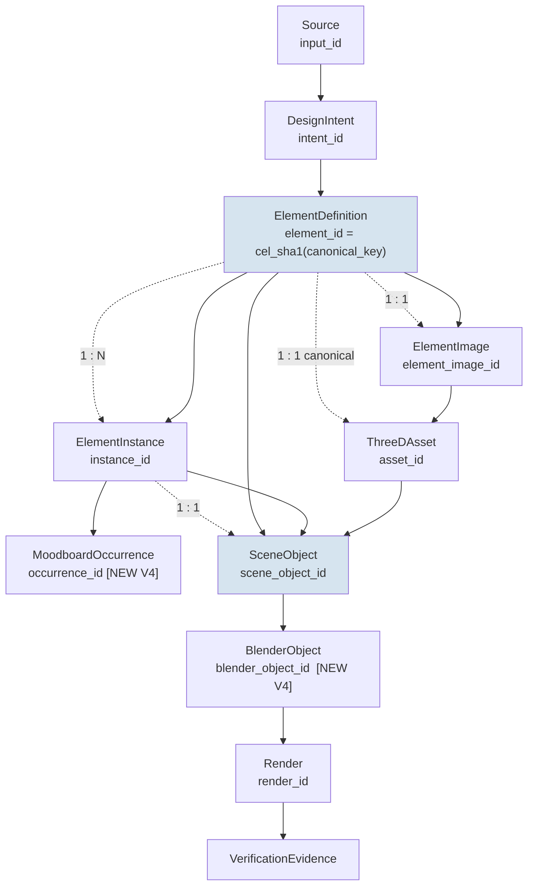

**The two cardinalities that define the product:**

- `ElementDefinition 1 : N ElementInstance` — three bar stools are one identity and three occurrences.
- `ElementDefinition 1 : 1 ThreeDAsset` — those three stools cost **one** generation. `[CURRENT]`

### 12.2 Canonical identity rules `[CURRENT]` — preserved unchanged

```
canonical_key = room | semantic_type | dims-bucket(0.1 m) | material | colour
element_id    = "cel_" + sha1(canonical_key)[:10]
```

- **Position is never part of identity.** It was, once — and three identical stools became three identities and 90 Meshy credits where 30 would do (`research/element-first/identity-ablation.json`).
- **No-evidence pieces cannot false-merge.** A piece with no positive evidence gets key `room|type|?<id>`, unique by construction.
- **False-split limitation, known and accepted:** two pieces either side of a 0.1 m bucket boundary split. Measured rate `[UNKNOWN]`.

### 12.3 Contracts

**ElementDefinition** `[CURRENT]` — *what a thing is*. Carries `element_id`, `room_id`, `semantic_type`, `canonical_name`, `material`, `color`, `dimensions_m`, `identity_method`, `instance_count`, `source_element_ids`, `canonical_asset_id`, `approved`. **No field is a position.**

**ElementInstance** `[CURRENT]` — *one occurrence of that thing*. Carries `instance_id`, `element_id`, `room_id`, `source_element_id`, `bbox`, `crop_ref`. Evidence about **this copy**, never about the kind.

**ElementImage** `[CURRENT]` — *the canonical picture*. One per definition. Seed derived from the element id, never random, so the same piece yields the same image on every run.

**MoodboardOccurrence** `[NEW V4]` — *where this instance appears in a composition*:

```
occurrence_id          str
element_instance_id    str
element_id             str          # denormalized for query
moodboard_id           str
room_id                str
frame                  Literal["MOODBOARD"]       # always - enforced
bbox_norm              (u0, v0, u1, v1)           # fractions, NOT metres
scale_norm             float
rotation_hint          str                         # back|left|right|front|""
crop_ref               str
crop_px                (int, int)                  # size BEFORE upscaling
visual_evidence        dict
position_source        Literal["read","derived",""]
confidence             float
provenance             {element_image_id, moodboard_render_id,
                        reader_model, reader_version}
```

**Why this is a new type rather than reusing `SceneElement`:** `SceneElement` currently conflates three jobs — a detection record, an occurrence record, and a hint carrier. Separating the occurrence makes the frame explicit (`frame` is pinned to `MOODBOARD`), which is what stops a moodboard fraction from being read as metres. `SceneElement` remains the reader's raw output; `MoodboardOccurrence` is the typed, frame-tagged projection of it — derived, so there is no second source of truth.

> *`plan.md` §9 argued against adding this type on the grounds that `SceneElement` already carries the fields. The brief requires it as first-class, and on reflection the brief is right for a reason `plan.md` under-weighted: a pinned `frame` field is the mechanism that prevents metric/non-metric confusion. The record stays derived, so the objection about duplication is answered by construction.*

**ThreeDAsset** `[EXTENSION]` — asset identity is **separate from instance identity**:

```
asset_id                str                       # [CURRENT]
canonical_element_id    str                       # [NEW V4] - currently absent
source_image_id         str                       # [NEW V4] which ElementImage
provider                polyhaven|upload|meshy|local     # [CURRENT]
generation_request_id   str                       # [NEW V4] idempotency key
files                   original | normalized | web      # [CURRENT]
dimensions              Vec3, post-normalization  # [CURRENT]
normalization           unit_scale, yaw_offset,
                        translation, strategy     # [CURRENT]
validation              ValidationIssue[]         # [CURRENT]
status                  normalized | failed       # [CURRENT]
project_id              str                       # [CURRENT] tenancy boundary
version                 int                       # [EXTENSION]
```

`AssetRecord.project_id` is a **tenancy boundary, not metadata**: a mesh generated from one client's moodboard stays out of the shared catalog, because offering it to the next project would put one client's furniture in another's home.

**SceneObject** `[EXTENSION]` — target shape:

```
scene_object_id  (= object_id)   [CURRENT]  random per-scene handle
element_id                       [NEW V4]
instance_id                      [NEW V4]
asset_id                         [CURRENT]
plan_key                         [CURRENT]  KEEP - the existing join
room_id, position, rotation_y,
scale, dimensions                [CURRENT]  frame = ROOM
visual (ObjectVisual)            [CURRENT]  carries source_intent_ids
```

`source_intent_ids` already exists nested inside `visual`. V4 adds a flat accessor rather than a duplicate field.

**BlenderObject** `[NEW V4]` — the manifest entry currently carries `"id": object_id` and nothing else identity-bearing. V4 adds `element_id`, `instance_id`, `plan_key`. Without this the chain breaks at the final hop and a render cannot be traced back to an element.

### 12.4 instance_id allocation

`ObjectPlanItem` carries `count: int`, not instance ids, and the compiler expands it with `for n in range(item.count)`. Identity per copy is therefore **allocated at compile time**:

```
instance_id = f"{element_id}#{n}"     # deterministic, stable across re-runs
```

The alternative — resolving real `ElementInstance` rows in the compiler — would require `app/planning` to import from `app/intelligence`, crossing a boundary the codebase deliberately maintains (`scene/schema.py` documents that the executor-facing contract imports nothing from the intelligence package). **Rejected on that ground alone.**

Reconciliation caveat, stated because it will surprise someone: when `item.count` differs from `len(instances)` for that element, the derived ids will not match the resolver's rows. That divergence must be **emitted as an event**, not silently tolerated.

---

## 13. Diagram 8 — Spatial Engine

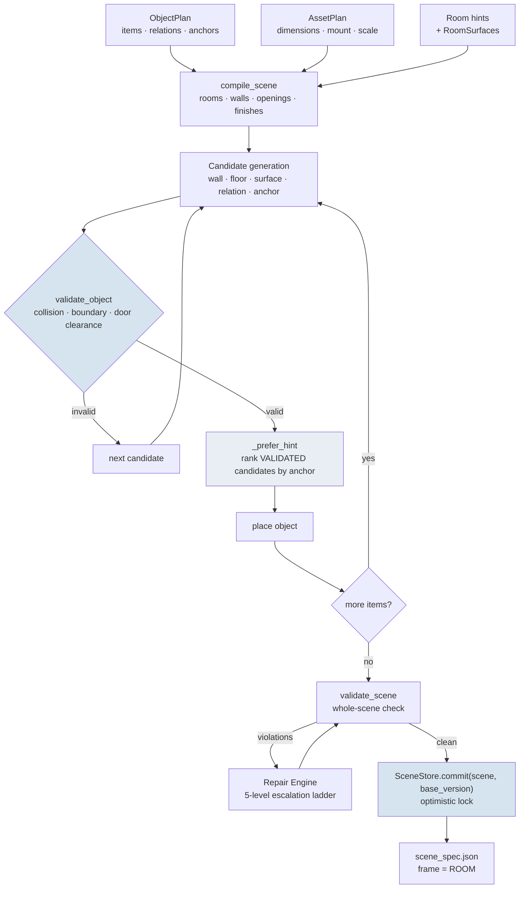

**The ordering is the whole design.** `validate_object` runs *before* `_prefer_hint`. The AI's anchor can only reorder options the solver has already proved valid. An anchor that no valid candidate satisfies is dropped and the solver's own choice stands.

### Encoded constants `[CURRENT]` — measured, not arbitrary

```
PRIMARY_WALKWAY_MIN_M   = 0.90    # near IRC 0.914 m hallway minimum
SECONDARY_WALKWAY_MIN_M = 0.65
PEDESTRIAN_INFLATION_M  = 0.275
GRID_CELL_M             = 0.05
DOOR_CLEARANCE_DEPTH    = 0.75
BOUNDARY_TOLERANCE      = 0.09    # lets furniture sit flush against walls
```

Changing any of these requires measured evidence — Invariant 20.

### Scene commit `[CURRENT]`

`SceneStore.commit(scene, base_version)` uses **optimistic locking**: a mismatched `base_version` raises `VersionConflict` (surfaced as HTTP 409, retryable). Full version history is retained, so every scene version is immutable once written.

---

## 14. Diagram 9 — Asset generation and lifecycle

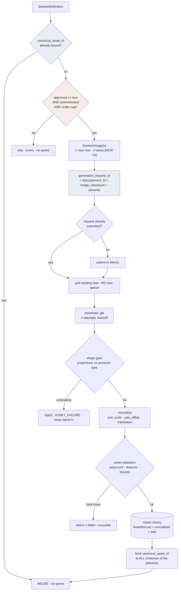

### 14.1 Spend safety — four independent gates

1. **Human approval** — `ElementDefinition.approved` must be `true` `[CURRENT]`
2. **Authentication** — the endpoint must require a principal `[NEW V4]`; today `POST /projects/{id}/elements/generate` is open
3. **Per-project cap** — `meshy_max_per_project` `[CURRENT]`
4. **Idempotency key** — `generation_request_id` `[NEW V4]`

Gate 4 is what makes retry safe. Without it a retried job re-submits and re-charges.

### 14.2 Reuse is the default, not an optimization

One generation per **definition**, bound to every **instance**. `[CURRENT]`

### 14.3 The shape gate `[CURRENT]`

`_contradicts_its_type` refuses to bind a mesh whose proportions contradict its semantic type (rug flatness ≤ 0.15; television/wall_art/mirror depth ratio ≤ 0.35). It exists because a "rug" crop containing the coffee table standing on it produced a table mesh (measured flatness 0.53).

**The gate is a symptom guard.** The root cause is that crops are bounding boxes rather than segmentation masks; §14.5's successor work is the real fix.

### 14.4 Normalization and orientation

`NormalizationInfo` exists with `unit_scale`, `yaw_offset`, `translation`, `strategy` `[CURRENT]`. `yaw_offset` is **always 0.0 today**. V4 measures the forward axis at ingest and stores it here — see §11.5 for why identity remains correct for the 58 audited catalog assets while generated meshes need real measurement.

### 14.5 Multi-view `[NEW V4]`

Meshy accepts multi-view input; the adapter sends one `image_url`. With one view, back-of-object geometry is inferred. Four views (front / left / right / back, rendered from the canonical element image) is the target. **Must be A/B measured against single-view before adoption** — `[UNKNOWN]` whether it improves the result here.

---

## 15. Diagram 10 — Blender execution and rendering

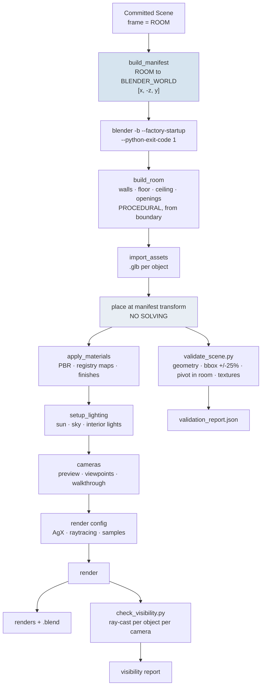

**Blender never solves.** Room geometry is procedural from the room boundary — which is what keeps corners square, doors aligned, and the validator able to prove nothing blocks a doorway. Generating wall meshes from crops would replace geometry that is *correct by construction* with geometry that is *correct by luck*.

### 15.1 Photorealism requirements

| Requirement | Mechanism | Status |
|---|---|---|
| Physically accurate scale | `dimensions` in metres; assets normalized at ingest | `[CURRENT]` |
| Room accuracy | procedural from boundary | `[CURRENT]` |
| PBR materials | registry `roughness` / `metalness` / maps | `[EXTENSION]` |
| Colour management | AgX + a **valid** look name | `[EXTENSION]` — see below |
| Indirect lighting | `scene.eevee.use_raytracing` | `[EXTENSION]` — never set today |
| Shadows / reflections | EEVEE with raytracing + overscan | `[EXTENSION]` |
| Camera realism | focal length, exposure per room | `[EXTENSION]` |
| Correct orientation | measured `yaw_offset` | `[EXTENSION]` |

Two live defects, both verified this session:

```python
# blender/scripts/build_scene.py:38-42
try:
    scene.view_settings.view_transform = "AgX"          # succeeds
    scene.view_settings.look = "AgX - Medium Contrast"  # REJECTED by Blender 5.2.1
except TypeError:
    pass                                                 # discards the failure
```

Every render to date has used AgX with **no contrast look applied**. `AgX - High Contrast`, `Punchy` and `Base Contrast` were probed and accepted. And `use_raytracing` is set nowhere in `blender/scripts/`, so it stays `False`.

**Design rule:** configuration that silently no-ops is worse than configuration that fails. Settings application must validate and report, never `except: pass`.

### 15.2 Photorealism is not correctness

A photorealistic render of the wrong room is a failure. §16 is the gate, not the renderer.

---

## 16. Render Verifier

```
Validated Scene  ->  Blender  ->  Render  ->  Render Verifier  ->  VerificationEvidence
    (expected)                  (observed)                          (evidence only)
```

| Check | Mechanism | Deterministic? |
|---|---|---|
| Expected objects exist | manifest vs `validate_scene.py` | **yes** |
| Object count | manifest vs placed | **yes** |
| Major objects visible | `check_visibility.py` ray-cast | **yes** |
| Approximate location | placed vs committed transform | **yes** |
| Scale | rendered bbox vs expected ±25% | **yes** |
| Orientation | yaw vs `facing_dir` | **yes** |
| Floating objects | y vs floor / support surface | **yes** |
| Severe intersections | `validate_scene` collision | **yes** |
| Room architecture preserved | manifest vs built geometry | **yes** |
| Doors / windows respected | `door_clearance_rects` | **yes** |
| Circulation | `clearance_engine` | **yes** |
| **Major materials match** | render vs `ObjectVisual` | **no — Validator** |
| **Major colours match** | render vs `color` / `color_words` | **no — Validator** |

**Eleven of thirteen checks are deterministic.** That ratio is achievable only because `check_visibility.py` and the geometric validators already exist.

### Why a model is not the judge of geometry

`check_visibility.py`'s own docstring records the measurement: a VLM asked to name what it saw scored the *same* built scene **0.556 / 0.778 / 0.556 / 0.556** across four reads — a 22-point spread, wider than any improvement worth chasing — while inventing a dining table in all four views of a living room that has none.

> *"A generative reader cannot be the judge of the pipeline that feeds it."*

The ray-cast gives the same answer every run, with no network and no credits, and separates the three failures that matter: **never in frame** / **occluded** / **visible**.

### Output contract `[NEW V4]`

```
VerificationEvidence
  verification_id, scene_id, scene_version, render_ids[]
  per_object: [{ scene_object_id, element_id, instance_id,
                 expected: {...}, observed: {...},
                 visibility: visible | occluded | never_in_frame,
                 checks: {name: pass | fail | unknown} }]
  summary: { coverage, placement_within_tolerance,
             orientation_match, asset_bound }
  verifier_version, produced_at
```

`unknown` is a first-class result. A check that could not run is **not** a pass.

---

## 17. Validation layers

Eight independent layers, deliberately not merged. Each has one job, one input, one failure category.

| # | Layer | Input | Detects | Category | Status |
|---|---|---|---|---|---|
| 1 | **Schema** | any artifact | malformed / missing fields | `REPRESENTATION_FAILURE` | `[CURRENT]` Pydantic |
| 2 | **Element identity** | definitions + instances + inventory | false merge/split, count drift, orphaned ids | `REPRESENTATION_FAILURE` | `[EXTENSION]` |
| 3 | **Asset** | `AssetRecord` | polycount, bounds, textures, shape-vs-type | `ASSET_FAILURE` | `[CURRENT]` |
| 4 | **Spatial** | `Scene` | collision, boundary, door clearance | `GEOMETRY_FAILURE` | `[CURRENT]` `validate_scene` |
| 5 | **Scene consistency** | `Scene` | dangling refs, parent cycles, room mismatch | `REPRESENTATION_FAILURE` | `[CURRENT]` `scene_consistency` |
| 6 | **Blender execution** | build output | missing geometry, bbox ±25%, pivot outside room, missing textures | `BLENDER_EXECUTION_FAILURE` | `[CURRENT]` |
| 7 | **Render verification** | renders + scene | invisible / missing / floating / mis-oriented | `VALIDATION_FAILURE` | `[NEW V4]` |
| 8 | **Design intent** | scene + intents + renders | requested style / elements / constraints not honoured | `PERCEPTION_FAILURE` or none | `[NEW V4]` Validator |

**Layers 1–7 are deterministic. Only layer 8 requires a model.** A failure at layer N does not run layer N+1 — it emits and escalates, so the first cause is reported rather than a cascade.

---

## 18. Diagram 11 — Validation flow

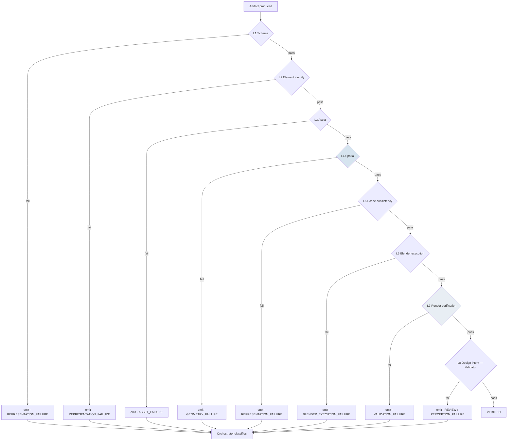

---

## 19. Diagram 12 — Repair loop

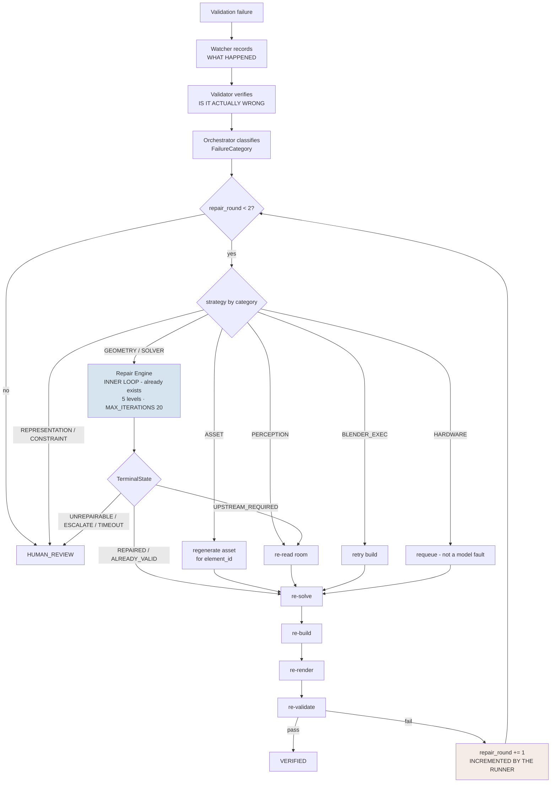

### Two loops, two owners

| | Inner | Outer |
|---|---|---|
| Owner | Repair Engine `[CURRENT]` | Orchestrator + Runner `[NEW V4]` |
| Scope | one scene's geometry | the whole pipeline |
| Bound | `MAX_ITERATIONS = 20` | `MAX_OUTER_REPAIR_ROUNDS = 2` |
| Enforcement | inside the engine | **by the runner, before dispatch** |
| Terminals | `REPAIRED, ALREADY_VALID, UNREPAIRABLE, ESCALATE, TIMEOUT, UPSTREAM_REQUIRED` | `VERIFIED, HUMAN_REVIEW, FAILED` |

**Termination proof:** `repair_round` lives on the job row and is incremented by the **runner**, not the agent. An Orchestrator that malfunctions and requests repair indefinitely still halts at 2. Bounding a loop with a rule the looping component is asked to obey is not a bound.

### Repair persistence — required, not optional

Every round persists: original failure (category + evidence), Validator verdict, Orchestrator decision + rationale, repair action, resulting scene version, second validation, final outcome. Without this the system cannot answer "why does this room look like this", which is the question a human reviewer always asks.

---

## 20. Diagram 6 — Event bus

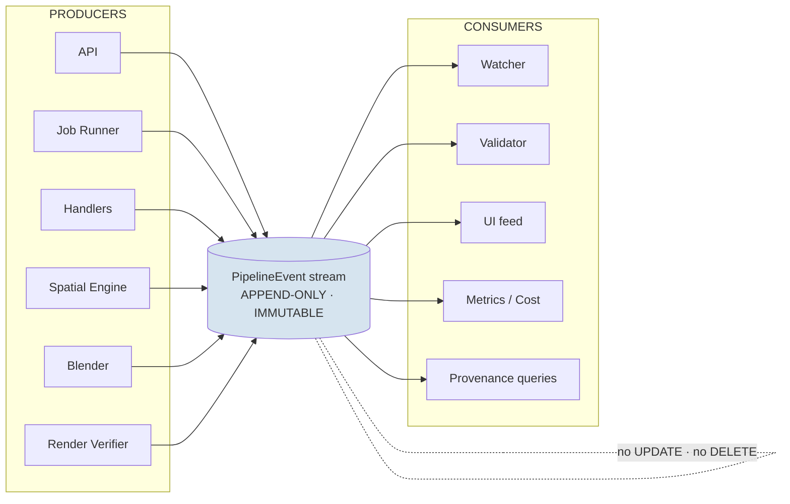

### Event envelope `[EXTENSION]`

Built on the existing `events` table (`event_id, project_id, job_id, stage, status, message, duration_ms, ts`) and the existing `ctx.emit(stage, message, status)` call sites. New fields are optional, so every current emitter keeps working:

```
PipelineEvent
  event_id           int      # [CURRENT] autoincrement - also the ordering key
  schema_version     str      # [NEW V4]
  project_id         str      # [CURRENT]
  job_id             str      # [CURRENT]
  parent_event_id    int?     # [NEW V4] causal chain
  correlation_id     str      # [NEW V4] one project run end-to-end
  producer           str      # [NEW V4] component name + version
  event_type         str      # [NEW V4] e.g. "spatial.solve.completed"
  stage              str      # [CURRENT]
  status             str      # [CURRENT]
  severity           info|warning|error|critical   # [NEW V4] set by EMITTER
  entity_ids         str[]    # [NEW V4] element/instance/asset/object ids
  evidence_refs      str[]    # [NEW V4] PATHS, never inlined content
  payload            dict     # [NEW V4] small, typed per event_type
  duration_ms        int      # [CURRENT]
  ts                 str      # [CURRENT] ISO 8601 UTC
```

Example:

```json
{
  "schema_version": "1.0",
  "event_id": 84213,
  "parent_event_id": 84207,
  "correlation_id": "run_7b3c1d",
  "project_id": "proj_a25a006c88",
  "job_id": "job_1f2e3d4c5b",
  "producer": "spatial_engine@4.0",
  "event_type": "validation.failed",
  "stage": "spatial_solve",
  "status": "failed",
  "severity": "error",
  "entity_ids": ["cel_ab12cd34ef", "cel_ab12cd34ef#1"],
  "evidence_refs": ["planning/validation_report.json", "renders/view_ne.png"],
  "payload": {"failure_category": "geometry_failure", "violation_count": 2},
  "duration_ms": 1840,
  "ts": "2026-09-21T03:14:07Z"
}
```

### Three rules

1. **Immutability.** No `UPDATE`, no `DELETE`. A wrong event is corrected by a **new** event referencing it via `parent_event_id`. Events are evidence; rewriting evidence destroys the audit trail the Supervisor depends on.
2. **`evidence_refs` are paths.** Never inlined content. This keeps rows small and prevents a large model answer becoming a memory row.
3. **Severity is set by the emitter.** The emitter knows whether a missing texture is fatal; a downstream model would guess.

### Attach point

`runner._execute` is the single choke point through which every job start, success, retry and failure already passes. **One hook there instruments all 13 job types** (11 handler modules — `tour` and `scene_plan` each register two; correction C9).

### Canonical event types

```
project.created · input.received
analysis.started · analysis.completed
element.detected · element.validated · element.rejected · element.identity.resolved
element.image.generated
moodboard.composed · moodboard.occurrence.recorded
asset.requested · asset.generated · asset.failed · asset.reused
spatial.solve.started · spatial.solve.completed · scene.committed
blender.started · blender.completed · render.generated
validation.started · validation.passed · validation.failed
repair.requested · repair.completed
human_review.required · human_review.decided
pipeline.completed · pipeline.failed
```

---

## 21. The Supervisor in detail

### 21.1 Watcher — "What happened?"

**Boundary:** observes; does not judge spatial correctness; does not mutate anything outside its own memory.

```
WatcherObservation
  observation_id       str
  schema_version       str
  project_id, job_id   str
  stage                str
  event_type           str
  observed_at          ISO-8601 UTC
  entity_ids           str[]
  evidence_refs        str[]
  anomaly_type         missing_output | unexpected_output | schema_drift
                     | identity_discontinuity | provenance_gap | count_drift
                     | latency_outlier | cost_outlier | retry_storm
                     | state_regression | none
  observed             dict        # what was seen
  expected             dict        # what the stage promised
  severity             info|warning|error|critical
  confidence           float
  detection_method     rule | statistic | model    # provenance of the finding
  recommended_check    str         # a CHECK for the Validator, never an action
  watcher_version      str
```

`detection_method` is load-bearing. A rule-detected missing output is a fact; a model-narrated anomaly is a suggestion. Collapsing them would let a model's guess enter the Orchestrator with the same weight as a count.

**What the rules catch without a model:** stage emitted no terminal event · output checkpoint absent · schema parse failure · element count changed between stages · an `element_id` present upstream and absent downstream · latency beyond the stage's historical distribution · cost above the per-project budget · retry count above threshold · `ProjectStage` moved backwards.

### 21.2 Validator — "Is it correct?"

**Boundary:** verifies; returns evidence; never writes a scene.

**It does not re-check geometry.** Layers 1–7 already do, deterministically and repeatably. The Validator consumes their reports and adjudicates layer 8 plus the two appearance checks.

```
ValidationResult
  validation_id        str
  schema_version       str
  project_id, scene_id, scene_version
  status               PASS | FAIL | WARNING | REVIEW_REQUIRED
  severity             info|warning|error|critical
  issue_type           str                  # aligned to the layer that found it
  failure_category     FailureCategory?     # the EXISTING 12-value enum
  affected_entities    [{kind, id}]         # element/instance/asset/scene_object
  expected             dict
  observed             dict
  evidence             str[]                # refs to reports and renders
  confidence           float
  recommended_action   continue | retry | regenerate_asset | re_solve
                     | re_read | human_review
  determinism          deterministic | model_assisted   # which produced it
  rationale            str
  validator_version    str
```

**Failure semantics:** a Validator that cannot run returns `REVIEW_REQUIRED`. Never `PASS`. This is enforced by constructing its provider with `allow_fallback=False` — the existing `ResilientProvider` falls back to `MockProvider`, and a mock `PASS` would be fabricated evidence presented as verification.

### 21.3 Orchestrator — "What next?"

**Boundary:** decides; directs deterministic services; never authors geometry.

```
Directive
  directive_id, schema_version, project_id, job_id
  decision       CONTINUE | RETRY | REGENERATE | RE_SOLVE | RE_READ
               | ESCALATE | HUMAN_REVIEW | FAIL
  target         {job_type, entity_ids[], params}
  based_on       {observation_ids[], validation_ids[]}   # traceable inputs
  repair_round   int
  rationale      str
  decided_by     policy | model          # which made the call
  confidence     float
  orchestrator_version  str
```

**Policy table first** — `FailureCategory` → directive:

| Category | Directive | Note |
|---|---|---|
| `PERCEPTION_FAILURE` | `RE_READ` | the model's output was wrong |
| `ASSET_FAILURE` | `REGENERATE` (bounded) | the asset was wrong |
| `GEOMETRY_FAILURE` | `RE_SOLVE` → Repair Engine | never "ask an LLM for new XYZ" |
| `SOLVER_FAILURE` | `RE_SOLVE` | chose wrong among valid candidates |
| `CANDIDATE_VOCABULARY_FAILURE` | `HUMAN_REVIEW` | **code defect** — no candidate could express a valid solution |
| `CONSTRAINT_FAILURE` | `HUMAN_REVIEW` | **code defect** |
| `REPRESENTATION_FAILURE` | `HUMAN_REVIEW` | **code defect** — the data model could not express a true fact |
| `REPAIR_FAILURE` | `ESCALATE` | |
| `VALIDATION_FAILURE` | `HUMAN_REVIEW` | a check was missing or wrong |
| `BLENDER_EXECUTION_FAILURE` | `RETRY` then `ESCALATE` | |
| `HARDWARE_FAILURE` | `RETRY` / requeue | **never blame the model** |
| `UNKNOWN` | gather evidence then `ESCALATE` | correctly abstained — *not* "no problem" |

The model is consulted only when the table abstains or the evidence conflicts. `decided_by` records which.

**The three code-defect rows matter.** `REPRESENTATION_FAILURE`, `CONSTRAINT_FAILURE` and `CANDIDATE_VOCABULARY_FAILURE` cannot be repaired at runtime — they mean the system *could not express* the right answer. Retrying is wasted spend; a human must change code.

### 21.4 Model diversity

Independent configuration per role:

```
<ROLE>_PROVIDER, <ROLE>_MODEL, <ROLE>_TEMPERATURE, <ROLE>_MAX_TOKENS,
<ROLE>_TIMEOUT_SECONDS, <ROLE>_MAX_ATTEMPTS,
<ROLE>_ALLOW_FALLBACK  (default FALSE),
<ROLE>_OUTPUT_SCHEMA   (pinned), <ROLE>_MEMORY_SCOPE
```

The pipeline's own `get_provider()` singleton is **not** reused — `app/supervisor/providers.py` constructs per role.

**Model choice is a benchmark output.** `[UNKNOWN]` — no benchmark has been run. Selection method: a labelled set of known-good and known-bad pipeline states; score each candidate per role on verdict precision/recall; choose the combination with the **lowest correlated error**, since uncorrelated failure is the entire point of diversity. Startup logs all three resolved role→model bindings.

### 21.5 Preventing correlated failure

The failure mode this architecture exists to prevent:

```
Watcher:      "Looks correct."
Validator:    "Watcher says correct, therefore correct."
Orchestrator: "Both agree, proceed."
```

Four structural defences:

| Defence | How it blocks the chain |
|---|---|
| **Different inputs** | Watcher reads the **event stream**; Validator reads **artifacts and renders**. The Validator never receives a Watcher verdict as a premise — at most a `recommended_check`, which is a question, not an answer. |
| **Different models** | An error correlated across all three requires the same mistake from different models on different inputs. |
| **Different memories** | No agent can read another's memory, so yesterday's wrong conclusion cannot become today's context. |
| **Typed contracts** | `WatcherObservation` carries `observed`/`expected`/`confidence`/`detection_method`, never a natural-language verdict. **There is no field in which "looks correct" can travel.** |

The required posture, expressed in the schemas themselves:

```
Watcher       ->  EVIDENCE OBSERVED           (observed vs expected, with method)
Validator     ->  INDEPENDENT VERIFICATION    (from artifacts, not from Watcher)
Orchestrator  ->  DECISION FROM STRUCTURED EVIDENCE
                  (cites observation_ids + validation_ids)
```

### 21.6 The Supervisor is non-load-bearing

With the Supervisor disabled the pipeline must still complete correctly. It observes, verifies and advises; it is not in the data path. This is both the rollback story for the largest new component and a testable property — and it is why the Supervisor's own failure can never be a `pipeline.failed`.

---

## 22. Pipeline state machine

### 22.1 Extend, don't replace

`ProjectStage` already exists with 13 states and a linear `STAGE_ORDER` used to decide whether a transition moves forward. V4 **adds** states; it does not rename existing ones, because persisted rows carry the current strings.

| Requested state | Existing | Action |
|---|---|---|
| `CREATED` | `CREATED` | keep |
| `INPUT_READY` | `INPUT_RECEIVED` | keep existing name |
| `ANALYZING` | `ANALYZING` | keep |
| `DESIGN_INTENT_READY` | `DESIGN_SPEC_READY` | keep existing name |
| `ELEMENTS_DETECTED` | — | **add** |
| `ELEMENTS_VALIDATED` | — | **add** (the human Build/Skip gate) |
| `ELEMENT_IMAGES_READY` | — | **add** |
| `MOODBOARD_READY` | — | **add** |
| `ASSETS_READY` | `ASSETS_READY` | keep (`ASSET_PLANNING` precedes) |
| `SPATIAL_SOLVING` | `SCENE_BUILDING` | keep existing name |
| `SCENE_READY` | — | **add** (scene committed, pre-Blender) |
| `BLENDER_BUILDING` | — | **add** (distinct from `SCENE_BUILDING`) |
| `RENDER_READY` | `PREVIEW_RENDERING` / `FINAL_RENDERING` | keep both, **add** `RENDER_READY` |
| `VALIDATING` | `SCENE_VALIDATING` | keep existing name |
| `REPAIRING` | — | **add** |
| `HUMAN_REVIEW` | — | **add** |
| `VERIFIED` | `COMPLETED` | **add** `VERIFIED` before `COMPLETED` |
| `FAILED` | `FAILED` | keep |
| `CANCELLED` | — | **add** |

Renaming a persisted enum value to match a document is a migration with no user benefit. Adding states is additive and safe.

### 22.2 State transition matrix

| Current State | Event | Next State | Owner | Conditions |
|---|---|---|---|---|
| `CREATED` | `input.received` | `INPUT_RECEIVED` | API | ≥1 input, validated |
| `INPUT_RECEIVED` | `analysis.started` | `ANALYZING` | Runner | analyze job dispatched |
| `ANALYZING` | `analysis.completed` | `DESIGN_SPEC_READY` | Handler | analysis checkpoint written |
| `ANALYZING` | `job.failed` (final) | `FAILED` | Runner | attempts exhausted |
| `DESIGN_SPEC_READY` | `element.detected` | `ELEMENTS_DETECTED` | Resolver | ≥1 definition |
| `ELEMENTS_DETECTED` | `human.decision` | `ELEMENTS_VALIDATED` | **Human** | every definition has `approved` ≠ null |
| `ELEMENTS_VALIDATED` | `element.image.generated` | `ELEMENT_IMAGES_READY` | Handler | image per approved definition |
| `ELEMENT_IMAGES_READY` | `moodboard.composed` | `MOODBOARD_READY` | Handler | render + occurrences written |
| `MOODBOARD_READY` | `asset.generated` / `asset.reused` | `ASSETS_READY` | Asset Library | every approved definition bound or explicitly failed |
| `ASSETS_READY` | `spatial.solve.started` | `SCENE_BUILDING` | Runner | plan + asset plan present |
| `SCENE_BUILDING` | `scene.committed` | `SCENE_READY` | Spatial Engine | commit succeeded |
| `SCENE_BUILDING` | `VersionConflict` | `SCENE_BUILDING` | Spatial Engine | retry with new base version |
| `SCENE_READY` | `blender.started` | `BLENDER_BUILDING` | Runner | Blender configured |
| `SCENE_READY` | `BlenderNotConfigured` | `FAILED` | Runner | 503, no retry |
| `BLENDER_BUILDING` | `render.generated` | `RENDER_READY` | Blender | renders + report written |
| `RENDER_READY` | `validation.started` | `SCENE_VALIDATING` | Runner | — |
| `SCENE_VALIDATING` | `validation.passed` | `VERIFIED` | Validator | all 8 layers pass |
| `SCENE_VALIDATING` | `validation.failed` + round < 2 | `REPAIRING` | **Orchestrator** | category is repairable |
| `SCENE_VALIDATING` | `validation.failed` + round ≥ 2 | `HUMAN_REVIEW` | **Runner** | cap enforced by runner |
| `SCENE_VALIDATING` | `REVIEW_REQUIRED` | `HUMAN_REVIEW` | Validator | ambiguous, or validator unavailable |
| `REPAIRING` | `repair.completed` | `SCENE_BUILDING` | Repair Engine | re-solve |
| `REPAIRING` | `UNREPAIRABLE` / `ESCALATE` | `HUMAN_REVIEW` | Repair Engine | — |
| `HUMAN_REVIEW` | `human.approve` | `VERIFIED` | **Human** | recorded in provenance |
| `HUMAN_REVIEW` | `human.reject` | `FAILED` | **Human** | recorded |
| `HUMAN_REVIEW` | `human.edit` | `SCENE_BUILDING` | **Human** | scene patch then re-solve |
| `HUMAN_REVIEW` | `human.retry` | `SCENE_BUILDING` | **Human** | resets `repair_round` |
| `HUMAN_REVIEW` | `human.override` | `VERIFIED` | **Human** | override recorded with reason |
| `VERIFIED` | `pipeline.completed` | `COMPLETED` | Runner | outputs published |
| *any non-terminal* | `cancel` | `CANCELLED` | **Human / API** | in-flight jobs cancelled |
| `FAILED` | `retry` | previous stage | **Human / API** | explicit, from checkpoint |

**Invalid transitions**, rejected and emitted as `state_regression`:

- any backward move except explicit human `retry` / `edit`
- `ELEMENTS_DETECTED → ELEMENT_IMAGES_READY` — cannot skip the human gate
- `MOODBOARD_READY → SCENE_BUILDING` — cannot skip assets
- `SCENE_BUILDING → RENDER_READY` — cannot skip commit
- `SCENE_VALIDATING → VERIFIED` without all 8 layers
- `REPAIRING → REPAIRING` more than twice
- any transition to `VERIFIED` triggered by an **agent** rather than validation or a human

### 22.3 Idempotency, persistence, recovery

**Persistence** `[CURRENT]`: stage on the `projects` row; job status on the `jobs` row; checkpoint files on disk (the durable record) with `job.checkpoint` naming the last completed step.

**Recovery after restart** `[CURRENT]`: `JobRunner.start()` re-queues every `unfinished()` job; a job that was `RUNNING` is marked `RETRYING` with an event recording that the process restarted, and resumes from its checkpoint.

**Idempotency** per stage:

| Stage | Key | Mechanism | Status |
|---|---|---|---|
| Enqueue | `(project_id, type)` in-flight | returns the existing job rather than queuing twice | `[CURRENT]` |
| Analysis | checkpoint file | skipped unless `force` | `[CURRENT]` |
| Element resolution | canonical key | deterministic — same input, same ids | `[CURRENT]` |
| Element image | `sha1(element_id)` seed | same image every run | `[CURRENT]` |
| **Meshy generation** | `generation_request_id` | **poll existing task, never re-submit** | `[NEW V4]` |
| Spatial solve | `base_version` | optimistic lock; conflict → retry | `[CURRENT]` |
| Blender build | manifest checksum | skip if unchanged | `[EXTENSION]` |
| Validation | `(scene_version, verifier_version)` | cached verdict | `[NEW V4]` |
| Repair | `repair_round` on the job row | bounded, counted by the runner | `[NEW V4]` |

**The one that costs money is the one that is missing.** Gate 4 in §14.1 is the design's answer.

---

## 23. Job and GPU architecture

### 23.1 Job model `[EXTENSION]`

```
Job:  job_id · project_id · type · lane · status · attempt · max_attempts
      checkpoint · error · params · result · log_path · timestamps
      + resource_class    [NEW V4]
      + priority          [NEW V4]
      + repair_round      [NEW V4]
      + idempotency_key   [NEW V4]
      + cost_actual       [NEW V4]

JobStatus: QUEUED · RUNNING · SUCCEEDED · FAILED · RETRYING · CANCELLED  [CURRENT]
JobLane:   ai · render                                                   [CURRENT]
```

`JobSpec` already carries `lane`, `max_attempts`, `stage_running`, `stage_done`, `uses_intelligence`, `uses_local_gpu`.

### 23.2 Resource classes `[NEW V4]`

| Class | Workloads | Scaling |
|---|---|---|
| `CPU` | API, state machine, event bus, Orchestrator policy, asset normalization | always on |
| `GPU_INFERENCE` | Qwen, image generation, visual verification | scale to zero |
| `GPU_RENDER` | Blender build + render | scale to zero; serialised per GPU |
| `EXTERNAL_API` | Meshy, cloud models | no local resource; rate-limited |

**The existing lane router already encodes the key insight** `[CURRENT]`: `_lane_for` moves a job to the render lane when the intelligence provider is local, because it runs on the same GPU as Blender and the single-worker render pool is therefore the GPU mutex. `resource_class` generalises this from one machine to a worker pool; the local behaviour must be preserved as the single-node case.

### 23.3 Diagram 14 — GPU worker architecture

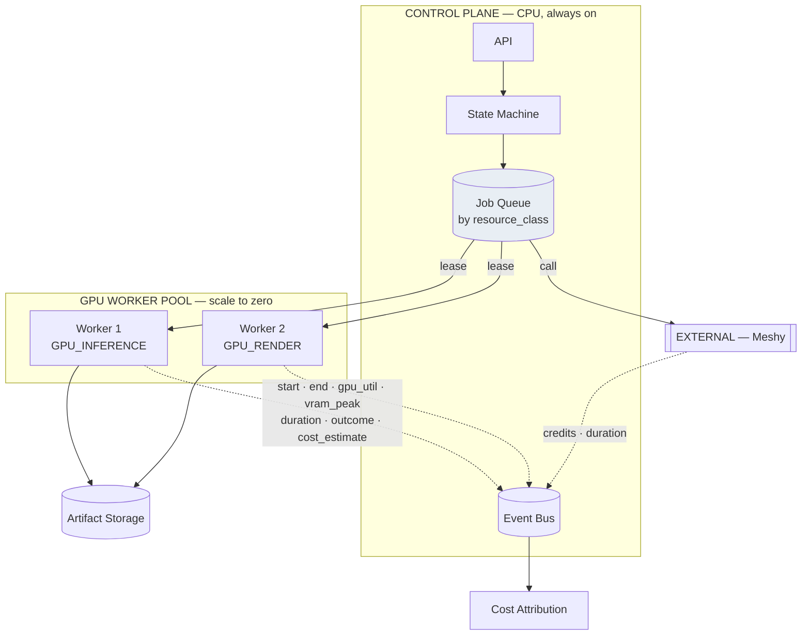

**The GPU is not assumed to be running.** Every GPU workload is already a job with queue, retry, timeout and checkpointing, so a cold pool degrades latency, never correctness.

**Current development environment `[VERIFIED CURRENT]` — measured 2026-09-21, and binding:**

| Resource | Measured | Design consequence |
|---|---|---|
| GPU | **RTX 3050 6GB Laptop** — 6144 MiB, driver 592.82 | **One GPU consumer at a time.** The single-worker render lane *is* the GPU mutex |
| RAM | **15.65 GB total, 0.84 GB free**, 45.21 GB commit | The failure mode here is **paging**, which looks like slowness |
| CPU | i5-13420H, 8C/12T | Not the bottleneck |

This is why `_lane_for` routing local-GPU work onto the single-worker render lane is not a workaround — **it is the architecture**. Two inferences plus a render on one 6 GB card does not degrade; it fails.

Local stack, unchanged: **Qwen2.5-VL-3B → element/moodboard images (SD 1.5) → Meshy (external, zero local VRAM) → Spatial Engine → Blender.** Hunyuan3D, TRELLIS and Unreal Engine are **not** local dependencies — see TRD §41.0.

**Future scaling option `[FUTURE]`, not a design premise:** `AWS G6e / NVIDIA L40S / 16 vCPU / 128 GiB / ~48 GB` — `[UNKNOWN]` as provisioned. **Verify the actual specification at deployment; do not design to the advertised figure.** Pool sizing comes from measurement on the machine in use, not the spec sheet. Adoption requires measured demand this machine cannot meet.

Every worker reports: start, end, duration, GPU utilisation, peak VRAM, outcome, estimated cost — attributed to `project_id` / `job_id` / `stage`.

---

## 24. Data storage

### 24.1 Diagram 13

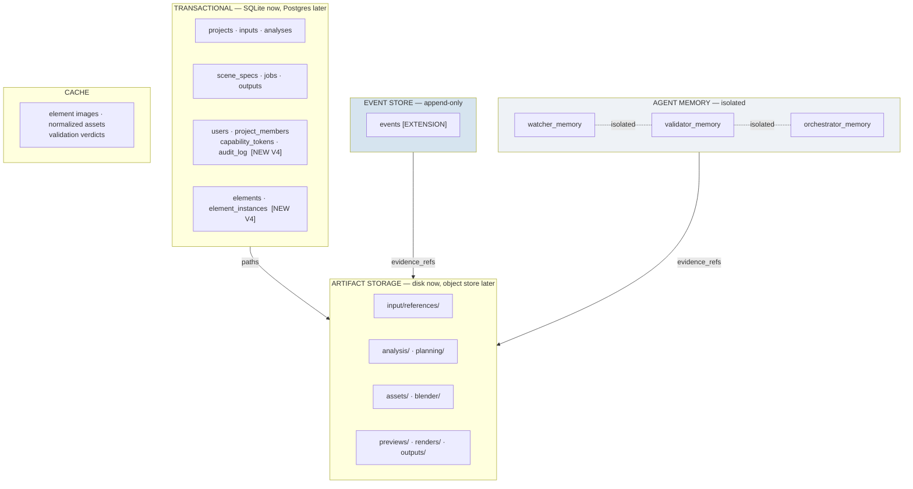

### 24.2 Boundaries

| Concern | Store | Why |
|---|---|---|
| Project / job state | relational | transactional, queryable |
| Element identity index | relational `[NEW V4]` | files stay the record; the DB makes it queryable |
| Events | append-only table | immutability is the contract |
| Agent memory | three tables | isolation is the contract |
| Artifacts | filesystem → object store | binaries never in the DB |
| Scenes | JSON files with full version history `[CURRENT]` | each version immutable |
| Cache | content-addressed | deterministic keys |

### 24.3 Migration stages

```
Stage 0  [CURRENT]   SQLite (8 tables, SCHEMA_VERSION=2, MIGRATIONS ladder) + local disk
Stage 1  [NEW V4]    + auth · supervisor · element-index tables - same SQLite
Stage 2  [NEW V4]    artifacts -> object storage; DB stores URIs
Stage 3  [PLANNED]   SQLite -> Postgres via app/db/sqlite.py, the documented seam
Stage 4  [PLANNED]   external queue; runner becomes a worker client
```

Every schema change goes through the existing `MIGRATIONS` ladder with `_add_column`, each step safe to run twice. **Additive only. Nothing is dropped.**

### 24.4 Canonical artifact map `[CURRENT]`

`CHECKPOINTS` already defines the artifact addresses — `analysis/design_analysis.json`, `analysis/moodboard_spec.json`, `planning/scene_reading.json`, `planning/object_plan.json`, `planning/asset_plan.json`, `planning/design_intent.json`, `planning/scene_spec.json`, `planning/spatial_check.json`, `planning/visual_intent_fidelity.json`, `blender/build_manifest.json`, `blender/scene.blend`, `blender/validation_report.json`, `blender/camera_path.json`, plus preview/walkthrough/output paths. V4 adds `planning/moodboard_occurrences.json` and `planning/render_verification.json`.

---

## 25. API architecture

### 25.1 Diagram 15

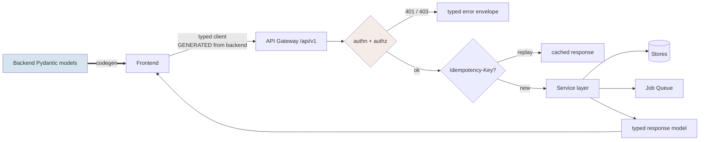

### 25.2 Contracts

Envelope `[CURRENT]`, kept — it works and is consistent:

```
read   {"success": true,  "data": ...}
write  {"success": true,  ...}
error  {"success": false, "error": {code, message, retryable}}
```

V4 adds:

| Element | Design |
|---|---|
| **Version** | `/api/v1/...`; current unversioned routes alias to v1 |
| **Response types** | Pydantic response models per route `[NEW V4]` — today routes return bare `dict` |
| **Type generation** | TS generated from those models; the frontend stops re-declaring shapes |
| **Errors** | typed `code`, stable across versions, `retryable` honest |
| **Idempotency** | `Idempotency-Key` header on every mutating route |
| **Pagination** | cursor-based for events, jobs, projects |
| **Auth** | router-level dependency, **deny by default** |

**Why response typing matters, concretely:** the frontend built `{ method: "PATCH", ...json(body) }`; the `json()` helper's own `method: "POST"` overwrote PATCH, routing client decisions to the enqueue endpoint. Both endpoints return 200, so nothing detected it — until a user reported their choices vanishing. An untyped contract cannot catch that; a generated client and a contract test can.

---

## 26. Security architecture

Adopt `docs/AUTH_PLAN.md`. Its three codebase-specific findings are correct and non-obvious:

1. **RLS cannot protect most of the product's data** — scenes are JSON files on disk; `GET /files/projects/{id}/{path}` has a traversal guard and **no authorization**. File authz is app-layer work whatever the database.
2. **The job runner has no user context** — it needs a service identity.
3. **Share links are deliberately anonymous** — `/w/{projectId}` needs a capability token, not a session, and an auth rollout must not break it.

`[UNKNOWN]` — the A/B/C option decision is open and is the user's. Steps 1–5 of that plan are independent of it.

| Control | Design | Status |
|---|---|---|
| Authentication | principal dependency at the router | `[NEW V4]` |
| Authorization | one choke point, deny by default | `[NEW V4]` |
| Project ownership | `projects.owner_id` + `project_members` | `[NEW V4]` |
| Roles | `homeowner` · `designer` · `admin` — three, not a matrix | `[NEW V4]` |
| **File isolation** | authorized or signed access; replaces bare `StaticFiles` | `[NEW V4]` — largest hole |
| Share links | capability tokens: unguessable, revocable, tour-scoped | `[NEW V4]` |
| Secrets | `SecretStr`, unwrapped only inside adapters, never logged | `[CURRENT]` |
| Upload security | filename **discarded** (`ref_NN.ext`), 25 MB + type + count limits | `[CURRENT]` |
| Path traversal | `safe_id()` strips to `[A-Za-z0-9_-]`, raises on empty | `[CURRENT]` |
| Subprocess | argument lists, **no `shell=True` anywhere** | `[CURRENT]` |
| Rate limits | per-principal, per-route | `[NEW V4]` |
| **Spend controls** | per-user + per-project caps, pre-authorization | `[NEW V4]` |

> **No unauthenticated endpoint may trigger paid external generation.** Today `POST /projects/{id}/elements/generate` does exactly that. Until §14.1 gate 2 exists, the service must not be exposed beyond localhost.

---

## 27. Observability

Current state is one line: `logging.basicConfig(level=INFO)`. Job-level events are good; **there is no aggregation**.

| Layer | Design |
|---|---|
| Logs | structured JSON; every line carries `project_id`, `job_id`, `correlation_id`, `stage`, `producer` |
| Metrics | stage latency, success rate, retry rate, repair rate, escalation rate, queue depth, GPU utilisation, cost |
| Traces | one trace per project run (`correlation_id`), spans per job and stage |
| Correlation | `correlation_id` minted at `project.created`, propagated onto every event, job and log line |
| Agent telemetry | per role: calls, tokens, latency, verdict distribution, **abstention rate** |

**The Watcher consumes this; it does not replace it.** Anything a query can answer must never be inferred by a model.

Ids only in logs — never a brief, an image, a prompt, or a key. `[CURRENT]` practice, preserved.

---

## 28. Cost architecture

Every expensive operation is attributable to `project_id` · `job_id` · `stage` · `provider` · `model` · `entity_id`.

```
CostEvent
  cost_event_id, project_id, job_id, stage
  provider   meshy | gemini | anthropic | ollama | aws
  model      str?
  entity_id  str?          # element_id / asset_id
  kind       ai_tokens | mesh_generation | gpu_seconds
           | storage_bytes | render_seconds
  quantity   float
  unit_cost  float?        # [UNKNOWN] until provider rates are configured
  amount     float?
  ts         ISO-8601 UTC
```

Rolls up to **cost per completed project**, split by AI / Meshy / GPU / storage / render. Baselines are `[UNKNOWN]` — none has been measured. This design specifies collection; `plan.md` §32 specifies measurement.

**Spend caps are enforced against this table, not estimated.** A cap that trusts an in-memory counter does not survive a restart.

---

## 29. Failure taxonomy

### 29.1 Two axes, not two enums

The **cause** axis is the existing `FailureCategory` `[CURRENT]` — twelve categories, defined, currently unused:

```
PERCEPTION_FAILURE · GEOMETRY_FAILURE · REPRESENTATION_FAILURE
CONSTRAINT_FAILURE · CANDIDATE_VOCABULARY_FAILURE · SOLVER_FAILURE
REPAIR_FAILURE · VALIDATION_FAILURE · ASSET_FAILURE
BLENDER_EXECUTION_FAILURE · HARDWARE_FAILURE · UNKNOWN
```

Its P10 rules are binding: **a model error is never relabelled an architecture error; an architecture error is never relabelled a model error; a hardware limitation is never relabelled a model failure.** `UNKNOWN` means *correctly abstained* — not a defect.

The **stage** axis is where it happened: `INPUT · MODEL · SCHEMA · IDENTITY · ASSET · SPATIAL · BLENDER · RENDER · VALIDATION · PROVIDER · TIMEOUT · RESOURCE · SECURITY · HUMAN_REVIEW_REQUIRED`.

The brief's requested classes map onto the stage axis. **They are not a second cause enum** — a second "what went wrong" vocabulary would invite exactly the relabelling the P10 rules forbid.

### 29.2 Failure record

```
FailureRecord
  failure_id, project_id, job_id
  stage_class       (stage axis)
  failure_category  (FailureCategory - cause axis)
  severity          info | warning | error | critical
  cause             str
  evidence_refs     str[]
  affected_entities [{kind, id}]
  retryable         bool
  repair_strategy   directive?
  occurred_at       ISO-8601 UTC
```

### 29.3 Propagation

```
Stage raises
  -> handler records FailureRecord + emits event (severity set by emitter)
  -> runner retries to max_attempts, then marks FAILED
  -> Watcher observes the pattern (retry storm? new? recurring?)
  -> Validator verifies whether the artifact is actually wrong
  -> Orchestrator classifies (policy table) and directs
  -> bounded repair, or HUMAN_REVIEW
```

A failure never propagates as a silent degradation. Where a stage can continue with less, it records **what it lost and why** — `ResilientProvider` already does this by inserting a warning naming the failed provider and stage, rather than presenting an estimate as a reading.

---

## 30. Cache architecture

| Cache | Key | Invalidation |
|---|---|---|
| Element image | `sha1(element_id + prompt + model + version)` | prompt / model / version change |
| Canonical asset | `canonical_asset_id` on the definition | explicit regeneration only |
| Normalized asset | `sha1(source glb) + normalizer_version` | normalizer version bump |
| Meshy task | `generation_request_id` | never — **prevents double spend** |
| Render | `sha1(manifest) + render_profile` | manifest or profile change |
| Validation verdict | `(scene_version, verifier_version, rules_version)` | any component changes |
| Model output | `sha1(prompt + inputs + model + params)` | **opt-in per stage only** |

**Model-output caching is opt-in, never global.** Caching a *reading* would hide a genuine re-read; caching a *classification* of an unchanged image is safe. The distinction is whether the input is immutable.

All keys are content-addressed, so a cache hit is provably the same computation — not a guess that inputs "probably" match.

---

## 31. Versioning

| Artifact | Field | Status |
|---|---|---|
| DB schema | `SCHEMA_VERSION = 2` + `MIGRATIONS` | `[CURRENT]` |
| Scene | `spec_version` + `version` (per commit) | `[CURRENT]` |
| Intelligence models | `schema_version` | `[CURRENT]` |
| Blender manifest | `MANIFEST_VERSION = "1.1"` | `[CURRENT]` |
| Events | `schema_version` | `[NEW V4]` |
| Agent memories | `memory_schema_version` | `[NEW V4]` |
| Prompts | `prompt_version` recorded on outputs | `[NEW V4]` |
| Validation rules | `rules_version` on every `ValidationResult` | `[NEW V4]` |
| Agent config | `watcher_version` / `validator_version` / `orchestrator_version` | `[NEW V4]` |

**Compatibility rule:** additive fields with defaults; readers ignore unknown fields; nothing is removed within a major version. Any scene written under V4 must remain readable — which is why the identity fields are `Optional` with `None` defaults.

Version fields exist so a verdict can be re-evaluated when the rules change. A `PASS` from `rules_version` 1 is not a `PASS` under version 2, and the system must be able to tell.

---

## 32. LLM contracts

### 32.1 Design Intelligence (Qwen / Gemini)

| | |
|---|---|
| **Input** | `InputBundle` — brief, reference images, room hints, vertical |
| **Output** | `DesignAnalysis`, `StyleSpec`, `ObjectPlan` (schema-validated) |
| **May decide** | which rooms, which element types, style, material/colour *proposals*, relation *hints*, approximate dimensions |
| **May NOT decide** | metric coordinates, final counts, canonical identity, collision, clearance, asset binding |
| **Tools** | none — structured output only |
| **Memory** | none; stateless per call. Provenance lives in artifacts |
| **Timeout / retry** | per provider config; `_error` recorded on failure |
| **Fallback** | mock allowed **only** when the operator selected the deterministic provider; a *failed* real primary is never papered over with a mock |
| **Evidence** | must cite reference ids for any claim about a client photo |

### 32.2 Watcher

| | |
|---|---|
| **Input** | typed events + its own memory + stage statistics. **Never** artifacts it would have to interpret geometrically |
| **Output** | `WatcherObservation[]` |
| **May decide** | that something is anomalous, and what check to recommend |
| **May NOT decide** | whether the scene is correct; any action; any mutation |
| **Tools** | read-only queries over events and its own memory |
| **Memory** | `WatcherMemory` only |
| **Confidence** | required; `detection_method` distinguishes rule / statistic / model |

### 32.3 Validator

| | |
|---|---|
| **Input** | deterministic reports (layers 1–7), renders, scene, definitions, instances, asset metadata, design intents, rules |
| **Output** | `ValidationResult` |
| **May decide** | `PASS` / `FAIL` / `WARNING` / `REVIEW_REQUIRED`; appearance and design-intent adherence |
| **May NOT decide** | geometry (deterministic layers own it); any mutation; any action |
| **Tools** | read-only artifact access |
| **Memory** | `ValidatorMemory` only |
| **Fallback** | **NONE.** Unavailable → `REVIEW_REQUIRED` |
| **Evidence** | every `FAIL` must cite ≥1 `evidence_ref`; an unsupported verdict is itself invalid |

### 32.4 Orchestrator

| | |
|---|---|
| **Input** | `WatcherObservation[]`, `ValidationResult[]`, job state, repair round, policy table |
| **Output** | `Directive` |
| **May decide** | which deterministic service to invoke; continue / retry / escalate |
| **May NOT decide** | coordinates, dimensions, identity, asset content — **it has no handle capable of writing them** |
| **Tools** | queue enqueue only |
| **Memory** | `OrchestratorMemory` only |
| **Bound** | `repair_round` enforced by the runner, not by the agent |
| **Evidence** | every directive cites the `observation_ids` / `validation_ids` it rests on; `decided_by` records policy vs model |

---

## 33. Anti-hallucination design

| # | Safeguard | How it stops propagation |
|---|---|---|
| 1 | **Structured outputs** | A model that cannot emit prose cannot emit an unfalsifiable claim. Every field has a type and a range. |
| 2 | **Schema validation** | Malformed output fails at layer 1 and never reaches a consumer that would treat it as fact. |
| 3 | **Evidence references** | A verdict without `evidence_refs` is invalid by contract, so an assertion cannot travel without its support. |
| 4 | **Confidence** | Low confidence routes to human review instead of silently becoming a premise. |
| 5 | **Independent Validator** | Verification reads artifacts, not the generator's reasoning — an error must be made twice, from different inputs, to survive. |
| 6 | **Model diversity** | A shared blind spot requires the same error from different models on different inputs. |
| 7 | **Memory isolation** | Yesterday's wrong conclusion cannot become today's context for another agent. |
| 8 | **Deterministic spatial solver** | Spatial truth is computed, not asserted, so it cannot be hallucinated at all. |
| 9 | **Derived counts** | No model is asked "how many" — rows are counted. The commonest numeric hallucination is structurally impossible. |
| 10 | **No unrestricted context sharing** | Typed contracts have no field in which "looks fine" can travel. |
| 11 | **Human escalation** | Ambiguity terminates in a person, not in a confident guess. |
| 12 | **Repair limits** | A wrong belief cannot drive unbounded spend. |
| 13 | **Provenance** | Every artifact can be traced to its cause, so a fabrication is discoverable after the fact. |
| 14 | **Immutable events** | The record of what happened cannot be retroactively made consistent with a wrong conclusion. |
| 15 | **No mock fallback in verification** | A verifier that cannot run says so. A fabricated `PASS` is the worst failure this system could produce. |

Safeguards 8, 9 and 15 are load-bearing: they make whole classes of hallucination *impossible* rather than *detectable*.

---

## 34. Frontend architecture

**The frontend renders backend state. It never derives truth.**

| Must display | Source |
|---|---|
| Project + pipeline state | `ProjectStage` + job rows |
| Element inventory | `ElementInventory` — the backend's count |
| Validation state | `ValidationResult` |
| Repair state | `repair_round` + repair records |
| Render | render outputs |
| 3D scene | committed `Scene` |
| Issues | `FailureRecord` + `WatcherObservation` |
| Human review queue | review items with evidence |
| **Provenance** | click an object → its full element chain `[NEW V4]` |

| Must never decide | Owner |
|---|---|
| Canonical identity | Element Resolver |
| Element count | `ElementInventory` (derived) |
| Spatial correctness | Spatial Engine |
| Asset validity | Asset Library |

Current soft violation `[CURRENT]`: `element-inventory.ts` recomputes `asset_count` by filtering groups client-side. It derives from backend data rather than inventing, but it duplicates a number the backend also computes — so the two can drift. V4 consumes the backend count.

### UX states

| UX state | Backend state | Progress | Allowed actions | On error |
|---|---|---|---|---|
| `CREATED` | `CREATED` | 0% | upload, edit brief | — |
| `UPLOADING` | `CREATED` | 5% | cancel | per-file retry |
| `ANALYZING` | `ANALYZING` | 15% | cancel | show cause, retry |
| `UNDERSTANDING` | `DESIGN_SPEC_READY` | 25% | **edit rooms**, confirm | re-run analysis |
| `GENERATING_ELEMENTS` | `ELEMENTS_DETECTED` → `ELEMENTS_VALIDATED` | 35% | **Build / Skip per element** | retry element |
| `BUILDING_ASSETS` | `ELEMENT_IMAGES_READY` → `ASSETS_READY` | 50% | cancel | per-asset retry; **stand-in shown and labelled** |
| `SOLVING_SPACE` | `SCENE_BUILDING` → `SCENE_READY` | 65% | cancel | show unplaceable items |
| `RENDERING` | `BLENDER_BUILDING` → `RENDER_READY` | 80% | cancel | show Blender log |
| `VALIDATING` | `SCENE_VALIDATING` | 90% | — | show failing layer |
| `REPAIRING` | `REPAIRING` | 92% | — | **show round N of 2** |
| `REVIEW_REQUIRED` | `HUMAN_REVIEW` | 95% | **approve · reject · edit · retry · override** | — |
| `READY` | `VERIFIED` / `COMPLETED` | 100% | share, export, hand off | — |
| `FAILED` | `FAILED` | — | retry from checkpoint | full cause + evidence |

**Two UX rules worth stating:** a stand-in asset is always labelled as a stand-in — a silent substitution is how "5 pieces over the limit of 6" became invisible before; and `REPAIRING` shows the round count, because a bounded loop the user cannot see looks identical to a hung one.

---

## 35. Human review

A first-class state, not an error path.

```
ReviewItem
  review_id, project_id, scene_id, scene_version
  trigger           repair_exhausted | validator_review_required
                  | unrepairable | low_confidence
                  | code_defect_class | spend_cap
  failure_category  FailureCategory?
  affected_entities [{kind, id}]
  expected          dict
  observed          dict
  evidence_refs     str[]        # renders, reports, diffs
  attempted         [{round, directive, outcome}]
  recommendation    Directive?   # advisory only
  available_actions APPROVE | REJECT | EDIT | RETRY | OVERRIDE
```

```
HumanDecision
  decision_id, review_id, user_id      # WHO - required
  action, reason                       # WHY - required on OVERRIDE
  scene_patch?                         # on EDIT
  decided_at                           # ISO-8601 UTC
```

**Every override is recorded in provenance with the person and the reason.** An override without an attributable human is not an override; it is an unexplained state change.

Human decisions are also the highest-quality signal the system will ever collect (§37).

---

## 36. Provenance

### 36.1 Complete chain

```
input_id -> intent_id -> element_id -> instance_id -> element_image_id
  -> occurrence_id -> asset_id -> scene_object_id -> blender_object_id
  -> render_id -> validation_id -> repair_id -> decision_id
```

### 36.2 The query that defines completeness

> *"What source photo caused this rendered chair to exist?"*

```
render_id
  -> blender_object_id      (manifest entry - [NEW V4] must carry element_id)
  -> scene_object_id        (object_id)
  -> instance_id            ([NEW V4])
  -> element_id             ([NEW V4] on SceneObject)
  -> ElementDefinition.source_element_ids
  -> ElementInstance.source_element_id
  -> SceneElement.crop_ref
  -> DesignIntent.source_intent_ids
  -> input_id
  -> input/references/ref_NN.jpg
```

**Two hops are missing today**, both in `plan.md` P1: `element_id` / `instance_id` on `SceneObject`, and identity in the Blender manifest (which currently carries `"id": object_id` alone).

### 36.3 Current status per hop

| Hop | Mechanism | Status |
|---|---|---|
| source → intent | `source_intent_ids` | `[CURRENT]` |
| intent → definition | `identity_method`, `source_element_ids` | `[CURRENT]` |
| definition → instance | `ElementInstance.element_id` | `[CURRENT]` |
| definition → image | `ElementImage.element_id` | `[CURRENT]` |
| instance → occurrence | — | `[NEW V4]` |
| image → asset | `asset_id` set on element; **`AssetRecord` lacks `element_id`** | `[NEW V4]` |
| asset → scene object | **no `element_id` on `SceneObject`** | `[NEW V4]` |
| scene object → Blender object | **manifest keyed by `object_id` only** | `[NEW V4]` |
| Blender object → render | no per-object render record | `[NEW V4]` |

---

## 37. Marketplace handoff and learning

### 37.1 The boundary

```
Validated Scene  ->  DesignSpecification  ->  Designer matchmaking  ->  Builder  ->  Execution
                     ^^^^^^^^^^^^^^^^^^^
                     the marketplace consumes THIS, never raw AI output
```

`DesignSpecification` `[PLANNED]` is derived **only** from a `VERIFIED` scene: rooms with dimensions, element definitions with instance counts and dimensions, materials and finishes, asset references, and the full provenance chain.

**A contractor quote traced to an unverifiable element is a liability.** That is the real argument for §36, stated plainly.

### 37.2 Learning

`[PLANNED]`. Collected: accepted / rejected elements (`ElementDefinition.approved` already records this), validation verdicts, repair outcomes, human decisions, asset usage.

Governed by: explicit **consent**, quality filtering, annotation, held-out evaluation, dataset versioning, benchmark before adoption.

**Tenancy is absolute.** `AssetRecord.project_id` already keeps one client's generated furniture out of another's home. The same boundary governs learning data. **No automatic training on all collected data** — collection and training are separate decisions with separate approvals.

---

## 38. Diagram 16 — Final end-to-end system

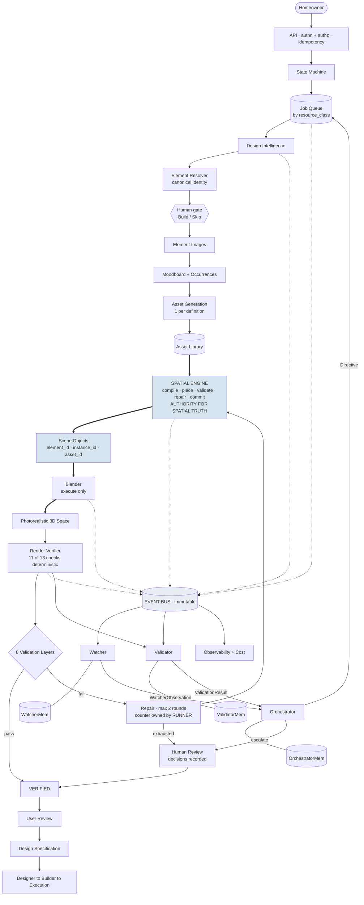

---

## 39. Definition of done — the questions this document must answer

| Question | Answer |
|---|---|
| Where does every piece of data live? | §8 ownership matrix, §24 storage, §24.4 artifact map |
| Who owns it? | §8 |
| Who can change it? | §7 authority matrix, §6 "may NOT change" column |
| How does it move? | §5 pipeline, §20 event bus, §22 state machine |
| How is it validated? | §17 eight layers, §16 render verifier |
| How is failure detected? | §17 layers, §21.1 Watcher rules, §29 taxonomy |
| How is failure repaired? | §19 bounded two-loop repair |
| How is identity preserved? | §12 chain, §36 provenance |
| How is the render verified? | §16 — 11 of 13 checks deterministic |
| How do the three agents stay independent? | §10 construction isolation, §21.5 four defences |
| How does the system recover from crashes? | §22.3 — `unfinished()` re-queue, checkpoints, `RETRYING` |
| How does it avoid duplicate generation? | §14.1 four gates; `generation_request_id`; canonical reuse |
| How is the photorealistic 3D space produced? | §15 Blender executes the committed scene; §15.1 render settings; §16 verifies it |

---

# Architectural Invariants

**These must never be violated. A change that breaks one is a change to the product, not to the code.**

1. **The Spatial Engine owns spatial truth.** Every metric coordinate in a committed scene originates from `place_objects` or the Repair Engine.
2. **AI cannot directly author final metric coordinates.** AI position output enters only as a ranking key over candidates the solver has already validated.
3. **Element identity survives the complete pipeline** — source → intent → definition → instance → image → occurrence → asset → scene object → Blender object → render.
4. **`ElementInstance` and canonical asset are separate concepts.** Instance identity is about *this copy*; asset identity is about *the mesh*.
5. **Multiple instances may share one canonical asset.** Three identical stools cost one generation.
6. **Moodboard coordinates are not world coordinates.** `MOODBOARD` is non-metric and has no transform to `ROOM`. Converting it applies a convention, which must be recorded in `position_source`.
7. **Blender executes the authoritative scene.** It never solves, never repositions, never resolves a collision.
8. **Validation is independent of generation.** The Validator reads artifacts, never the generator's reasoning.
9. **The Watcher observes; it does not mutate.** It writes only its own memory.
10. **The Validator verifies; it does not mutate.** It writes only its own memory, and **never returns `PASS` when it could not run**.
11. **The Orchestrator decides; it does not invent geometry.** It holds a queue handle and no scene-store handle.
12. **Agent memories are isolated.** No agent is constructed with another agent's store.
13. **Agents communicate only through structured events and typed evidence.** Never transcripts.
14. **Pipeline events are immutable.** Corrections are new events referencing the old.
15. **Automatic repair is bounded** at 2 outer rounds, counted by the runner before dispatch — never by the component that requests repair.
16. **Human overrides are recorded** with the person, the reason and the resulting state.
17. **The frontend is not a second source of truth.** It renders backend state; it never derives identity, counts, or correctness.
18. **Paid external generation requires authentication, human approval, a spend cap, and an idempotency key** — all four.
19. **Production claims require real-path evidence.** A mock-mode test suite is never cited as production evidence.
20. **Measured constants change only on measured evidence.** Clearance, tolerance and threshold values carry their measurement; replacing working spatial infrastructure requires proof the replacement is better.
21. **Final success means a validated, photorealistic 3D space — not a good-looking image.** A render is correct when it provably corresponds to the validated scene.

---

*End of design document. Sequencing, priorities and file-by-file changes are in `plan.md`; current-state evidence is in `AUDIT_CODEBASE.md`.*
