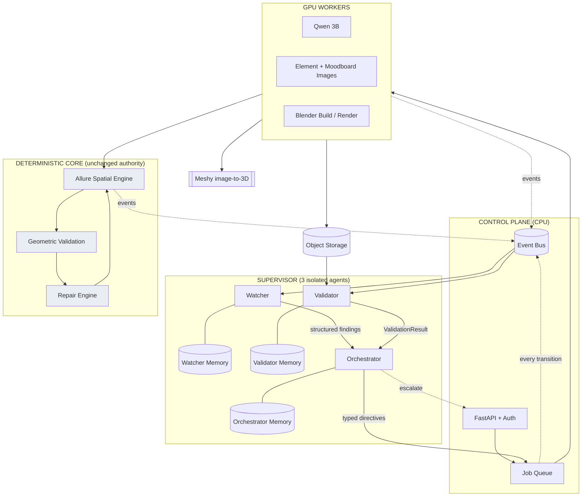
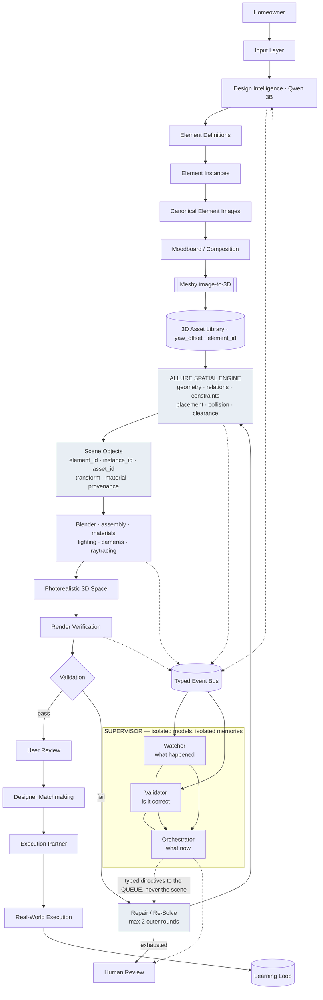

# Allure Interiors V4 — Production Architecture & Implementation Plan

*Written 2026-09-21 · baseline: `AUDIT_CODEBASE.md` (repo root) · every claim below re-verified against code during this planning pass · **no production code was modified***

**Capability labels used throughout:**
`[CURRENT/VERIFIED]` exists and runs · `[PARTIAL]` exists incompletely · `[EXPERIMENTAL]` in `research/`, not wired · `[LEGACY]` present, not on the live path · `[PLANNED]` documented, no code · `[NEW V4]` does not exist · `[UNKNOWN]` not determined.

---

## 1. Executive Summary

V4 does not replace this system. The audit found the hard part — the deterministic Spatial Engine — already built, authoritative, and better than most of what would replace it. V4's job is to **close four structural gaps around a working core** and then wrap it in a supervisor that can observe, verify and recover.

The planning pass found five things that materially change what V4 has to build:

1. **`FailureCategory` already exists in production and nothing imports it.** `app/spatial/failures.py` defines the canonical twelve-category taxonomy; a repo-wide search for importers returns **zero**. V4 does not design a failure vocabulary — it *wires the one already there*. `[VERIFIED]`
2. **The repair loop already exists.** `app/spatial/repair_engine.py` implements DETECT→CLASSIFY→LOCALIZE→GENERATE→SCORE→APPLY→RE-VALIDATE with a five-level escalation ladder, `MAX_ITERATIONS = 20`, and terminal states including `UPSTREAM_REQUIRED` and `ESCALATE`. V4 does not build a repair loop — it builds the **outer** render-verify loop around this one, and `UPSTREAM_REQUIRED` is precisely the signal the Orchestrator consumes. `[VERIFIED]`
3. **`element_id` is not missing from the pipeline — it is missing from one hop.** `ObjectPlanItem.element_id` exists and is used by `asset_decision.py:305`. The chain dies at a single constructor call, `compiler.py:803-819`. `[VERIFIED]`
4. **`instance_id` is a genuinely harder problem than `element_id`.** `ObjectPlanItem` carries `count: int`, not instance ids, and the compiler expands it with `for n in range(item.count)` at `compiler.py:747`. Copying `element_id` is two lines; `instance_id` requires deciding *which* `ElementInstance` each of the N copies is. These are **separate work items**, not one. `[VERIFIED]`
5. **A migration ladder already exists.** `db/sqlite.py` has `SCHEMA_VERSION = 2`, a `MIGRATIONS` list and an `_add_column` helper. *(This corrects the audit, which said there was no migration tooling — there is.)* Every V4 table is an append to that list. `[VERIFIED]`

And one thing V4 must **not** re-decide: `docs/AUTH_PLAN.md` is a mature plan with a recommendation (Option C) and an **open decision**. V4 adopts it by reference. The decision is the user's, and it does not block starting.

**What V4 adds that genuinely does not exist:** the three-agent Supervisor with isolated memories, a typed event bus, production render verification, photorealistic render fixes, GPU worker separation, and authentication.

**The blunt framing:** V3 is an engine. V4 is the product around the engine. Roughly 70% of V4 is wiring, hardening and infrastructure; roughly 30% is new intelligence.

---

## 2. V3 / Current Codebase Reality

| Area | Files | LOC | Status |
|---|---|---|---|
| `aether-backend` | 367 | 26,179 Python | `[CURRENT/VERIFIED]` |
| `aether-frontend` | 247 | 12,534 TS/TSX | `[CURRENT/VERIFIED]`, one dead route |
| `docs/` | 91 | — | unusually accurate |
| `aether-backend/research/` | ~30 | — | `[EXPERIMENTAL]`, clean separation |

Largest modules: `planning/compiler.py` 1209 · `api/projects_routes.py` 1124 · `intelligence/prompts.py` 1070 · `intelligence/scene_reading.py` 1041 · `intelligence/schema.py` 788.

**Test reality:** 970 backend tests pass, but `tests/conftest.py` blanks `GEMINI_API_KEY`, `ANTHROPIC_API_KEY`, `MESHY_API_KEY` and sets `SCENE_IMAGE_ENABLED=false`. **Zero real provider calls are exercised.** `[VERIFIED]` — this is why §31 separates three test classes.

**Note on paths:** the verification harness is at `aether-backend/research/placement_loop.py`, not `research/placement_loop.py`. *(Corrects the audit.)*

---

## 3. Current Verified Architecture

Traced call-by-call from `app/jobs/handlers/scene_plan.py:334`:

| # | Call | Line | Output |
|---|---|---|---|
| 1 | `_classify_references` | :353 | `planning/design_intent.json` |
| 2 | `_read_scene` | :357 | `planning/scene_reading.json` |
| 3 | `resolve_plan` → `merge_reading_into_plan` | :369–371 | `planning/object_plan.json` |
| 4 | intent resolution / fidelity | :420 | plan annotations |
| 5 | asset decision | :442–451 | `planning/asset_plan.json` |
| 6 | `compile_scene` | :464 | rooms, walls, openings |
| 7 | `place_objects` | :470 | `AddObjectOp[]` |
| 8 | repair engine | :475 | collision/clearance repair |
| 9 | `_commit_with_retry` | :477 | `planning/scene_spec.json` |

**Steps 6–9 run after every AI stage and no AI stage writes final coordinates.** This is the property V4 must preserve above all else. `[VERIFIED]`

---

## 4. Current Production Pipeline

| Stage | Implementation | Status |
|---|---|---|
| Intake | `projects_routes.py:230` `add_inputs` | `[CURRENT/VERIFIED]` |
| Reasoning | **Gemini** `gemini-3.5-flash-lite` | `[CURRENT/VERIFIED]` — *not* Qwen |
| Qwen:3B | `ollama_provider.py`, 624 LOC | `[PARTIAL]` — reachable only by `INTELLIGENCE_PROVIDER=ollama` |
| Element definitions | `scene_reading.py:598,653` | `[CURRENT/VERIFIED]` |
| Element instances | `resolve_elements` | `[CURRENT/VERIFIED]` |
| Canonical element image | `handlers/element_images.py:60` | `[CURRENT/VERIFIED]` |
| Moodboard | local SD in `handlers/analyze.py` | `[CURRENT/VERIFIED]` |
| Image→3D | `providers/meshy.py:151`, **single image** | `[PARTIAL]` |
| Spatial engine | `planning/compiler.py` + `app/spatial/*` | `[CURRENT/VERIFIED]` — authoritative |
| Scene objects | `scene/schema.py:153` | `[PARTIAL]` — no `element_id` |
| Blender | `blender/runner.py:114` | `[CURRENT/VERIFIED]` |
| Geometric validation | `spatial/validation.py`, `blender/scripts/validate_scene.py` | `[CURRENT/VERIFIED]` |
| Visibility check | `blender/scripts/check_visibility.py` | `[CURRENT/VERIFIED]` (script) but `[EXPERIMENTAL]` (not in a job) |
| Render verification loop | `aether-backend/research/placement_loop.py` | `[EXPERIMENTAL]` |
| Failure taxonomy | `app/spatial/failures.py` | `[PARTIAL]` — **defined, zero importers** |
| Repair engine | `app/spatial/repair_engine.py` | `[CURRENT/VERIFIED]` |
| Designer matchmaking | — | `[PLANNED]` |
| Execution partner matching | — | `[PLANNED]` |

---

## 5. Current Architecture Gaps

Ranked by what blocks V4, not by how bad they sound.

| # | Gap | Evidence | Blocks |
|---|---|---|---|
| G1 | **No authentication anywhere**, including the Meshy spend endpoint `projects_routes.py:779` | no `Depends` on any route | any deployment |
| G2 | **No deployment artefacts** — no Dockerfile, compose, CI | repo-wide search | any deployment |
| G3 | **`SceneObject` has no `element_id`/`instance_id`** | `scene/schema.py:153-187` | provenance, Validator, learning loop |
| G4 | **`FailureCategory` has zero importers** | grep | Orchestrator |
| G5 | **No event bus** — `events` table has no `event_type`, `entity_ids`, `severity`, `confidence` | `db/sqlite.py:91-100` | all three agents |
| G6 | **Zero real-provider tests** | `tests/conftest.py` | all production confidence |
| G7 | **Provider is a process-wide singleton** with mock fallback | `provider.py:191` | three agents with three models |
| G8 | **Render verification not in production** | lives in `research/` | photorealism claims |
| G9 | **Blender colour management silently fails**; `use_raytracing` never set | `build_scene.py:38-42` | photorealism |
| G10 | **Meshy receives one image**; crops are bbox not masks | `meshy.py:172` | asset quality |
| G11 | **`NormalizationInfo.yaw_offset` exists but is never populated** | `assets/schema.py:35` | orientation |
| G12 | ~~`/cinematic` → HTTP 404~~ **WITHDRAWN (C1)** — optional external engine, degrades gracefully | Playwright, 2026-09-21 | none |
| G13 | **Untyped API responses**, shapes re-declared in frontend | `envelope.py` `ok()` returns `dict` | contract drift |
| G14 | **Element identity lives in JSON, not the DB** | 8 tables, none for elements | cross-project reuse, learning |
| G15 | **`SceneElement.element_id` includes `bbox`** — re-reading orphans paid meshes | `scene_reading.py:348` | spend safety |

---

## 6. V4 Product Objective

An **AI-native residential design intelligence and execution platform** — not an image generator.

The success condition is a **traceable, spatially valid, visually consistent, photorealistic, executable 3D representation of a home**, good enough to become the structured input to designer matchmaking and real-world execution.

Explicitly: a beautiful 2D moodboard is an *intermediate artefact*, never the deliverable. A render is not successful because it looks good; it is successful when it **provably corresponds to the validated scene** (§18).

---

## 7. V4 Target Architecture



**The one line that matters:** the Orchestrator's arrow points at the **job queue**, never at the scene. No agent writes geometry.

---

## 8. V4 Production Pipeline

Same spine as V3, with V4 additions marked:

```
USER INPUT
  ↓
INPUT LAYER  (prompt · photos · floor plan · dimensions · references · constraints)   [PARTIAL → NEW V4: floor plan, constraints]
  ↓
DESIGN INTELLIGENCE (Qwen 3B)                                    [PARTIAL — must become selectable & benchmarked]
  ↓
ELEMENT DEFINITIONS → ELEMENT INSTANCES                          [CURRENT/VERIFIED]
  ↓
CANONICAL ELEMENT IMAGES                                         [CURRENT/VERIFIED]
  ↓
MOODBOARD / COMPOSITION                                          [CURRENT/VERIFIED]
  ↓
MESHY IMAGE→3D  (+ multi-view, + mask crops)                     [PARTIAL → NEW V4]
  ↓
3D ASSET LIBRARY  (+ measured yaw_offset)                        [PARTIAL → NEW V4]
  ↓
ALLURE SPATIAL ENGINE                                            [CURRENT/VERIFIED — authority preserved]
  ↓
SCENE OBJECTS  (+ element_id, instance_id, provenance)           [PARTIAL → NEW V4]
  ↓
BLENDER  (+ raytracing, + fixed colour management)               [PARTIAL → NEW V4]
  ↓
PHOTOREALISTIC 3D SPACE
  ↓
VALIDATION  (geometric [CURRENT] + render verification [NEW V4])
  ↓
SUPERVISOR: Watcher · Validator · Orchestrator                   [NEW V4]
  ↓
REPAIR / RE-SOLVE  (inner loop [CURRENT], outer loop [NEW V4])
  ↓
USER REVIEW  →  DESIGNER MATCHMAKING  →  EXECUTION              [PLANNED]
```

---

## 9. Element-First Architecture

The intended chain and what actually exists:

| Link | Type | Status |
|---|---|---|
| `DesignIntent` | `DesignIntentSet` | `[CURRENT/VERIFIED]` |
| `ElementDefinition` | `intelligence/schema.py:428` | `[CURRENT/VERIFIED]` |
| `ElementInstance` | `intelligence/schema.py:463` | `[CURRENT/VERIFIED]` |
| `ElementImage` | `intelligence/schema.py:475` | `[CURRENT/VERIFIED]` |
| `MoodboardOccurrence` | **no such type** — role played implicitly by `SceneElement` | `[PARTIAL]` |
| `3DAsset` | `AssetRecord` — but has no `element_id` | `[PARTIAL]` |
| `SceneObject` | has `plan_key` only | `[PARTIAL]` |

**V4 decision on `MoodboardOccurrence`:** do **not** introduce a new type. `SceneElement` already carries `bbox`, `crop_ref`, `position_m`, `room_id` — everything an occurrence is. Adding a parallel type would create a second source of truth for the same fact (Rule 1's spirit). Instead, **document `SceneElement` as the occurrence record** and make the naming honest in its docstring. `[NEW V4 — documentation only]`

**V4 decision on `3DAsset`:** add `element_id` to `AssetRecord` so the asset knows which element it was generated for. Currently only `project_id` is recorded. `[NEW V4]`

---

## 10. Element Identity Model

### Target `SceneObject`

```python
class SceneObject(BaseModel):
    object_id: str          # [CURRENT] random, per-scene instance handle
    element_id: Optional[str] = None      # [NEW V4] canonical identity
    instance_id: Optional[str] = None     # [NEW V4] which copy
    asset_id: Optional[str] = None        # [CURRENT]
    plan_key: Optional[str] = None        # [CURRENT] keep — do not replace
    room_id: str                          # [CURRENT]
    position / rotation_y / scale / dimensions   # [CURRENT]
    visual: ObjectVisual                  # [CURRENT] already carries source_intent_ids
```

Note `source_intent_ids` already exists, nested at `ObjectVisual.source_intent_ids` (`scene/schema.py:143`). *(The audit listed it as missing from `SceneObject`; it is present, one level down.)* No new field needed — but §21 adds a flat accessor so provenance queries don't have to know it's nested.

### The two changes are not equal

**`element_id` — small.** `ObjectPlanItem.element_id` already exists and reaches the compiler. At `compiler.py:803` add `element_id=item.element_id or None`. Two lines, additive, optional.

**`instance_id` — needs a decision.** `ObjectPlanItem` has `count: int`, not instance ids. The compiler loops `for n in range(item.count)` (`compiler.py:747`) and already distinguishes copies via `plan_key=item.object_key if n == 0 else f"{item.object_key}#{n+1}"` (`:817`).

Three options:

| Option | Mechanism | Cost | Risk |
|---|---|---|---|
| **A** (recommended) | Derive: `instance_id = f"{element_id}#{n}"` at the compiler | Trivial, deterministic, no upstream change | Doesn't reconcile with real `ElementInstance` rows when `count` ≠ `len(instances)` |
| B | Carry `instance_ids: list[str]` on `ObjectPlanItem`, assign nth | Correct; touches `merge_reading_into_plan` | Medium — changes plan schema |
| C | Look up `ElementInstance` rows at compile time | Most correct | Compiler would import from `intelligence` — **violates the existing boundary** that `scene` imports nothing from `intelligence` (`scene/schema.py:118-126`) |

**Recommendation: A now, B in P2 if reconciliation is ever needed.** C is rejected outright — it breaks a deliberate architectural boundary, and no requirement currently justifies that.

### Identity rules carried forward unchanged

- Position is **never** part of identity. `canonical_key_for` uses room, type, dims-bucket, material, colour only. `[CURRENT/VERIFIED]` — preserve.
- No-evidence pieces keep unique keys `room|type|?<id>` — cannot false-merge. `[CURRENT/VERIFIED]` — preserve.

### The open identity defect (G15)

`SceneElement.element_id` = `sha1(f"{room}|{sem}|{name}|{bbox}#{n}")` — **bbox-dependent**. Re-reading a moodboard mints new ids and orphans paid meshes. V4 P1 fixes this by **re-binding assets by canonical key on re-read** rather than by changing the id — the id's instability is a symptom; the asset binding is what actually costs money. `[NEW V4]`

---

## 11. Multi-Agent Pipeline Supervisor

### Design stance

The Supervisor exists to reduce **correlated hallucination**. Its value comes entirely from the three agents being genuinely independent — different model, different memory, different contract. Three prompts against one model with one context is not a supervisor; it is one model talking to itself, and it would fail exactly when all three are wrong the same way.

Two constraints from the existing code shape this:

1. **`ResilientProvider` falls back to `MockProvider` on failure** (`provider.py:151-163`). For the Validator this is catastrophic — a mock `PASS` is fabricated evidence presented as verification, violating Rule 5 and Rule 7. **Every Supervisor agent must be constructed with `allow_fallback=False`.** A Validator that cannot run must report `REVIEW_REQUIRED`, never `PASS`.
2. **`get_provider()` is a process-wide singleton** (`provider.py:191`). The Supervisor cannot use it. V4 adds a separate `app/supervisor/providers.py` with per-role construction. The pipeline's own provider is untouched.

### 11.1 Watcher

**Question it answers: "What happened?"**

| | |
|---|---|
| **Consumes** | every event on the bus |
| **Produces** | `WatcherFinding` — anomalies, drift, continuity breaks, cost/latency outliers |
| **Never** | decides spatial correctness; touches geometry; writes to the scene |
| **Memory** | `watcher_memory` — logs, traces, metrics, per-stage historical behaviour, cost |

Most of what the Watcher reports should be **deterministic**, not model-inferred: a missing output, a stage that emitted no `succeeded`, an element count that dropped between stages, a latency 3σ above that stage's history. **The model is only for the residue** — narrating an anomaly pattern that rules did not anticipate. Building the Watcher as "an LLM reading logs" would spend money to re-derive facts a SQL query already knows.

`[NEW V4]` — but note `runner.py:215-222` already emits structured `job.start/succeeded/failed` lines with the right ids. The Watcher's data source largely exists.

### 11.2 Validator

**Question it answers: "Is it correct?"**

**The critical boundary:** the Validator does **not** re-check geometry. Three deterministic checkers already exist and are better at it than any model:

| Existing checker | What it proves | Status |
|---|---|---|
| `spatial/validation.py` `validate_scene` | collision, boundary, door clearance | `[CURRENT/VERIFIED]` |
| `blender/scripts/validate_scene.py` | geometry exists, bbox within ±25%, pivot inside room, textures resolve | `[CURRENT/VERIFIED]` |
| `blender/scripts/check_visibility.py` | visible / occluded / never-in-frame, by ray-cast | `[CURRENT/VERIFIED]` |

The Validator **consumes their output as evidence** and adjudicates only what they cannot: appearance consistency, material plausibility, design-intent adherence, orientation sanity in the render, and anomalies no rule anticipated.

`check_visibility.py`'s own docstring records why: a VLM judge scored the *same* scene 0.556/0.778/0.556/0.556 across four reads and invented a dining table in all four. **That measurement is the reason the Validator is not the judge of geometry.** `[VERIFIED]`

**Output contract:**

```python
class ValidationResult(BaseModel):
    verdict: Literal["PASS", "FAIL", "WARNING", "REVIEW_REQUIRED"]
    failure_category: Optional[FailureCategory]   # reuse app/spatial/failures.py
    affected_entity_ids: list[str]                 # element_id / instance_id / object_id
    evidence_refs: list[str]                       # paths, never inlined content
    confidence: float
    recommended_action: Literal["continue","retry","regenerate_asset",
                                "re_solve","re_read","human_review"]
    rationale: str
```

**Never** returns a scene, a transform, or a coordinate.

**Memory:** `validator_memory` — rules, prior results, known failure exemplars, per-project validation history.

### 11.3 Orchestrator

**Question it answers: "What now?"**

Consumes `WatcherFinding` + `ValidationResult` + job state. Emits **typed directives to the job queue**:

| Signal | Directive |
|---|---|
| Meshy transport failure | `retry(job)` |
| `FailureCategory.ASSET_FAILURE` | `regenerate_asset(element_id)` |
| `TerminalState.UPSTREAM_REQUIRED` from repair | `re_solve` or `re_read` |
| `FailureCategory.PERCEPTION_FAILURE` | `re_read(room_id)` |
| repair `ESCALATE` / round 3 | `human_review` |
| ambiguity, low confidence | `human_review` |

**The Orchestrator has no scene-write capability by construction** — it holds a queue handle, not a scene store handle. That is how Rule 3 is enforced in code rather than in prose.

**Memory:** `orchestrator_memory` — decisions, state transitions, recovery outcomes, repair-round counters.

**Much of this should be a rule table, not a model call.** The mapping above is deterministic. The model earns its place only on genuinely ambiguous cases. Start with the table; add the model where the table abstains.

### 11.4 Agent Model Isolation

```
WATCHER_MODEL   ≠   VALIDATOR_MODEL   ≠   ORCHESTRATOR_MODEL
```

Each configured independently:

```
<ROLE>_PROVIDER          anthropic | gemini | ollama | openai | ...
<ROLE>_MODEL
<ROLE>_TEMPERATURE
<ROLE>_MAX_TOKENS
<ROLE>_TIMEOUT_SECONDS
<ROLE>_MAX_ATTEMPTS
<ROLE>_ALLOW_FALLBACK    must default false
```

**Do not hard-code the three models.** `[UNKNOWN]` — which model suits which role is a benchmark result, and **no benchmark has been run**. §32 defines how to produce it. Until then the config exists and the values are operator choices.

**Startup must log the three resolved role→model bindings**, alongside the pipeline provider. The audit's finding that the production model can change silently by setting an env var (G7 latent hijack) must not be reproduced three more times.

### 11.5 Memory Isolation

**Rule 4 is enforced structurally, not by convention.**

```
Watcher  →  watcher_memory      (no read access to the others)
Validator → validator_memory    (no read access to the others)
Orchestrator → orchestrator_memory
```

Implementation: three tables, each reached only through its own store class, each store constructed with its agent. **No agent receives a handle to another agent's store.** Cross-agent information moves only as `SupervisorEvent` rows (§12).

**Explicitly forbidden:** passing raw model transcripts between agents. A transcript carries the producing model's phrasing, uncertainty and errors as if they were observations — which is precisely how one model's hallucination becomes another's premise.

### 11.6 Event Bus

Built on what exists. The `events` table (`db/sqlite.py:91-100`) already has `project_id`, `job_id`, `stage`, `status`, `message`, `duration_ms`, `ts`, and `ctx.emit()` (`jobs/context.py:57`) is already called throughout every handler.

V4 **extends** rather than replaces: add `event_type`, `entity_ids`, `evidence_refs`, `severity`, `confidence`, `schema_version` via the existing `MIGRATIONS` ladder. Old rows keep working; `emit()` gains optional kwargs; existing call sites are unchanged.

**The single attach point is `runner._execute` (`runner.py:194-255`)** — every job start, success, retry and failure already passes through it. One hook there covers all **13 job types** (11 handler modules — correction C9).

### 11.7 Agent Contracts

Every cross-agent message is typed, versioned, traceable, auditable:

```json
{
  "schema_version": "1.0",
  "event_id": 84213,
  "project_id": "proj_a25a006c88",
  "job_id": "job_1f2e3d4c5b",
  "stage": "spatial_solve",
  "event_type": "validation_failure",
  "entity_ids": ["cel_ab12cd34ef", "el_9f8e7d6c5b"],
  "evidence_refs": ["planning/validation_report.json", "renders/view_ne.png"],
  "severity": "high",
  "confidence": 0.91,
  "ts": "2026-09-21T03:14:07Z"
}
```

`evidence_refs` are **paths, never inlined content** — this keeps events small, auditable, and prevents a large model answer from becoming a memory row.

---

## 12. Pipeline Event Model

Event types, mapped to where they already fire:

| Event | Emitted from | Status |
|---|---|---|
| `project.created`, `input.received` | `projects_routes.py` | `[PARTIAL]` — exists as generic events |
| `job.queued/started/succeeded/failed/retrying` | `runner.py` | `[CURRENT/VERIFIED]` |
| `analysis.started/completed` | `handlers/analyze.py` | `[PARTIAL]` |
| `element.detected/validated/rejected` | `scene_reading.py` | `[NEW V4]` |
| `element.identity.resolved` | `resolve_elements` | `[NEW V4]` |
| `asset.requested/generated/failed` | `handlers/generate_elements.py` | `[PARTIAL]` |
| `spatial.solve.started/completed` | `compiler.py` | `[NEW V4]` |
| `scene.committed` | `scene_plan.py:477` | `[PARTIAL]` |
| `blender.started/completed`, `render.generated` | `blender/runner.py` | `[PARTIAL]` |
| `validation.started/passed/failed` | `[NEW V4]` | — |
| `repair.requested/completed` | `repair_engine.py` | `[NEW V4]` |
| `human_review.required`, `pipeline.completed` | `[NEW V4]` | — |

**Severity is set by the emitter, never inferred by an agent** — the emitter knows whether a missing texture is fatal; a downstream model would guess.

---

## 13. Spatial Engine

**Keep entirely. Extend only where measured.** This is the strongest part of the system and Rule 12 applies.

Preserved unchanged:
- 18 modules under `app/spatial/`
- `PRIMARY_WALKWAY_MIN_M = 0.90`, `SECONDARY_WALKWAY_MIN_M = 0.65`, `PEDESTRIAN_INFLATION_M = 0.275`, `GRID_CELL_M = 0.05` (`clearance_engine.py:53-59`)
- `DOOR_CLEARANCE_DEPTH = 0.75`, `BOUNDARY_TOLERANCE = 0.09` (`validation.py:22-23`)
- `repair_engine.py` five-level ladder, `MAX_ITERATIONS = 20`, `max_level=3` default
- the research→production migration discipline recorded in module docstrings

V4 changes, all additive:
1. Emit events at solve start/end (§12).
2. Report failures using `FailureCategory` (§44.5).
3. Carry `element_id`/`instance_id` through `compiler.py`.

**Not changing:** candidate generation, scoring, the anchor-as-preference rule, `validate_object`. No measured evidence justifies touching them.

---

## 14. 3D Asset Pipeline

| Item | Current | V4 |
|---|---|---|
| Canonical reuse | 3 identical stools = 1 generation | `[CURRENT/VERIFIED]` keep |
| Shape gate `_contradicts_its_type` | rejects rug with flatness 0.53 vs 0.15 limit | `[CURRENT/VERIFIED]` keep |
| Crop source | **bbox** — contained a coffee table when cropping a rug | `[NEW V4]` segmentation mask |
| `yaw_offset` | field exists, always 0.0 | `[NEW V4]` measure at ingest |
| `AssetRecord.element_id` | absent | `[NEW V4]` add |
| Multi-view input | single image | `[NEW V4]` |

**Orientation (G11) is the highest-value asset fix.** The audit established that `_native_forward_yaw` returns 0° for all four real assets because Meshy output is already canonically −Y — so the heuristic did not fix chairs; placed pieces inheriting the wall normal did. The durable fix is to **measure and store** the forward axis at ingest into the field that already exists, instead of inferring it at placement time.

---

## 15. Meshy Integration

Keep. `providers/meshy.py` has retry with backoff, a per-project cap (`meshy_max_per_project: 20`), a 900 s timeout, and remesh at 30k triangles — all measured settings with recorded reasons.

V4 additions:
1. **Multi-view submission** — the API accepts it; `meshy.py:172` sends one `image_url`. Requires §17's 4-view element renders as input.
2. **Spend protection** — the endpoint at `projects_routes.py:779` is currently unauthenticated. P0.
3. **Cost events** — every submission emits cost to the bus for §30.

**Do not replace Meshy speculatively.** `[UNKNOWN]` — no benchmark exists comparing it to alternatives. Rule 12.

---

## 16. Blender Architecture

Keep `blender/runner.py` (subprocess, list args, no `shell=True`, timeout, log capture) and all 14 scripts.

Two verified live defects to fix (§17).

One addition: **`render_viewpoints.py` must become a job.** It already exists, already opens the saved `.blend` without rebuilding, and already takes an N-camera spec — exactly what render verification needs. It is a script with no handler. `[EXPERIMENTAL → NEW V4 job]`

---

## 17. Photorealistic Rendering Architecture

**Two fixes are trivial and were measured this session.**

**F1 — the swallowed colour-management failure.** `blender/scripts/build_scene.py:38-42`:

```python
try:
    scene.view_settings.view_transform = "AgX"
    scene.view_settings.look = "AgX - Medium Contrast"   # rejected by Blender 5.2.1
except TypeError:
    pass                                                  # discards the failure
```

Line 1 succeeds, line 2 raises, the `except` discards it. **Every render since has used AgX with no contrast look.** `AgX - High Contrast`, `Punchy` and `Base Contrast` were probed and accepted. Fix: use a valid name, and stop swallowing — log and re-raise unexpected types. `[MEASURED]`

**F2 — `scene.eevee.use_raytracing` is set nowhere** in `blender/scripts/`, so it stays `False` and indirect lighting falls back to light-probe approximation. `[VERIFIED]`

Both analysed with sources in `docs/production/render_quality.md`.

Further work, in priority order: overscan for screen-space effects · per-material roughness/metalness from the registry rather than defaults · light count and placement from `LightingSpec.interior_lights` (the type exists, `scene/schema.py:201`) · camera focal length and exposure per room.

**Rule 8 stands:** none of this makes a render *correct*. §18 does.

---

## 18. Render Verification

**Promote `aether-backend/research/placement_loop.py` into production.** Re-run 2026-09-21 on **two** projects: 98% and **94%**, coverage 100% and **75%**. `[MEASURED, N=2]` The 98% figure alone was N=1 and is the better of the two.

The production verifier compares **expected scene vs actual render** and checks:

| Check | Mechanism | Deterministic? |
|---|---|---|
| expected objects exist | manifest vs `validate_scene.py` | yes |
| object count | manifest vs placed | yes |
| major objects visible | `check_visibility.py` ray-cast | **yes** |
| no floating objects | y vs floor/support | yes |
| no severe intersection | `validate_scene` | yes |
| room architecture preserved | manifest vs build | yes |
| doors/windows respected | `door_clearance_rects` | yes |
| orientation approximately matches | yaw vs `facing_dir` | yes |
| **materials approximately match** | render vs `ObjectVisual` | **Validator (model)** |
| **visual attributes preserved** | render vs `visual.descriptors` | **Validator (model)** |

**Nine of eleven checks are deterministic.** Only the two appearance checks need a model. This is the ratio that keeps Rule 2 and Rule 5 intact, and it is achievable because the ray-cast and geometric checkers already exist.

The verifier **produces evidence and never becomes the solver** (Rule 2).

---

## 19. Repair / Re-Solve Loop

**Inner loop — exists, keep unchanged.** `repair_engine.py`: DETECT→CLASSIFY→LOCALIZE→GENERATE→SCORE→APPLY→RE-VALIDATE, five escalation levels, `MAX_ITERATIONS = 20`, terminal states `REPAIRED | ALREADY_VALID | UNREPAIRABLE | ESCALATE | TIMEOUT | UPSTREAM_REQUIRED`.

**Outer loop — `[NEW V4]`:**

```
BUILD → RENDER → VERIFY → VALIDATE
   ↓ fail
CLASSIFY  (FailureCategory)
   ↓
ORCHESTRATOR selects strategy
   ↓
 ┌─ geometry     → repair_engine (inner loop, already exists)
 ├─ asset        → regenerate asset for element_id
 ├─ perception   → re-read room
 └─ unrepairable → human review
   ↓
RE-SOLVE → RE-BUILD → RE-RENDER → RE-VALIDATE
```

**`MAX_OUTER_REPAIR_ROUNDS = 2`, then human review. Enforced by a counter on the job row, not by agent judgement** — Rule 10 must not depend on a model choosing to stop. The inner engine's own `MAX_ITERATIONS = 20` is unchanged and independent.

**Termination proof obligation:** the outer counter is incremented by the runner before dispatch, so an Orchestrator that malfunctions and requests repair forever still halts at 2.

---

## 20. Scene Assembly

Unchanged in mechanism: `compile_scene` → `place_objects` → repair → `_commit_with_retry` → manifest → Blender.

Additions: `element_id`/`instance_id` on every `SceneObject`; solve/commit events; `FailureCategory` on warnings.

**Manifest must carry `element_id`** so the Blender object, the render and the verification report can all be joined back to the element — otherwise the chain breaks at the last hop, after all this work.

---

## 21. Provenance & Traceability

Target chain, with current status per hop:

```
SOURCE            → DESIGN INTENT    OK   source_intent_ids
DESIGN INTENT     → ELEMENT DEF      OK   identity_method
ELEMENT DEF       → ELEMENT INSTANCE OK   ElementInstance.element_id
ELEMENT INSTANCE  → ELEMENT IMAGE    OK   ElementImage.element_id
ELEMENT IMAGE     → 3D ASSET         GAP  asset_id set on element; AssetRecord lacks element_id  [NEW V4]
3D ASSET          → SCENE OBJECT     GAP  no element_id on SceneObject                            [NEW V4]
SCENE OBJECT      → BLENDER OBJECT   GAP  manifest keyed by object_id only                        [NEW V4]
BLENDER OBJECT    → RENDERED OUTPUT  GAP  no per-object record in render metadata                 [NEW V4]
```

**Definition of complete:** given any pixel region in a final render, the system can name the `SceneObject`, its `instance_id`, its `element_id`, the `ElementImage` it was generated from, the `DesignIntent` that proposed it, and the uploaded reference photo behind it — by joins, with no guessing.

Add a flat `SceneObject.source_intent_ids` accessor delegating to `visual.source_intent_ids` so provenance queries need not know the nesting.

---

## 22. Frontend / User Review

| Item | Action |
|---|---|
| `/cinematic` + `features/walkthrough` (3,121 LOC) | **Keep as-is (C1).** It targets an optional external engine at `:4000` and renders an explicit "engine not running" state. Not a defect; no V4 work. |
| `element-inventory.ts` derived `asset_count` | Consume the backend count; do not recompute (Rule 1) |
| Untyped responses re-declared in `types.ts` | Generate from Pydantic (§25) |
| Supervisor surface | `[NEW V4]` — validation verdicts, evidence, repair rounds, human-review queue |
| Provenance surface | `[NEW V4]` — click an object, see its element chain |

**Rule 1 is a standing constraint:** the frontend presents backend truth and never derives it.

---

## 23. Backend Architecture

Keep FastAPI, the two-lane runner, checkpointing, the envelope, the store layer.

| Change | Reason |
|---|---|
| Auth dependency on both routers | G1 |
| `app/supervisor/` package | §11 |
| `app/events/` typed bus | §11.6 |
| Decompose `compiler.py` (1209), `projects_routes.py` (1124), `scene_reading.py` (1041) | P2, only where V4 already edits them |

**Do not decompose for tidiness.** Split a module when V4 work forces a change inside it, not before — Rule 12's spirit.

---

## 24. Data Storage

| Layer | Now | V4 |
|---|---|---|
| Relational | SQLite, 8 tables, `SCHEMA_VERSION = 2`, `MIGRATIONS` ladder | + supervisor/auth/element tables; Postgres path per AUTH_PLAN step 6 |
| Element identity | per-project JSON | **index into SQLite** (G14) — files stay the record, DB becomes queryable |
| Binary | local disk + `StaticFiles` | S3/object storage (P3) |
| Project artefacts | `data/projects/<safe_id>/` | unchanged shape |

New tables (all via the existing ladder):

```
watcher_memory        (project_id, job_id, event_id, kind, payload, ts)
validator_memory      (project_id, entity_id, verdict, category, evidence_refs, confidence, ts)
orchestrator_memory   (project_id, job_id, decision, directive, round, outcome, ts)
supervisor_events     (extends `events` — or new columns on it; see §11.6)
elements              (element_id, project_id, room_id, semantic_type, canonical_key, ...)
element_instances     (instance_id, element_id, project_id, ...)
```

Plus AUTH_PLAN's `users`, `project_members`, `capability_tokens`, `audit_log`, `refresh_tokens`, and `projects.owner_id`.

**`app/db/sqlite.py` is documented as the Postgres swap seam and is genuinely structured as one.** Stores above it should not change when the swap happens.

---

## 25. API Contracts

Current: request bodies are Pydantic and validated; **responses are untyped `dict` via `ok()`**, and the frontend re-declares every shape in `types.ts`.

This produced a real silent bug: `reviewElementImages` built `{ method: "PATCH", ...json(body) }` and `json()`'s own `method: "POST"` overwrote PATCH, routing client decisions to the enqueue endpoint. Both return 200, so nothing detected it.

V4:
1. Typed response models per route.
2. Generate TS types from them — one source of truth.
3. A contract test per endpoint asserting method, status and shape.

Envelope stays (`{success, data}` / `{success, error:{code,message,retryable}}`) — it works and is consistent.

---

## 26. Job / Queue Architecture

Keep the two-lane runner for single-node. It is well-built: idempotent enqueue (`runner.py:99`), restart recovery (`:64-71`), GPU-aware lane routing (`_lane_for`, `:116-143`), retry with backoff.

V4 additions:
- Event emission at `_execute` (one hook).
- `repair_round` on the job row, enforcing §19's cap.
- **Service identity** for the runner — AUTH_PLAN finding 2: the runner cannot carry a user JWT.

P3 externalises the queue for multi-node. `[PLANNED]` — not before, and only on measured need.

---

## 27. GPU Worker Architecture

**Separate CPU control plane from GPU workers.** `_lane_for` already encodes the essential insight — local-GPU work is serialised against Blender because they share a card.

| Workload | GPU? | Notes |
|---|---|---|
| FastAPI, auth, DB, event bus, Orchestrator rules | **CPU** | |
| Qwen inference | **GPU** | `ollama_num_ctx: 16384` sized to 6 GB card |
| Element / moodboard images (SD) | **GPU** | |
| Blender build + render | **GPU** | |
| Meshy | neither | external API |
| Watcher / Validator model calls | CPU or external | depends on §11.4 choices |

Every GPU workload is already a job with queue, retry, timeout and checkpointing. **The GPU does not need to be always-on** — jobs queue when no worker is available.

---

## 28. Compute Architecture

> **CORRECTION — 2026-09-21.** An earlier draft framed AWS G6e as the target environment. **V4 is developed and accepted on the founder's local machine.** G6e is a future scaling option only. TRD §41.0 is authoritative.

### 28.1 Current development environment `[VERIFIED CURRENT]` — measured, and binding

| Resource | Measured | Consequence |
|---|---|---|
| GPU | **RTX 3050 6GB Laptop** — 6144 MiB, driver 592.82 | **6 GB is the ceiling**; one GPU consumer at a time |
| RAM | **15.65 GB total, 0.84 GB free**, 45.21 GB commit | Already paging; failure looks like slowness |
| CPU | i5-13420H, 8C/12T | Not the bottleneck |
| Disk | C: 215 GB · G: 222 GB free | Adequate |

**Stack stays as-is:** Qwen2.5-VL-3B → SD 1.5 element/moodboard images → **Meshy (external — zero local VRAM)** → Spatial Engine → Blender. Hunyuan3D, TRELLIS and Unreal Engine are **not** local dependencies.

The single-worker render lane is **the GPU mutex**, not a temporary limitation — preserve it.

### 28.2 Future scaling option `[FUTURE]` — not a V4 prerequisite

**AWS G6e / NVIDIA L40S / 16 vCPU / 128 GiB / ~48 GB GPU memory advertised.**

`[ASSUMED]` — a stated option, not a verified deployment. **Verify the actual provider specification at deployment time** rather than designing to the advertised figure. Adoption requires measured demand the local machine cannot meet.

```
┌─────────────────────────────┐
│ CPU control plane (always on)│  FastAPI · auth · Postgres · event bus · queue
└──────────────┬──────────────┘
               │ jobs
┌──────────────▼──────────────┐
│ GPU worker pool (scale to 0) │  Qwen · SD · Blender
└──────────────┬──────────────┘
               │
      S3 object storage · CloudWatch/OTel
```

**Do not assume the GPU is always running.** Everything GPU-bound is already a queued job, so a cold pool degrades latency, not correctness.

`[UNKNOWN]` — memory ceilings, concurrent-project behaviour and GPU utilisation have never been measured. Size the pool from §32 benchmarks, not from the spec sheet.

---

## 29. Security

**Adopt `docs/AUTH_PLAN.md` in full.** It is a considered plan with three costed options and a recommendation (**C**: Postgres + managed identity provider + app-layer authorization, fallback **B**: self-hosted JWT + RBAC). Its three findings specific to this codebase are correct and non-obvious:

1. **RLS cannot protect most of the product's data** — scenes are JSON files on disk; `GET /files/projects/{id}/{path}` has a traversal guard and **no authorization at all**. File authz is app-layer work whatever the database.
2. **The job runner has no user context** — it needs a service identity, which under Supabase bypasses RLS by construction.
3. **Share links (`/w/{projectId}`) are deliberately anonymous** — they need capability tokens, not sessions, and an auth rollout must not break them.

`[UNKNOWN]` — **the A/B/C decision is open and is the user's to make.** AUTH_PLAN steps 1–5 deliver most of the security benefit and are independent of it, so **this does not block starting**.

V4 adds to that plan:

| Item | Why |
|---|---|
| **Meshy spend protection** | `projects_routes.py:779` spends credits, unauthenticated. Per-user and per-project caps, not just `meshy_max_per_project`. |
| **Rate limiting** | absent entirely |
| **Explicit provider selection** | G7 — `ANTHROPIC_API_KEY` silently promotes `claude-opus-5` under `auto` |
| **Supervisor agent key isolation** | three more keys to hold as `SecretStr` and never log |

Already mitigated, keep: filename discarded on upload (`ref_NN.ext`), 25 MB + type + count limits, `safe_id()` traversal strip, no `shell=True` anywhere, Gemini key in header not URL.

---

## 30. Observability

Current: `logging.basicConfig(level=INFO)` in `main.py:29` — that is the entire configuration. Job-level events are good (`runner.py:215-222`, per-project `events` table); there is **no aggregation**.

V4:

| Layer | Add |
|---|---|
| Logs | structured JSON, `project_id`/`job_id`/`event_id` correlation on every line |
| Metrics | stage latency, success rate, repair rate, escalation rate, queue depth, GPU utilisation |
| Cost | per-project Meshy credits, GPU seconds, model tokens — **per role** for the three agents |
| Tracing | one trace per project run, spanning every job |
| Dashboards | pipeline health, cost, human-review queue |

The Watcher is a **consumer** of this, not a replacement for it. Metrics a query can answer must never be inferred by a model.

---

## 31. Testing Strategy

**The 970-test suite is not production evidence** and must never again be cited as such. `tests/conftest.py` blanks every provider key.

Three explicitly separated classes:

| Class | Keys | Runs | Gate |
|---|---|---|---|
| **MOCK** | blanked (current behaviour) | every commit, CI | must stay green; fast |
| **REAL PROVIDER** | live keys, cost-capped | nightly / pre-release | Gemini, Qwen, Meshy, Blender |
| **PRODUCTION PATH** | full E2E on a real project | pre-release, manual | one complete project, brief→verified render |

Required suites:

1. Unit (existing, keep)
2. Integration — stage boundaries
3. **Real provider smoke** — one live call per provider `[NEW V4]`
4. Spatial solver (existing, strong)
5. **Real Meshy** — one generation, cost-capped `[NEW V4]`
6. **Real Blender** — build + render `[NEW V4]`
7. **Render verification** `[NEW V4]`
8. **End-to-end project** `[NEW V4]`
9. **Supervisor** — three agents, isolation asserted `[NEW V4]`
10. **Failure injection** — kill Meshy mid-job, corrupt a plan, return malformed model JSON `[NEW V4]`
11. Regression benchmarks (§32)
12. **Browser-level** — none exist today `[NEW V4]`

**Two tests that must exist and would be easy to forget:**
- **Memory isolation:** assert that a Watcher store handle cannot read `validator_memory`. Rule 4 in a test, not a comment.
- **No-fallback:** assert a Supervisor agent whose provider fails returns `REVIEW_REQUIRED`, never `PASS`.

---

## 32. Benchmark Strategy

**No benchmark results are invented here. Every baseline below is either measured or marked UNKNOWN.**

| Metric | Baseline | How to measure |
|---|---|---|
| Element identity accuracy | `[UNKNOWN]` | hand-label a project; compare definitions |
| Instance count accuracy | `[UNKNOWN]` | hand-count vs `ElementInventory` |
| False merge rate | `[UNKNOWN]` | distinct pieces sharing a `canonical_key` |
| False split rate | `[UNKNOWN]` | identical pieces with different keys (dims-bucket boundary) |
| Asset reuse rate | `[UNKNOWN]` | generations ÷ instances |
| Mesh generation success | `[MEASURED]` 11/11 on `proj_a25a006c88` | Meshy job outcomes |
| Spatial validity rate | `[UNKNOWN]` | `validate_scene` violations = 0 |
| Collision rate | `[UNKNOWN]` | `count_hard_full` |
| Clearance violation rate | `[UNKNOWN]` | `clearance_engine` |
| Placement accuracy | `[MEASURED]` 91% within 1.0 m, 55% within 0.5 m | `placement_loop.py` |
| Orientation accuracy | `[MEASURED]` 100% | `placement_loop.py` |
| Coverage | `[MEASURED]` 100% | `placement_loop.py` |
| Composite accuracy | `[MEASURED]` 98% | `placement_loop.py` |
| Render verification pass rate | `[UNKNOWN]` | once §18 ships |
| Repair success rate | `[UNKNOWN]` | `TerminalState` distribution |
| Human escalation rate | `[UNKNOWN]` | escalations ÷ projects |
| Photorealistic quality | `[UNKNOWN]` | needs a defined rubric — **do not invent a score** |
| E2E completion rate | `[UNKNOWN]` | projects reaching verified render |
| Pipeline duration | `[MEASURED 2026-09-21]` Blender build **29.7 s mean, N=3/6**, range 15.8–39.4. ~~40–60 s~~ (N=1) retracted. scene_plan and the render figure remain N=1. | `docs/benchmarks/v4_runtime_baseline.json` |
| GPU / Meshy / total cost per project | `[UNKNOWN]` | §30 cost tracking |

**Agent model selection (§11.4) is a benchmark output, not a guess.** Method: assemble a labelled set of known-good and known-bad pipeline states; score each candidate model per role on precision/recall of its verdict; prefer the combination with the **lowest correlated error**, which is the entire reason for model diversity.

---

## 33. Failure Handling

**Use `FailureCategory` from `app/spatial/failures.py` — do not invent a second taxonomy.** Twelve categories: `PERCEPTION_FAILURE`, `GEOMETRY_FAILURE`, `REPRESENTATION_FAILURE`, `CONSTRAINT_FAILURE`, `CANDIDATE_VOCABULARY_FAILURE`, `SOLVER_FAILURE`, `REPAIR_FAILURE`, `VALIDATION_FAILURE`, `ASSET_FAILURE`, `BLENDER_EXECUTION_FAILURE`, `HARDWARE_FAILURE`, `UNKNOWN`.

Its P10 rules are binding and worth restating: **a model error is never relabelled an architecture error; an architecture error is never relabelled a model error; a hardware limitation is never relabelled a model failure.**

`UNKNOWN` means *correctly abstained* — not a defect. The Orchestrator must treat it as "insufficient evidence → gather more or escalate", never as "no problem".

Category → default directive:

| Category | Directive |
|---|---|
| `PERCEPTION_FAILURE` | re-read room |
| `ASSET_FAILURE` | regenerate asset for `element_id` |
| `GEOMETRY_FAILURE` / `SOLVER_FAILURE` | re-solve via repair engine |
| `REPAIR_FAILURE` | escalate |
| `BLENDER_EXECUTION_FAILURE` | retry, then escalate |
| `HARDWARE_FAILURE` | requeue; **never** blame the model |
| `REPRESENTATION_FAILURE` / `CONSTRAINT_FAILURE` / `CANDIDATE_VOCABULARY_FAILURE` | human review — these are code defects, not runtime faults |
| `VALIDATION_FAILURE` | human review |
| `UNKNOWN` | gather evidence, then escalate |

---

## 34. Human Review

Triggers: 2 outer repair rounds exhausted · `TerminalState.ESCALATE`/`UNREPAIRABLE` · Validator `REVIEW_REQUIRED` · low confidence · `REPRESENTATION_FAILURE` class · spend cap reached.

Each review item carries: project, entities, evidence refs (renders, reports), what was tried, the Orchestrator's recommendation, and the **full provenance chain** for the affected element.

Human decisions are recorded — they are the highest-quality training signal the system will ever have (§38).

---

## 35. Marketplace Integration

`[PLANNED]` — no code exists. P4.

Prerequisite: the validated scene must carry enough structured data to become a **bill of materials** — element definitions, instance counts, dimensions, materials, and provenance. §10 and §21 are what make this possible; the marketplace is mostly a consumer of work done earlier.

---

## 36. Designer Matchmaking

`[PLANNED]` — P4. Match on style tags, room types, budget, geography. Depends on §35's structured output and on AUTH_PLAN's `designer` role and `project_members` table.

---

## 37. Execution Partner Integration

`[PLANNED]` — P4. Quantities and specifications derive from the validated scene, not from the moodboard. **This is the strongest argument for §21's complete provenance chain**: a contractor quote traced to an unverifiable element is a liability.

---

## 38. Data / Learning Loop

`[PLANNED]` — P4.

Capture, per project: accepted vs rejected elements (the Build/Skip gate already records this as `ElementDefinition.approved`), validation verdicts, repair outcomes, human review decisions, final approval.

Uses: improve the reader, tune identity bucketing from measured false merge/split rates, calibrate the Validator against human verdicts, benchmark agent models on real history.

**Constraint:** one client's data must never leak into another's design. `AssetRecord.project_id` already enforces this for generated assets, with the reasoning recorded in `assets/schema.py:76-81`. Extend the same discipline to learning data.

---

## 39. P0 — Production Blockers

*Nothing ships publicly until these are done.*

| # | Item | Files | Difficulty | Risk |
|---|---|---|---|---|
| P0.1 | **Record the A/B/C auth decision** as an ADR | `docs/` | trivial | none — unblocks everything |
| P0.2 | Auth data model, no enforcement (AUTH_PLAN step 1) | `db/sqlite.py` MIGRATIONS | low | none |
| P0.3 | Authentication + principal dependency (step 2) | `main.py`, new `app/auth/` | medium | low |
| P0.4 | **Authorization at one choke point, deny by default** (step 3) | both routers | medium | medium — test share links |
| P0.5 | **File authorization** (step 4) — largest single hole | `files_router`, `StaticFiles` mounts | medium | medium |
| P0.6 | Share links as capability tokens (step 5) | `app/auth/` | medium | **must not break `/w/{id}`** |
| P0.7 | **Meshy spend protection** + rate limiting | `projects_routes.py:779` | low | low |
| P0.8 | Dockerfile + compose + CI running the mock suite | new | medium | none |
| P0.9 | **Explicit provider selection** + log resolved provider at startup | `provider.py`, `config.py` | low | low |
| P0.10 | Real-provider smoke tests | `tests/real/` | medium | none |
| P0.11 | Structured logging + correlation ids | `main.py`, `runner.py` | low | none |
| P0.12 | ~~Decide `/cinematic`~~ **WITHDRAWN (C1)** — verified not a defect | — | — | — |

---

## 40. P1 — Core V4 Architecture

| # | Item | Depends on | Difficulty |
|---|---|---|---|
| P1.1 | `SceneObject.element_id` | — | **trivial** |
| P1.2 | `SceneObject.instance_id` (Option A) | P1.1 | low |
| P1.3 | `AssetRecord.element_id` | — | low |
| P1.4 | `element_id` in Blender manifest | P1.1 | low |
| P1.5 | Re-bind assets by canonical key on re-read (G15) | — | medium |
| P1.6 | Element identity index tables | P1.1 | medium |
| P1.7 | **Extend `events` into a typed bus** | — | medium |
| P1.8 | **Wire `FailureCategory`** — first importers | P1.7 | low |
| P1.9 | `app/supervisor/providers.py` — per-role, `allow_fallback=False` | P0.9 | medium |
| P1.10 | Three isolated memory stores | P1.7 | medium |
| P1.11 | **Watcher** (rules first, model for the residue) | P1.7, P1.10 | medium |
| P1.12 | **Validator** (consumes deterministic evidence) | P1.7, P1.10 | high |
| P1.13 | **Orchestrator** (rule table first) | P1.11, P1.12 | high |
| P1.14 | Supervisor tests incl. isolation + no-fallback | P1.13 | medium |

**Ordering note — a deviation from the suggested order.** The brief lists event bus at #9, after identity. That order is right and I am keeping it, for a reason worth stating: **events carry `entity_ids`, and `entity_ids` are meaningless until `element_id` reaches `SceneObject`.** Building the bus first would ship a schema whose most important field is empty. P1.1–P1.6 before P1.7 is a dependency, not a preference.

---

## 41. P2 — Photorealistic 3D

| # | Item | Difficulty | Note |
|---|---|---|---|
| P2.1 | **Fix AgX look name; stop swallowing** | **trivial** | every render improves immediately |
| P2.2 | Enable EEVEE ray-tracing + overscan | low | visual only, low risk |
| P2.3 | `render_viewpoints` as a job | low | script exists |
| P2.4 | **Render verification in production** | high | promote `placement_loop.py` |
| P2.5 | **Outer repair loop, max 2 rounds** | high | wraps existing engine |
| P2.6 | Measure + store `yaw_offset` at ingest | medium | field exists |
| P2.7 | Multi-view Meshy input | medium | needs 4-view element renders |
| P2.8 | Segmentation-mask crops | high | fixes rug-was-a-table at root |
| P2.9 | Materials/lighting/camera realism | medium | `LightingSpec` exists |

**Do P2.1 first regardless of everything else.** It is a one-line fix that improves every render the product has ever produced.

---

## 42. P3 — Scale & Infrastructure

GPU worker separation · external queue · S3 · SQLite→Postgres (AUTH_PLAN step 6) · RLS as defence-in-depth (step 7) · metrics/tracing/dashboards · cost accounting per project and per agent role · multi-project concurrency.

**Measure before optimising.** §32 lists what is currently `[UNKNOWN]`; several P3 items may prove unnecessary at real load.

---

## 43. P4 — Marketplace / Learning

Designer matchmaking · builder/execution matching · bill of materials from the validated scene · accepted/rejected dataset · model improvement · agent-model re-benchmarking on real history.

---

## 44. File-by-File Implementation Plan

### 44.1 `app/scene/schema.py`

| | |
|---|---|
| **CURRENT** | `SceneObject` (line 153) has `object_id`, `asset_id`, `plan_key`, `room_id`, transform, `visual`. **No `element_id`, no `instance_id`.** `[VERIFIED]` |
| **CHANGE** | Add `element_id: Optional[str] = None`, `instance_id: Optional[str] = None`. Add a flat `source_intent_ids` property delegating to `visual.source_intent_ids`. **Keep `plan_key`.** |
| **WHY** | Closes the provenance chain (G3). Optional + defaulted, so every scene file written before V4 loads unchanged. |
| **DEPENDENCIES** | `planning/compiler.py`, `scene/serialization`, `blender/manifest.py`, frontend `types.ts` |
| **ORDER** | **P1.1 — first V4 code change** |
| **TESTS** | element→instance→scene traceability; an old `scene_spec.json` still loads; `element_id` survives commit and reload |
| **ROLLBACK** | Delete two optional fields. No migration, no data loss — nothing else requires them. |

### 44.2 `app/planning/compiler.py`

| | |
|---|---|
| **CURRENT** | `for n in range(item.count)` at :747; `SceneObject(...)` at :803-819 sets `plan_key=item.object_key if n == 0 else f"{item.object_key}#{n+1}"` at :817. `item.element_id` is **in scope and unused here**. `[VERIFIED]` |
| **CHANGE** | At the constructor add `element_id=item.element_id or None` and `instance_id=f"{item.element_id}#{n}" if item.element_id else None`. Emit `spatial.solve.started/completed`. Report warnings with `FailureCategory`. |
| **WHY** | The single hop where identity is lost. |
| **DEPENDENCIES** | 44.1 must land first |
| **ORDER** | P1.1 → P1.2 |
| **TESTS** | a 3-count plan item yields 3 objects with 1 `element_id` and 3 distinct `instance_id`s; existing placement tests unchanged |
| **ROLLBACK** | Remove two kwargs. `plan_key` still carries the old join. |

### 44.3 `app/db/sqlite.py`

| | |
|---|---|
| **CURRENT** | `SCHEMA_VERSION = 2`, 8 tables, `MIGRATIONS = [(2, _v2_project_vertical)]`, `_add_column` helper. `[VERIFIED]` |
| **CHANGE** | Append migrations: `events` extra columns (`event_type`, `entity_ids`, `evidence_refs`, `severity`, `confidence`); `watcher_memory`, `validator_memory`, `orchestrator_memory`; `elements`, `element_instances`; AUTH_PLAN tables + `projects.owner_id`. |
| **WHY** | Event bus (G5), memory isolation, identity index (G14), auth (G1). |
| **DEPENDENCIES** | none — the ladder is designed for this |
| **ORDER** | P0.2 (auth tables), P1.7 (event + memory tables) |
| **TESTS** | migration runs twice safely; a v2 DB upgrades cleanly; old rows readable |
| **ROLLBACK** | Additive columns and new tables. Reverting code leaves them unread and harmless. **Never drop.** |

### 44.4 `app/jobs/context.py` + `app/jobs/runner.py`

| | |
|---|---|
| **CURRENT** | `ctx.emit(stage, message, status)` at `context.py:57` → `jobs.add_event(...)`. `runner._execute` (:194-255) is the single choke point for start/succeed/retry/fail. `[VERIFIED]` |
| **CHANGE** | `emit()` gains optional `event_type`, `entity_ids`, `evidence_refs`, `severity`, `confidence`. Publish to the typed bus from `_execute`. Add `repair_round` to the job row and enforce the §19 cap **before dispatch**. |
| **WHY** | One hook covers all **13 job types**. Rule 10 enforced by the runner, not by an agent. |
| **DEPENDENCIES** | 44.3 |
| **ORDER** | P1.7 |
| **TESTS** | every job transition produces an event; existing `emit()` call sites unchanged; repair cap halts at 2 even if the Orchestrator keeps asking |
| **ROLLBACK** | New kwargs are optional; remove the publish call. Existing events keep working. |

### 44.5 `app/spatial/failures.py`

| | |
|---|---|
| **CURRENT** | 12-category `FailureCategory` enum. **Zero importers** — grep returns nothing. `[VERIFIED]` |
| **CHANGE** | Do **not** change the enum. Add `app/supervisor/classify.py` mapping evidence → category, and make `repair_engine`, `validation`, `compiler` and Blender handlers report with it. |
| **WHY** | The vocabulary exists and is well-reasoned (P10 §8). The gap is that nothing uses it. |
| **DEPENDENCIES** | 44.4 |
| **ORDER** | P1.8 |
| **TESTS** | each of the 12 categories is reachable from at least one real failure; P10's three relabelling rules asserted |
| **ROLLBACK** | Remove the classifier; the enum returns to unused. |

### 44.6 `app/supervisor/` *(new package)*

```
app/supervisor/
  __init__.py
  providers.py      # per-role construction, allow_fallback=False
  contracts.py      # SupervisorEvent, WatcherFinding, ValidationResult, Directive
  classify.py       # evidence -> FailureCategory
  memory.py         # three isolated stores, no cross handles
  watcher.py
  validator.py
  orchestrator.py
  policy.py         # category -> directive rule table
```

| | |
|---|---|
| **CURRENT** | does not exist |
| **CHANGE** | Create. Each agent gets its own provider and its own store. **The Orchestrator is constructed with a queue handle and no scene-store handle.** |
| **WHY** | §11. Rules 3 and 4 enforced by construction. |
| **DEPENDENCIES** | 44.3, 44.4, 44.5 |
| **ORDER** | P1.9 → P1.13 |
| **TESTS** | memory isolation (a Watcher handle cannot read validator memory); provider failure → `REVIEW_REQUIRED` not `PASS`; Orchestrator cannot write a scene (no handle exists); rule table covers all 12 categories |
| **ROLLBACK** | Remove the package and the `_execute` publish. **The pipeline runs exactly as V3 without it** — this is the key property: the Supervisor is observational and advisory, never load-bearing for the happy path. |

### 44.7 `app/intelligence/provider.py`

| | |
|---|---|
| **CURRENT** | `get_provider()` singleton; `auto` → Anthropic if key, else Gemini; `ollama` by name only; falls back to `MockProvider`. `[VERIFIED]` |
| **CHANGE** | Keep for the pipeline. Require explicit `INTELLIGENCE_PROVIDER` (warn loudly on `auto`); log the resolved provider and model at startup. **Do not** make the Supervisor use this singleton. |
| **WHY** | G7 — the production model can change by adding an env var. |
| **DEPENDENCIES** | none |
| **ORDER** | P0.9 |
| **TESTS** | resolved provider is logged; setting `ANTHROPIC_API_KEY` no longer silently changes the primary without a log line |
| **ROLLBACK** | Restore the `auto` default. |

### 44.8 `app/core/config.py`

| | |
|---|---|
| **CURRENT** | Flat `Settings(BaseSettings)`; keys as `SecretStr`; measured values with recorded reasons. `[VERIFIED]` |
| **CHANGE** | Add `watcher_*`, `validator_*`, `orchestrator_*` blocks (provider, model, temperature, max tokens, timeout, max attempts, `allow_fallback` defaulting **False**). Add auth, storage, rate-limit and spend-cap settings. |
| **WHY** | §11.4 model diversity; §29. |
| **DEPENDENCIES** | none |
| **ORDER** | P0.9 / P1.9 |
| **TESTS** | defaults load with no env; `allow_fallback` is False unless explicitly set |
| **ROLLBACK** | Remove fields; unused settings are inert. |

### 44.9 `app/main.py`

| | |
|---|---|
| **CURRENT** | `include_router(router)` + `include_router(projects_router)`; three `StaticFiles` mounts; `files_router`; `logging.basicConfig(level=INFO)`. `[VERIFIED]` |
| **CHANGE** | Router-level `dependencies=[Depends(require_principal)]`. Replace/guard the `StaticFiles` mounts and `files_router` with authorized or signed access. Structured JSON logging. Start the Supervisor in `lifespan`. |
| **WHY** | G1; AUTH_PLAN steps 3–4 (the file hole is the largest). |
| **DEPENDENCIES** | `app/auth/`, 44.6 |
| **ORDER** | P0.3 → P0.5 |
| **TESTS** | unauthenticated request → 401; cross-user project access → 403; **share link `/w/{id}` still works**; file access requires authorization |
| **ROLLBACK** | Remove the dependency list. **Test share links on every change** — AUTH_PLAN finding 3. |

### 44.10 `blender/scripts/build_scene.py`

| | |
|---|---|
| **CURRENT** | Lines 38-42 set `view_transform = "AgX"` then `look = "AgX - Medium Contrast"`, which Blender 5.2.1 **rejects**; `except TypeError: pass` discards it. `[MEASURED]` |
| **CHANGE** | Use an accepted look (`AgX - High Contrast`, `Punchy` or `Base Contrast` — all probed and accepted). Log and re-raise unexpected exception types. |
| **WHY** | Every render since has had no contrast look applied. |
| **DEPENDENCIES** | none |
| **ORDER** | **P2.1 — do this first, it is one line** |
| **TESTS** | a build asserts the look actually applied; an invalid name fails loudly |
| **ROLLBACK** | Revert the string. |

### 44.11 `blender/scripts/_common.py` (+ render scripts)

| | |
|---|---|
| **CURRENT** | `scene.eevee.use_raytracing` is set **nowhere** in `blender/scripts/`, so it stays `False`. `[VERIFIED]` |
| **CHANGE** | Enable ray-tracing and overscan in the shared setup. |
| **WHY** | Indirect lighting currently falls back to light-probe approximation. |
| **DEPENDENCIES** | none |
| **ORDER** | P2.2 |
| **TESTS** | render completes; measure time delta (it will cost something — record it) |
| **ROLLBACK** | Single flag. |

### 44.12 `aether-backend/research/placement_loop.py` → `app/verification/`

| | |
|---|---|
| **CURRENT** | Research harness; **N=2**: accuracy 98% and 94%, coverage 100% and 75%, placement 91% and 100%. Uses `check_visibility.py` and `render_viewpoints.py`, both of which exist. `[MEASURED 2026-09-21]` |
| **CHANGE** | Promote to `app/verification/render_verifier.py` + a `verify` job. **Follow `docs/production/research_to_production.md`** — the repo's existing migration discipline, including the docstring recording provenance. |
| **WHY** | G8 — Rule 8: photorealistic ≠ correct. |
| **DEPENDENCIES** | 44.1 (needs `element_id` to report per element), 44.4 |
| **ORDER** | P2.4 |
| **TESTS** | a known-good scene passes; a deliberately broken one (object moved into a wall) fails with the right `FailureCategory` |
| **ROLLBACK** | Unregister the job; the research script stays. |

### 44.13 `app/assets/schema.py` + `pipeline.py`

| | |
|---|---|
| **CURRENT** | `NormalizationInfo.yaw_offset` exists (line 35) and **always defaults to 0.0**; `IngestMeta.yaw_offset` likewise. `AssetRecord` has `project_id` but **no `element_id`**. `[VERIFIED]` |
| **CHANGE** | Add `AssetRecord.element_id`. Measure the forward axis at ingest and store it in the existing `yaw_offset`. |
| **WHY** | G11 orientation; G3 provenance. **No new field is needed for yaw — only a real value in the one that exists.** |
| **DEPENDENCIES** | 44.1 |
| **ORDER** | P1.3, P2.6 |
| **TESTS** | ingesting a known-rotated asset records a non-zero `yaw_offset`; placement honours it |
| **ROLLBACK** | `yaw_offset` returns to 0.0 — current behaviour exactly. |

### 44.14 `app/providers/meshy.py`

| | |
|---|---|
| **CURRENT** | `openapi/v1/image-to-3d` at :138, single `image_url` at :172; retry with backoff; caps and timeouts all measured. `[VERIFIED]` |
| **CHANGE** | Multi-view submission. Emit cost events. |
| **WHY** | G10 — back-of-object geometry is currently a guess. |
| **DEPENDENCIES** | 4-view element renders (P2.7) |
| **ORDER** | P2.7 |
| **TESTS** | real Meshy test (cost-capped); single-image path still works |
| **ROLLBACK** | Feature-flag to single image. |

### 44.15 `app/intelligence/scene_reading.py`

| | |
|---|---|
| **CURRENT** | `element_id` = `sha1(f"{room}|{sem}|{name}|{bbox}#{n}")` at :348 — **bbox-dependent**, so re-reading orphans paid meshes. `[VERIFIED]` |
| **CHANGE** | On re-read, **re-bind existing `asset_id`s by canonical key** rather than by element id. |
| **WHY** | G15 — a re-read can waste a full generation budget. |
| **DEPENDENCIES** | none |
| **ORDER** | P1.5 |
| **TESTS** | re-read a project; assert every previously generated asset is still bound and **no new Meshy call is made** |
| **ROLLBACK** | Revert the re-bind step; ids are unchanged either way. **Note:** this deliberately does not change the id — the id's instability is a symptom, the asset binding is the cost. |

### 44.16 `app/api/*.py` + frontend `types.ts`

| | |
|---|---|
| **CURRENT** | Request bodies typed; responses untyped `dict` via `ok()`; shapes re-declared in the frontend. A method-override bug shipped silently because of this. `[VERIFIED]` |
| **CHANGE** | Typed response models; generate TS types; contract test per endpoint. |
| **WHY** | G13, Rule 1. |
| **DEPENDENCIES** | none |
| **ORDER** | P2 |
| **TESTS** | method, status and shape pinned per endpoint |
| **ROLLBACK** | Response models are additive; generation is a build step. |

---

## 45. Migration Strategy

**Principles**

1. **Additive first.** Every schema change is an optional field or a new table. Old files and rows keep loading — this is already the codebase's habit (`spec_version`, `schema_version`, defaulted fields) and V4 follows it.
2. **Never drop.** Nothing is deleted during V4.
3. **Migrate through the existing ladder.** `MIGRATIONS` + `_add_column`, each step safe to run twice.
4. **Supervisor is non-load-bearing.** The pipeline must run correctly with the Supervisor disabled. This is the rollback story for the largest new component, and it should be enforced by a test.
5. **Follow `research_to_production.md`** for anything promoted out of `research/`, including the provenance docstring.

**Sequence**

```
Phase A  P0.1–P0.2   auth decision + data model, no enforcement
Phase B  P0.3–P0.7   authentication → authorization → files → share links → spend
Phase C  P0.8-P0.11  deployment, provider explicitness, smoke tests, logging  (P0.12 withdrawn, C1)
Phase D  P1.1–P1.6   identity chain + index      <- element_id before events
Phase E  P1.7–P1.8   typed event bus + FailureCategory wiring
Phase F  P1.9–P1.14  Supervisor (Watcher -> Validator -> Orchestrator)
Phase G  P2.1–P2.3   render fixes + viewpoint job   <- P2.1 can jump the queue, it is one line
Phase H  P2.4–P2.5   render verification + outer repair loop
Phase I  P2.6–P2.9   asset orientation, multi-view, masks, realism
Phase J  P3          scale
Phase K  P4          marketplace + learning
```

**Deviations from the brief's suggested order, and why:**
- **Event bus after identity** (§40) — `entity_ids` are empty without `element_id`.
- **P2.1 may run at any time** — it is a one-line fix with an immediate visible benefit and near-zero risk; queueing it behind the Supervisor would be false discipline.

---

## 46. Testing Gates

No phase is complete until its gate passes.

| Phase | Gate |
|---|---|
| A | Migrations run twice cleanly; existing projects load; **no enforcement yet, so nothing breaks** |
| B | Unauthenticated → 401; cross-user → 403; **share links still work**; file access authorized; Meshy capped |
| C | CI green; container builds and boots; resolved provider logged; real-provider smoke passes |
| D | 3-count plan → 3 objects, 1 `element_id`, 3 `instance_id`s; **old scene files load unchanged**; full chain query answerable |
| E | Every job transition emits a typed event; all 12 `FailureCategory` values reachable |
| F | **Memory isolation asserted**; **provider failure → `REVIEW_REQUIRED`, never `PASS`**; Orchestrator has no scene handle; **pipeline runs correctly with Supervisor disabled** |
| G | AgX look verifiably applied; ray-tracing on; render time delta recorded |
| H | Known-good scene passes verification; broken scene fails with the right category; **repair halts at 2 rounds even under a misbehaving Orchestrator** |
| I | `yaw_offset` non-zero for a rotated asset; multi-view improves a measured metric **or is reverted** |
| J | Load test; cost per project measured |
| K | Bill of materials generated from a validated scene |

**Standing gate on every phase:** the 970 mock tests stay green, and no phase may cite them as production evidence.

---

## 47. Definition of Done

| | Item | Status today |
|---|---|---|
| [ ] | User intent captured | `[CURRENT/VERIFIED]` |
| [ ] | Room understood | `[CURRENT/VERIFIED]` |
| [ ] | Design intent structured | `[CURRENT/VERIFIED]` |
| [ ] | Element definitions created | `[CURRENT/VERIFIED]` |
| [ ] | Element instances created | `[CURRENT/VERIFIED]` |
| [ ] | Element identity deterministic | `[CURRENT/VERIFIED]` |
| [ ] | Canonical element images created | `[CURRENT/VERIFIED]` |
| [ ] | Moodboard composed | `[CURRENT/VERIFIED]` |
| [ ] | 3D assets generated/reused | `[CURRENT/VERIFIED]` |
| [ ] | Asset provenance preserved | `[PARTIAL]` → P1.3 |
| [ ] | Spatial Engine solves placement | `[CURRENT/VERIFIED]` |
| [ ] | **SceneObject has element_id + instance_id + asset_id** | `[PARTIAL]` → P1.1/P1.2 |
| [ ] | Blender scene assembled | `[CURRENT/VERIFIED]` |
| [ ] | Photorealistic render generated | `[PARTIAL]` → P2.1/P2.2 |
| [ ] | Render verified | `[EXPERIMENTAL]` → P2.4 |
| [ ] | Validator independently checks correctness | `[NEW V4]` → P1.12 |
| [ ] | Watcher observes every stage | `[NEW V4]` → P1.11 |
| [ ] | Orchestrator manages failures/retries | `[NEW V4]` → P1.13 |
| [ ] | **Agent memories isolated** | `[NEW V4]` → P1.10 |
| [ ] | Agent communication structured | `[NEW V4]` → P1.7 |
| [ ] | Repair loop works | `[CURRENT/VERIFIED]` inner · `[NEW V4]` outer |
| [ ] | **Maximum repair rounds enforced** | `[NEW V4]` → P2.5 |
| [ ] | Human review escalation works | `[NEW V4]` → P1.13 |
| [ ] | Full provenance chain works | `[PARTIAL]` → P1.1–P1.4 |
| [ ] | Real provider tests exist | `[NEW V4]` → P0.10 |
| [ ] | Real Meshy test exists | `[NEW V4]` → P0.10 |
| [ ] | Real Blender test exists | `[NEW V4]` → P0.10 |
| [ ] | End-to-end test exists | `[NEW V4]` |
| [ ] | **Authentication exists** | `[PLANNED]` → P0.3 |
| [ ] | **Authorization exists** | `[PLANNED]` → P0.4 |
| [ ] | **Deployment exists** | `[NEW V4]` → P0.8 |
| [ ] | Monitoring exists | `[PARTIAL]` → P0.11 |
| [ ] | Cost tracking exists | `[NEW V4]` → P3 |
| [ ] | Production recovery exists | `[PARTIAL]` — job recovery yes, data backup no |

---

## 48. Risks

| # | Risk | Severity | Mitigation |
|---|---|---|---|
| R1 | **Supervisor becomes load-bearing** and a model outage stops the pipeline | High | Advisory by construction; §46 Phase F gate requires the pipeline to run with it disabled |
| R2 | **Validator falls back to Mock and fabricates a PASS** | **Critical** | `allow_fallback=False`; failure → `REVIEW_REQUIRED`; asserted by test |
| R3 | **Three agents on one model** → correlated hallucination; the architecture's whole purpose is lost | High | Separate configs; startup logs all three; §32 benchmark selects for *uncorrelated* error |
| R4 | Agent memory leaks across roles | High | No cross-store handles; isolation test |
| R5 | Orchestrator loops forever | High | Counter enforced by the runner before dispatch, not by the agent |
| R6 | **Auth rollout breaks anonymous share links** | High | AUTH_PLAN finding 3; share-link test on every auth change |
| R7 | **Re-read orphans paid meshes** | High | P1.5 re-bind by canonical key |
| R8 | Unauthenticated Meshy spend before P0 completes | **Critical** | Do not expose beyond localhost until P0.4 + P0.7 |
| R9 | Supervisor cost exceeds pipeline cost | Medium | Rules first, model on the residue; per-role cost tracking |
| R10 | Identity migration breaks old scenes | Medium | Optional fields only; old-file load test |
| R11 | Replacing working spatial infra without evidence | Medium | Rule 12; measure first |
| R12 | Mock suite cited as production evidence | Medium | §31's three classes named separately in CI output |
| R13 | Postgres migration breaks the file layer | Medium | AUTH_PLAN: file authz is app-layer and independent of the DB choice |
| R14 | Photorealism pursued instead of correctness | Medium | Rule 8; §18 is the gate, not the render |

---

## 49. Unknowns

| # | Unknown | How to resolve |
|---|---|---|
| U1 | Was `/api/walkthroughs` ever implemented and removed, or never built? | `git log --diff-filter=D -- '*walkthrough*'` |
| U2 | **Auth option A / B / C** | **User decision** — AUTH_PLAN §"The decision". Does not block steps 1–5 |
| U3 | Which model suits Watcher / Validator / Orchestrator | §32 benchmark. **Do not guess** |
| U4 | Is `data/` backed up anywhere? It holds every paid mesh | Ask; then design backup |
| U5 | Qwen quality at current scale vs Gemini | Re-run `research/phase*` benchmarks |
| U6 | Do the 30 `xfail`s in `test_vertical_boundary.py` encode accepted limits or deferred bugs? | Read them |
| U7 | Real GPU/memory/concurrency limits | Load test on the target instance, not the spec sheet |
| U8 | Actual G6e/L40S specification as provisioned | **Verify at deployment**, do not design to the advertised 48 GB |
| U9 | Is multi-view Meshy measurably better? | P2.7 A/B on the same elements |
| U10 | Photorealism rubric | Must be defined before any quality target is claimed |

---

## 50. Final V4 Architecture Diagram



---

## 51. Final V4 Production Pipeline Diagram

```
                              USER
                               │
                    ┌──────────▼──────────┐
                    │ INPUT LAYER         │  prompt · photos · floor plan
                    │                     │  dimensions · references · constraints
                    └──────────┬──────────┘
                               ▼
                    ┌──────────────────────┐
                    │ DESIGN INTELLIGENCE  │  Qwen 3B  [PARTIAL — must be selected + benchmarked]
                    └──────────┬───────────┘
                               ▼
              ELEMENT DEFINITIONS → ELEMENT INSTANCES        [CURRENT/VERIFIED]
                               ▼
                    CANONICAL ELEMENT IMAGES                 [CURRENT/VERIFIED]
                               ▼
                    MOODBOARD / COMPOSITION                  [CURRENT/VERIFIED]
                               ▼
                    MESHY IMAGE → 3D  (multi-view)           [PARTIAL → NEW V4]
                               ▼
                    3D ASSET LIBRARY  (yaw_offset)           [PARTIAL → NEW V4]
                               ▼
        ╔══════════════════════════════════════════════╗
        ║  ALLURE SPATIAL ENGINE                       ║     [CURRENT/VERIFIED]
        ║  geometry · relations · constraints          ║     * AUTHORITY FOR
        ║  placement · collision · clearance           ║       SPATIAL TRUTH
        ╚══════════════════════╦═══════════════════════╝
                               ▼
              SCENE OBJECTS  element_id · instance_id        [PARTIAL → NEW V4]
              asset_id · transform · material · provenance
                               ▼
                    BLENDER  assembly · materials            [CURRENT/VERIFIED]
                    lighting · cameras · rendering           + raytracing [NEW V4]
                               ▼
                    PHOTOREALISTIC 3D SPACE
                               ▼
                    RENDER VERIFICATION                      [EXPERIMENTAL → NEW V4]
                    9 deterministic checks + 2 model checks
                               ▼
                    ┌──────────────────────┐
                    │ VALIDATION           │
                    └──────┬────────┬──────┘
                      pass │        │ fail
                           │        ▼
                           │   REPAIR / RE-SOLVE  (max 2 outer rounds)
                           │        │         └─── exhausted ──► HUMAN REVIEW
                           │        └──► back to SPATIAL ENGINE
                           ▼
                    USER REVIEW
                           ▼
              DESIGNER MATCHMAKING → EXECUTION PARTNER       [PLANNED]
                           ▼
                    REAL-WORLD EXECUTION
                           ▼
                    LEARNING LOOP ────────────► back to DESIGN INTELLIGENCE

    ┌───────────────────────────────────────────────────────────────────┐
    │  SUPERVISOR observes every stage above via the typed event bus.   │
    │  WATCHER "what happened" · VALIDATOR "is it correct"              │
    │  ORCHESTRATOR "what now"                                          │
    │  Three models · three memories · structured events only.          │
    │  Directives go to the JOB QUEUE. No agent writes geometry.        │
    └───────────────────────────────────────────────────────────────────┘
```

---

## Closing note on philosophy

```
UNDERSTAND → REPRESENT → GENERATE → SOLVE → EXECUTE → VERIFY → REPAIR → DELIVER → LEARN
```

and continuously:

```
OBSERVE → VERIFY → DECIDE → ACT → OBSERVE AGAIN
```

The discipline that makes this work is already in the codebase and predates this plan: research is promoted to production only after a passing gate, with provenance recorded in the module docstring; measured constants carry the measurement in a comment; a VLM was removed as judge because it scored the same scene four different ways.

**V4's job is to extend that discipline to the parts of the system that do not yet have it — not to replace the parts that do.**
