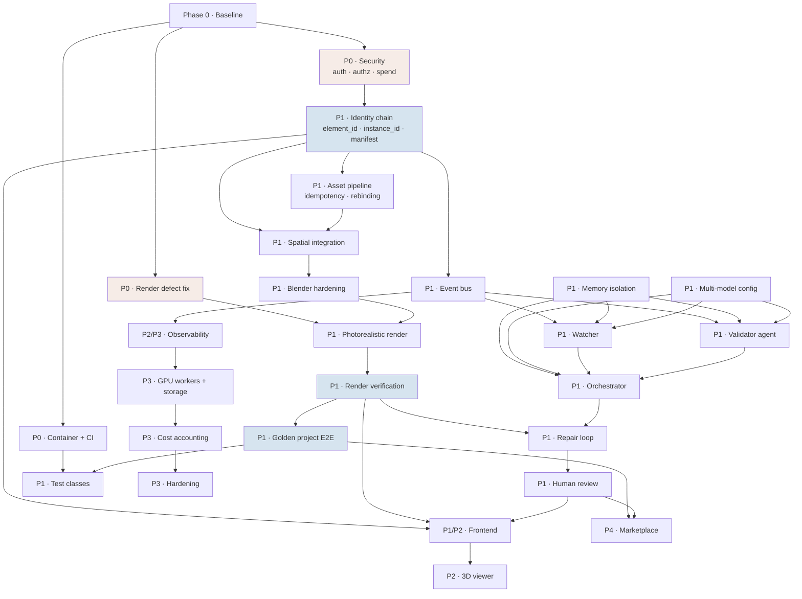

# Allure Interiors V4 — Execution & Delivery Contract

*Version 1.0 · 2026-09-21 · the execution layer beneath `PRD.md`, `plan.md`, `design.md`, `TRD.md`*

> **Every file path in this document was verified against the repository before being written.** No filename is invented.
> **No production code was modified to produce this document.**

---

## 0. How to read this document

| Document | Answers |
|---|---|
| `PRD.md` | What product are we building? |
| `plan.md` | What are we building, in what phases? |
| `design.md` | How does the system work internally? |
| `TRD.md` | What technical requirements must it satisfy? |
| **`task.md`** (this) | **Exactly what must be done, in what order, by whom, with what tests, and when a phase is complete** |

### Status legend

⬜ TODO · 🟡 IN PROGRESS · 🟠 BLOCKED · 🔵 IN REVIEW · 🟢 DONE · 🔴 FAILED · ⚪ DEFERRED

### Classification legend

`[ALREADY DONE]` verified working in the repo · `[PARTIAL]` exists incompletely · `[REQUIRED]` must be built · `[BLOCKED]` cannot start · `[DEPENDENCY]` gates other work · `[EXPERIMENTAL]` exists in `research/` · `[RESEARCH REQUIRED]` needs investigation before scoping

### The delivery rule

> **We do not optimise for tasks completed. We optimise for verified product capabilities delivered.**

Every task ends with an **Outcome** stating the capability, not the code. Every phase ends with a **Gate** that either passes or does not.

---

## 1. Task Summary

*All figures below are counted from the task list in this document, not estimated.*

### By priority

| Priority | Tasks | Meaning |
|---|---:|---|
| **P0 — Blocker** | **19** | Must complete before the system can safely progress |
| **P1 — Core V4** | **46** | Required for the V4 end-to-end product |
| **P2 — Quality** | **6** | Makes V4 robust and usable |
| **P3 — Scale** | **5** | Required for production scale |
| **P4 — Future** | **1** | Post-V4 |
| **TOTAL** | **77** | |

### By current state

| Classification | Tasks | Meaning |
|---|---:|---|
| `[ALREADY DONE]` | **1** | Verified working; needs only a regression test to protect it |
| `[PARTIAL]` | **16** | Exists incompletely — the largest category by risk |
| `[REQUIRED]` | **52** | Must be built |
| `[BLOCKED]` | **1** | **P0-SEC-000 — the auth decision is the user's** |
| `[RESEARCH REQUIRED]` | **6** | Needs investigation before it can be scoped |
| `[EXPERIMENTAL]` | **1** | Exists in `research/`, to be promoted |

### Programme shape

| Measure | Value |
|---|---:|
| **Critical path length** | **10 tasks** |
| Delivery phases | **26** (Phase 0 … Phase 25) |
| Phase gates | **25** |
| Milestones | **12** (M0 … M11) |
| Failure-injection rows | **18** core + 7 carried from earlier phases |
| Golden-project acceptance criteria | **20** |

### What these numbers say

**Two thirds of the work is `[REQUIRED]` new construction, but the critical path is only 10 tasks** — because the hardest part, the deterministic spatial engine, already works and is explicitly out of scope for replacement.

**Only one task is `[BLOCKED]`**, and it is blocked on a decision rather than on engineering: `P0-SEC-000`, the authentication option. `docs/AUTH_PLAN.md` notes that its steps 1–5 are independent of that choice, so **this must not be allowed to stall Phase 1**.

**16 `[PARTIAL]` tasks carry the most risk**, because each represents something that looks finished and is not — a floor plan accepted and never read, a render setting silently discarded, a designer step that displays "Request sent" and sends nothing.

---

## 2. V4 Critical Path

**The smallest dependency chain to the first verified photorealistic 3D project.**

```
P0-SEC-001  Authentication
     ↓
P0-SEC-003  Authorization + spend protection
     ↓
P0-RENDER-001  Fix the silently-swallowed render setting        ← 1-line fix, unblocks all render quality
     ↓
P1-IDENTITY-001  element_id + instance_id on SceneObject         ← 2 optional fields
     ↓
P1-IDENTITY-003  Identity into the Blender manifest
     ↓
P1-ASSET-002  Meshy idempotency key                              ← stops double-charging
     ↓
P1-SPATIAL-001  Compiler carries identity through placement
     ↓
P1-RENDER-002  Enable and verify raytracing
     ↓
P1-VALIDATOR-001  Promote render verification to production
     ↓
P1-EVAL-001  Golden project passes end to end
```

**Critical path length: 10 tasks.**

Everything else — the Supervisor, memory isolation, multi-model, frontend, infrastructure — is **parallelisable around this spine** or follows it. Three of the ten are small (`P0-RENDER-001` is one line; `P1-IDENTITY-001` is two optional fields).

### Why this order and not the documented one

`plan.md` sequences the event bus before the Supervisor, and this document keeps that. But the **critical path deliberately defers the event bus and all three agents**, because:

- The event bus carries `entity_ids`, which are **empty until `element_id` reaches `SceneObject`**. Building it first ships a schema whose most important field is blank.
- The Supervisor is **advisory and non-load-bearing** (`design.md` §21.6). A verified photorealistic project does not require it — verification does, and verification is deterministic (11 of 13 checks).

**The first verified render is reachable without a single agent.** That is the point of the ordering.

---

## 3. Task Dependency Graph



**Read the graph for parallelism.** After Phase 0 and P0 security, three streams run concurrently:

| Stream | Tasks | Owner cluster |
|---|---|---|
| **A — Critical path** | Identity → Asset → Spatial → Blender → Render → Verification → Golden | Backend, 3D, Spatial, Blender |
| **B — Supervisor** | Events → Memory/Multi-model → Watcher → Validator → Orchestrator → Repair | GenAI, Backend |
| **C — Platform** | Container/CI → Observability → GPU workers → Cost → Hardening | DevOps, MLOps |

Stream A is the only one on the critical path. **B and C must not block it.**

---

## 4. Milestones

| ID | Name | Priority | Depends on | Exit gate |
|---|---|---|---|---|
| **M0** | Baseline Locked | P0 | — | Current system measured and reproducible |
| **M1** | Production Safety | P0 | M0 | Nothing unauthenticated can spend money or read another project |
| **M2** | Identity Complete | P1 | M1 | Every rendered object traces to its source input |
| **M3** | Supervisor Foundation | P1 | M2 | Watcher + Validator + Orchestrator observe and control failures |
| **M4** | Element-First Complete | P1 | M2 | Golden identity benchmark passes: no false merge, no false split |
| **M5** | Spatially Valid 3D | P1 | M4 | Every SceneObject has identity **and** valid geometry |
| **M6** | Photorealistic 3D | P1 | M5 | Render settings verified applied; raytraced GI on |
| **M7** | Verified 3D | P1 | M6 | Independent verification passes on the golden project |
| **M8** | Self-Repairing Pipeline | P1 | M3, M7 | Injected failure repaired within 2 rounds or escalated |
| **M9** | Human Review | P1 | M8 | A user resolves an unresolved case without losing project state |
| **M10** | Production V4 | P3 | M9 | A project executes without manually running local processes |
| **M11** | Marketplace Handoff | P4 | M10 | A validated project produces a structured handoff package |

Full milestone detail with demos and evidence is in §31.

---

## 5. Phase 0 — Baseline and Safety

**Objective:** establish a clean, measurable, reproducible baseline before any V4 change.

**Gate:** *No V4 architectural work is considered started until the baseline is recorded.*

---

### P0-QA-001 — Lock the repository and test baseline

**Priority:** P0 · **Status:** ⬜ TODO · **Classification:** `[REQUIRED]`
**Owner:** QA Engineer · **Supporting:** Backend Engineer
**Dependencies:** none · **Blocks:** every other task

**Objective:** capture exactly what passes today so every later change has a comparison point.

**Current State:** `[ALREADY DONE]` in part — the suite exists and passes. Measured: **970 passed, 9 skipped, 30 xfailed** (backend), **46 tests** across 5 files (frontend). **Not recorded anywhere as a versioned baseline.**

**Required Change:** run and record the full suite with versions, durations and the exact xfail list. Tag the commit.

**Implementation Scope:** `aether-backend/tests/`, `aether-frontend/`, new `docs/benchmarks/v4_baseline.json`

**Deliverable:** `docs/benchmarks/v4_baseline.json` containing test counts, durations, Python/Node/Blender versions, git SHA, and the enumerated 30 xfail node ids.

**Acceptance Criteria:**
- Baseline file exists and is committed
- Re-running the suite on the tagged commit reproduces the same counts
- Every one of the 30 xfails is listed by node id

**Verification:** `pytest -q` in `aether-backend`; `npm test` in `aether-frontend`; diff against the baseline file.

**Evidence:** committed baseline JSON + terminal output attached to the task.

**Outcome:** *Every V4 change can be proven not to have regressed the existing 970-test structural suite.*

**Rollback:** N/A — additive documentation only.

---

### P0-QA-002 — Classify the 30 xfails

**Priority:** P0 · **Status:** ⬜ TODO · **Classification:** `[RESEARCH REQUIRED]`
**Owner:** Spatial Engineer · **Supporting:** QA Engineer
**Dependencies:** P0-QA-001 · **Blocks:** P1-SPATIAL-001

**Objective:** determine whether the 30 `xfail`s in `aether-backend/tests/test_vertical_boundary.py` encode accepted limitations or deferred bugs.

**Current State:** `[PARTIAL]` — 30 xfails exist, pre-existing, **unexplained**. An unexplained xfail is an unresolved question sitting inside the test suite.

**Required Change:** read each, assign a disposition, record it as a reason string.

**Implementation Scope:** `aether-backend/tests/test_vertical_boundary.py`

**Deliverable:** every xfail carries `reason=` naming either the accepted limitation or the tracked defect.

**Acceptance Criteria:** zero xfails without a reason; each classified `accepted-limitation` or `deferred-bug`, the latter with a task id.

**Verification:** `pytest -q -rx` shows a reason for every xfail.

**Evidence:** the diff, plus a disposition table in the task.

**Outcome:** *The team knows whether the spatial engine has 30 known bugs or 30 documented boundaries.*

**Rollback:** revert the reason strings; behaviour unchanged.

---

### P0-QA-003 — Record the runtime and accuracy baseline

**Priority:** P0 · **Status:** ⬜ TODO · **Classification:** `[PARTIAL]`
**Owner:** QA Engineer · **Supporting:** Blender Engineer, MLOps Engineer
**Dependencies:** P0-QA-001 · **Blocks:** P1-RENDER-002, P3-COST-001

**Objective:** capture current timings and pipeline accuracy so improvements and regressions are measurable.

**Current State:** `[PARTIAL]` — numbers exist from a **single** project: 4 viewpoint renders **11 s**, Blender build **40–60 s**, `scene_plan` **~2 min**; `aether-backend/research/placement_loop.py` measured coverage 100%, placement 91% within 1.0 m, orientation 100%, composite 98% — **all N=1.**

**Required Change:** re-run on ≥3 projects, record with N, store as a versioned benchmark.

**Implementation Scope:** `aether-backend/research/placement_loop.py`, `docs/benchmarks/`

**Deliverable:** `docs/benchmarks/v4_runtime_baseline.json` with per-stage durations and accuracy, each carrying **N** and the date.

**Acceptance Criteria:**
- ≥3 projects measured
- Every figure states N
- **No single-project figure is reported as a rate**

**Verification:** run the harness; compare against the JSON.

**Evidence:** the benchmark JSON.

**Outcome:** *Allure has honest baselines, so "we improved placement accuracy" becomes provable instead of impressionistic.*

**Rollback:** N/A.

---

### P0-ARCH-001 — Inventory the production path, providers and environment

**Priority:** P0 · **Status:** ⬜ TODO · **Classification:** `[REQUIRED]`
**Owner:** Technical Architect · **Supporting:** DevOps Engineer
**Dependencies:** none · **Blocks:** P0-SEC-002, P0-INFRA-001

**Objective:** one authoritative list of what actually runs, so security and deployment target reality.

**Current State:** `[PARTIAL]` — documented across `AUDIT_CODEBASE.md` and `design.md`, never as a single operational inventory.

**Required Change:** produce the inventory: every route, job type, provider, external dependency, environment variable name, artifact path.

**Implementation Scope:** read-only across `aether-backend/app/api/projects_routes.py` (**35** decorators — 34 on `router` + 1 on `files_router`), `aether-backend/app/api/routes.py` (**28**), `aether-backend/app/jobs/handlers/` (**13 registered types from 11 modules** — correction C9), `aether-backend/app/core/config.py`, `aether-backend/app/projects/layout.py` (`CHECKPOINTS`, 17 entries). Route total is 63 either way; the 34/29 split above was off by one.

**Deliverable:** `docs/production/v4_inventory.md`.

**Acceptance Criteria:**
- All 63 routes listed with method, current auth requirement (**none**) and whether they spend money
- All **13** job types listed with lane and resource class (the "11" here counted modules, not registrations — C9)
- Every env var listed **by name only** — no values
- Every artifact path from `CHECKPOINTS` listed

**Verification:** cross-check counts against `grep` of route decorators and the handler registry.

**Evidence:** the inventory document.

**Outcome:** *Security, deployment and observability work targets a verified list instead of a guess.*

**Rollback:** N/A.

---

### P0-INFRA-002 — Define and test the `data/` backup strategy

**Priority:** P0 · **Status:** ⬜ TODO · **Classification:** `[RESEARCH REQUIRED]`
**Owner:** DevOps Engineer · **Supporting:** Technical Architect
**Dependencies:** P0-ARCH-001 · **Blocks:** M1

**Objective:** ensure the directory holding every project's truth — including every paid mesh — is recoverable.

**Current State:** **`[UNKNOWN]`** — whether `data/` is backed up has never been established. It holds SQLite, all project artifacts and every purchased 3D model.

**Required Change:** establish whether backups exist; if not, define and **test** one.

**Implementation Scope:** `aether-backend/data/` (runtime), deployment configuration.

**Deliverable:** a documented, **restore-tested** backup procedure.

**Acceptance Criteria:**
- A restore reproduces a working project **including its meshes**
- Frequency and retention are stated
- The procedure is tested, not merely written

**Verification:** perform a real restore into a clean directory and open the restored project.

**Evidence:** restore log + screenshot of the restored project.

**Outcome:** *Allure cannot lose every customer's purchased 3D assets to one disk failure.*

**Rollback:** N/A.

---

### ✅ Phase 0 Gate — Baseline Locked (M0)

| Criterion | Task | Evidence |
|---|---|---|
| Test baseline recorded and reproducible | P0-QA-001 | `docs/benchmarks/v4_baseline.json` |
| 30 xfails classified | P0-QA-002 | reason strings |
| Runtime + accuracy baseline, N ≥ 3 | P0-QA-003 | `docs/benchmarks/v4_runtime_baseline.json` |
| Production inventory complete | P0-ARCH-001 | `docs/production/v4_inventory.md` |
| `data/` backup tested by restore | P0-INFRA-002 | restore log |

**Gate rule:** no Phase 1+ task may be marked 🟢 DONE until this gate passes.

---

## 6. Phase 1 — Production Safety (P0 blockers)

**Objective:** make the system safe to run where anyone can reach it.

**The situation in one sentence:** *anyone who can reach the application today can open any project and trigger paid 3D generation.*

---

### P0-SEC-000 — Record the authentication decision

**Priority:** P0 · **Status:** 🟠 BLOCKED · **Classification:** `[BLOCKED]` — **the decision is the user's**
**Owner:** Technical Architect · **Supporting:** Security Engineer
**Dependencies:** none · **Blocks:** P0-SEC-001 and therefore all of M1

**Objective:** close the open A/B/C decision in `docs/AUTH_PLAN.md` so implementation can start.

**Current State:** `[BLOCKED]` — `docs/AUTH_PLAN.md` presents three costed options (**A** Supabase, **B** self-hosted JWT + RBAC, **C** Postgres + managed identity provider + app-layer authorization) and recommends **C**, fallback **B**. **The decision has not been made.**

**Required Change:** make and record the decision as an ADR.

**Implementation Scope:** `docs/` (new ADR)

**Deliverable:** an ADR naming the choice, the reasoning and the consequences for the job runner and file access.

**Acceptance Criteria:** the ADR states option, reasoning and consequences.

**Verification:** review.

**Evidence:** the ADR.

**Outcome:** *The single decision blocking production-safety work is closed.*

**Rollback:** supersede with a new ADR; never edit in place.

> **Do not let this stall the phase.** `AUTH_PLAN.md` correctly observes that its steps 1–5 — data model, authentication, authorization, file authorization, capability tokens — are **independent of the A/B/C choice**. Only the Postgres migration and RLS depend on it.

---

### P0-SEC-001 — Authentication and the principal dependency

**Priority:** P0 · **Status:** ⬜ TODO · **Classification:** `[REQUIRED]`
**Owner:** Security Engineer · **Supporting:** Backend Engineer
**Dependencies:** P0-SEC-000 · **Blocks:** P0-SEC-002, P0-SEC-003, P0-SEC-006, M1

**Objective:** give the system a concept of "who is asking."

**Current State:** **`[REQUIRED]`** — there is **no authentication of any kind**. No `Depends`, no bearer scheme, no API-key check on any of the 63 routes.

**Required Change:** implement identity per P0-SEC-000; expose a FastAPI dependency yielding the current principal. **No enforcement in this task.**

**Implementation Scope:** new `aether-backend/app/auth/`, `aether-backend/app/main.py`, `aether-backend/app/db/sqlite.py` (migration adding `users`)

**Deliverable:** login/session plus a `require_principal` dependency.

**Acceptance Criteria:**
- A user can register and sign in
- The dependency yields a principal for a valid session, 401 otherwise
- **Existing routes still work** — this adds capability, not enforcement
- The migration runs twice safely and is additive only

**Verification:** integration tests for sign-up, sign-in, expiry, invalid token; the 970-test suite still passes.

**Evidence:** test output; a session lifecycle trace.

**Outcome:** *Allure can tell one person from another — the precondition for every other security control.*

**Rollback:** remove the router and dependency; no route depends on it yet.

---

### P0-SEC-002 — Authorization at one choke point, deny by default

**Priority:** P0 · **Status:** ⬜ TODO · **Classification:** `[REQUIRED]`
**Owner:** Security Engineer · **Supporting:** Backend Engineer
**Dependencies:** P0-SEC-001, P0-ARCH-001 · **Blocks:** P0-SEC-003, P0-SEC-004, P0-SEC-005, M1

**Objective:** make projects belong to people.

**Current State:** **`[REQUIRED]`** — any caller can read or modify any project by id.

**Required Change:** add `projects.owner_id` and a `project_members` join; enforce authorization as a **single router-level dependency**, deny by default.

**Implementation Scope:** `aether-backend/app/db/sqlite.py` (migration), `aether-backend/app/api/projects_routes.py`, `aether-backend/app/api/routes.py`, `aether-backend/app/main.py`

**Deliverable:** deny-by-default authorization across both routers.

**Acceptance Criteria:**
- Unauthenticated → **401**
- Another user's project → **403**
- Owner's own project → **200**
- **The anonymous share link `/w/{projectId}` still works** (see P0-SEC-004)
- An authz matrix test covers every route × role
- Existing projects are backfilled to an owner

**Verification:** security suite covering the matrix; the 970 tests still pass.

**Evidence:** authz matrix output.

**Outcome:** *A person's home photographs and designs are visible only to them and whoever they choose.*

**Rollback:** remove the dependency list from the routers. **Re-test share links on every change.**

---

### P0-SEC-003 — Spend protection on paid generation

**Priority:** P0 · **Status:** ⬜ TODO · **Classification:** `[REQUIRED]`
**Owner:** Security Engineer · **Supporting:** Backend Engineer
**Dependencies:** P0-SEC-002 · **Blocks:** M1

**Objective:** make it impossible for an unauthenticated or unauthorized caller to spend money.

**Current State:** **`[REQUIRED]`** — `POST /projects/{project_id}/elements/generate` (`aether-backend/app/api/projects_routes.py:779`) spends Meshy credits and is **open**. A per-project cap exists (`meshy_max_per_project: 20`) but there is no authentication and no per-user limit.

**Required Change:** require an authenticated, authorized principal; add per-user and per-project caps evaluated against **persisted** cost records, not an in-memory counter.

**Implementation Scope:** `aether-backend/app/api/projects_routes.py`, `aether-backend/app/core/config.py`, `aether-backend/app/db/sqlite.py` (cost table)

**Deliverable:** four independent spend gates — human approval (already exists) + authentication + cap + idempotency key (P1-ASSET-002).

**Acceptance Criteria:**
- Unauthenticated generation request → **401, zero spend**
- Cap reached → generation halts, **project preserved**, human review raised
- **Restarting the process does not reset accumulated spend**

**Verification:** security test; fault-injection killing the process mid-project and confirming the cap survives.

**Evidence:** test output; a cost record surviving restart.

**Outcome:** *Nobody can drain Allure's Meshy credits, and a restart cannot silently reset a spend limit.*

**Rollback:** remove the cap check. **Do not remove the auth requirement.**

---

### P0-SEC-004 — Share links as capability tokens

**Priority:** P0 · **Status:** ⬜ TODO · **Classification:** `[REQUIRED]`
**Owner:** Security Engineer · **Supporting:** Frontend Engineer
**Dependencies:** P0-SEC-002 · **Blocks:** P0-SEC-005, M1

**Objective:** keep anonymous sharing working while it stops being an authorization hole.

**Current State:** `[PARTIAL]` — `/w/{projectId}` is a deliberately anonymous read-only tour. `docs/AUTH_PLAN.md` identifies this correctly as **a feature, not a gap** — it needs a capability token, not a session.

**Required Change:** replace implicit anonymous access with an unguessable, revocable, tour-scoped token.

**Implementation Scope:** `aether-backend/app/db/sqlite.py` (`capability_tokens`), `aether-backend/app/api/projects_routes.py`, `aether-frontend/src/app/w/[projectId]/page.tsx`

**Deliverable:** share links granting viewing only, revocable.

**Acceptance Criteria:**
- A share link opens the tour with no account
- It grants **no** access beyond the tour package
- Revoking breaks the link
- **Guessing a project id does not grant access**

**Verification:** security test for each of the four; browser test that sharing still works.

**Evidence:** test output; browser screenshot.

**Outcome:** *Sharing a design stays effortless without making every project publicly readable.*

**Rollback:** feature-flag to the current behaviour **only** on a non-public deployment.

---

### P0-SEC-005 — Authorize file access

**Priority:** P0 · **Status:** ⬜ TODO · **Classification:** `[REQUIRED]`
**Owner:** Security Engineer · **Supporting:** Backend Engineer
**Dependencies:** P0-SEC-002, P0-SEC-004 · **Blocks:** M1

**Objective:** close what `docs/AUTH_PLAN.md` identifies as **the largest single hole**.

**Current State:** **`[REQUIRED]`** — `GET /files/projects/{id}/{path}` has a path-traversal guard (`safe_id()`) and **no authorization whatsoever**. `/files/assets`, `/files/assets-web` and `/files/materials` are bare `StaticFiles` mounts in `aether-backend/app/main.py`.

**Required Change:** replace or guard all four with authorized or signed access.

**Implementation Scope:** `aether-backend/app/main.py` (the `StaticFiles` mounts and `files_router`), `aether-backend/app/api/projects_routes.py`

**Deliverable:** file access requiring authorization or a valid signature.

**Acceptance Criteria:**
- Another user's render is **not** retrievable
- A share-token holder retrieves only that project's tour assets
- Traversal attempts still fail
- **The 3D viewer and share page still load their assets**

**Verification:** security test; browser test confirming the viewer still works.

**Evidence:** test output; viewer screenshot.

**Outcome:** *A person's renders and uploaded photographs are no longer retrievable by anyone who guesses a path.*

**Rollback:** restore the mounts **only** on a non-public deployment.

---

### P0-SEC-006 — Rate limiting

**Priority:** P0 · **Status:** ⬜ TODO · **Classification:** `[REQUIRED]`
**Owner:** Security Engineer
**Dependencies:** P0-SEC-001 · **Blocks:** M1

**Objective:** bound abuse and runaway consumption.

**Current State:** **`[REQUIRED]`** — absent entirely.

**Required Change:** per-principal and per-route limits returning 429 with a retry hint.

**Implementation Scope:** `aether-backend/app/main.py`, `aether-backend/app/core/config.py`

**Deliverable:** configurable rate limits on all mutating routes.

**Acceptance Criteria:** exceeding a limit returns 429; limits are configurable; normal use is unaffected.

**Verification:** load test driving past the limit.

**Evidence:** load test output.

**Outcome:** *A single client cannot exhaust the service or the job queue.*

**Rollback:** raise limits to effectively unlimited via configuration.

---

### P0-RENDER-001 — Fix the silently-swallowed render setting

**Priority:** P0 · **Status:** ⬜ TODO · **Classification:** `[REQUIRED]`
**Owner:** Blender Engineer
**Dependencies:** none · **Blocks:** P1-RENDER-002, M6

**Objective:** stop discarding a failed render-quality setting, and apply a valid one.

**Current State:** `[PARTIAL]` — `aether-backend/blender/scripts/build_scene.py:38-42` sets `view_transform = "AgX"` (succeeds) then `look = "AgX - Medium Contrast"` (**rejected by the installed Blender**), and `except TypeError: pass` discards the failure. **Every render the product has produced has had no contrast look applied.** Probed as accepted: `AgX - High Contrast`, `Punchy`, `Base Contrast`.

**Required Change:** use an accepted look name; assert the setting took effect; log and re-raise unexpected exception types rather than swallowing them.

**Implementation Scope:** `aether-backend/blender/scripts/build_scene.py`

**Deliverable:** colour management applied and verified, failing loudly when it cannot be.

**Acceptance Criteria:**
- After build, `view_settings.view_transform` and `view_settings.look` equal the requested values
- An invalid look name **fails the build** rather than passing silently
- A before/after render pair shows a visible difference

**Verification:** integration test asserting the applied values; visual comparison on the golden scene.

**Evidence:** the assertion test; the before/after render pair.

**Outcome:** *Every render now carries the intended colour treatment — closing a defect that has degraded the product's central visual promise since the beginning, unnoticed.*

**Rollback:** revert the look string; behaviour returns to the prior (broken) state.

---

### P0-AI-001 — Make provider selection explicit

**Priority:** P0 · **Status:** ⬜ TODO · **Classification:** `[REQUIRED]`
**Owner:** GenAI Engineer · **Supporting:** Backend Engineer
**Dependencies:** none · **Blocks:** P1-MM-001

**Objective:** stop the production reasoning model from changing by accident.

**Current State:** `[PARTIAL]` — `aether-backend/app/intelligence/provider.py:191-221` resolves `auto` to Anthropic when `ANTHROPIC_API_KEY` exists, else Gemini. Live production is **Gemini** (`gemini-3.5-flash-lite`). **Setting one environment variable silently promotes `claude-opus-5` to primary.**

**Required Change:** require `INTELLIGENCE_PROVIDER` explicitly; warn loudly on `auto`; log the resolved provider and model at startup.

**Implementation Scope:** `aether-backend/app/intelligence/provider.py`, `aether-backend/app/core/config.py`, `aether-backend/app/main.py`

**Deliverable:** provider resolution impossible to change without noticing.

**Acceptance Criteria:**
- Startup logs `provider=` and `model=`
- `auto` emits a warning naming what it resolved to
- Adding `ANTHROPIC_API_KEY` without changing the setting produces a visible warning

**Verification:** integration test asserting the log line under three configurations.

**Evidence:** startup log for each configuration.

**Outcome:** *The model that reads a customer's home cannot change because someone added an API key.*

**Rollback:** restore the `auto` default.

---

### P0-AI-002 — Regression-test the no-silent-mock rule

**Priority:** P0 · **Status:** ⬜ TODO · **Classification:** `[ALREADY DONE]` — needs a test
**Owner:** GenAI Engineer · **Supporting:** QA Engineer
**Dependencies:** none · **Blocks:** P1-VALIDATOR-002

**Objective:** protect an existing correct behaviour so it cannot regress.

**Current State:** `[ALREADY DONE]` — `aether-backend/app/intelligence/provider.py` already distinguishes "operator selected the deterministic provider" from "the real provider failed," inserting a warning naming the failed provider and stage rather than presenting an estimate as a reading. **Correct, and currently untested.**

**Required Change:** add the regression test. **No behaviour change.**

**Implementation Scope:** `aether-backend/tests/`

**Deliverable:** a test pinning the distinction.

**Acceptance Criteria:** injecting a provider exception produces a warning containing provider and stage; the result is **not** presented as a real reading.

**Verification:** `pytest` on the new test.

**Evidence:** test output.

**Outcome:** *The rule that a mock estimate must never masquerade as a reading of a customer's photograph is enforced by CI rather than by memory.*

**Rollback:** N/A — test only.

---

### P0-FRONTEND-001 — ~~Resolve the dead `/cinematic` route~~ **WITHDRAWN — NOT A DEFECT (C1)**

**Priority:** ~~P0~~ — · **Status:** 🟢 CLOSED, no change required · **Classification:** `[ALREADY DONE]`
**Owner:** Frontend Engineer · **Closed:** 2026-09-21, verified in-browser with Playwright
**Dependencies:** none · **Blocks:** nothing — M1 no longer depends on this

**The premise of this task was wrong.** It was written from an audit finding that tested the URL, saw a non-200, and never read the page's own docstring.

**Verified reality:**

| Claimed | Actual |
|---|---|
| Calls the Aether backend, which returns HTTP 404 | Calls a **separate optional engine** at `NEXT_PUBLIC_WALKTHROUGH_API_URL`, default `http://localhost:4000` (`walkthrough-api.ts:38`) |
| Dead feature, backend missing | **Optional integration** with "RE Walkthrough Pro", a different product |
| A broken page a user can land on | Renders a documented, graceful unavailable state |

The intent was documented all along — `aether-frontend/src/app/cinematic/page.tsx:13-17`:

> *"The photo-to-film studio, backed by the RE Walkthrough Pro engine on port 4000. Optional: without that engine the view shows its own 'engine not running' state and nothing else is affected."*

**What a user actually sees** (Playwright, `main` innerText):

> *The walkthrough engine is not running — This is the one part of Allure that needs a service behind it. Nothing else in the portal is affected. Expected at http://localhost:4000 — [Check again]*

**Action:** none. Do not delete `features/walkthrough/`; it is a working optional surface.

**Residual requirement, carried forward:** any route depending on an optional external service must state that dependency in the UI when the service is absent. `/cinematic` already satisfies it, so it becomes the reference implementation rather than a defect. Folded into `P1-FRONTEND-00x` acceptance rather than kept as its own task.

**Evidence:** `TRACK_RECORD.md` §2 (P0-FRONTEND-001) and §5 correction C1.

---

### P0-FRONTEND-002 — Label or implement the designer step

**Priority:** P0 · **Status:** ⬜ TODO · **Classification:** `[PARTIAL]`
**Owner:** Product Engineer · **Supporting:** Frontend Engineer
**Dependencies:** none · **Blocks:** M1

**Objective:** stop the interface asserting something untrue.

**Current State:** **`[PARTIAL]`** — step 9 of the Studio (`aether-frontend/src/features/walkthrough-studio/components/walkthrough-studio.tsx`) renders designer cards from **hardcoded data**; "Connect" sets local React state and displays **"Request sent."** **Nothing is sent. Nothing is stored. Reloading clears it.**

**Required Change:** **one of two paths, no third:** (A) make connection requests persist and deliver, or (B) label the step a preview and stop claiming a request was sent.

**Implementation Scope:** `aether-frontend/src/features/walkthrough-studio/components/walkthrough-studio.tsx`; for path A also `aether-backend/app/api/projects_routes.py` and a migration.

**Deliverable:** an interface that does not claim an action it did not perform.

**Acceptance Criteria:**
- Path A: a connection request survives reload and is retrievable server-side
- Path B: the step is visibly marked a preview; sample profiles are labelled as examples; the button does not read "Request sent"

**Verification:** browser test asserting the chosen behaviour.

**Evidence:** browser test; screenshot.

**Outcome:** *The one place in the product where the interface asserts something untrue is closed.*

**Rollback:** revert the copy or the endpoint.

---

### P0-INFRA-001 — Container image and CI

**Priority:** P0 · **Status:** ⬜ TODO · **Classification:** `[REQUIRED]`
**Owner:** DevOps Engineer
**Dependencies:** P0-ARCH-001 · **Blocks:** P1-QA-001, M10

**Objective:** make the system reproducibly buildable and continuously tested.

**Current State:** **`[REQUIRED]`** — **no Dockerfile, no compose file, no CI workflow exists anywhere in the repository.**

**Required Change:** add a container image and a CI pipeline running the MOCK suite on every commit.

**Implementation Scope:** new `Dockerfile`, `docker-compose.yml`, `.github/workflows/` (or equivalent)

**Deliverable:** `docker build` succeeds; CI runs on push and blocks merge on failure.

**Acceptance Criteria:**
- The container boots and serves `/api/health`
- CI runs the 970-test MOCK suite
- **CI output labels the test class** (`class=MOCK`)

**Verification:** a CI run on a pull request.

**Evidence:** CI run link and build log.

**Outcome:** *Allure can be deployed the same way twice, and a regression is caught before merge instead of after.*

**Rollback:** N/A — additive.

---

### P0-OBSERVABILITY-001 — Structured logging with correlation ids

**Priority:** P0 · **Status:** ⬜ TODO · **Classification:** `[PARTIAL]`
**Owner:** Backend Engineer · **Supporting:** DevOps Engineer
**Dependencies:** none · **Blocks:** P1-EVENT-001, P3-OBSERVABILITY-001

**Objective:** make a failing project traceable.

**Current State:** `[PARTIAL]` — `aether-backend/app/main.py:29` is `logging.basicConfig(level=logging.INFO)` and **that is the entire configuration**. Job-level lines are good (`aether-backend/app/jobs/runner.py:215-222` emits `job.start`/`succeeded`/`failed` with project, job, type, lane, attempt, ms) but there is **no aggregation** and no correlation id.

**Required Change:** structured JSON logging; a `correlation_id` minted at project creation, carried on every log line, event and job.

**Implementation Scope:** `aether-backend/app/main.py`, `aether-backend/app/jobs/runner.py`, `aether-backend/app/jobs/context.py`

**Deliverable:** JSON logs carrying `project_id`, `job_id`, `correlation_id`, `stage`.

**Acceptance Criteria:**
- Every line parses as JSON with the four fields
- Filtering by correlation id returns the complete run
- **Logs carry ids only — never a brief, an image, a prompt or a key** (existing practice; must survive)

**Verification:** integration test asserting the fields; a log scan asserting no secret or prompt text.

**Evidence:** sample log output; scan result.

**Outcome:** *A support engineer can reconstruct what happened to one customer's project from the logs alone.*

**Rollback:** revert to `basicConfig`.

---

### ✅ Phase 1 Gate — Production Safety (M1)

| Criterion | Task | Evidence |
|---|---|---|
| Auth decision recorded | P0-SEC-000 | ADR |
| Authentication works | P0-SEC-001 | test output |
| Authorization deny-by-default; share links intact | P0-SEC-002, P0-SEC-004 | authz matrix |
| **Unauthenticated generation spends nothing** | P0-SEC-003 | security test |
| File access authorized | P0-SEC-005 | security test |
| Rate limits exist | P0-SEC-006 | load test |
| Provider selection explicit and logged | P0-AI-001 | startup log |
| No-silent-mock rule tested | P0-AI-002 | test output |
| Render setting applied and asserted | P0-RENDER-001 | before/after render |
| No route 404s | P0-FRONTEND-001 | browser test |
| Designer step honest | P0-FRONTEND-002 | browser test |
| Container builds; CI runs | P0-INFRA-001 | CI run |
| Structured logs with correlation ids | P0-OBSERVABILITY-001 | log sample |

**Gate rule:** **the product must not be exposed beyond a trusted machine until every row passes.** This gate alone gates launch, independent of every capability in later phases.

---

## 7. Phase 2 — Identity Foundation

**Objective:** close the element identity chain from source input to final render.

**The chain:** `Source → Intent → ElementDefinition → ElementInstance → ElementImage → MoodboardOccurrence → ThreeDAsset → SceneObject → BlenderObject → Render`

**What already works** `[ALREADY DONE]`: source→intent (`source_intent_ids`), intent→definition (`identity_method`), definition→instance (`ElementInstance.element_id`), definition→image (`ElementImage.element_id`). **The chain dies at `SceneObject`.**

---

### P1-IDENTITY-001 — Add `element_id` and `instance_id` to `SceneObject`

**Priority:** P1 · **Status:** ⬜ TODO · **Classification:** `[REQUIRED]` · **CRITICAL PATH**
**Owner:** Backend Engineer · **Supporting:** Spatial Engineer
**Dependencies:** P0-SEC-002 · **Blocks:** P1-IDENTITY-002, P1-IDENTITY-003, P1-SPATIAL-001, P1-VALIDATOR-001, M2

**Objective:** let a scene object name the element it came from, without a join.

**Current State:** **`[PARTIAL]`** — `aether-backend/app/scene/schema.py:153-187` defines `SceneObject` with `object_id`, `asset_id`, `room_id`, transform, `plan_key` and `visual`. **No `element_id`, no `instance_id`.** Identity survives only by joining `plan_key` → `ObjectPlanItem.object_key` → `.element_id`.

Note: `source_intent_ids` **does** already exist, nested at `ObjectVisual.source_intent_ids` (`aether-backend/app/scene/schema.py:143`).

**Required Change:** add `element_id: Optional[str] = None` and `instance_id: Optional[str] = None`. **Keep `plan_key`.** Add a flat `source_intent_ids` accessor delegating to `visual.source_intent_ids`.

**Implementation Scope:** `aether-backend/app/scene/schema.py`

**Deliverable:** two optional identity fields plus a convenience accessor.

**Acceptance Criteria:**
- **A `scene_spec.json` written before V4 still loads unchanged** — fields are optional with `None` defaults
- `plan_key` is retained and unchanged
- The flat accessor returns `visual.source_intent_ids`

**Verification:** unit test loading a pre-V4 scene file; unit test on the accessor; the 970-test suite still passes.

**Evidence:** test output; a pre-V4 scene file loading successfully.

**Outcome:** *A scene object can carry the identity of the element that justified it — the schema change that makes the entire provenance chain possible.*

**Rollback:** delete two optional fields. No migration, no data loss; nothing else requires them yet.

---

### P1-IDENTITY-002 — Populate identity in the compiler

**Priority:** P1 · **Status:** ⬜ TODO · **Classification:** `[REQUIRED]` · **CRITICAL PATH**
**Owner:** Spatial Engineer · **Supporting:** Backend Engineer
**Dependencies:** P1-IDENTITY-001 · **Blocks:** P1-IDENTITY-003, M2

**Objective:** actually fill the fields at the one place where identity is currently lost.

**Current State:** **`[PARTIAL]`** — `aether-backend/app/planning/compiler.py:747` loops `for n in range(item.count)`, and the `SceneObject(...)` constructor at `:803-819` sets `plan_key=item.object_key if n == 0 else f"{item.object_key}#{n + 1}"` at `:817`. **`item.element_id` is in scope and unused here.**

**Required Change:** at the constructor, add `element_id=item.element_id or None` and `instance_id=f"{item.element_id}#{n}" if item.element_id else None`.

**Design decision (TDR-004 in `design.md`):** derive `instance_id` rather than resolving real `ElementInstance` rows, because resolving them would require `app/planning` to import from `app/intelligence` — crossing a boundary the codebase deliberately maintains (`aether-backend/app/scene/schema.py` documents that the executor-facing contract imports nothing from the intelligence package).

**Implementation Scope:** `aether-backend/app/planning/compiler.py`

**Deliverable:** every placed object carries its element and instance identity.

**Acceptance Criteria:**
- A 3-count plan item yields **3 objects sharing 1 `element_id` with 3 distinct `instance_id`s**
- `instance_id` is **deterministic**: two compiles of the same plan produce identical sets
- Existing placement tests pass unchanged
- **When `item.count` differs from `len(instances)`, the divergence is emitted as an event, not silently tolerated**

**Verification:** unit test on the 3-count case; determinism test compiling twice; the 970 tests still pass.

**Evidence:** test output showing 1 element_id / 3 instance_ids.

**Outcome:** *Three identical bar stools are now provably one identity and three occurrences at the scene level — not a join nobody performs.*

**Rollback:** remove two constructor kwargs; `plan_key` still carries the old join.

---

### P1-IDENTITY-003 — Carry identity into the Blender manifest

**Priority:** P1 · **Status:** ⬜ TODO · **Classification:** `[REQUIRED]` · **CRITICAL PATH**
**Owner:** Blender Engineer · **Supporting:** Backend Engineer
**Dependencies:** P1-IDENTITY-002 · **Blocks:** P1-VALIDATOR-001, P1-IDENTITY-005, M2

**Objective:** stop the chain breaking at the final hop.

**Current State:** **`[PARTIAL]`** — `aether-backend/app/blender/manifest.py:331` builds each object entry as `{"id": o.object_id, "semantic_type": …, "room_id": …, "strategy": …, "name": …, "asset": …, "location": …, "rotation_rad": …, "scale": …, "dimensions": …, "color": …, "mount": …, "parent": …, "material_overrides": …, "locked": …}`. **No `element_id`, no `instance_id`, no `plan_key`.** `MANIFEST_VERSION = "1.1"`.

**Required Change:** add `element_id`, `instance_id` and `plan_key` to each object entry. Bump `MANIFEST_VERSION`.

**Implementation Scope:** `aether-backend/app/blender/manifest.py`

**Deliverable:** a manifest whose every object names its element.

**Acceptance Criteria:**
- Every manifest object entry contains the three identity fields
- `MANIFEST_VERSION` is bumped and a reader rejects an unknown major version
- The built scene is otherwise byte-identical for an unchanged input

**Verification:** contract test on the manifest shape; 3D regression comparing a rebuilt scene.

**Evidence:** a manifest excerpt; regression output.

**Outcome:** *A Blender object — and therefore a rendered pixel region — can be traced back to the element that caused it.*

**Rollback:** remove the three fields; revert the version.

---

### P1-IDENTITY-004 — Add `element_id` to the asset record

**Priority:** P1 · **Status:** ⬜ TODO · **Classification:** `[REQUIRED]`
**Owner:** 3D Engineer · **Supporting:** Backend Engineer
**Dependencies:** P1-IDENTITY-001 · **Blocks:** P1-IDENTITY-005, M2

**Objective:** let an asset name the element it was generated for.

**Current State:** **`[PARTIAL]`** — `aether-backend/app/assets/schema.py` defines `AssetRecord` with `asset_id`, `name`, `semantic_type`, `status`, `source`, `files`, `dimensions`, `normalization`, `validation`, `mount`, tags and **`project_id`** — but **no `element_id` and no `source_image_id`**.

**Required Change:** add `canonical_element_id` and `source_image_id`.

**Implementation Scope:** `aether-backend/app/assets/schema.py`, `aether-backend/app/assets/pipeline.py`, `aether-backend/app/jobs/handlers/generate_elements.py`

**Deliverable:** every generated asset names its element and source image.

**Acceptance Criteria:**
- Every generated asset carries both fields
- Existing registry records load unchanged (optional fields)
- `project_id` tenancy behaviour is unchanged

**Verification:** unit test; load an existing `registry.json` unchanged.

**Evidence:** test output; a registry record excerpt.

**Outcome:** *The asset library can answer "which element is this mesh for", enabling reuse audit and the designer handoff.*

**Rollback:** remove two optional fields.

---

### P1-IDENTITY-005 — Provenance query and index

**Priority:** P1 · **Status:** ⬜ TODO · **Classification:** `[REQUIRED]`
**Owner:** Backend Engineer · **Supporting:** Data Engineer
**Dependencies:** P1-IDENTITY-003, P1-IDENTITY-004 · **Blocks:** P1-FRONTEND-003, M2

**Objective:** make the chain queryable, not merely present.

**Current State:** **`[REQUIRED]`** — element identity lives only in per-project JSON (`planning/scene_reading.json`, `planning/element_images.json`); the database has 8 tables and **none for elements or assets**.

**Required Change:** index element identity in the database (files remain the record); expose an endpoint answering the provenance query.

**Implementation Scope:** `aether-backend/app/db/sqlite.py` (migration adding `elements`, `element_instances`), `aether-backend/app/api/projects_routes.py`

**Deliverable:** `GET /projects/{id}/provenance/{scene_object_id}` returning the full chain.

**Acceptance Criteria:** for **every** object in a golden project's render, the chain resolves:
```
render → blender_object → scene_object → instance → element
      → definition.source_element_ids → instance.source_element_id
      → SceneElement.crop_ref → DesignIntent.source_intent_ids → input_id → ref_NN.jpg
```

**Verification:** integration test asserting resolution for every object in the golden scene.

**Evidence:** the endpoint response for one object, full chain.

**Outcome:** *Allure can answer "what source photo caused this rendered chair to exist" — for every object, by query, with no guessing.*

**Rollback:** drop the endpoint; the index tables are additive and harmless.

---

### P1-IDENTITY-006 — Golden identity benchmark

**Priority:** P1 · **Status:** ⬜ TODO · **Classification:** `[REQUIRED]`
**Owner:** AI Evaluation Engineer · **Supporting:** QA Engineer
**Dependencies:** P1-IDENTITY-002 · **Blocks:** M2, M4

**Objective:** prove identity behaviour with numbers, not assertion.

**Current State:** **`[REQUIRED]`** — false-merge and false-split rates are **`[UNKNOWN]`**. The guards exist; their effectiveness has never been measured.

**Required Change:** build a hand-labelled set and measure.

**Implementation Scope:** new `aether-backend/research/` harness + `docs/benchmarks/`

**Deliverable:** measured false-merge rate, false-split rate, instance-count accuracy, asset reuse rate — each with **N**.

**Acceptance Criteria:**
- The golden composition (§30) yields **10 definitions, 17 instances, ≤9 generations**
- 3 identical stools → **exactly 1 generation**
- 2 identical chairs → **exactly 1 generation**
- 2 side tables remain **2** definitions (no false merge)
- 2 dark + 1 light stool → **2** definitions (no false merge, no false split)
- Every figure states N

**Verification:** run the harness against the labelled set.

**Evidence:** benchmark JSON in `docs/benchmarks/`.

**Outcome:** *Allure can state its identity accuracy as a measured number instead of a design intention.*

**Rollback:** N/A — measurement only.

---

### ✅ Phase 2 Gate — Identity Complete (M2)

| Criterion | Task | Evidence |
|---|---|---|
| `SceneObject` carries element + instance identity | P1-IDENTITY-001/002 | 1 element_id / 3 instance_ids test |
| Pre-V4 scene files still load | P1-IDENTITY-001 | load test |
| Manifest carries identity | P1-IDENTITY-003 | manifest excerpt |
| Assets name their element | P1-IDENTITY-004 | registry excerpt |
| **Provenance resolves for every object** | P1-IDENTITY-005 | endpoint response |
| Identity accuracy measured with N | P1-IDENTITY-006 | benchmark JSON |

---

## 8. Phase 3 — Event System

**Objective:** a typed, immutable event stream the Supervisor and observability can both consume.

---

### P1-EVENT-001 — Extend the events table into a typed bus

**Priority:** P1 · **Status:** ⬜ TODO · **Classification:** `[PARTIAL]`
**Owner:** Backend Engineer
**Dependencies:** P1-IDENTITY-002, P0-OBSERVABILITY-001 · **Blocks:** P1-WATCHER-001, P1-VALIDATOR-002, M3

**Objective:** give events the fields the Supervisor needs, without breaking existing emitters.

**Current State:** `[PARTIAL]` — `aether-backend/app/db/sqlite.py:91-100` defines `events(event_id, project_id, job_id, stage, status, message, duration_ms, ts)`. `aether-backend/app/jobs/context.py:57` provides `ctx.emit(stage, message, status)` and every handler already calls it. **Missing: `event_type`, `entity_ids`, `evidence_refs`, `severity`, `confidence`, `correlation_id`, `parent_event_id`, `producer`, `schema_version`.**

**Required Change:** append a migration adding the new columns; extend `emit()` with **optional** kwargs so every existing call site is unchanged.

**Implementation Scope:** `aether-backend/app/db/sqlite.py` (`MIGRATIONS`), `aether-backend/app/jobs/context.py`, `aether-backend/app/jobs/store.py`

**Deliverable:** a typed event envelope on the existing table.

**Acceptance Criteria:**
- The migration runs twice safely; old rows remain readable
- **Every existing `emit()` call site compiles and behaves identically**
- `evidence_refs` are **paths, never inlined content**
- `severity` is set by the **emitter**, never inferred downstream

**Verification:** migration test (run twice); unit test on the envelope; the 970 tests pass.

**Evidence:** a sample event row; migration output.

**Outcome:** *Pipeline events can carry which entities they concern and where the evidence lives — the substrate the Supervisor needs.*

**Rollback:** new columns are additive and optional; remove the publish call.

---

### P1-EVENT-002 — Emit typed events from the single choke point

**Priority:** P1 · **Status:** ⬜ TODO · **Classification:** `[REQUIRED]`
**Owner:** Backend Engineer
**Dependencies:** P1-EVENT-001 · **Blocks:** P1-WATCHER-001, M3

**Objective:** instrument all **13 job types** (11 handler modules) with one hook.

**Current State:** `[PARTIAL]` — `aether-backend/app/jobs/runner.py:194-255` (`_execute`) is the **single choke point** through which every job start, success, retry and failure already passes.

**Required Change:** publish typed events from `_execute`; add stage-specific events in the handlers that need entity ids (`scene_plan`, `generate_elements`, `element_images`, `build`).

**Implementation Scope:** `aether-backend/app/jobs/runner.py`, `aether-backend/app/jobs/handlers/scene_plan.py`, `aether-backend/app/jobs/handlers/generate_elements.py`, `aether-backend/app/jobs/handlers/element_images.py`, `aether-backend/app/jobs/handlers/build.py`

**Deliverable:** the canonical event-type set emitting across the pipeline.

**Acceptance Criteria:**
- Every job transition produces exactly one event
- `spatial.solve.started/completed`, `asset.requested/generated/failed/reused`, `element.identity.resolved`, `scene.committed`, `render.generated` all fire
- A complete project's event stream shares one `correlation_id`
- **Emission failure is logged and never fails the producing job**

**Verification:** integration test counting events for a full run; fault test breaking the event writer.

**Evidence:** the event stream for one golden project.

**Outcome:** *A complete project can be reconstructed from event history sufficiently to diagnose every major stage.*

**Rollback:** remove the publish call from `_execute`; existing events keep working.

---

### P1-EVENT-003 — Immutability and idempotent consumption

**Priority:** P1 · **Status:** ⬜ TODO · **Classification:** `[REQUIRED]`
**Owner:** Backend Engineer · **Supporting:** QA Engineer
**Dependencies:** P1-EVENT-002 · **Blocks:** M3

**Objective:** make events trustworthy as evidence.

**Current State:** **`[REQUIRED]`** — nothing prevents an update or delete on the events table.

**Required Change:** enforce append-only; require consumers to be idempotent by `event_id`; corrections become **new** events referencing `parent_event_id`.

**Implementation Scope:** `aether-backend/app/db/sqlite.py`, `aether-backend/app/jobs/store.py`

**Deliverable:** an append-only event log with idempotent consumers.

**Acceptance Criteria:**
- No `UPDATE`/`DELETE` path exists on `events`; a test asserts it
- Replaying a batch of events produces **no duplicated side effects**
- A correction produces two rows, not one edited row

**Verification:** contract test; replay test.

**Evidence:** test output.

**Outcome:** *The record of what happened cannot be retroactively edited to agree with a wrong conclusion.*

**Rollback:** relax the constraint (not recommended).

---

### ✅ Phase 3 Gate — Event System

| Criterion | Task | Evidence |
|---|---|---|
| Typed envelope, migration safe twice | P1-EVENT-001 | migration output |
| All **13 job types** instrumented via one hook | P1-EVENT-002 | event stream |
| Events immutable; consumers idempotent | P1-EVENT-003 | replay test |
| Event writer failure does not fail a job | P1-EVENT-002 | fault test |

---

## 9. Phase 4 — Watcher

**Objective:** observe every stage and detect anomalies — **rules first, model second.**

**Boundary:** the Watcher observes. It does not judge spatial correctness, repair, or write anything outside its own memory.

---

### P1-WATCHER-001 — Deterministic anomaly detectors

**Priority:** P1 · **Status:** ⬜ TODO · **Classification:** `[REQUIRED]`
**Owner:** Backend Engineer · **Supporting:** GenAI Engineer
**Dependencies:** P1-EVENT-002, P1-MEMORY-001 · **Blocks:** P1-WATCHER-002, P1-ORCHESTRATOR-001, M3

**Objective:** catch the detectable failures with **zero model calls**.

**Current State:** **`[REQUIRED]`** — no Watcher exists. The data source largely does: `runner.py` already emits structured job lines, and the `events` table records per-project stages.

**Required Change:** implement rule-based detectors for: missing terminal event · absent output checkpoint · schema parse failure · **element count drift between stages** · **an `element_id` present upstream and absent downstream** · latency beyond the stage's historical distribution · cost above budget · retry count above threshold · `ProjectStage` moving backwards.

**Implementation Scope:** new `aether-backend/app/supervisor/watcher.py`, `aether-backend/app/supervisor/contracts.py`

**Deliverable:** `WatcherObservation[]` produced from events alone.

**Acceptance Criteria:**
- All nine detectors fire correctly on injected conditions
- **Zero model calls are made for any of them**
- Every observation carries `detection_method` = `rule` or `statistic`
- `recommended_check` is a **check for the Validator, never an action**

**Verification:** fault-injection test per detector.

**Evidence:** detector test matrix output.

**Outcome:** *Missing outputs, identity breaks and count drift are detected deterministically, at no inference cost.*

**Rollback:** disable the Watcher; the pipeline is unaffected (it is advisory).

---

### P1-WATCHER-002 — Residual anomaly narration (model)

**Priority:** P1 · **Status:** ⬜ TODO · **Classification:** `[REQUIRED]`
**Owner:** GenAI Engineer
**Dependencies:** P1-WATCHER-001, P1-MM-001 · **Blocks:** M3

**Objective:** describe anomaly patterns the rules did not anticipate.

**Current State:** **`[REQUIRED]`**

**Required Change:** add a model pass over residual anomalies only, with `detection_method = model`.

**Implementation Scope:** `aether-backend/app/supervisor/watcher.py`, `aether-backend/app/supervisor/providers.py`

**Deliverable:** narrated observations, clearly distinguished from rule-detected facts.

**Acceptance Criteria:**
- Model output never overwrites a rule-detected observation
- `detection_method` distinguishes them, and consumers weight by it
- **The Watcher cannot read `validator_memory` or `orchestrator_memory`**

**Verification:** unit test on precedence; isolation test.

**Evidence:** test output.

**Outcome:** *A pattern nobody wrote a rule for can still be surfaced — without it acquiring the authority of a measured fact.*

**Rollback:** disable the model pass; rules continue.

---

### ✅ Phase 4 Gate — Watcher

| Criterion | Evidence |
|---|---|
| All nine rule detectors fire on injected failures | detector matrix |
| Rule detection uses **zero** model calls | call-count assertion |
| `detection_method` recorded on every observation | schema test |
| Watcher cannot read other agents' memory | isolation test |
| **Disabling the Watcher does not affect the pipeline** | E2E with Watcher off |

---

## 10. Phase 5 — Validator

**Objective:** independently verify results. **The Validator does not re-check geometry** — deterministic layers own that.

---

### P1-VALIDATOR-001 — Promote render verification to production

**Priority:** P1 · **Status:** ⬜ TODO · **Classification:** `[EXPERIMENTAL]` → `[REQUIRED]` · **CRITICAL PATH**
**Owner:** 3D Engineer · **Supporting:** Blender Engineer, QA Engineer
**Dependencies:** P1-IDENTITY-003, P1-RENDER-002 · **Blocks:** P1-REPAIR-001, M7

**Objective:** make the deterministic render check part of the product.

**Current State:** `[EXPERIMENTAL]` — `aether-backend/research/placement_loop.py` already measured coverage 100%, placement 91% @1.0 m, orientation 100%, composite 98% (**N=1**). It uses `aether-backend/blender/scripts/check_visibility.py` (ray-cast) and `aether-backend/blender/scripts/render_viewpoints.py`, **both of which exist**. `render_viewpoints.py` has **no registered job handler**.

**Required Change:** promote to `aether-backend/app/verification/`, register a `verify` job, and register `render_viewpoints` as a job. Follow the repo's existing migration discipline (`docs/production/research_to_production.md`), including the provenance docstring.

**Implementation Scope:** new `aether-backend/app/verification/render_verifier.py`, `aether-backend/app/jobs/handlers/` (new handler), `aether-backend/app/jobs/registry.py`

**Deliverable:** `VerificationEvidence` produced per project, per object.

**Acceptance Criteria:**
- 11 of 13 checks are **deterministic** (only material and colour matching use a model)
- Visibility is decided by **ray-cast**, never by asking a model what it sees
- **A check that could not run yields `unknown` — which is NOT a pass**
- Every per-object entry carries `scene_object_id`, `element_id`, `instance_id`
- Results are byte-identical across repeated runs of an unchanged scene

**Verification:** golden scene passes; a deliberately broken scene (object moved into a wall) fails with the right category; determinism test running twice.

**Evidence:** `planning/render_verification.json` for the golden project.

**Outcome:** *Allure can state that a render corresponds to the scene it solved — the product's central differentiating claim, made checkable.*

> **Why deterministic:** `check_visibility.py`'s own docstring records the measurement that settled this — a VLM asked to name what it saw scored the **same** built scene **0.556 / 0.778 / 0.556 / 0.556** across four reads while inventing a dining table in all four views of a room that has none.

**Rollback:** unregister the job; the research script remains.

---

### P1-VALIDATOR-002 — The Validator agent (appearance and design intent)

**Priority:** P1 · **Status:** ⬜ TODO · **Classification:** `[REQUIRED]`
**Owner:** GenAI Engineer · **Supporting:** AI Evaluation Engineer
**Dependencies:** P1-VALIDATOR-001, P1-MEMORY-001, P1-MM-001, P0-AI-002 · **Blocks:** P1-ORCHESTRATOR-001, M3

**Objective:** adjudicate what deterministic checks cannot — appearance and design-intent adherence.

**Current State:** **`[REQUIRED]`**

**Required Change:** implement the Validator consuming deterministic reports plus renders; produce `ValidationResult`.

**Implementation Scope:** new `aether-backend/app/supervisor/validator.py`, `aether-backend/app/supervisor/contracts.py`, `aether-backend/app/supervisor/providers.py`

**Deliverable:** `ValidationResult` with status, `failure_category`, affected entities, evidence, confidence, recommended action.

**Acceptance Criteria:**
- **Constructed with `allow_fallback=False`** — a provider failure yields `REVIEW_REQUIRED`, **never `PASS`**
- **Temperature 0** (judge same-verdict rate is >95% at temp 0 vs ~70% at temp 1)
- Every `FAIL` cites ≥1 `evidence_ref`; an unsupported verdict is schema-invalid
- It receives report **results**, not raw geometry to re-derive
- It **cannot** read `watcher_memory` or `orchestrator_memory`
- Uses the existing 12-value `FailureCategory` from `aether-backend/app/spatial/failures.py` — **no new enum**

**Verification:** fault test injecting provider failure → asserts `REVIEW_REQUIRED` and that `PASS` is unreachable on that path; isolation test; schema test on empty evidence.

**Evidence:** fault test output; a sample `ValidationResult`.

**Outcome:** *Design-intent and appearance are checked by something that did not produce the design — and a verifier that cannot run says so instead of passing.*

**Rollback:** disable the agent; deterministic layers 1–7 continue.

---

### P1-VALIDATOR-003 — Wire `FailureCategory`

**Priority:** P1 · **Status:** ⬜ TODO · **Classification:** `[PARTIAL]`
**Owner:** Spatial Engineer · **Supporting:** Backend Engineer
**Dependencies:** P1-EVENT-002 · **Blocks:** P1-ORCHESTRATOR-001, M3

**Objective:** use the causal taxonomy that already exists and is unused.

**Current State:** **`[PARTIAL]`** — `aether-backend/app/spatial/failures.py` defines `FailureCategory` with 12 categories and the binding P10 relabelling rules. **A repo-wide search for importers returns zero.**

**Required Change:** add a classifier and make `repair_engine`, `validation`, `compiler` and the Blender handlers report with it. **Do not change the enum.**

**Implementation Scope:** new `aether-backend/app/supervisor/classify.py`; `aether-backend/app/spatial/repair_engine.py`, `aether-backend/app/spatial/validation.py`, `aether-backend/app/planning/compiler.py`, `aether-backend/app/jobs/handlers/build.py`

**Deliverable:** failures classified against one vocabulary.

**Acceptance Criteria:**
- **All 12 categories reachable** from at least one real failure
- The three P10 rules are asserted: a model error is never relabelled an architecture error; an architecture error is never relabelled a model error; a hardware limitation is never relabelled a model failure
- `UNKNOWN` is treated as *correctly abstained*, not "no problem"

**Verification:** test asserting reachability of all 12; rule tests.

**Evidence:** the 12-category coverage report.

**Outcome:** *Every failure names the layer responsible, using the vocabulary the codebase already reasoned its way to.*

**Rollback:** remove the classifier; the enum returns to unused.

---

### ✅ Phase 5 Gate — Validator

| Criterion | Evidence |
|---|---|
| Render verification in production, 11/13 deterministic | `render_verification.json` |
| Visibility by ray-cast, byte-identical across runs | determinism test |
| **`unknown` is not a pass** | fault test |
| Validator never returns `PASS` when it cannot run | fault test |
| Temperature 0 configured | config assertion |
| All 12 `FailureCategory` values reachable | coverage report |
| Validator detects deliberately injected failures | §30 injection matrix |

---

## 11. Phase 6 — Orchestrator

**Objective:** decide what happens next. **The Orchestrator never authors geometry.**

---

### P1-ORCHESTRATOR-001 — Policy table and directives

**Priority:** P1 · **Status:** ⬜ TODO · **Classification:** `[REQUIRED]`
**Owner:** Backend Engineer · **Supporting:** GenAI Engineer
**Dependencies:** P1-WATCHER-001, P1-VALIDATOR-002, P1-VALIDATOR-003, P1-MEMORY-001 · **Blocks:** P1-REPAIR-001, M3

**Objective:** map failure categories to deterministic recovery actions.

**Current State:** **`[REQUIRED]`**

**Required Change:** implement the policy table mapping all 12 `FailureCategory` values to directives; the model is consulted **only where the table abstains**.

Mapping (from `design.md` §21.3): `PERCEPTION_FAILURE`→`RE_READ` · `ASSET_FAILURE`→`REGENERATE` · `GEOMETRY_FAILURE`/`SOLVER_FAILURE`→`RE_SOLVE` · `REPRESENTATION_FAILURE`/`CONSTRAINT_FAILURE`/`CANDIDATE_VOCABULARY_FAILURE`→`HUMAN_REVIEW` (**code defects, not runtime faults**) · `REPAIR_FAILURE`→`ESCALATE` · `VALIDATION_FAILURE`→`HUMAN_REVIEW` · `BLENDER_EXECUTION_FAILURE`→`RETRY` then `ESCALATE` · `HARDWARE_FAILURE`→requeue (**never blame the model**) · `UNKNOWN`→gather evidence then `ESCALATE`.

**Implementation Scope:** new `aether-backend/app/supervisor/orchestrator.py`, `aether-backend/app/supervisor/policy.py`

**Deliverable:** typed `Directive` emitted to the job queue.

**Acceptance Criteria:**
- **Constructed with a queue handle and NO scene-store handle** — a capability audit confirms no write path to `SceneStore`
- All 12 categories have a table entry
- `decided_by` records `policy` or `model`
- Every directive cites the `observation_ids` / `validation_ids` it rests on
- A geometry failure invokes the **Repair Engine**, never a model for coordinates
- `TerminalState.UPSTREAM_REQUIRED` routes to re-read/re-solve, not another repair

**Verification:** capability audit test; unit test per category; integration test on a geometry failure.

**Evidence:** capability audit output; the 12-row mapping test.

**Outcome:** *Failures are routed to deterministic services by a component that structurally cannot invent geometry.*

**Rollback:** disable the Orchestrator; failures surface as before.

---

### P1-ORCHESTRATOR-002 — Decision audit trail

**Priority:** P1 · **Status:** ⬜ TODO · **Classification:** `[REQUIRED]`
**Owner:** Backend Engineer
**Dependencies:** P1-ORCHESTRATOR-001 · **Blocks:** P1-HUMAN-001, M3

**Objective:** make every recovery decision explainable after the fact.

**Current State:** **`[REQUIRED]`**

**Required Change:** persist per round: original failure (category + evidence), Validator verdict, Orchestrator decision + rationale, repair action, resulting scene version, second validation, final outcome.

**Implementation Scope:** `aether-backend/app/db/sqlite.py` (migration), `aether-backend/app/supervisor/orchestrator.py`

**Deliverable:** a queryable repair history per project.

**Acceptance Criteria:** a repaired project exposes a complete record per round; a human reviewer can answer "why does this room look like this."

**Verification:** integration test on a repaired project.

**Evidence:** the repair record for one project.

**Outcome:** *The question every reviewer asks — "why did it do that?" — has an answer in the data.*

**Rollback:** drop the table; decisions still execute.

---

### ✅ Phase 6 Gate — Orchestrator

| Criterion | Evidence |
|---|---|
| **Orchestrator holds no scene-store handle** | capability audit |
| All 12 categories mapped | mapping test |
| Geometry failures route to the Repair Engine, never a model | integration test |
| Every directive cites its inputs | schema test |
| Deliberately failed stages produce correct recovery decisions | §30 injection matrix |

---

## 12. Phase 7 — Memory Isolation

**Objective:** three memories, isolated **by construction** so no prompt or model error can breach them.

---

### P1-MEMORY-001 — Three isolated stores

**Priority:** P1 · **Status:** ⬜ TODO · **Classification:** `[REQUIRED]`
**Owner:** Backend Engineer · **Supporting:** Security Engineer
**Dependencies:** P1-EVENT-001 · **Blocks:** P1-WATCHER-001, P1-VALIDATOR-002, P1-ORCHESTRATOR-001, M3

**Objective:** make cross-agent memory access structurally impossible.

**Current State:** **`[REQUIRED]`** — no agent memory exists.

**Required Change:** add `watcher_memory`, `validator_memory`, `orchestrator_memory` tables and one store class each. **Each agent is constructed with exactly one store handle — its own.**

**Implementation Scope:** `aether-backend/app/db/sqlite.py` (migration), new `aether-backend/app/supervisor/memory.py`

**Deliverable:** three append-only, project-scoped, version-tagged stores.

**Acceptance Criteria:**
- **A Watcher handle cannot read `validator_memory`** — asserted by a security test
- Constructors accept exactly one store
- All three are append-only (no `UPDATE`/`DELETE` path)
- Every row carries `memory_schema_version`
- **Cross-project access is limited to aggregate statistics; no raw rows cross a project boundary**
- Untrusted content is stored as **data**, never as instruction

**Verification:** isolation test (treated as a **security** test, not a unit test); append-only contract test; cross-project test.

**Evidence:** isolation test output.

**Outcome:** *One agent's wrong conclusion cannot become another agent's premise, because the object graph does not contain the edge.*

**Rollback:** remove the stores; agents degrade to stateless.

---

### P1-MEMORY-002 — Retention and poisoning protection

**Priority:** P1 · **Status:** ⬜ TODO · **Classification:** `[REQUIRED]`
**Owner:** Security Engineer · **Supporting:** Backend Engineer
**Dependencies:** P1-MEMORY-001 · **Blocks:** M3

**Objective:** stop memory becoming an injection surface or an unbounded data liability.

**Current State:** **`[REQUIRED]`**

**Required Change:** define retention per store with automated deletion; present untrusted content to models as clearly-delimited data.

**Implementation Scope:** `aether-backend/app/supervisor/memory.py`, new retention job

**Deliverable:** enforced retention and delimited untrusted content.

**Acceptance Criteria:**
- A retention job deletes rows past their window and **records what it deleted**
- An injected instruction stored in memory **does not alter a later agent's behaviour in a decision-changing way**
- Prompt construction places untrusted content in a delimited data section; a test asserts the delimiter is present and escaped

**Verification:** retention test; memory-poisoning fault test (§30 row 16).

**Evidence:** retention log; poisoning test output.

**Outcome:** *Agent memory cannot be used to smuggle instructions into a later decision, and it does not grow without bound.*

**Rollback:** disable the retention job; poisoning guards should not be rolled back.

---

### ✅ Phase 7 Gate — Memory Isolation

| Criterion | Evidence |
|---|---|
| **One agent cannot read another's memory** | security isolation test |
| All three stores append-only | contract test |
| Memory versioned | schema test |
| Retention enforced and recorded | retention log |
| Poisoning attempt does not change a decision | injection test |

---

## 13. Phase 8 — Multi-Model Architecture

**Objective:** three independently configurable models, **selected by benchmark, not assumption**.

---

### P1-MM-001 — Per-role provider configuration

**Priority:** P1 · **Status:** ⬜ TODO · **Classification:** `[REQUIRED]`
**Owner:** GenAI Engineer · **Supporting:** MLOps Engineer
**Dependencies:** P0-AI-001 · **Blocks:** P1-WATCHER-002, P1-VALIDATOR-002, P1-ORCHESTRATOR-001, M3

**Objective:** make model diversity possible without hard-coding it.

**Current State:** **`[REQUIRED]`** — `get_provider()` in `aether-backend/app/intelligence/provider.py:191` is a **process-wide singleton**. The Supervisor cannot use it.

**Required Change:** add `aether-backend/app/supervisor/providers.py` constructing a provider **per role**, with independent provider, model, temperature, token budget, timeout, retry policy, output schema and memory scope. **The pipeline's own provider is untouched.**

**Implementation Scope:** new `aether-backend/app/supervisor/providers.py`, `aether-backend/app/core/config.py`

**Deliverable:** three independent role configurations.

**Acceptance Criteria:**
- Three config blocks exist; changing one does not affect the others
- **`allow_fallback` defaults to `False` for every role**
- **Startup logs all three resolved role→model bindings**
- Verification roles default to temperature 0

**Verification:** config test; startup log assertion.

**Evidence:** startup log showing three bindings.

**Outcome:** *The three agents can run on three different models — the precondition for the diversity the architecture exists to exploit.*

**Rollback:** point all three at one configuration.

---

### P1-MM-002 — Benchmark model selection for uncorrelated error

**Priority:** P1 · **Status:** ⬜ TODO · **Classification:** `[RESEARCH REQUIRED]`
**Owner:** AI Evaluation Engineer · **Supporting:** GenAI Engineer
**Dependencies:** P1-MM-001, P1-VALIDATOR-002 · **Blocks:** M3

**Objective:** choose models on evidence, and record an honest negative result if diversity does not help.

**Current State:** **`[UNKNOWN]`** — **no benchmark has been run.** Which model suits which role is undetermined.

**Required Change:** assemble a labelled set of known-good **and known-bad** pipeline states; score each candidate per role; compute a **pairwise error-correlation matrix**; choose for **lowest correlated error**, not highest individual accuracy.

**Implementation Scope:** new evaluation harness + `docs/benchmarks/`

**Deliverable:** per-role precision/recall **and** a correlation matrix, with the chosen combination justified against it.

**Acceptance Criteria:**
- The labelled set contains known-bad states, not only known-good
- The correlation matrix is published
- **If diversity shows no measurable reduction in correlated error, that finding is recorded** rather than diversity retained for its own sake
- Repeat-run verdict consistency is measured at temperature 0

**Verification:** run the harness; publish with N and date.

**Evidence:** benchmark report including the correlation matrix.

**Outcome:** *Model choice becomes a measured decision, and the claim "independent verification reduces correlated failure" becomes a number rather than a hope.*

> **The claim this task must not overreach into:** Anthropic's published 90.2% multi-agent result concerns **breadth-first research tasks**, not verification. It supports the architectural pattern (isolated context, distilled structured returns) and does **not** establish that model diversity improves verification accuracy here.

**Rollback:** N/A — measurement only.

---

### ✅ Phase 8 Gate — Multi-Model

| Criterion | Evidence |
|---|---|
| Three independent role configs | config test |
| `allow_fallback` false by default | config assertion |
| Three bindings logged at startup | startup log |
| Correlation matrix published with N | benchmark report |
| Negative result recorded honestly if found | benchmark report |

---

## 14. Phase 9 — Element-First Pipeline

**Objective:** complete and prove the element chain. **Most of this already works** — this phase closes gaps and adds the occurrence type.

---

### P1-ELEM-001 — `MoodboardOccurrence` as a typed, frame-pinned record

**Priority:** P1 · **Status:** ⬜ TODO · **Classification:** `[REQUIRED]`
**Owner:** Backend Engineer · **Supporting:** GenAI Engineer
**Dependencies:** P1-IDENTITY-001 · **Blocks:** M4

**Objective:** stop a moodboard fraction ever being read as metres.

**Current State:** **`[PARTIAL]`** — the role is played implicitly by `SceneElement` rows in `aether-backend/app/intelligence/schema.py:297`, which carry `bbox`, `crop_ref`, `crop_px`, `position_m`, `position_source`. **There is no named occurrence type and no pinned frame.**

**Required Change:** add `MoodboardOccurrence` **derived from `SceneElement`**, with `frame` pinned to `Literal["MOODBOARD"]`.

**Design note:** `plan.md` §9 argued against this type on duplication grounds. **This task reverses that**, because the value is not the fields — it is the pinned frame, which is the mechanism that prevents metric confusion. Deriving it answers the duplication objection by construction: one source, two views. (Recorded as TDR-015 in `design.md`.)

**Implementation Scope:** `aether-backend/app/intelligence/schema.py`, `aether-backend/app/intelligence/scene_reading.py`, new artifact `planning/moodboard_occurrences.json` registered in `aether-backend/app/projects/layout.py` (`CHECKPOINTS`)

**Deliverable:** a typed occurrence record with a non-metric frame.

**Acceptance Criteria:**
- `frame` is always `MOODBOARD`; constructing one from a metric value **fails**
- `crop_px` records the crop's native size **before** upscaling
- The record is derived, not authored — no second source of truth
- The new artifact appears in `CHECKPOINTS`

**Verification:** unit test asserting the frame pin and the metric rejection.

**Evidence:** test output; a sample occurrence record.

**Outcome:** *A moodboard position can never silently become a world coordinate, because the type refuses it.*

**Rollback:** remove the type; `SceneElement` continues as before.

---

### P1-ELEM-002 — Add the `MOODBOARD` coordinate frame

**Priority:** P1 · **Status:** ⬜ TODO · **Classification:** `[REQUIRED]`
**Owner:** Spatial Engineer
**Dependencies:** P1-ELEM-001 · **Blocks:** M4

**Objective:** complete a frame registry that is otherwise already excellent.

**Current State:** `[PARTIAL]` — `aether-backend/app/spatial/coordinate_frames.py` **already implements** a `FrameId` enum with 7 members (`IMAGE, CAMERA, ROOM, WALL, OBJECT, ASSET, BLENDER_WORLD`), a `FRAME_REGISTRY` of `FrameSpec` records carrying units, handedness, up/right/forward, metric, persistent, serializable and transform source; `aether-backend/app/spatial/frame_graph.py` holds typed `Rigid3` edges; `aether-backend/app/spatial/transforms.py` raises `FrameMismatchError`. **Only the moodboard frame is missing.**

*(The module docstring says "EIGHT FRAMES" while the enum defines seven — a doc/code discrepancy to correct while here.)*

**Required Change:** add `MOODBOARD` with `metric = False`, `parent = None` and **no edge in the frame graph**.

**Implementation Scope:** `aether-backend/app/spatial/coordinate_frames.py`, `aether-backend/app/spatial/frame_graph.py`

**Deliverable:** an eighth frame, non-metric, deliberately unconnected.

**Acceptance Criteria:**
- `FRAME_REGISTRY[MOODBOARD].metric is False`
- **No `Rigid3` edge connects `MOODBOARD` to `ROOM`** — a moodboard has no camera pose, so no projection exists to invert
- The docstring/enum count discrepancy is corrected

**Verification:** unit test on the registry entry and the absent edge.

**Evidence:** test output.

**Outcome:** *The frame taxonomy is complete, and the one non-metric frame is explicitly marked as such.*

**Rollback:** remove the enum member.

---

### P1-ELEM-003 — Resolve the `"floor_plan"` name collision

**Priority:** P1 · **Status:** ⬜ TODO · **Classification:** `[REQUIRED]`
**Owner:** Spatial Engineer · **Supporting:** Backend Engineer
**Dependencies:** P1-ELEM-002 · **Blocks:** M4

**Objective:** stop one string meaning two unrelated things.

**Current State:** **`[PARTIAL]`** — `"floor_plan"` is both an uploaded document type (`InputKind.floor_plan` in `aether-backend/app/projects/schema.py:59`) **and** a relation-frame name (`Frame = Literal["floor_plan", "camera"]` in `aether-backend/app/spatial/relation_model.py:33`, also used in `aether-backend/app/spatial/clearance_engine.py:72`).

**Required Change:** rename the **relation-frame** usage to align with `FrameId` (it means "the room's plan view", i.e. `ROOM` projected to XZ). Leave `InputKind` alone.

**Implementation Scope:** `aether-backend/app/spatial/relation_model.py`, `aether-backend/app/spatial/clearance_engine.py`, `aether-backend/app/spatial/scene_graph.py`, `aether-backend/app/spatial/scene_serialization.py`

**Deliverable:** unambiguous frame naming.

**Acceptance Criteria:**
- The two concepts no longer share a string
- **Until renamed, no code compares them** — a test asserts it
- Serialized relations from before the rename still load

**Verification:** unit test; load a pre-rename relation file.

**Evidence:** test output.

**Outcome:** *A future engineer cannot confuse an uploaded floor plan with a coordinate frame.*

**Rollback:** revert the rename; the compatibility shim keeps old files loading.

---

### P1-ELEM-004 — First-class "keep this furniture" control

**Priority:** P1 · **Status:** ⬜ TODO · **Classification:** `[PARTIAL]`
**Owner:** Product Engineer · **Supporting:** Backend Engineer, Frontend Engineer
**Dependencies:** P1-IDENTITY-002 · **Blocks:** M4

**Objective:** make preserving existing furniture reliable rather than phrasing-dependent.

**Current State:** **`[PARTIAL]`** — expressible in the brief ("keep the TV unit") and the system can honour it, but it is **free text**. It works when the phrasing is clear and fails silently when it is not.

**Required Change:** a structured control marking an element as client-owned; such elements are never generated and are designed around.

**Implementation Scope:** `aether-backend/app/intelligence/schema.py` (`ElementDefinition`), `aether-backend/app/api/projects_routes.py`, `aether-frontend/src/features/studio/components/element-review.tsx`

**Deliverable:** a kept-furniture flag carried end to end.

**Acceptance Criteria:**
- A marked piece **appears in the final scene**
- It consumes **zero** generations
- It is labelled "yours" in the inventory and the viewer
- Provenance resolves it to the photo showing it

**Verification:** golden journey 2 (§30); integration test asserting zero generations for kept pieces.

**Evidence:** journey 2 output; generation count.

**Outcome:** *A person who says "keep my TV unit" gets their TV unit — provably, not probably.*

**Rollback:** fall back to free-text interpretation.

---

### ✅ Phase 9 Gate — Element-First Complete (M4)

| Criterion | Task | Evidence |
|---|---|---|
| `MoodboardOccurrence` typed and frame-pinned | P1-ELEM-001 | frame test |
| `MOODBOARD` frame added, non-metric, unconnected | P1-ELEM-002 | registry test |
| `"floor_plan"` collision resolved | P1-ELEM-003 | rename test |
| Kept furniture preserved, zero generations | P1-ELEM-004 | journey 2 |
| **Golden identity benchmark passes** | P1-IDENTITY-006 | benchmark JSON |
| 10 definitions · 17 instances · ≤9 generations | P1-IDENTITY-006 | benchmark JSON |

---

## 15. Phase 10 — Asset Pipeline

**Objective:** production-grade asset generation with **no double-charging**.

---

### P1-ASSET-001 — Re-bind assets on moodboard re-read

**Priority:** P1 · **Status:** ⬜ TODO · **Classification:** `[REQUIRED]`
**Owner:** Backend Engineer · **Supporting:** GenAI Engineer
**Dependencies:** P1-IDENTITY-004 · **Blocks:** M4

**Objective:** stop a re-read stranding already-purchased meshes.

**Current State:** **`[PARTIAL]`** — `aether-backend/app/intelligence/scene_reading.py:348` builds `element_id` as `"el_" + sha1(f"{room}|{sem}|{name}|{bbox}#{n}")[:10]` — **bbox-dependent**. Re-reading a moodboard mints new ids and orphans any `asset_id` bound to the old ones. **The person can pay twice for the same piece.**

**Required Change:** on re-read, re-bind existing `asset_id`s **by canonical key** rather than by element id. Deliberately do **not** change the id — the id's instability is a symptom; the asset binding is the cost.

**Implementation Scope:** `aether-backend/app/intelligence/scene_reading.py`, `aether-backend/app/jobs/handlers/scene_plan.py`

**Deliverable:** re-reads that preserve asset bindings.

**Acceptance Criteria:**
- Re-reading a project with bound assets issues **zero** new Meshy calls
- Every asset remains bound
- A changed piece correctly gets a new binding

**Verification:** integration test re-reading a project with bound assets and asserting zero submissions (§30 row 23).

**Evidence:** submission count before/after.

**Outcome:** *Exploring a design no longer risks re-purchasing 3D models the customer already paid for.*

**Rollback:** revert the re-bind step; ids are unchanged either way.

---

### P1-ASSET-002 — Meshy idempotency key

**Priority:** P1 · **Status:** ⬜ TODO · **Classification:** `[REQUIRED]` · **CRITICAL PATH**
**Owner:** Backend Engineer
**Dependencies:** P1-IDENTITY-004 · **Blocks:** P1-SPATIAL-001, M4

**Objective:** make retry safe.

**Current State:** **`[PARTIAL]`** — `aether-backend/app/providers/meshy.py` has 4 download attempts with backoff and a per-project cap, but **no idempotency key**. A retried job re-submits and re-charges.

**Required Change:** add `generation_request_id = sha1(element_id + image_checksum + params)`; a repeat **polls the existing task, never re-submits**.

**Implementation Scope:** `aether-backend/app/providers/meshy.py`, `aether-backend/app/jobs/handlers/generate_elements.py`, `aether-backend/app/db/sqlite.py` (task ledger)

**Deliverable:** the fourth spend gate (§ P0-SEC-003).

**Acceptance Criteria:**
- **Killing and restarting a generation job produces zero additional submissions** (§30 row 9)
- An in-flight task is polled, not re-created
- The key is deterministic for identical inputs

**Verification:** fault-injection test killing the job mid-generation.

**Evidence:** submission count across a kill/restart cycle.

**Outcome:** *A crash or a retry can never cost the customer a second mesh.*

**Rollback:** remove the key check — **only with the cap and auth still in place.**

---

### P1-ASSET-003 — Distinguish the two Meshy 429s

**Priority:** P1 · **Status:** ⬜ TODO · **Classification:** `[REQUIRED]`
**Owner:** Backend Engineer
**Dependencies:** P1-ASSET-002 · **Blocks:** M4

**Objective:** handle rate limiting correctly rather than generically.

**Current State:** **`[PARTIAL]`** — the adapter treats 429 generically. Meshy returns **two distinct forms**: `RateLimitExceeded` (requests/second) and `NoMoreConcurrentTasks` (queue depth). Documented limits: **20 req/s** for Pro/Premium/Ultra/Studio, 100 for Enterprise; **queue tasks 10 / 30 / 100 / 20** by tier, per-account across all API keys.

**Required Change:** distinguish them and apply different backoff; cap in-flight tasks below the account's queue limit, configurable per tier.

**Implementation Scope:** `aether-backend/app/providers/meshy.py`, `aether-backend/app/core/config.py`

**Deliverable:** correct backoff per cause.

**Acceptance Criteria:**
- `NoMoreConcurrentTasks` → **wait for a slot** (not a request-rate backoff)
- `RateLimitExceeded` → back off on request rate
- In-flight task count never exceeds the configured cap

**Verification:** fault test simulating each (§30 rows 10–11 equivalent); load test on the cap.

**Evidence:** test output.

**Outcome:** *Allure stops burning retries against the wrong limit, and stops stalling on the other.*

**Rollback:** revert to generic 429 handling.

---

### P1-ASSET-004 — Persist meshes within the vendor retention window

**Priority:** P1 · **Status:** ⬜ TODO · **Classification:** `[PARTIAL]`
**Owner:** Backend Engineer · **Supporting:** DevOps Engineer
**Dependencies:** P1-ASSET-002 · **Blocks:** M4

**Objective:** never lose a paid mesh to an expired vendor URL.

**Current State:** `[PARTIAL]` — the adapter downloads on success with 4 attempts, which is good. **The invariant is not stated or tested.** Meshy retains files **3 days on non-Enterprise plans** and serves **signed, time-limited URLs**.

**Required Change:** assert the mesh exists in Allure storage **before** the task is marked done; never reference a vendor URL after completion.

**Implementation Scope:** `aether-backend/app/jobs/handlers/generate_elements.py`, `aether-backend/app/assets/pipeline.py`

**Deliverable:** a stated, tested persistence invariant.

**Acceptance Criteria:**
- A completed task's mesh is in Allure storage before completion is recorded
- **Expiring the vendor URL after download breaks nothing** (§30 row 13 equivalent)

**Verification:** fault test expiring the URL post-download and running a build.

**Evidence:** fault test output.

**Outcome:** *A three-day vendor retention window cannot silently destroy a customer's purchased assets.*

**Rollback:** N/A — assertion only.

---

### P1-ASSET-005 — Measure and store the asset forward axis

**Priority:** P2 · **Status:** ⬜ TODO · **Classification:** `[PARTIAL]`
**Owner:** 3D Engineer
**Dependencies:** P1-ASSET-004 · **Blocks:** P2-RENDER-001, M5

**Objective:** make orientation knowable per asset rather than inferred at placement.

**Current State:** **`[PARTIAL]`** — `aether-backend/app/assets/schema.py:35` defines `NormalizationInfo.yaw_offset` and it is **always `0.0`**. Separately, `aether-backend/app/spatial/frame_graph.py` documents that `ASSET → OBJECT` is identity **because a Phase 10 audit found none of the 58 registry assets needed a correction** — so identity is measured-correct for *those*. **Meshy output is a different population.**

**Required Change:** measure the forward axis at ingest and store it in the existing field. Generated meshes are measured **separately** from the audited catalog.

**Implementation Scope:** `aether-backend/app/assets/pipeline.py`, `aether-backend/app/assets/normalization.py`, `aether-backend/blender/scripts/import_assets.py`

**Deliverable:** a measured (possibly zero, but *measured*) yaw offset per asset.

**Acceptance Criteria:**
- Ingesting a deliberately rotated asset records a **non-zero** `yaw_offset`
- Placement honours it
- A non-zero measured yaw produces a real `Rigid3` on the `ASSET → OBJECT` edge
- The 58 audited catalog assets keep identity

**Verification:** unit test with a rotated fixture; golden scene orientation check.

**Evidence:** yaw values for the golden project's assets.

**Outcome:** *Chairs face into the room because the asset's orientation is known, not because a heuristic guessed right.*

**Rollback:** `yaw_offset` returns to 0.0 — exactly current behaviour.

---

### P2-ASSET-006 — Segmentation-mask crops

**Priority:** P2 · **Status:** ⬜ TODO · **Classification:** `[RESEARCH REQUIRED]`
**Owner:** Computer Vision Engineer · **Supporting:** 3D Engineer
**Dependencies:** P1-ASSET-004 · **Blocks:** M6

**Objective:** fix the root cause of wrong-object meshes.

**Current State:** **`[PARTIAL]`** — crops are **bounding boxes**. A "rug" crop containing the coffee table standing on it produced a table mesh (measured flatness 0.53 against a 0.15 limit). The shape gate `_contradicts_its_type` in `aether-backend/app/jobs/handlers/generate_elements.py` now rejects it — **but the gate is a symptom guard.**

**Required Change:** derive crops from segmentation masks (SAM2-class); where no mask exists, mark `bbox_fallback` and keep the shape gate in force.

**Implementation Scope:** `aether-backend/app/intelligence/crops.py`, `aether-backend/app/jobs/handlers/generate_elements.py`

**Deliverable:** mask-derived crops with an explicit fallback marker.

**Acceptance Criteria:**
- On the golden project, every generated asset's source crop is mask-derived **or explicitly flagged**
- **The shape gate remains in force** — defence in depth
- The rug case produces a rug

**Verification:** golden project asset audit; regression on the rug case.

**Evidence:** crop audit; rug mesh comparison.

**Outcome:** *Meshy receives the object it was asked for, instead of whatever else was inside the box.*

**Rollback:** revert to bbox crops; the shape gate still catches the worst cases.

---

### P2-ASSET-007 — Multi-view submission (A/B gated)

**Priority:** P2 · **Status:** ⬜ TODO · **Classification:** `[RESEARCH REQUIRED]`
**Owner:** 3D Engineer · **Supporting:** AI Evaluation Engineer
**Dependencies:** P2-ASSET-006 · **Blocks:** M6

**Objective:** improve mesh geometry — **only if measured to do so.**

**Current State:** **`[PARTIAL]`** — `aether-backend/app/providers/meshy.py` submits a **single** `image_url` (as a base64 data URI, because crops sit on local disk with no web server). Meshy documents a multi-image endpoint `POST /openapi/v1/multi-image-to-3d` accepting **1–4 images**, URLs or data URIs, with guidance that all images should show the same object from different angles.

**Required Change:** render 4 views of the canonical element image; submit via the documented endpoint using **only documented parameters**.

**Implementation Scope:** `aether-backend/app/providers/meshy.py`, `aether-backend/app/jobs/handlers/element_images.py`

**Deliverable:** optional multi-view submission behind a measured decision.

**Acceptance Criteria:**
- A 4-view submission succeeds against the live API using only documented parameters
- **An A/B over ≥10 elements reports geometry and orientation deltas**
- **Adoption requires a measured win** — otherwise the single-view path stays

**Verification:** real-provider test; A/B benchmark.

**Evidence:** A/B report with N.

**Outcome:** *Back-of-object geometry stops being a guess — if and only if the measurement supports it.*

**Rollback:** feature-flag to single image.

---

### ✅ Phase 10 Gate — Asset Pipeline

| Criterion | Task | Evidence |
|---|---|---|
| **Re-read issues zero new Meshy calls** | P1-ASSET-001 | submission count |
| **Kill/restart issues zero extra submissions** | P1-ASSET-002 | fault test |
| Two 429 forms handled distinctly | P1-ASSET-003 | fault test |
| Mesh persisted before task completion | P1-ASSET-004 | fault test |
| Yaw measured per asset | P1-ASSET-005 | yaw values |
| Repeated instances do not duplicate generation | P1-IDENTITY-006 | benchmark |

---

## 16. Phase 11 — Spatial Engine Integration

**Objective:** integrate identity into the solver. **Do not replace the Spatial Engine.**

> The published indoor-layout literature converged on exactly Allure's architecture — an LLM proposes *relations*, a constraint solver produces *coordinates*. `_prefer_hint` ranking candidates the solver has **already validated** is that pattern, implemented. **Requirement: do not invert it.**

---

### P1-SPATIAL-001 — Identity through placement, with events

**Priority:** P1 · **Status:** ⬜ TODO · **Classification:** `[REQUIRED]` · **CRITICAL PATH**
**Owner:** Spatial Engineer
**Dependencies:** P1-IDENTITY-002, P1-ASSET-002, P0-QA-002 · **Blocks:** P1-BLENDER-001, M5

**Objective:** carry identity through the solver and emit solve events.

**Current State:** `[ALREADY DONE]` for placement correctness — the solver, collision, clearance and repair all work and are measured. `[PARTIAL]` for identity and events.

**Required Change:** ensure identity survives placement and repair; emit `spatial.solve.started/completed`; classify warnings with `FailureCategory`.

**Implementation Scope:** `aether-backend/app/planning/compiler.py`, `aether-backend/app/spatial/repair_engine.py`

**Deliverable:** placement that preserves identity and reports in the shared vocabulary.

**Acceptance Criteria:**
- Every committed `SceneObject` has `element_id` **and** valid geometry
- Repair preserves identity, dimensions and asset binding
- **An unplaceable item is reported by name with the room and priority** — never silently dropped
- Solve events carry entity ids and outcome counts
- **The measured constants are unchanged** (`PRIMARY_WALKWAY_MIN_M = 0.90`, `DOOR_CLEARANCE_DEPTH = 0.75`, `BOUNDARY_TOLERANCE = 0.09`, `MAX_ITERATIONS = 20`)

**Verification:** integration test asserting identity + validity on every object; existing spatial tests pass unchanged.

**Evidence:** per-object identity/validity report for the golden scene.

**Outcome:** *Every object in a committed scene has both a traceable identity and provably valid geometry.*

**Rollback:** remove the identity kwargs and the event emission; solving is unchanged.

---

### P1-SPATIAL-002 — Explain spatial trade-offs in plain language

**Priority:** P1 · **Status:** ⬜ TODO · **Classification:** `[PARTIAL]`
**Owner:** Product Engineer · **Supporting:** Spatial Engineer, Frontend Engineer
**Dependencies:** P1-SPATIAL-001 · **Blocks:** P1-FRONTEND-002, M5

**Objective:** turn a solver warning into a decision the person can make.

**Current State:** `[PARTIAL]` — the engine already produces `"{key}: no valid position in {room} (priority {n})"`. **Nothing surfaces it usefully.**

**Required Change:** translate unplaceable-item warnings into plain statements with options.

**Implementation Scope:** `aether-backend/app/api/projects_routes.py`, `aether-frontend/src/features/studio/`

**Deliverable:** a person-facing trade-off message with at least two options.

**Acceptance Criteria:**
- A conflict produces a plain statement naming the pieces and the constraint
- **At least two options** are offered
- **No internal code or identifier appears** — never "Constraint C-104 failed"

**Verification:** browser test on an over-constrained room.

**Evidence:** screenshot of the trade-off message.

**Outcome:** *"The sofa and armchair won't both fit along the window wall with a clear walkway" — instead of a piece silently missing.*

**Rollback:** revert to the raw warning list.

---

### ✅ Phase 11 Gate — Spatially Valid 3D (M5)

| Criterion | Evidence |
|---|---|
| **Every SceneObject has identity and valid geometry** | per-object report |
| Zero validation violations on the golden scene | validation output |
| Unplaceable items named with reasons | warning list |
| Trade-offs stated in plain language | screenshot |
| Measured constants unchanged | constant pin test |

---

## 17. Phase 12 — Blender Production Pipeline

**Objective:** a reliable execution layer. **Blender must not become a second spatial solver.**

---

### P1-BLENDER-001 — Harden execution and assert settings

**Priority:** P1 · **Status:** ⬜ TODO · **Classification:** `[PARTIAL]`
**Owner:** Blender Engineer
**Dependencies:** P1-SPATIAL-001, P0-RENDER-001 · **Blocks:** P1-RENDER-002, M5

**Objective:** make Blender failures loud, bounded and recoverable.

**Current State:** `[ALREADY DONE]` in large part — `aether-backend/app/blender/runner.py:114` launches `blender -b [blend] --factory-startup --python-exit-code 1 --python <script> -- <args>` with list arguments, a timeout and log capture, and **no `shell=True` anywhere**. `--factory-startup` is meaningful hardening: local preferences and add-ons cannot alter a production render. `[PARTIAL]` for settings assertion and crash reporting.

**Required Change:** assert applied render settings; report a Blender crash as `BLENDER_EXECUTION_FAILURE` with captured logs; confirm the render device at startup and **fail fast rather than silently falling back to CPU**.

**Implementation Scope:** `aether-backend/app/blender/runner.py`, `aether-backend/blender/scripts/_common.py`, `aether-backend/blender/scripts/build_scene.py`

**Deliverable:** an execution layer that never fails quietly.

**Acceptance Criteria:**
- A script exception yields a non-zero exit and a classified failure
- **Killing a Blender process mid-build marks the job failed with captured logs; the API stays up** (§30 row 11 equivalent)
- Startup logs the render device; a misconfigured device fails with a named error
- Every imported object's transform equals its manifest transform within float tolerance — **Blender never re-solves**

**Verification:** fault test killing the process; 3D regression on transforms.

**Evidence:** fault test output; transform comparison.

**Outcome:** *A Blender crash is a diagnosable job failure rather than a mystery, and the renderer never quietly changes the design.*

**Rollback:** revert the assertions; execution behaviour unchanged.

---

### P1-BLENDER-002 — Register `render_viewpoints` as a job

**Priority:** P1 · **Status:** ⬜ TODO · **Classification:** `[PARTIAL]`
**Owner:** Blender Engineer · **Supporting:** Backend Engineer
**Dependencies:** P1-BLENDER-001 · **Blocks:** P1-VALIDATOR-001, M6

**Objective:** make multi-viewpoint rendering available to verification.

**Current State:** **`[PARTIAL]`** — `aether-backend/blender/scripts/render_viewpoints.py` **already exists**, already opens the saved `.blend` **without rebuilding**, and already takes an N-camera spec. **It has no registered handler.**

**Required Change:** register a `viewpoints` job type.

**Implementation Scope:** new handler in `aether-backend/app/jobs/handlers/`, `aether-backend/app/jobs/registry.py`

**Deliverable:** a callable viewpoint-render job.

**Acceptance Criteria:**
- The job renders N cameras from a committed scene **without rebuilding**
- It runs on the render lane (GPU mutex preserved)
- Output paths are registered in `CHECKPOINTS`

**Verification:** integration test rendering 4 viewpoints.

**Evidence:** four rendered viewpoints.

**Outcome:** *Verification can look at the built scene from several angles — the input it needs to exist at all.*

**Rollback:** unregister the handler; the script remains.

---

### ✅ Phase 12 Gate — Blender

| Criterion | Evidence |
|---|---|
| Settings asserted, failures loud | assertion test |
| Crash marks job failed, API stays up | fault test |
| **Transforms equal manifest transforms — no re-solving** | 3D regression |
| Viewpoint job registered | 4 renders |
| Same scene reproduces the same assembly | 3D regression |

---

## 18. Phase 13 — Photorealistic Rendering

**Objective:** deliver the product's central visual promise, **measurably**.

---

### P1-RENDER-002 — Enable and verify raytraced indirect lighting

**Priority:** P1 · **Status:** ⬜ TODO · **Classification:** `[REQUIRED]` · **CRITICAL PATH**
**Owner:** Blender Engineer
**Dependencies:** P0-RENDER-001, P1-BLENDER-001, P0-QA-003 · **Blocks:** P1-VALIDATOR-001, M6

**Objective:** stop rendering indirect light with the low-fidelity fallback.

**Current State:** **`[PARTIAL]`** — `scene.eevee.use_raytracing` is set **nowhere** in `aether-backend/blender/scripts/`. Blender's manual states that when raytracing is disabled it is replaced by a pre-filtered light-probe pipeline — described as the choice "when visual fidelity is not the primary goal," which is **the opposite of this product's requirement**.

**Required Change:** enable raytracing explicitly; record the tracing method, ray count and max roughness; **measure the render-time delta before adopting**.

`[UNKNOWN]` The exact `RaytraceEEVEE` property defaults could not be read from the official API pages (they render via JavaScript). **Read them in-process with `dir()`/`help()` inside Blender before setting values** — do not assume.

**Implementation Scope:** `aether-backend/blender/scripts/_common.py`, `aether-backend/blender/scripts/build_scene.py`

**Deliverable:** raytraced GI with recorded settings and a measured cost.

**Acceptance Criteria:**
- The render config records raytracing **on** with named settings
- **The render-time delta is measured and recorded** — adoption is a decision, not a default
- A visual comparison shows the difference
- Settings are asserted applied (per P1-BLENDER-001)

**Verification:** integration test asserting the flag; visual regression; timing comparison against the P0-QA-003 baseline.

**Evidence:** before/after renders; timing delta.

**Outcome:** *Indirect lighting is computed rather than approximated — the second half of the product's silently-degraded visual promise.*

**Rollback:** disable the flag; render time returns to baseline.

---

### P2-RENDER-001 — PBR materials from the registry

**Priority:** P2 · **Status:** ⬜ TODO · **Classification:** `[PARTIAL]`
**Owner:** Blender Engineer · **Supporting:** 3D Engineer
**Dependencies:** P1-RENDER-002, P1-ASSET-005 · **Blocks:** M6

**Objective:** render the design's materials rather than defaults.

**Current State:** `[PARTIAL]` — materials exist and are applied; per-material roughness/metalness from the registry are not consistently used.

**Required Change:** drive metallic-roughness from the material registry; assets stay glTF 2.0 / GLB metallic-roughness.

**Implementation Scope:** `aether-backend/blender/scripts/apply_materials.py`, `aether-backend/app/materials/registry.py`

**Deliverable:** registry-driven PBR.

**Acceptance Criteria:** changing a registry roughness value **changes the render**; every registry asset is valid GLB with metallic-roughness materials.

**Verification:** visual regression on a changed material value.

**Evidence:** before/after renders.

**Outcome:** *The materials the design chose are the materials that appear.*

**Rollback:** revert to defaults.

---

### P2-RENDER-002 — Lighting from `LightingSpec`

**Priority:** P2 · **Status:** ⬜ TODO · **Classification:** `[PARTIAL]`
**Owner:** Blender Engineer
**Dependencies:** P1-RENDER-002 · **Blocks:** M6

**Objective:** make lighting respond to the design.

**Current State:** **`[PARTIAL]`** — `aether-backend/app/scene/schema.py:211` defines `LightingSpec` (sun azimuth/elevation/strength, sky turbidity, exposure, `interior_lights`) and `InteriorLight` at `:201`. **The typed spec exists and interior lights are not used.**

**Required Change:** drive Blender lighting from the spec, including interior lights at their specified positions.

**Implementation Scope:** `aether-backend/blender/scripts/setup_lighting.py`

**Deliverable:** design-driven lighting.

**Acceptance Criteria:** changing `LightingSpec` changes the render; interior lights appear at their specified positions.

**Verification:** visual regression on a changed spec.

**Evidence:** before/after renders.

**Outcome:** *A warm evening scheme and a cool daylight scheme actually look different.*

**Rollback:** revert to fixed lighting.

---

### ✅ Phase 13 Gate — Photorealistic 3D (M6)

| Criterion | Evidence |
|---|---|
| Colour management applied and asserted | assertion test |
| **Raytracing on; render-time delta measured** | timing comparison |
| Registry materials reach the render | visual regression |
| Lighting driven by `LightingSpec` | visual regression |
| Physical scale correct within tolerance | golden scene check |
| Renders derived from the validated scene | 3D regression |

---

## 19. Phase 14 — Render Verification

*(Implementation task is `P1-VALIDATOR-001`, Phase 5 — it is listed there because it is the Validator's deterministic half. This phase is its acceptance.)*

---

### P1-EVAL-002 — Render-mismatch detection test

**Priority:** P1 · **Status:** ⬜ TODO · **Classification:** `[REQUIRED]`
**Owner:** QA Engineer · **Supporting:** 3D Engineer
**Dependencies:** P1-VALIDATOR-001 · **Blocks:** M7

**Objective:** prove the verifier detects a discrepancy rather than assuming it would.

**Current State:** **`[REQUIRED]`**

**Required Change:** deliberately modify a scene after verification input is captured and assert detection.

**Implementation Scope:** `aether-backend/tests/`

**Deliverable:** a detection test per check class.

**Acceptance Criteria:**
- Removing an object → detected as missing
- Moving an object into a wall → detected as intersecting
- Rotating an object 90° → detected as mis-oriented
- Hiding an object behind another → detected as occluded (by **ray-cast**, deterministically)
- **Disabling a checker yields `unknown`, and the overall verdict is not `PASS`**

**Verification:** run the detection suite.

**Evidence:** detection matrix output.

**Outcome:** *The verification claim is demonstrated against deliberate breakage, not asserted.*

**Rollback:** N/A — tests only.

---

### ✅ Phase 14 Gate — Verified 3D (M7)

| Criterion | Evidence |
|---|---|
| Verification runs in production per project | `render_verification.json` |
| 11 of 13 checks deterministic | check inventory |
| Deliberate modifications detected | detection matrix |
| **`unknown` never reported as a pass** | fault test |
| Per-object results carry element identity | report excerpt |

---

## 20. Phase 15 — Repair Loop

**Objective:** bounded automatic recovery. **The inner repair engine already exists — this phase wraps it.**

---

### P1-REPAIR-001 — Outer repair loop, bounded at 2 rounds

**Priority:** P1 · **Status:** ⬜ TODO · **Classification:** `[REQUIRED]`
**Owner:** Backend Engineer · **Supporting:** Spatial Engineer
**Dependencies:** P1-VALIDATOR-001, P1-ORCHESTRATOR-001 · **Blocks:** P1-HUMAN-001, M8

**Objective:** add the pipeline-level loop around the existing scene-level one.

**Current State:** `[ALREADY DONE]` for the **inner** loop — `aether-backend/app/spatial/repair_engine.py` implements DETECT→CLASSIFY→LOCALIZE→GENERATE→SCORE→APPLY→RE-VALIDATE with a five-level escalation ladder, `MAX_ITERATIONS = 20`, `LEVEL3_BUDGET = 400`, and six terminal states including `UPSTREAM_REQUIRED` and `ESCALATE`. **`[REQUIRED]` for the outer loop.**

**Required Change:** add `repair_round` to the job row; **the runner increments it before dispatch**; cap at 2, then escalate.

**Implementation Scope:** `aether-backend/app/jobs/runner.py`, `aether-backend/app/jobs/schema.py`, `aether-backend/app/db/sqlite.py` (migration), `aether-backend/app/supervisor/orchestrator.py`

**Deliverable:** a provably-terminating outer repair loop.

**Acceptance Criteria:**
- **A deliberately misbehaving Orchestrator that requests repair indefinitely still halts at round 2** (§30 row 15)
- The counter is owned by the **runner**, not the requesting component
- The inner engine's `MAX_ITERATIONS = 20` is unchanged and independent
- Repair rounds are visible as "attempt N of 2"
- Every round is persisted (P1-ORCHESTRATOR-002)

**Verification:** fault test with a misbehaving Orchestrator; injected-collision test.

**Evidence:** round counter behaviour under abuse.

**Outcome:** *A wrong belief cannot drive unbounded spend or an infinite progress bar, because the bound is enforced by the component that does not want to exceed it.*

**Rollback:** set the cap to 0 (no automatic repair); escalation still works.

---

### ✅ Phase 15 Gate — Self-Repairing Pipeline (M8)

| Criterion | Evidence |
|---|---|
| Injected collision repaired within 2 rounds | fault test |
| **Misbehaving Orchestrator still halts at 2** | abuse test |
| `UPSTREAM_REQUIRED` routes to re-read/re-solve | unit test |
| Every round persisted and explainable | repair record |
| **No infinite progress state exists** | E2E timing |

---

## 21. Phase 16 — Human Review

**Objective:** a first-class review state, routed to the right audience.

---

### P1-HUMAN-001 — Review queue and decision records

**Priority:** P1 · **Status:** ⬜ TODO · **Classification:** `[REQUIRED]`
**Owner:** Backend Engineer · **Supporting:** Product Engineer
**Dependencies:** P1-REPAIR-001, P1-ORCHESTRATOR-002 · **Blocks:** P1-FRONTEND-002, M9

**Objective:** make escalation a state with data, not an error path.

**Current State:** **`[REQUIRED]`** — no human-review state exists. `ProjectStage` in `aether-backend/app/projects/schema.py:12` has 13 states (`CREATED … COMPLETED, FAILED`) with **no `HUMAN_REVIEW`, no `REPAIRING`, no `VERIFIED`, no `CANCELLED`**.

**Required Change:** **add** states to `ProjectStage` (do not rename existing ones — persisted rows carry the current strings). Add a review item record and a decision record.

**Implementation Scope:** `aether-backend/app/projects/schema.py`, `aether-backend/app/db/sqlite.py` (migration), `aether-backend/app/api/projects_routes.py`

**Deliverable:** a queryable review queue with recorded decisions.

**Acceptance Criteria:**
- New states added; **existing state strings unchanged**; old rows load
- A review item carries: issue · affected entities (by **human name**, not id) · evidence refs · expected vs observed · what was attempted per round · a recommendation · explicit actions
- A decision records **who, why and what resulted**; an override **requires a reason**
- Escalations route correctly: a rendering defect goes to **operations**, not the homeowner

**Verification:** integration test creating and resolving a review item; schema test on the reason requirement.

**Evidence:** a review item and its decision record.

**Outcome:** *An unresolved case becomes a piece of work with evidence, not a stalled project.*

**Rollback:** remove the states (additive; old rows unaffected).

---

### ✅ Phase 16 Gate — Human Review (M9)

| Criterion | Evidence |
|---|---|
| Review state exists; old rows load | migration test |
| Review item carries all six fields | schema test |
| **Override requires a reason and names the person** | schema test |
| Escalations route to the right audience | routing test |
| **A user resolves a case without losing project state** | E2E |

---

## 22. Phase 17 — Frontend

**Objective:** the user-facing V4 workflow, consuming backend truth.

---

### P1-FRONTEND-003 — Typed API contracts and generated client types

**Priority:** P1 · **Status:** ⬜ TODO · **Classification:** `[REQUIRED]`
**Owner:** Backend Engineer · **Supporting:** Frontend Engineer
**Dependencies:** P0-SEC-002 · **Blocks:** P1-FRONTEND-001, M10

**Objective:** stop the frontend maintaining a second copy of the API contract.

**Current State:** **`[PARTIAL]`** — request bodies are Pydantic and validated, but responses return bare `dict` via `ok()` in `aether-backend/app/api/envelope.py`, and the frontend re-declares shapes in `aether-frontend/src/features/studio/types.ts`.

**A real bug this caused:** `reviewElementImages` in `aether-frontend/src/features/studio/api/projects-api.ts` built `{ method: "PATCH", ...json(body) }`; the `json()` helper's own `method: "POST"` spread on top and **overwrote PATCH**, routing element decisions to the enqueue endpoint. Both return 200, so nothing detected it — until a user reported their Build/Skip choices vanishing.

**Required Change:** typed response models per route; generate TS types; add a contract test per endpoint pinning method, status and shape.

**Implementation Scope:** `aether-backend/app/api/projects_routes.py`, `aether-backend/app/api/routes.py`, `aether-backend/app/api/envelope.py`, `aether-frontend/src/features/studio/types.ts`

**Deliverable:** one source of truth for the contract.

**Acceptance Criteria:**
- Every route has a response model; a lint test fails on a bare `dict`
- CI fails if generated types differ from committed ones
- **Changing an endpoint's method or shape fails a test**
- The envelope shape is unchanged (`{success, data}` / `{success, error}`)

**Verification:** contract suite; codegen diff check in CI.

**Evidence:** contract test output; CI codegen check.

**Outcome:** *The class of bug that silently discarded a customer's choices becomes impossible to ship.*

**Rollback:** keep hand-written types; contract tests still guard the methods.

---

### P1-FRONTEND-001 — Element inventory, assumptions and uncertainty

**Priority:** P1 · **Status:** ⬜ TODO · **Classification:** `[PARTIAL]`
**Owner:** Frontend Engineer · **Supporting:** Product Engineer
**Dependencies:** P1-IDENTITY-005, P1-FRONTEND-003 · **Blocks:** M9

**Objective:** show what Allure thinks exists, and what it guessed.

**Current State:** `[PARTIAL]` — the inventory exists and reads well ("3 matching bar stools"). **Missing:** element states (detected/validated/rejected/unresolved), kept-furniture labels, inference markers, and an assumptions panel. Also, `aether-frontend/src/features/studio/element-inventory.ts` **recomputes `asset_count` client-side** (`groups.filter(...).length`), duplicating a number the backend also computes.

**Required Change:** surface states and inference markers; add an assumptions panel; **consume backend counts instead of recomputing them**.

**Implementation Scope:** `aether-frontend/src/features/studio/element-inventory.ts`, `aether-frontend/src/features/studio/components/element-review.tsx`, `aether-frontend/src/features/walkthrough-studio/components/walkthrough-studio.tsx`

**Deliverable:** an inventory that shows certainty as well as content.

**Acceptance Criteria:**
- Each element shows one of four states
- **Every inferred or estimated value carries a visible marker and is editable**
- Kept furniture is labelled "yours"
- **Displayed counts equal backend counts** — a test asserts no client-side recomputation
- An assumptions panel lists every inference

**Verification:** browser test; contract test on count equality.

**Evidence:** screenshots; count equality test.

**Outcome:** *A person can see what Allure knows, what it guessed, and change the guesses — instead of discovering an assumption after they have acted on it.*

**Rollback:** revert the UI; counts fall back to client computation.

---

### P1-FRONTEND-002 — Review surface and repair visibility

**Priority:** P1 · **Status:** ⬜ TODO · **Classification:** `[REQUIRED]`
**Owner:** Frontend Engineer · **Supporting:** Product Engineer
**Dependencies:** P1-HUMAN-001, P1-VALIDATOR-001, P1-SPATIAL-002 · **Blocks:** M9

**Objective:** a dedicated screen where the person judges the design.

**Current State:** **`[PARTIAL]`** — the viewer exists; there is **no review surface**.

**Required Change:** build the review screen; show validation status in plain language; show repair rounds as "attempt N of 2".

**Implementation Scope:** `aether-frontend/src/features/walkthrough-studio/components/walkthrough-studio.tsx`, new review components

**Deliverable:** a review surface with four actions.

**Acceptance Criteria:**
- Presents render · 3D scene · inventory · **assumptions** · validation status · detected issues
- **Approve / Edit / Regenerate / Reject** all reachable
- **Reject does not delete work**
- Repair shows the round counter
- **No raw error, code or internal identifier appears anywhere**

**Verification:** browser test on all four actions; a scan asserting no internal ids in the DOM.

**Evidence:** screenshots; browser test output.

**Outcome:** *A person can judge, accept or change the design in one place — and a bounded repair loop no longer looks like a hang.*

**Rollback:** hide the review route.

---

### P1-FRONTEND-004 — Design versions

**Priority:** P1 · **Status:** ⬜ TODO · **Classification:** `[REQUIRED]`
**Owner:** Backend Engineer · **Supporting:** Frontend Engineer
**Dependencies:** P1-FRONTEND-002 · **Blocks:** M9

**Objective:** protect an accepted design from a later experiment.

**Current State:** **`[REQUIRED]`** — no versioning at user level. `aether-backend/app/scene/store.py` **already keeps full scene version history** with optimistic locking (`commit(scene, base_version)` → `VersionConflict`), which is the substrate; nothing exposes design versions to the person.

**Required Change:** expose design versions; allow revert; **never lose an accepted version.**

**Implementation Scope:** `aether-backend/app/db/sqlite.py` (migration), `aether-backend/app/api/projects_routes.py`, frontend

**Deliverable:** multiple design versions per project with revert.

**Acceptance Criteria:**
- **After creating and discarding a new version, the accepted one is recoverable byte-identical** (§30, journey 9)
- At least two versions coexist; either can be made current
- Re-running after an edit issues **zero** new generations for unchanged pieces

**Verification:** E2E journey 9; byte-comparison of the recovered version.

**Evidence:** journey 9 output; byte comparison.

**Outcome:** *Trying a variation can never cost the person the design they already accepted.*

**Rollback:** single-version behaviour; history remains in the scene store.

---

### ✅ Phase 17 Gate — Frontend

| Criterion | Evidence |
|---|---|
| Typed contracts; generated types | CI codegen check |
| Counts come from the backend | equality test |
| Inference markers visible and editable | screenshots |
| Review surface with four actions | browser test |
| Repair rounds visible | screenshot |
| **Accepted version survives an experiment** | journey 9 |
| **Complete golden project runs from the browser with no manual backend step** | E2E |

---

## 23. Phase 18 — 3D Viewer

---

### P2-VIEWER-001 — Object selection with identity

**Priority:** P2 · **Status:** ⬜ TODO · **Classification:** `[PARTIAL]`
**Owner:** 3D Web Engineer · **Supporting:** Frontend Engineer
**Dependencies:** P1-IDENTITY-005, P1-FRONTEND-003 · **Blocks:** M9

**Objective:** the highest-leverage trust surface in V4.

**Current State:** `[ALREADY DONE]` for orbit/pan/zoom/walk and share links. `[PARTIAL]` for selection: object picking is partial and **shows no identity**.

**Required Change:** selecting an object reveals name, dimensions, material, kept-or-new, and **origin** (which photo or reference).

**Implementation Scope:** `aether-frontend/src/features/walkthrough3d/`, provenance endpoint from P1-IDENTITY-005

**Deliverable:** identity-aware selection.

**Acceptance Criteria:**
- Clicking an object shows all five fields
- **Viewer object positions equal scene positions within float tolerance — the viewer never re-lays-out**
- Loads on a mid-range laptop or degrades with a clear message

**Verification:** browser test; position comparison test.

**Evidence:** screenshot of a selected object with its chain.

**Outcome:** *"Lounge chair · 0.78 × 0.80 × 0.75 m · from your inspiration photo 3 · 1 of 2 matching" — the moment a render stops being "an AI picture."*

**Rollback:** disable selection; navigation unaffected.

---

### P2-VIEWER-002 — Compressed web assets

**Priority:** P2 · **Status:** ⬜ TODO · **Classification:** `[PARTIAL]`
**Owner:** 3D Web Engineer
**Dependencies:** P2-VIEWER-001 · **Blocks:** M10

**Objective:** make the viewer load on ordinary hardware.

**Current State:** `[PARTIAL]` — `aether-backend/app/assets/web_variant.py` exists and a `/files/assets-web` mount is served, so a web copy path exists. Compression (Draco / KTX2) is not applied.

**Required Change:** apply Draco geometry and/or KTX2 texture compression to the web variant. **Blender continues reading the uncompressed normalized copy.**

**Implementation Scope:** `aether-backend/app/assets/web_variant.py`, viewer loader configuration

**Deliverable:** measurably smaller web payloads.

**Acceptance Criteria:**
- The web variant is measurably smaller (payload and GPU memory)
- **Blender reads the normalized copy unchanged**
- Decoder paths are configured in the viewer

**Verification:** payload benchmark; Blender regression.

**Evidence:** before/after payload sizes.

**Outcome:** *The trust surface loads on the hardware people actually own.*

**Rollback:** serve uncompressed web variants.

---

### ✅ Phase 18 Gate — Viewer

| Criterion | Evidence |
|---|---|
| Golden scene loads and stays interactive | browser test |
| Selection reveals identity and origin | screenshot |
| **Viewer never re-lays-out** | position comparison |
| Web payload measurably smaller | benchmark |

---

## 24. Phase 19 — Testing and Evaluation

---

### P1-QA-001 — Separate the three test classes

**Priority:** P1 · **Status:** ⬜ TODO · **Classification:** `[REQUIRED]`
*(Gating force of a P0 — see **Blocks** — but delivered in the V4 core stream.)*
**Owner:** QA Engineer · **Supporting:** DevOps Engineer
**Dependencies:** P0-INFRA-001 · **Blocks:** M2 and every later gate

**Objective:** stop the mock suite being mistaken for production evidence.

**Current State:** **`[PARTIAL]`** — 970 tests pass, but `aether-backend/tests/conftest.py` blanks `GEMINI_API_KEY`, `ANTHROPIC_API_KEY`, `MESHY_API_KEY` and sets `SCENE_IMAGE_ENABLED=false`. **The suite exercises zero real provider calls, zero real Meshy calls and zero GPU rendering.** It is a strong *structural* suite and no evidence of integration correctness.

**Required Change:** three labelled classes — **MOCK** (every commit), **REAL-PROVIDER** (nightly, cost-capped), **PRODUCTION-PATH** (pre-release). CI prints the class and per-class counts.

**Implementation Scope:** `aether-backend/tests/conftest.py`, new `aether-backend/tests/real/`, CI configuration

**Deliverable:** three independently reported suites.

**Acceptance Criteria:**
- CI prints `class=MOCK`, `class=REAL-PROVIDER`, `class=PRODUCTION-PATH` with counts
- **A release gate fails if REAL-PROVIDER did not run**
- The 970 MOCK tests stay green
- Results are **never aggregated into one number**

**Verification:** a release pipeline run.

**Evidence:** CI output showing three labelled classes.

**Outcome:** *"970 tests pass" can never again be presented as proof that the production path works.*

**Rollback:** N/A — reporting only.

---

### P1-QA-002 — Real-provider smoke tests

**Priority:** P1 · **Status:** ⬜ TODO · **Classification:** `[REQUIRED]`
**Owner:** QA Engineer · **Supporting:** GenAI Engineer, 3D Engineer, Blender Engineer
**Dependencies:** P1-QA-001, P0-SEC-003 · **Blocks:** M7

**Objective:** exercise each real provider at least once per cycle.

**Current State:** **`[REQUIRED]`** — zero real-provider coverage exists.

**Required Change:** one live call per provider: Gemini, Qwen, Meshy, Blender — **cost-capped**.

**Implementation Scope:** new `aether-backend/tests/real/`

**Deliverable:** a nightly smoke suite.

**Acceptance Criteria:** one live call per provider passes nightly; spend is capped; failures are reported with the provider named.

**Verification:** a nightly run.

**Evidence:** nightly run output with cost recorded.

**Outcome:** *A vendor API change is discovered by CI at night rather than by a customer in the morning.*

**Rollback:** disable the nightly job.

---

### P1-QA-003 — Failure-injection suite

**Priority:** P1 · **Status:** ⬜ TODO · **Classification:** `[REQUIRED]`
**Owner:** QA Engineer · **Supporting:** Backend Engineer
**Dependencies:** P1-REPAIR-001, P1-VALIDATOR-002 · **Blocks:** M8

**Objective:** demonstrate controlled recovery for every failure class.

**Current State:** **`[REQUIRED]`**

**Required Change:** implement every row of the §30 matrix.

**Implementation Scope:** `aether-backend/tests/`

**Deliverable:** an 18-row injection suite.

**Acceptance Criteria:** each injected failure produces the expected detection, classification, directive, recovery and user-visible message.

**Verification:** run the suite.

**Evidence:** the injection matrix result table.

**Evidence rule:** a row without evidence is **not** passing.

**Outcome:** *Recovery behaviour is demonstrated against deliberate breakage rather than assumed.*

**Rollback:** N/A — tests only.

---

### P1-QA-004 — Visual and 3D regression

**Priority:** P1 · **Status:** ⬜ TODO · **Classification:** `[REQUIRED]`
**Owner:** QA Engineer · **Supporting:** Blender Engineer
**Dependencies:** P1-RENDER-002 · **Blocks:** M6

**Objective:** catch silent render and solver drift.

**Current State:** **`[REQUIRED]`**

**Required Change:** golden-image visual regression with a **documented threshold** and an **explicit update ritual**; 3D scene regression comparing structure and transforms, not pixels.

**Implementation Scope:** `aether-backend/tests/`, `docs/benchmarks/`

**Deliverable:** two regression suites.

**Acceptance Criteria:**
- **Baselines cannot be updated by a normal CI run** — an explicit env-gated regenerate is required
- A threshold chosen to hide drift is rejected in review
- **A moved object fails 3D regression even if the render looks similar**

**Verification:** deliberately move an object and confirm 3D regression fails while visual might not.

**Evidence:** regression output.

**Outcome:** *A solver regression is caught by structure, not by whether a picture still looks plausible.*

**Rollback:** N/A — tests only.

---

### P1-EVAL-001 — Golden project end-to-end

**Priority:** P1 · **Status:** ⬜ TODO · **Classification:** `[REQUIRED]` · **CRITICAL PATH**
**Owner:** AI Evaluation Engineer · **Supporting:** QA Engineer
**Dependencies:** P1-VALIDATOR-001, P1-IDENTITY-006, P1-SPATIAL-001 · **Blocks:** M7, M10

**Objective:** one canonical project that proves the whole chain.

**Current State:** **`[REQUIRED]`**

**Required Change:** build `GOLDEN-LIVING-ROOM-01` (§29) as a versioned dataset and run it end to end.

**Implementation Scope:** new `aether-backend/tests/golden/`, `docs/benchmarks/`

**Deliverable:** a repeatable E2E benchmark.

**Acceptance Criteria:** all 20 criteria in §29.2 pass.

**Verification:** the E2E run.

**Evidence:** the golden run report with all 20 criteria.

**Outcome:** *Allure has one project that, when it passes, means V4 works.*

**Rollback:** N/A.

---

### ✅ Phase 19 Gate — Testing

| Criterion | Evidence |
|---|---|
| Three test classes labelled separately | CI output |
| Real-provider smoke passes nightly | nightly run |
| All 18 injection rows demonstrate recovery | injection matrix |
| Visual + 3D regression with protected baselines | regression output |
| **Golden project passes all 20 criteria** | golden report |
| Every metric states method, date and **N** | benchmark reports |

---

## 25. Phase 20 — Observability

---

### P3-OBSERVABILITY-001 — Metrics, traces and GenAI spans

**Priority:** P3 · **Status:** ⬜ TODO · **Classification:** `[REQUIRED]`
**Owner:** DevOps Engineer · **Supporting:** MLOps Engineer
**Dependencies:** P0-OBSERVABILITY-001, P1-EVENT-002 · **Blocks:** P3-COST-001, M10

**Objective:** make the system diagnosable in aggregate.

**Current State:** **`[PARTIAL]`** — structured job lines exist; **no aggregation, no metrics, no tracing.**

**Required Change:** metrics (stage latency, success rate, retry rate, **repair rate**, **escalation rate**, queue depth, GPU utilisation, cost); one trace per project run; model calls instrumented with **OpenTelemetry GenAI semantic conventions** (`gen_ai.request.model`, `gen_ai.usage.input_tokens` / `output_tokens`, `gen_ai.response.finish_reasons`) extended with `agent_id`, `provider`, `prompt_version`.

**Implementation Scope:** `aether-backend/app/main.py`, `aether-backend/app/jobs/runner.py`, `aether-backend/app/supervisor/providers.py`

**Deliverable:** dashboards and traces.

**Acceptance Criteria:**
- Each metric renders on a dashboard
- A trace spans a complete project run via `correlation_id`
- Model spans carry the standard attributes
- **Logs still carry ids only — never a brief, an image, a prompt or a key**
- Per-agent **abstention rate** is visible

**Verification:** trace a failing project from input to final failure.

**Evidence:** a full trace; dashboard screenshots.

**Outcome:** *A failed project can be traced from input to final failure without reading raw logs.*

**Rollback:** disable exporters; structured logs remain.

---

### ✅ Phase 20 Gate — Observability

| Criterion | Evidence |
|---|---|
| Failed project traceable end to end | trace |
| Metrics dashboard live | screenshots |
| GenAI spans use standard attributes | span sample |
| No secret or prompt text in logs | scan result |

---

## 26. Phase 21 — Infrastructure

---

### P3-INFRA-001 — Separate the control plane from GPU workers

**Priority:** P3 · **Status:** ⬜ TODO · **Classification:** `[REQUIRED]`
**Owner:** DevOps Engineer · **Supporting:** Backend Engineer
**Dependencies:** P0-INFRA-001, P3-OBSERVABILITY-001 · **Blocks:** P3-COST-001, M10

**Objective:** let the GPU scale to zero without affecting API availability.

**Current State:** `[PARTIAL]` — a two-lane in-process `ThreadPoolExecutor` (`ai` 2 workers, `render` 1). **`_lane_for` in `aether-backend/app/jobs/runner.py:116-143` already encodes the key insight**: local-GPU work is routed to the render lane so the single-worker pool acts as the GPU mutex. That generalises.

**Required Change:** add `resource_class` (`CPU`, `GPU_INFERENCE`, `GPU_RENDER`, `EXTERNAL_API`); run GPU workers as separate processes. **Preserve the single-node behaviour as the degenerate case.**

**Implementation Scope:** `aether-backend/app/jobs/schema.py`, `aether-backend/app/jobs/runner.py`, `aether-backend/app/jobs/registry.py`, deployment configuration

**Deliverable:** a control plane that serves requests with no GPU worker running.

**Acceptance Criteria:**
- The API serves requests with **no GPU worker running**; GPU jobs queue
- **Per-device GPU concurrency never exceeds its worker count** — two analyses plus a render once overlapped for 11 minutes on one card
- Workers report start, end, duration, GPU utilisation, peak VRAM, outcome and estimated cost
- Sizing derives from **measured** VRAM and latency, not the spec sheet

**Scope correction `[VERIFIED CURRENT]` 2026-09-21:** this task is about **separability**, not about moving to a datacentre. Development and V4 acceptance happen on the measured local machine — **RTX 3050 6GB Laptop (6144 MiB), 15.65 GB RAM (0.84 GB free), i5-13420H**. The single-node case, where the control plane and one GPU worker share this machine, is the **primary** target; a remote GPU pool is the degenerate extension of the same interface.

`[UNKNOWN]` Current AWS pricing was not retrieved and **must not be assumed**; any cost model cites a current source with a retrieval date. `g6e.4xlarge` remains a `[FUTURE]` scaling option (TRD §41.1), **not** a prerequisite for this task.

**Verification:** run the API with the GPU pool at zero; load test per-device concurrency.

**Evidence:** cold-pool test; concurrency measurement.

**Outcome:** *A project executes without anyone manually starting local processes, and a cold GPU degrades latency rather than correctness.*

**Rollback:** run everything in one process (current behaviour).

---

### P3-STORAGE-001 — Object storage for artifacts

**Priority:** P3 · **Status:** ⬜ TODO · **Classification:** `[REQUIRED]`
**Owner:** DevOps Engineer · **Supporting:** Backend Engineer
**Dependencies:** P3-INFRA-001, P0-SEC-005 · **Blocks:** M10

**Objective:** move binaries off local disk while keeping access authorized.

**Current State:** `[PARTIAL]` — artifacts live under `data/projects/<safe_id>/` with the layout documented in `CHECKPOINTS` (`aether-backend/app/projects/layout.py`).

**Required Change:** store artifacts in object storage; the database stores URIs; access remains authorized or signed.

**Implementation Scope:** `aether-backend/app/projects/layout.py`, `aether-backend/app/main.py`, storage adapter

**Deliverable:** artifacts in object storage with authorized access.

**Acceptance Criteria:**
- Artifact addressing is stable; unchanged content resolves to the same address
- **Authorization is preserved** (P0-SEC-005)
- New V4 artifacts (`moodboard_occurrences.json`, `render_verification.json`) are registered in `CHECKPOINTS`
- Backup/restore still works (P0-INFRA-002)

**Verification:** E2E on object storage; restore test.

**Evidence:** E2E run; restore log.

**Outcome:** *Artifacts survive a worker restart and can be served from anywhere, without becoming publicly readable.*

**Rollback:** local disk adapter.

---

### ✅ Phase 21 Gate — Production V4 (M10)

| Criterion | Evidence |
|---|---|
| API serves with GPU pool at zero | cold-pool test |
| Per-device GPU concurrency bounded | concurrency test |
| Artifacts in object storage, authorized | E2E |
| Backup restore still works | restore log |
| **A project executes with no manual local process** | E2E |

---

## 27. Phase 22 — Cost Engineering

---

### P3-COST-001 — Cost events and cost per project

**Priority:** P3 · **Status:** ⬜ TODO · **Classification:** `[REQUIRED]`
**Owner:** MLOps Engineer · **Supporting:** Backend Engineer
**Dependencies:** P3-OBSERVABILITY-001, P1-ASSET-002, P0-QA-003 · **Blocks:** M10

**Objective:** answer "what did this project cost Allure to produce?"

**Current State:** **`[REQUIRED]`** — nothing tracks cost. `BASELINE = UNKNOWN` for every figure.

**Required Change:** emit a `CostEvent` per expensive operation, attributable to project · job · stage · provider · model · entity. **Read `consumed_credits` from the Meshy response — never hardcode pricing.**

**Implementation Scope:** `aether-backend/app/db/sqlite.py` (migration), `aether-backend/app/providers/meshy.py`, `aether-backend/app/jobs/runner.py`

**Deliverable:** per-project cost, split by AI / Meshy / GPU / storage / render.

**Acceptance Criteria:**
- A project's total cost is computable **from events alone**
- Meshy cost comes from `consumed_credits`, **not a hardcoded rate**
- **Spend caps evaluate against persisted events** and survive a restart (P0-SEC-003)
- Per-agent Supervisor cost is tracked and comparable to pipeline cost
- Any pricing figure used in planning **cites a source and a date**

**Verification:** run the golden project and compute its cost.

**Evidence:** the golden project cost breakdown.

**Outcome:** *Allure can price its product on measured unit economics instead of estimates.*

**Rollback:** disable cost emission; caps fall back to the project count cap.

---

### ✅ Phase 22 Gate — Cost

| Criterion | Evidence |
|---|---|
| Every expensive operation emits a cost event | event sample |
| Cost per completed project computable | golden breakdown |
| Meshy cost read from the response | cost record |
| Caps survive restart | fault test |
| Agent cost tracked per role | cost report |

---

## 28. Phase 23 — Production Hardening

---

### P3-INFRA-002 — Failure, recovery and security hardening

**Priority:** P3 · **Status:** ⬜ TODO · **Classification:** `[REQUIRED]`
**Owner:** DevOps Engineer · **Supporting:** Security Engineer, QA Engineer
**Dependencies:** P3-INFRA-001, P3-STORAGE-001 · **Blocks:** M10

**Objective:** prove the system survives production failure modes.

**Current State:** `[PARTIAL]` — job restart recovery already works (`JobRunner.start()` re-queues `unfinished()` and marks `RUNNING` → `RETRYING` with an event). **Untested at production scale; no load testing, no rotation, no alerting.**

**Required Change:** load testing · worker restart · queue recovery · database and asset backup · security testing · secret rotation · abuse prevention · monitoring and alerts · deployment rollback.

**Implementation Scope:** deployment configuration, CI, `aether-backend/app/jobs/runner.py`

**Deliverable:** a tested production failure playbook.

**Acceptance Criteria:**
- Worker crash mid-job → job resumes from checkpoint, **no duplicate spend** (§30 row 18)
- Queue recovery after restart
- Backup restore tested (P0-INFRA-002)
- Secret rotation does not require downtime
- Alerts fire on repair-rate and escalation-rate thresholds
- Deployment rollback tested

**Verification:** run the production failure playbook.

**Evidence:** playbook results.

**Outcome:** *Production failure scenarios have been rehearsed rather than discovered.*

**Rollback:** N/A — operational.

---

### ✅ Phase 23 Gate — Hardening

| Criterion | Evidence |
|---|---|
| Worker crash resumes without duplicate spend | fault test |
| Backup restore tested | restore log |
| Secret rotation without downtime | rotation log |
| Alerts fire on thresholds | alert test |
| Deployment rollback tested | rollback log |

---

## 29. Phase 24 — Marketplace Foundation

---

### P4-MARKETPLACE-001 — Structured design specification

**Priority:** P4 · **Status:** ⬜ TODO · **Classification:** `[REQUIRED]`
**Owner:** Backend Engineer · **Supporting:** Product Engineer
**Dependencies:** P1-EVAL-001, P1-HUMAN-001 · **Blocks:** M11

**Objective:** produce the artifact a designer can act on.

**Current State:** **`[REQUIRED]`**

**Required Change:** generate a `DesignSpecification` **only** from a verified, accepted scene: rooms with dimensions (marked stated or estimated), element definitions with instance counts and dimensions, materials and finishes, kept pieces, asset references, layout with honoured clearances, full provenance, and what validation checked.

**Implementation Scope:** new `aether-backend/app/design/specification.py`, `aether-backend/app/api/projects_routes.py`

**Deliverable:** an exportable design package.

**Acceptance Criteria:**
- **The generator refuses a scene that is not verified**
- The package contains all listed sections
- Every object resolves to its source
- **No construction-ready claim appears anywhere in it**

**Verification:** golden journey 10 (§30).

**Evidence:** the generated package.

**Outcome:** *A designer receives a document with data behind it rather than a picture.*

**Rollback:** disable the endpoint.

---

### ✅ Phase 24 Gate — Marketplace Handoff (M11)

| Criterion | Evidence |
|---|---|
| Specification generated only from a verified scene | refusal test |
| All sections present; provenance resolves | journey 10 |
| **No construction-ready claim** | copy review |
| Marketplace does not block the rendering path | disable test |

---

## 30. Phase 25 — The V4 Golden Project

### 29.1 `GOLDEN-LIVING-ROOM-01`

A warm modern residential living/dining area. Fixed brief, fixed reference photographs, fixed dimensions, **versioned as a dataset**.

| Element | Count | What it proves |
|---|---|---|
| Sofa | 1 | Large floor object, wall-adjacent, orientation matters |
| Lounge chairs | **2 identical** | 1 definition → 2 instances → **1 asset** |
| Bar stools | **3 identical** | The canonical reuse case — **1 generation, 3 placements** |
| Side tables | 2 | Relation-placed; near-duplicate but distinguishable (**no false merge**) |
| Coffee table | 1 | Centre-of-room placement; clearance-critical |
| Cushions | 4 | `on_surface` mounting; parent/child relationships |
| Floor lamp | 1 | Small footprint; corner placement |
| Rug | 1 | **Flat object — the shape-gate regression case** |
| TV unit (existing) | 1 | **Client-owned; must not be generated** |
| Television | 1 | Wall-mounted; the type-split regression case |

**Expected arithmetic:** **10 definitions · 17 instances · ≤9 generated assets.**
3 stools → **exactly 1** generation. 2 chairs → **exactly 1** generation. TV unit → **zero**.

### 29.2 The twenty acceptance criteria

| # | Criterion | Task |
|---|---|---|
| 1 | 10 definitions | P1-IDENTITY-006 |
| 2 | 17 instances | P1-IDENTITY-002 |
| 3 | **3 stools = 1 generation; 2 chairs = 1 generation** | P1-ASSET-001 |
| 4 | No false merge — 2 side tables stay 2 | P1-IDENTITY-006 |
| 5 | No false split — 3 stools stay 1 kind | P1-IDENTITY-006 |
| 6 | **TV unit binds without spend** | P1-ELEM-004 |
| 7 | `television` ≠ `tv_unit`; no duplicate | P1-IDENTITY-006 |
| 8 | Rug survives the shape gate and is a rug | P2-ASSET-006 |
| 9 | **Zero validation violations** | P1-SPATIAL-001 |
| 10 | Clearance honoured; door swing intact | P1-SPATIAL-001 |
| 11 | Cushions parented to seating | P1-SPATIAL-001 |
| 12 | Registry materials reach the render | P2-RENDER-001 |
| 13 | **Colour management asserted applied** | P0-RENDER-001 |
| 14 | Every object within ±25% of stated metres | P1-RENDER-002 |
| 15 | **Render verified per object** | P1-VALIDATOR-001 |
| 16 | **Complete provenance for every object** | P1-IDENTITY-005 |
| 17 | **Injected collision repaired in ≤2 rounds or escalated** | P1-REPAIR-001 |
| 18 | **Same result with the Supervisor disabled** | P1-WATCHER-001 |
| 19 | Project cost computable | P3-COST-001 |
| 20 | **Re-running spends nothing additional** | P1-ASSET-002 |

### 29.3 The provenance proof

Criterion 16 passes only when this resolves for **every** rendered object:

```
render → blender_object (carrying element_id) → scene_object → instance_id
       → element_id → definition.source_element_ids → instance.source_element_id
       → SceneElement.crop_ref → DesignIntent.source_intent_ids → input_id
       → input/references/ref_NN.jpg
```

**Two hops in that chain do not exist today** (P1-IDENTITY-001, P1-IDENTITY-003).

---

## 31. Failure Injection Matrix

Every row is a task under **P1-QA-003**. A row without evidence is **not** passing.

| # | Injected failure | Expected detection | Expected `FailureCategory` | Expected response | Expected user experience |
|---|---|---|---|---|---|
| 1 | Remove one element from the reading | Watcher `count_drift`; inventory `lost_to` | `PERCEPTION_FAILURE` | `RE_READ` | "We re-checked your room" |
| 2 | Duplicate an element (byte-identical) | `mark_duplicates` marks it | — | `CONTINUE` | Marked duplicate, **not deleted** |
| 3 | Duplicate with a different bbox (3 stools) | No merge | — | `CONTINUE` | 3 instances survive |
| 4 | Swap an asset for the wrong type | Shape gate rejects | `ASSET_FAILURE` | `REGENERATE` | **Labelled stand-in** if unresolved |
| 5 | Alter dimensions beyond tolerance | Blender validator ±25% | `ASSET_FAILURE` | `REGENERATE` | Flagged in verification |
| 6 | Force a collision | `validate_scene` | `GEOMETRY_FAILURE` | `RE_SOLVE` → Repair Engine | "Correcting the layout — 1 of 2" |
| 7 | Obstruct a doorway | `door_clearance_rects` | `GEOMETRY_FAILURE` | `RE_SOLVE` | Plain trade-off with options |
| 8 | Remove a `SceneObject` post-commit | Verification object-count check | `VALIDATION_FAILURE` | `HUMAN_REVIEW` | "One thing to look at" |
| 9 | **Meshy timeout** | Poll exceeds 900 s | `ASSET_FAILURE` (timeout) | `RETRY`, bounded | "Taking longer than usual" · **resumable** |
| 10 | Invalid model JSON | Schema validation, layer 1 | `REPRESENTATION_FAILURE` | `HUMAN_REVIEW` | **No consumer receives it** |
| 11 | **Blender process killed mid-build** | Non-zero exit | `BLENDER_EXECUTION_FAILURE` | `RETRY` | "Retrying" · **API stays up** |
| 12 | Render mismatch (object moved post-capture) | Render verifier | `VALIDATION_FAILURE` | `HUMAN_REVIEW` | Plain description of the mismatch |
| 13 | **Validator disagrees with deterministic layers** | Conflict detected | `VALIDATION_FAILURE` | `HUMAN_REVIEW` | Escalated with **both** verdicts |
| 14 | **Watcher false positive** | Validator finds nothing wrong | — | `CONTINUE` | **Pipeline not disrupted** |
| 15 | **Orchestrator retry loop** (misbehaving agent) | Runner counter | — | Forced escalation | **Halts at round 2** |
| 16 | **Memory contamination attempt** | Delimited-data guard | `SECURITY` | Reject | **No decision changed** |
| 17 | **Unauthorized API request** | Auth dependency | `SECURITY` | Reject | **401/403, zero spend** |
| 18 | **Queue worker crash** | Restart recovery | — | Resume from checkpoint | `resumed` event · **no duplicate spend** |

**Additional rows carried from earlier phases:** Meshy `NoMoreConcurrentTasks` vs `RateLimitExceeded` (P1-ASSET-003) · expired Meshy URL after 3-day retention (P1-ASSET-004) · re-read with bound assets (P1-ASSET-001) · Blender invalid look name (P0-RENDER-001) · event writer broken (P1-EVENT-002) · Supervisor entirely disabled (P1-WATCHER-001) · scene version conflict (existing optimistic locking).

---

## 32. Milestone Detail

### M0 — Baseline Locked
**Priority:** P0 · **Depends on:** — · **Tasks:** P0-QA-001/002/003, P0-ARCH-001, P0-INFRA-002
**Outcome:** the current system is measured and reproducible.
**Demo:** run the suite on the tagged commit; show it matches the baseline file.
**Acceptance:** all Phase 0 gate rows pass.
**Evidence:** `docs/benchmarks/v4_baseline.json`, `v4_runtime_baseline.json`, `docs/production/v4_inventory.md`, restore log.
**Exit gate:** Phase 0 gate.

### M1 — Production Safety
**Priority:** P0 · **Depends on:** M0 · **Tasks:** all Phase 1
**Outcome:** the core system is safe to run where people can reach it.
**Demo:** attempt an unauthenticated generation request; show 401 and zero spend. Open another user's project; show 403. Open a share link; show it still works.
**Acceptance:** all Phase 1 gate rows pass.
**Evidence:** authz matrix, security tests, CI run, before/after render.
**Exit gate:** **this gate alone gates launch.**

### M2 — Identity Complete
**Priority:** P1 · **Depends on:** M1 · **Tasks:** P1-IDENTITY-001…006
**Outcome:** every element survives from source to scene.
**Demo:** pick any object in a rendered golden scene; resolve its chain back to the source photograph.
**Acceptance:** provenance resolves for **100%** of objects; a pre-V4 scene file still loads.
**Evidence:** provenance endpoint responses; identity benchmark JSON.
**Exit gate:** Phase 2 gate.

### M3 — Supervisor Foundation
**Priority:** P1 · **Depends on:** M2 · **Tasks:** Phases 3–8
**Outcome:** Watcher + Validator + Orchestrator observe and control failures, with isolated memories and independent models.
**Demo:** inject three failures; show detection, verdict and directive for each; show the isolation test failing an illegal read.
**Acceptance:** all Phase 4–8 gate rows; **the pipeline completes with the Supervisor disabled.**
**Evidence:** detector matrix, isolation test, correlation matrix.
**Exit gate:** Phases 4–8 gates.

### M4 — Element-First Complete
**Priority:** P1 · **Depends on:** M2 · **Tasks:** Phases 9–10
**Outcome:** elements become canonical assets and instances correctly, with no double-charging.
**Demo:** run the golden composition; show 10 definitions, 17 instances, ≤9 generations, and 3 stools costing one generation.
**Acceptance:** identity benchmark passes; re-read issues zero new Meshy calls.
**Evidence:** benchmark JSON; submission counts.
**Exit gate:** Phases 9–10 gates.

### M5 — Spatially Valid 3D
**Priority:** P1 · **Depends on:** M4 · **Tasks:** Phases 11–12
**Outcome:** a complete project becomes a spatially valid 3D scene with traceable SceneObjects.
**Demo:** open a project → run the pipeline → inspect SceneObjects → inspect collisions → inspect the scene.
**Acceptance:** **100% of golden-scene required objects have identity and valid placement.**
**Evidence:** per-object identity/validity report.
**Exit gate:** Phases 11–12 gates.

### M6 — Photorealistic 3D
**Priority:** P1 · **Depends on:** M5 · **Tasks:** Phase 13
**Outcome:** Blender produces high-quality final renders from the validated scene.
**Demo:** before/after renders showing colour management and raytracing applied, with the timing delta.
**Acceptance:** settings asserted applied; render-time delta recorded.
**Evidence:** render pairs; timing comparison.
**Exit gate:** Phase 13 gate.

### M7 — Verified 3D
**Priority:** P1 · **Depends on:** M6 · **Tasks:** Phase 14, P1-EVAL-001
**Outcome:** independent verification confirms the rendered scene.
**Demo:** run verification on the golden project; then deliberately move an object and show detection.
**Acceptance:** golden project passes all 20 criteria; detection matrix passes.
**Evidence:** `render_verification.json`; detection matrix.
**Exit gate:** Phase 14 gate.

### M8 — Self-Repairing Pipeline
**Priority:** P1 · **Depends on:** M3, M7 · **Tasks:** Phase 15, P1-QA-003
**Outcome:** bounded automatic repair works.
**Demo:** inject a collision; watch "attempt 1 of 2"; show resolution or escalation.
**Acceptance:** all 18 injection rows pass; **a misbehaving Orchestrator still halts at 2.**
**Evidence:** injection matrix; abuse test.
**Exit gate:** Phase 15 gate.

### M9 — Human Review
**Priority:** P1 · **Depends on:** M8 · **Tasks:** Phases 16–18
**Outcome:** users can resolve unresolved cases without losing state.
**Demo:** drive a project to escalation; resolve it in the browser; show the decision record naming the person and reason.
**Acceptance:** **a complete golden project runs from the browser with no manual backend step**; an accepted version survives a discarded experiment.
**Evidence:** browser E2E; byte-comparison of the recovered version.
**Exit gate:** Phases 16–18 gates.

### M10 — Production V4
**Priority:** P3 · **Depends on:** M9 · **Tasks:** Phases 19–23
**Outcome:** a complete V4 project executes reliably in production infrastructure.
**Demo:** run a project with the GPU pool cold; show it queues, starts a worker, completes, and reports its cost.
**Acceptance:** all Phase 19–23 gate rows.
**Evidence:** cold-pool E2E; cost breakdown; playbook results.
**Exit gate:** Phases 19–23 gates.

### M11 — Marketplace Handoff
**Priority:** P4 · **Depends on:** M10 · **Tasks:** Phase 24
**Outcome:** a validated design becomes a professional handoff package.
**Demo:** export the golden project's specification; show every object resolving to its source.
**Acceptance:** journey 10 passes; the generator refuses an unverified scene.
**Evidence:** the exported package.
**Exit gate:** Phase 24 gate.

---

## 33. Definition of Ready

A task may not enter implementation unless **all** hold. Otherwise it is 🟠 **BLOCKED / NEEDS CLARIFICATION**.

- [ ] Dependencies complete
- [ ] Objective unambiguous
- [ ] Affected components known and **path-verified against the repository**
- [ ] Acceptance criteria defined and measurable
- [ ] Test method defined
- [ ] Rollback understood

---

## 34. Definition of Done

**A task is not DONE because code exists.** It is DONE only when:

- [ ] Implementation complete
- [ ] Tests written
- [ ] Tests pass
- [ ] Relevant integration test passes
- [ ] **Production path verified** (not mock-only)
- [ ] Documentation updated
- [ ] Observability exists where needed
- [ ] Error handling exists
- [ ] Security considered
- [ ] Regression checked — **the 970 MOCK tests still green**
- [ ] **Evidence captured and linked**
- [ ] Acceptance criteria satisfied

**Evidence rule:** a task may not be marked 🟢 DONE without linked evidence — test output, benchmark, screenshot, render, API response, log trace, database record, event trace, measurement, security test, or browser test.

---

## 35. Change Control

If implementation reveals a task is wrong, **do not silently rewrite it.** Append a change record:

```
CHANGE RECORD — <TASK-ID> — <date>
Original task:     <what it said>
Discovered issue:  <what implementation revealed>
Decision:          <what we decided>
Revised task:      <the new statement>
Reason:            <why>
Impact:            <dependencies, milestones, other tasks affected>
```

This document already contains two such reversals, recorded rather than hidden:

| Reversal | Where |
|---|---|
| `MoodboardOccurrence` — `plan.md` argued against it; **P1-ELEM-001 adds it**, because the value is the pinned frame, not the fields | §14 |
| Critical path defers the event bus and all three agents, despite `plan.md`'s phase order — because `entity_ids` are empty until identity lands, and the Supervisor is non-load-bearing | §2 |

---

## 36. Engineering Role Summary

| Role | Primary tasks |
|---|---|
| **Technical Architect** | P0-SEC-000, P0-ARCH-001 |
| **Security Engineer** | P0-SEC-001…006, P1-MEMORY-002, P3-INFRA-002 |
| **Backend Engineer** | P1-IDENTITY-001/005, P1-EVENT-001…003, P1-ORCHESTRATOR-001/002, P1-MEMORY-001, P1-ASSET-001…004, P1-HUMAN-001, P1-FRONTEND-003, P3-COST-001 |
| **GenAI Engineer** | P0-AI-001/002, P1-WATCHER-002, P1-VALIDATOR-002, P1-MM-001 |
| **Spatial Engineer** | P0-QA-002, P1-IDENTITY-002, P1-SPATIAL-001, P1-ELEM-002/003, P1-VALIDATOR-003 |
| **Blender Engineer** | P0-RENDER-001, P1-IDENTITY-003, P1-BLENDER-001/002, P1-RENDER-002, P2-RENDER-001/002 |
| **3D Engineer** | P1-IDENTITY-004, P1-VALIDATOR-001, P1-ASSET-005, P2-ASSET-007 |
| **Computer Vision Engineer** | P2-ASSET-006 |
| **Frontend Engineer** | P0-FRONTEND-001, P1-FRONTEND-001/002/004 |
| **3D Web Engineer** | P2-VIEWER-001/002 |
| **Product Engineer** | P0-FRONTEND-002, P1-ELEM-004, P1-SPATIAL-002 |
| **QA Engineer** | P0-QA-001/003, P1-QA-001…004, P1-EVAL-002 |
| **AI Evaluation Engineer** | P1-IDENTITY-006, P1-MM-002, P1-EVAL-001 |
| **DevOps Engineer** | P0-INFRA-001/002, P3-OBSERVABILITY-001, P3-INFRA-001/002, P3-STORAGE-001 |
| **MLOps Engineer** | P3-COST-001 |
| **Data Engineer** | supporting P1-IDENTITY-005 |

---

# V4 FINAL DELIVERY CHECKLIST

## PRODUCT
- [ ] User can create project
- [ ] User can provide intent
- [ ] User can upload room references
- [ ] User can review detected elements
- [ ] User can review design
- [ ] User can review 3D scene
- [ ] User can edit design
- [ ] User can approve final design

## INTELLIGENCE
- [ ] Intent understanding
- [ ] Element definitions
- [ ] Element instances
- [ ] Canonical identity
- [ ] Visual attributes
- [ ] Provenance

## ASSETS
- [ ] Element images
- [ ] Canonical assets
- [ ] Meshy integration
- [ ] Asset reuse
- [ ] Asset validation

## SPATIAL
- [ ] Room geometry
- [ ] Spatial solve
- [ ] Collision validation
- [ ] Clearance validation
- [ ] Scene commit
- [ ] SceneObject identity

## RENDERING
- [ ] Blender assembly
- [ ] Materials
- [ ] Lighting
- [ ] Camera
- [ ] Photorealistic render
- [ ] Render verification

## SUPERVISOR
- [ ] Event bus
- [ ] Watcher
- [ ] Validator
- [ ] Orchestrator
- [ ] Independent models
- [ ] Isolated memories
- [ ] Structured communication
- [ ] Repair loop
- [ ] Human escalation

## PRODUCTION
- [ ] Authentication
- [ ] Authorization
- [ ] Secure uploads
- [ ] Secrets
- [ ] Queue
- [ ] Workers
- [ ] Storage
- [ ] Monitoring
- [ ] Cost tracking
- [ ] Recovery
- [ ] Backups
- [ ] Deployment

## TESTING
- [ ] Unit tests
- [ ] Integration tests
- [ ] Contract tests
- [ ] Real provider tests
- [ ] Blender tests
- [ ] Meshy tests
- [ ] Browser tests
- [ ] Visual tests
- [ ] Failure injection
- [ ] Golden project
- [ ] End-to-end benchmark

## MARKETPLACE
- [ ] Validated design handoff
- [ ] Designer-ready package
- [ ] Designer matching foundation
- [ ] Execution matching foundation

---

# V4 IS COMPLETE ONLY WHEN

**V4 is complete only when a homeowner can provide residential design intent, room photographs and optional dimensions; Allure converts that intent into a traceable element-first representation in which repeated pieces share one canonical 3D asset; solves a spatially valid scene in which every object carries its `element_id`, `instance_id` and `asset_id`; assembles and renders it photorealistically in Blender with colour management and raytracing verified applied; independently verifies that render against the scene it solved using eleven deterministic checks; repairs bounded failures within two automatic rounds and escalates the rest to human review with recorded decisions; preserves the complete provenance chain from the final rendered pixel back to the source photograph; lets the user review, edit and revise without losing an accepted version or paying twice for a mesh; and does all of it behind authentication, authorization and spend protection — demonstrated by `GOLDEN-LIVING-ROOM-01` passing all twenty acceptance criteria and all eighteen failure-injection rows, with every published metric carrying its measurement method, date and N.**

**Not:** *"all tasks are checked off."*

---

*End of execution contract. Product: `PRD.md` · roadmap: `plan.md` · architecture: `design.md` · technical requirements: `TRD.md` · current-state evidence: `AUDIT_CODEBASE.md`.*
